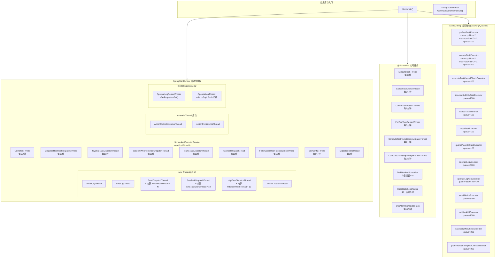

# 后台线程全景

> 所有后台线程的启动入口、定时任务、异步线程池的全景梳理。涵盖 `SpringStartRunner` 启动的原始 Thread、`@Scheduled` 定时任务、`AsyncConfig` 线程池。

## 一图览全貌



## 一、SpringStartRunner 启动的线程

**文件**：`src/main/java/cn/testin/config/SpringStartRunner.java`

`CommandLineRunner.run()` 在 Spring Boot 启动完成后执行，共启动以下线程：

### 1.1 new Thread() 启动（Runnable）

| 线程 | 类型 | 说明 |
|------|------|------|
| `EmailCfgThread` | `new Thread().start()` | 邮件配置加载（SMTP/SendCloud） |
| `SmsCfgThread` | `new Thread().start()` | 短信配置加载（多厂商通道） |
| `EmailDispatchThread` | `new Thread().start()` | 邮件分发主线程（内部启动 N 个 EmailWorkThread 和 SendCloudEmailWorkThread） |
| `SmsTaskDispatchThread` | `new Thread().start()` | 短信分发主线程（内部启动 10 个 SmsTaskWorkThread） |
| `HttpTaskDispatchThread` | `new Thread().start()` | HTTP 通知分发主线程（内部启动 10 个 HttpTaskWorkThread） |
| `NoticeDispatchThread` | `new Thread().start()` | 通知分发线程（poolSize=100, batch=10, timeout=100ms） |

```java
// SpringStartRunner.java
EmailCfgThread emailCfgThread = new EmailCfgThread();
(new Thread(emailCfgThread)).start();
```

### 1.2 ScheduledExecutorService（corePoolSize=16）

```java
// SpringStartRunner.java
ScheduledExecutorService service = Executors.newScheduledThreadPool(16);
```

| 线程 | 调度方式 | 周期 |
|------|---------|------|
| `OemStartThread` | `scheduleAtFixedRate` | 每 300 秒（5 分钟），初始延迟 1 秒 |
| `DingWebHookTaskDispatchThread` | `scheduleWithFixedDelay` | 每 10 秒，初始延迟 1 秒 |
| `JoyChatTaskDispatchThread` | `scheduleAtFixedRate` | 每 10 秒 |
| `WeComWebHookTaskDispatchThread` | `scheduleAtFixedRate` | 每 10 秒 |
| `TeamsTaskDispatchThread` | `scheduleAtFixedRate` | 每 10 秒 |
| `FawTaskDispatchTread` | `scheduleAtFixedRate` | 每 10 秒 |
| `FeiShuWebHookTaskDispatchThread` | `scheduleAtFixedRate` | 每 10 秒 |
| `SsoConfigThread` | `scheduleAtFixedRate` | 每 5 分钟 |
| `MqNoticeDataThread` | `scheduleAtFixedRate` | 每 3000 毫秒（3 秒），初始延迟 1 秒 |

### 1.4 InitializingBean 启动（操作日志消费）

这两个线程负责操作日志的 Redis 可靠队列消费，与 [横切-AOP与横切关注点](横切-AOP与横切关注点.md) 中 `@OperateLog` 的 AOP 写入形成「**写 Redis → 消费入库**」完整链路：

```
@OperateLog AOP                    OperateLogRestartThread              OperateLogThread
     │                                    │                                  │
     ├ postOperateLog()                    ├ afterPropertiesSet()             ├ run()
     │  → insertOperateLog()              │  → 1. 检查备份队列残留           │  → while(true)
     │    → Redis LPUSH                    │      OPERATE_LOG_QUEUE_PROCESS   │    → 队列积压>3000?
     │      OPERATE_LOG_QUEUE              │  → 2. 有残留→恢复处理            │      sleep(1000) 反压
     │                                     │  → 3. operateLogThread.start()   │    → brPopLPush(..., 0)
     └─────────────────────────────────────┘      │                           │      阻塞消费可靠队列
                                                  └───────────────────────────┤
                                                                              → operateLogExecutor
                                                                                execute()
                                                                              → insertOperateLog()
                                                                                → db_operate_log
```

**可靠性设计（brPopLPush 模式）**：

| 机制 | 说明 |
|------|------|
| `brPopLPush(OPERATE_LOG_QUEUE, OPERATE_LOG_QUEUE_PROCESS, 0)` | 原子地从源队列弹出并推入备份队列，超时 0=永久阻塞 |
| 备份队列 `OPERATE_LOG_QUEUE_PROCESS` | 正在处理中的数据暂存，消费成功后才从备份队列删除 |
| `OperateLogRestartThread` 启动时恢复 | 应用重启后自动消费备份队列残留数据（`lLen > 0` 时触发），`setNx` 分布式锁防并发 |
| 失败保护 | `executeOperateLog` 异常时用 `lRem` 从备份队列删除（避免死信循环），AOP 侧 `requestId` 幂等防重复 |
| 反压控制 | 线程池队列积压 >3000 时 `sleep(1000)` 暂停消费 |

#### OperateLogThread

**文件**：`src/main/java/cn/testin/schedule/log/OperateLogThread.java`

- 继承 `Thread`，`@Component` 注解（但**不**在 `SpringStartRunner` 中启动，由 `OperateLogRestartThread.afterPropertiesSet()` 调用 `start()`）
- 死循环 `brPopLPush(jedis, OPERATE_LOG_QUEUE, OPERATE_LOG_QUEUE_PROCESS, 0)` 阻塞消费
- 取到数据后丢入 `operateLogExecutor` 线程池执行 `insertOperateLog(logValue, -1)`
- 使用独立 Jedis 实例 `@Qualifier("operateLogThreadJedis")`

```java
// OperateLogThread.java
public void run() {
    while (!Thread.currentThread().isInterrupted()) {
        // 反压：队列积压超过3000时暂停1秒
        if (executeTaskExecutor.getThreadPoolExecutor().getQueue().size() > 3000) {
            Thread.sleep(1000);
        }
        String logValue = redisService.brPopLPush(jedis,
            Constants.OPERATE_LOG_QUEUE,
            Constants.OPERATE_LOG_QUEUE_PROCESS, 0);
        if (StringUtils.hasLength(logValue)) {
            executeTaskExecutor.execute(() -> executeOperateLog(logValue));
        }
    }
}
```

#### OperateLogRestartThread

**文件**：`src/main/java/cn/testin/schedule/log/OperateLogRestartThread.java`

- 实现 `InitializingBean`，`@Component` 注解
- `afterPropertiesSet()` 在 Spring 容器初始化后自动执行：
  1. 检查 `OPERATE_LOG_QUEUE_PROCESS` 备份队列是否有残留（`lLen > 0`）
  2. 有残留 → 新建临时线程执行 `operateLogRestart(length)`，用 `setNx("OPERATE_LOG_RESTART", ..., 120)` 分布式锁防并发
  3. 恢复完成后 `start()` OperateLogThread 进入正常消费
- 恢复过程中失败的记录用 `lRem(OPERATE_LOG_QUEUE_PROCESS, -1, logValue)` 兜底删除

| 线程 | 启动方式 | Jedis 实例 |
|------|---------|-----------|
| `OperateLogThread` | `Thread.start()`（由 Restart 触发） | `operateLogThreadJedis` |
| `OperateLogRestartThread` | `InitializingBean.afterPropertiesSet()` | `operateLogRestartThreadJedis` |


**文件**：分散在 `cn.testin.schedule` 包和 `cn.testin.business.impl` 包下，均标注 `@Component` + `@EnableScheduling`。

### 2.1 测试计划执行相关

| 类 | cron 表达式 | 频率 | 分布式锁 | 说明 |
|----|------------|------|---------|------|
| `ExecuteTaskThread` | `0/30 * * * * ?` | 每 30 秒 | `setNx("EXECUTE_TASK", ..., 120)` | 扫描未完成的执行记录，并发执行子计划任务 |
| `CancelTaskCheckThread` | `20 4/5 * * * ?` | 每小时第 4,9,14...分钟的第 20 秒 | Redis setNx | 检查取消中的任务是否取消完成 |
| `CancelTaskRestartThread` | `15 3/5 * * * ?` | 每小时第 3,8,13...分钟的第 15 秒 | Redis setNx | 重试取消任务 |
| `PreTestTaskRestartThread` | `45 0/5 * * * ?` | 每 5 分钟第 45 秒 | `setNx("PRE_REST_TASK_RESTART", ..., 120)` | 重试预提测失败的任务 |

```java
// ExecuteTaskThread.java
@Scheduled(cron = "0/30 * * * * ?")
public void executeTask() {
    Boolean result = redisService.setNx(EXECUTE_TASK, EXECUTE_TASK, 120);
    // 分布式锁防多实例并发...
    // 使用 executeTaskExecutor 线程池并发执行子任务
}
```

### 2.2 同步状态计算

| 类 | cron 表达式 | 频率 | 说明 |
|----|------------|------|------|
| `ComputeTaskTemplateSyncStatusThread` | `40 0/2 * * * ?` | 每 2 分钟第 40 秒 | 计算任务模板同步状态 |
| `ComputeCaseScriptNoSyncStatusThread` | `5 0/2 * * * ?` | 每 2 分钟第 5 秒 | 计算用例脚本未同步状态 |

### 2.3 统计与监控

| 类 | cron 表达式 | 频率 | 说明 |
|----|------------|------|------|
| `DiskMonitorScheduled` | `0 0 3 * * ?` | 每天凌晨 3:00 | 磁盘使用量统计 |
| `CaseStatisticSchedule` | `0 0 3 ? * MON` | 每周一凌晨 3:00 | 用例统计周报 |
| `OpsAlarmScheduledTask` | `0 */15 * * * ?` | 每 15 分钟 | Ops 告警检查与通知 |

## 三、AsyncConfig 线程池

**文件**：`src/main/java/cn/testin/config/AsyncConfig.java`

通过 `@EnableAsync` + `@Bean` 定义 13 个独立线程池，统一计算公式：

```
corePoolSize = cpuNum * 2
maxPoolSize  = cpuNum * 2 + 1
```

以 8 核 CPU 为例：core=16, max=17。

### 按用途分类

#### 3.1 任务执行类

| Bean 名称 | 队列长度 | 线程名前缀 | 使用方 |
|-----------|---------|-----------|--------|
| `preTestTaskExecutor` | 100 | `pre_test_task_` | PreTestTaskThread 预提测并发 |
| `executeTaskExecutor` | 200 | `execute_task_` | ExecuteTaskThread 任务执行并发 |
| `executeTaskCancelCheckExecutor` | 200 | `execute_task_cancel_check_` | 取消检查并发 |
| `executeSubInfoTaskExecutor` | 1000 | `execute_sub_info_task_` | `executeSubPlanRecordTask` 子计划并发 |
| `cancelTaskExecutor` | 100 | `cancel_task_` | 取消任务并发 |
| `resetTaskExecutor` | 100 | `reset_task_` | 重测任务并发 |

#### 3.2 Quartz

| Bean 名称 | 队列长度 | 线程名前缀 |
|-----------|---------|-----------|
| `quartzPlanInfoStartExecutor` | 100 | `quartz_plan_info_start` |

#### 3.3 操作日志

| Bean 名称 | 队列长度 | 线程名前缀 | 备注 |
|-----------|---------|-----------|------|
| `operateLogExecutor` | 3100 | `operate_log_` | |
| `operateLogAopExecutor` | 3100 | `operate_log_aop_` | maxPoolSize 最低保证 10 |

#### 3.4 通知与回调

| Bean 名称 | 队列长度 | 线程名前缀 | 使用场景 |
|-----------|---------|-----------|---------|
| `emailNoticeExecutor` | 3100 | `email_notice_` | `emailNoticeExecutor.execute()` 异步发送邮件通知 |
| `callBackUrlExecutor` | 1000 | `call_back_url_` | 回调 URL 异步调用 |

#### 3.5 业务校验

| Bean 名称 | 队列长度 | 线程名前缀 |
|-----------|---------|-----------|
| `caseScriptNoCheckExecutor` | 200 | `case_script_no_check_` |
| `planInfoTaskTemplateCheckExecutor` | 200 | `plan_info_task_template_check_` |

### 使用方式

通过 `@Autowired @Qualifier` 注入后在代码中手动调用：

```java
// ExecuteRecordTaskServiceImpl.java
@Autowired
@Qualifier("executeSubInfoTaskExecutor")
Executor executeSubInfoTaskExecutor;

// 使用
CompletableFuture.supplyAsync(() -> {
    executeSubPlanRecordTask(executeRecord, dbExecuteRecordTask, "msg");
    return true;
}, executeSubInfoTaskExecutor);
```

```java
// ExecuteRecordTaskServiceImpl.java
@Autowired
@Qualifier("emailNoticeExecutor")
ThreadPoolTaskExecutor emailNoticeExecutor;

emailNoticeExecutor.execute(() -> {
    try {
        Thread.sleep(500); // 等待事务提交
        planEmailNoticeService.sendEmail(executeRecord);
    } catch (Exception e) { ... }
});
```

## 四、线程总数估算（8 核机器示例）

| 来源 | 线程数 |
|------|--------|
| SpringStartRunner `new Thread()` | 6 + EmailWorkThread(约2个) + SmsWorkThread(10) + HttpWorkThread(10) = **约28** |
| InitializingBean 启动 | OperateLogThread(1) + 恢复线程(临时1) = **约2** |
| ScheduledExecutorService | **16** |
| @Scheduled（单线程执行） | **约10** |
| AsyncConfig 线程池（最大值） | preTest(17) + execute(17) + cancelCheck(17) + subInfo(17) + cancel(17) + reset(17) + quartz(17) + opLog(17) + opLogAop(17) + emailNotice(17) + callback(17) + caseScript(17) + templateCheck(17) = **221** |
| **总计** | **约 277 个线程** |

> 注：AsyncConfig 线程池按 `maxPoolSize` 计，实际运行中大部分线程空闲，仅在高峰期达到上限。

## 相关文件索引

| 文件 | 说明 |
|------|------|
| `src/main/java/cn/testin/config/SpringStartRunner.java` | 应用启动时线程统一创建入口 |
| `src/main/java/cn/testin/config/AsyncConfig.java` | 13 个异步线程池定义 |
| `src/main/java/cn/testin/schedule/plan/ExecuteTaskThread.java` | 核心定时任务（30s） |
| `src/main/java/cn/testin/schedule/plan/CancelTaskCheckThread.java` | 取消状态检查（5min） |
| `src/main/java/cn/testin/schedule/plan/CancelTaskRestartThread.java` | 取消重试（5min） |
| `src/main/java/cn/testin/schedule/plan/PreTestTaskRestartThread.java` | 预提测重试（5min） |
| `src/main/java/cn/testin/schedule/statistic/CaseStatisticSchedule.java` | 用例统计（每周一） |
| `src/main/java/cn/testin/business/impl/common/DiskMonitorScheduled.java` | 磁盘监控（每日） |
| `src/main/java/cn/testin/business/impl/notice/ops/alarm/OpsAlarmScheduledTask.java` | Ops 告警（15min） |
| `src/main/java/cn/testin/schedule/plan/ComputeTaskTemplateSyncStatusThread.java` | 模板同步状态（2min） |
| `src/main/java/cn/testin/schedule/plan/ComputeCaseScriptNoSyncStatusThread.java` | 脚本同步状态（2min） |
| `src/main/java/cn/testin/schedule/log/OperateLogThread.java` | 操作日志 Redis 可靠队列消费 |
| `src/main/java/cn/testin/schedule/log/OperateLogRestartThread.java` | 操作日志备份队列恢复 + 启动消费线程 |

## 专题关联

- [专题-索引](专题-索引.md) — 返回专题索引
- [核心链路-后台定时任务数据流](核心链路-后台定时任务数据流.md) — 各定时任务的 DB 读写与调用链详细分析
- [横切-通知系统](横切-通知系统.md) — 通知分发线程（Email/SMS/HTTP/WebHook）的 Dispatcher+Worker 模式
- [横切-任务状态机](横切-任务状态机.md) — ExecuteRecordTask 状态枚举与流转（由 ExecuteTaskThread/CancelTaskThread/PreTestTaskThread 驱动）
- [核心链路-定时执行](核心链路-定时执行.md) — Quartz Cron → 快照建树 → 30s 轮询 → 回调回收 五阶段数据流
- [核心链路-测试计划执行](核心链路-测试计划执行.md) — POST /v3/test_plan/test_plans/execute/{id} 手动执行流程
- [横切-模块间通信](横切-模块间通信.md) — Redis setNx 分布式锁 + AsyncConfig 线程池的通信层
- [横切-AOP与横切关注点](横切-AOP与横切关注点.md) — @OperateLog 注解 AOP 写入 Redis 队列，与本页操作日志消费线程形成完整链路
