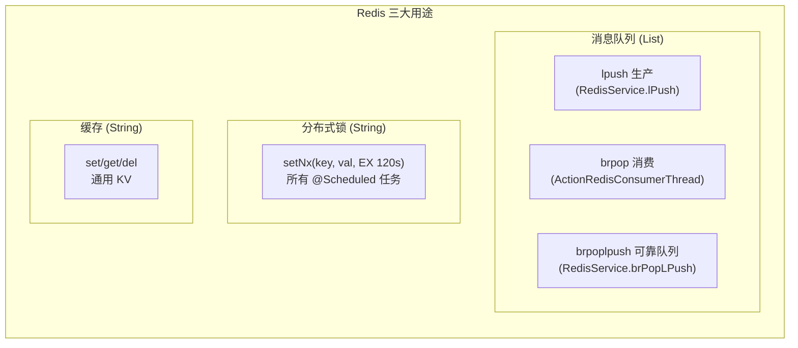

# 模块间通信

> 平台基础功能服务 与外部模块、中间件的通信全景：REST（OkHttp + RestTemplate）、Redis MQ（brpop + lpush）、Elasticsearch、Quartz、LDAP。

## 通信架构总览

```mermaid
flowchart TB
    subgraph testincore["testin-core"]
        direction TB
        SpringBoot["Spring Boot 主进程"]
        SSR["SpringStartRunner"]
        ApiServlet["ApiServlet /*"]
        DispatcherServlet["DispatcherServlet /v3/*"]
        ServiceRemote["ServiceRemoteV3Api<br/>(RestTemplate+OkHttp)"]
        RedisService["RedisService<br/>(JedisPool)"]
        ActionConsumer["ActionRedisConsumerThread<br/>(brpop)"]
        QuartzJobs["QuartzPlanInfoExecuteJob<br/>QuartzPlanInfoExecuteRestartJob"]
        AdAuth["AdAuthUtil<br/>(JNDI LDAP)"]
        EsPortal["EsPortalSummaryService<br/>(Elasticsearch)"]
        QuartzService["QuartzServiceImpl<br/>(SchedulerFactoryBean)"]
    end

    subgraph ExternalModules["外部微服务"]
        RealTest["RealTest<br/>(任务执行引擎)"]
        RealTask["RealTask<br/>(任务管理)"]
        RealWeb["RealWeb<br/>(Web测试)"]
        RealScheduling["RealScheduling<br/>(设备调度)"]
        ControlCenter["ControlCenter<br/>(控制中心)"]
        Script["Script<br/>(脚本/套件/文件管理)"]
        RealCfg["RealCfg<br/>(配置/错误原因)"]
        DataSource["DataSource<br/>(数据源)"]
        Plan["Plan<br/>(计划联动)"]
        CommonApi["CommonApi<br/>(通用模板)"]
    end

    subgraph Middleware["中间件"]
        Redis[("Redis<br/>List 队列<br/>KV 缓存<br/>分布式锁")]
        ES[("Elasticsearch<br/>Portal 摘要索引")]
        MySQL[("MySQL<br/>主存储")]
        LDAPServer[("LDAP/AD<br/>认证服务器")]
    end

    ServiceRemote -->|"REST POST/GET/DELETE<br/>JSON"| RealTest
    ServiceRemote -->|"REST"| RealTask
    ServiceRemote -->|"REST"| RealWeb
    ServiceRemote -->|"REST"| RealScheduling
    ServiceRemote -->|"REST"| ControlCenter
    ServiceRemote -->|"REST"| Script
    ServiceRemote -->|"REST"| RealCfg
    ServiceRemote -->|"REST"| DataSource
    ServiceRemote -->|"REST"| Plan
    ServiceRemote -->|"REST"| CommonApi

    RedisService -->|"Jedis lpush/lrem/llen<br/>KV set/get/del<br/>setNx 分布式锁"| Redis
    ActionConsumer -->|"Jedis brpop"| Redis

    QuartzJobs -->|"Quartz RAMJobStore"| QuartzService

    EsPortal -->|"RestHighLevelClient"| ES

    AdAuth -->|"JNDI InitialLdapContext"| LDAPServer

    SpringBoot --> MySQL
    SSR --> MySQL
```



## 一、REST 通信（OkHttp + RestTemplate）

### 1.1 RestTemplate 配置

**文件**：`src/main/java/cn/testin/config/RestTemplateConfig.java`

底层使用 OkHttp3 作为 HTTP 客户端，封装为 Spring `RestTemplate`：

```java
// RestTemplateConfig.java
private OkHttpClient okHttpConfigClient() {
    return new OkHttpClient().newBuilder()
            .connectionPool(pool())           // 连接池 30 个连接，300 分钟保活
            .connectTimeout(10L, SECONDS)     // 连接超时 10s
            .readTimeout(10L, SECONDS)        // 读超时 10s
            .writeTimeout(10L, SECONDS)       // 写超时 10s
            .hostnameVerifier((hostname, session) -> true)  // 跳过证书校验
            .build();
}

@Bean
public RestTemplate restTemplate() {
    RestTemplate restTemplate = new RestTemplate(httpRequestFactory());
    // 解决中文乱码（ISO -> UTF-8）
    ...
}
```

### 1.2 统一远程调用封装

**文件**：`src/main/java/cn/testin/api/ServiceRemoteV3Api.java`

封装 `RestTemplate` 为统一的远程调用工具，对外暴露 `remotePost` / `remoteGet` / `remoteDelete` / `remoteGetUri`。

```java
// ServiceRemoteV3Api.java
@Component
public class ServiceRemoteV3Api {

    @Autowired
    RestTemplate restTemplate;

    // POST JSON 通用调用
    public <T, E> T remotePost(String url, E body,
            ParameterizedTypeReference<ApiV3ResponseDTO<T>> typeReference) throws GeneralException {
        HttpEntity<E> request = new HttpEntity<>(body, headers);
        ResponseEntity<ApiV3ResponseDTO<T>> exchange =
            restTemplate.exchange(url, HttpMethod.POST, request, typeReference);
        // 校验 statusCode != 200 或 response.code != 0 时抛异常
    }

    // GET 通用调用（泛型）
    public <T> T remoteGet(String url,
            ParameterizedTypeReference<ApiV3ResponseDTO<T>> typeReference) throws GeneralException { ... }

    // GET 通用调用（Class）
    public <T> T remoteGet(String url, Class<T> clazz) throws GeneralException { ... }

    // GET URI 方式
    public <T> T remoteGetUri(String url, Class<T> clazz) throws Exception { ... }

    // DELETE 通用调用
    public <T> T remoteDelete(String url,
            ParameterizedTypeReference<ApiV3ResponseDTO<T>> typeReference) throws GeneralException { ... }
}
```

### 1.3 外部微服务调用

所有外部服务前缀定义在 `AbstractApi` 常量中（`src/main/java/cn/testin/api/realtest/AbstractApi.java`），通过 `ApiUtil.getServiceApiUrl(prefix)` 解析为实际 URL（直连模式，非注册中心）。

#### 核心执行服务

| API 类 | 服务前缀 | 用途 |
|--------|---------|------|
| `RealTestV3Api` | `RealTest` | 真机测试任务下发、执行、取消、报告查询 |
| `RealTestV1Api` | `RealTest` | 兼容旧版任务接口（`ApiUtil.doPress`） |
| `ReportApi` | `RealTest` | 报告复测记录、分享链接 |
| `RealTaskV3Api` | `RealTask` | 用例任务模板管理、执行、取消、统计 |
| `ReportCaseV3Api` | `RealTask` | 用例报告查询 |
| `RealWebV3Api` | `RealWeb` | Web 测试任务管理、报告 |
| `RealWebV1Api` | `RealWeb` | 兼容旧版 Web 接口 |
| `TemplateV3Api` | `RealTest` / `CommonApi` / `RealTask` | 跨服务模板统一查询（按 bizCode 路由） |
| `TemplateV1Api` | `RealTask` | 旧版模板批量删除 |

#### 设备与调度服务

| API 类 | 服务前缀 | 用途 |
|--------|---------|------|
| `DeviceV3Api` | `RealScheduling`（设备列表查询 `getDeviceInfo`） / `ControlCenter`（设备详情查询 `getDeviceDetailInfo`） | 设备信息查询（一个类调用两个服务） |
| `TaskApi` (scheduling) | `RealScheduling` | 调度中心任务操作（`ApiUtil.doPress`） |

#### 脚本与文件服务

| API 类 | 服务前缀 | 用途 |
|--------|---------|------|
| `SuiteV3Api` | `Script` | 套件/应用包查询 |
| `ScriptV3Api` | `Script` | 脚本 CRUD、脚本组管理、脚本转用例 |
| `SuitApi` | `Script` | 旧版文件管理（`ApiUtil.doPress`） |

#### 配置与数据源服务

| API 类 | 服务前缀 | 用途 |
|--------|---------|------|
| `ErrorCauseTypeServiceApi` | `RealCfg` | 错误原因类型配置查询 |
| `ResourceApi` (realcfg) | `RealCfg` | 资源配置管理（`ApiUtil.doPress`） |
| `DataSourceV3Api` | `DataSource` | 数据源：脚本参数/用例数据源关联/移动 |
| `TestPlanTaskApi` | `Plan` | 计划与任务模板联动（`ApiUtil.doPress`） |
| `TempletConfigApi` | `notice` | 邮件模板配置查询（`ApiUtil.doPress`） |

#### 其他服务

| API 类 | 通信方式 | 用途 |
|--------|---------|------|
| `ITestInWebApi` | HTTP（`service.api.properties` 配置 host） | SSO Token 刷新（`/sso/refresh/token.htm`） |
| `UploadApi` | HTTP（`Config.UPLOAD_URL` + 硬编码 APIKEY） | 文件上传 |
| `DingApi` | HTTPS → oapi.dingtalk.com | 钉钉 Webhook（asyncsend_v2 / getbymobile / oauth2） |
| `FeiShuApi` | HTTPS → open.feishu.cn | 飞书 Webhook |
| `WeComApi` | HTTPS → qyapi.weixin.qq.com | 企业微信 Webhook |
| `TeamsApi` | Microsoft Graph API | Teams Webhook（Azure Identity 认证） |
| `JoyChatApi` | HTTPS | JoyChat Webhook |
| `FawApi` | HTTPS | 一汽 FAW Webhook |

> **注**：`DeviceV3Api` 一个类调用两个服务 —— `getDeviceInfo()` 走 `RealScheduling`（`/v3/device_task/device_task/get_device_task_info`），`getDeviceDetailInfo()` 走 `ControlCenter`（`/v3/ControlCenter/device/list`）。`AbstractApi` 定义的前缀常量是 `realControlCenterPrefixName = "RealControlCenter"`，但 `getDeviceDetailInfo()` 实际传入的字面量是 `"ControlCenter"`（与常量不一致）；`getDeviceInfo()` 传入的字面量 `"RealScheduling"` 与 `realSchedulingPrefixName` 一致。

#### AbstractApi 中已定义但 api/ 包未直接使用的前缀

| 前缀常量 | 值 | 说明 |
|---------|---|------|
| `realPortalPrefixName` | `RealPortal` | Portal 服务（api/ 包未直接引用，可能由其他模块使用） |
| `payPrefixName` | `PayManager` | 支付管理 |
| `userPrefixName` | `UserManager` | 用户管理 |

**文件**：`src/main/java/cn/testin/business/impl/plan/ExecuteRecordTaskServiceImpl.java`

```java
// 示例：调用 real-task 下发执行
Long executeTaskId = realTaskV3Api.executeTask(request);            // line:1887
// 示例：取消已下发任务
realTaskV3Api.deleteRecord(executeTaskId);                          // line:1897
// 示例：查询设备详情
BasePageListResponseDTO<DeviceDetailResponseDTO> deviceDetailInfo =
    deviceV3Api.getDeviceDetailInfo(deviceIdList, ...);             // line:2359
```

### 1.4 服务发现

远程调用的 URL 通过 `RemoteApiConstants` 常量和配置文件管理（直连模式，非注册中心）：

**文件**：`src/main/java/cn/testin/common/RemoteApiConstants.java`

## 二、Redis MQ（brpop + lpush）

### 2.1 Redis 连接

使用 Jedis 直连，配置为 `springBootJedisPool` Bean。

**文件**：`src/main/java/cn/testin/business/redis/RedisService.java`

### 2.2 Redis 三大用途



### 2.3 消息队列：ActionRedisConsumerThread

**文件**：`src/main/java/cn/testin/schedule/action/ActionRedisConsumerThread.java`

```java
// ActionRedisConsumerThread.java
public void run() {
    while (!Thread.currentThread().isInterrupted()) {
        try (Jedis jedis = jedisPool.getResource()) {
            // 阻塞 180 秒等待队列数据
            List<String> actionLogStrList = jedis.brpop(180, REDIS_QUEUE_KEY_ACTION);
            // 放入 BlockingQueue 供 ActionPersistenceThread 消费
            for (String actionLogJsonStr : actionLogValueStr) {
                workQueue.put(actionLogJsonStr);
            }
        }
    }
}
```

生产端通过 `RedisService.lPush(queue, value)` 将活动日志推入队列：
```java
// RedisService.java
public void lPush(String queue, String value) {
    try (Jedis jedis = jedisPool.getResource()) {
        jedis.lpush(queue, value);
    }
}
```

可靠队列模式 `brPopLPush` 用于需要确认消费的场景（将数据从 source 队列原子移动到 backup 队列）：
```java
// RedisService.java
public String brPopLPush(Jedis jedis, String queue, String backUpQueue, int timeout) {
    return jedis.brpoplpush(queue, backUpQueue, timeout);
}
```

### 2.4 分布式锁

所有 `@Scheduled` 定时任务入口统一使用 `redisService.setNx()` 防多实例并发：

```java
// RedisService.java
public Boolean setNx(String key, String value, int second) {
    try (Jedis jedis = jedisPool.getResource()) {
        String result = jedis.set(key, value, "NX", "EX", second);
        return "OK".equals(result);
    }
}
```

典型用法（ExecuteTaskThread）：
```java
Boolean result = redisService.setNx(EXECUTE_TASK, EXECUTE_TASK, 120);
try {
    if (!result) { return; }  // 其他实例已获取锁
    // ... 执行业务
} finally {
    if (result) { redisService.delete(EXECUTE_TASK); }
}
```

## 三、Elasticsearch

### 配置

Spring Boot 自动配置被排除（`ElasticsearchDataAutoConfiguration` 禁用），自定义配置通过 XML 注入：

```java
// Boot.java
@SpringBootApplication(..., exclude = {..., ElasticsearchDataAutoConfiguration.class})
@ImportResource(locations = {"classpath:cfg/spring/spring-EsDB.xml"})
```

### Portal 摘要索引

ES 主要用于 Portal 任务摘要（汇总视图）的存储和查询：

| 类 | 作用 |
|----|------|
| `EsPortalSummaryServiceImpl` | Portal 摘要服务实现 |
| `EsPortalSummaryDAO` | ES 查询 DAO |
| `EsPortalSummary` | POJO 映射 |
| `PortalTaskServiceImpl` | 向 ES 写入 Portal 任务数据 |

### 查询方

`CancelTaskCheckThread` 中会查询 ES 来辅助判断任务的取消/执行状态。

## 四、Quartz（定时调度）

### 配置

**文件**：`src/main/java/cn/testin/config/PlanInfoScheduledConfig.java`

```java
// PlanInfoScheduledConfig.java
@Bean("planInfoExecuteSchedulerFactory")
public SchedulerFactoryBean schedulerFactoryBean() {
    Properties properties = new Properties();
    properties.put("org.quartz.scheduler.instanceName", instanceName);
    properties.put("org.quartz.threadPool.threadCount", threadCount);
    // 注意：使用 RAMJobStore（内存存储，非 JDBC）
    factory.setQuartzProperties(properties);
    // 注册全局 Listener
    factory.setSchedulerListeners(quartzSchedulerListener);
    factory.setGlobalJobListeners(quartzJobListener);
    factory.setGlobalTriggerListeners(quartzTriggerListener);
}
```

### Quartz Job

| Job 类 | 功能 |
|--------|------|
| `QuartzPlanInfoExecuteJob` | 根据 `planInfoId` 参数触发测试计划执行 |
| `QuartzPlanInfoExecuteRestartJob` | 重启测试计划执行 |
| `DirQuartzJob` | 目录相关定时任务 |

```java
// QuartzPlanInfoExecuteJob.java
@Override
protected void executeInternal(JobExecutionContext ctx) throws JobExecutionException {
    JobDataMap data = ctx.getMergedJobDataMap();
    long planInfoId = data.getLong("planInfoId");
    planInfoService.executePlanInfo(planInfoId, null);
}
```

### Quartz 服务

`QuartzServiceImpl` 通过 `planInfoExecuteQuartzService` Bean 注入，管理 Job 的添加、删除、暂停、恢复：

**文件**：
- `src/main/java/cn/testin/business/impl/quartz/QuartzServiceImpl.java`
- `src/main/java/cn/testin/business/interfaces/quartz/IQuartzService.java`

### Listener

三个全局 Listener 注册在 `PlanInfoScheduledConfig` 中：

| Listener | 说明 |
|----------|------|
| `QuartzSchedulerListener` | Scheduler 生命周期监听 |
| `QuartzJobListener`（name=`plan_info_job`） | Job 执行前后监听 |
| `QuartzTriggerListener`（name=`plan_info_trigger`） | Trigger 触发时机监听 |

## 五、LDAP 认证

**文件**：`src/main/java/cn/testin/util/ldap/AdAuthUtil.java`

用于企业 AD/LDAP 用户认证，支持两种模式：

### 模式一：简单认证

```java
// AdAuthUtil.java
public static void auth(String ldapUrl, String account, String password) {
    env.put(Context.INITIAL_CONTEXT_FACTORY, "com.sun.jndi.ldap.LdapCtxFactory");
    env.put(Context.PROVIDER_URL, ldapUrl);                    // LDAP服务器地址
    env.put(Context.SECURITY_AUTHENTICATION, "simple");
    env.put(Context.SECURITY_PRINCIPAL, account);              // 用户DN
    env.put(Context.SECURITY_CREDENTIALS, password);           // 密码
    ctx = new InitialLdapContext(env, null);
}
```

### 模式二：基于 DN 查询认证

```java
// AdAuthUtil.java
public static String auth(String ldapUrl, String account, String password, String dn) {
    // searchBase = "ou=users,dc=xxx,dc=xxx"
    // 绑定 DN: uid=account,ou=users,dc=xxx,dc=xxx
    // 查询属性: cn, sn, mail
    // 返回 mail 地址
}
```

调用方：`UserService`、`Login` 类中，用于验证企业 AD 域用户身份。

## 六、MySQL 数据存储

使用 MyBatis-Plus 作为 ORM，通过 `@DS` 注解实现多数据源切换：

```java
@DS(Constants.DB_PLAN)  // plan 库
@Transactional(rollbackFor = Exception.class)
public void taskFinishAfterDeal(...) { ... }
```

## 相关文件索引

| 文件 | 说明 |
|------|------|
| `src/main/java/cn/testin/config/RestTemplateConfig.java` | OkHttp3 + RestTemplate 配置 |
| `src/main/java/cn/testin/api/realtest/AbstractApi.java` | 外部服务前缀常量定义（12 个服务） |
| `src/main/java/cn/testin/api/ServiceRemoteV3Api.java` | 统一 REST 远程调用封装 |
| `src/main/java/cn/testin/api/ServiceRemoteV1Api.java` | V1 版 REST 调用（`ApiUtil.doPress`） |
| `src/main/java/cn/testin/api/realtest/RealTestV3Api.java` | RealTest 服务 V3 调用 |
| `src/main/java/cn/testin/api/realtask/RealTaskV3Api.java` | RealTask 服务 V3 调用 |
| `src/main/java/cn/testin/api/realweb/RealWebV3Api.java` | RealWeb 服务 V3 调用 |
| `src/main/java/cn/testin/api/controlcenter/device/DeviceV3Api.java` | 设备查询（RealScheduling + ControlCenter） |
| `src/main/java/cn/testin/api/fileSystem/ScriptV3Api.java` | 脚本服务 V3 调用（Script） |
| `src/main/java/cn/testin/api/fileSystem/SuiteV3Api.java` | 套件服务 V3 调用（Script） |
| `src/main/java/cn/testin/api/datasource/DataSourceV3Api.java` | 数据源服务 V3 调用 |
| `src/main/java/cn/testin/api/realcfg/ErrorCauseTypeServiceApi.java` | 错误原因配置服务（RealCfg） |
| `src/main/java/cn/testin/api/plan/TestPlanTaskApi.java` | 计划联动服务（Plan） |
| `src/main/java/cn/testin/api/template/TemplateV3Api.java` | 跨服务模板查询（RealTest/CommonApi/RealTask） |
| `src/main/java/cn/testin/api/notice/dingding/DingApi.java` | 钉钉 Webhook |
| `src/main/java/cn/testin/business/redis/RedisService.java` | Redis 操作封装（Jedis） |
| `src/main/java/cn/testin/schedule/action/ActionRedisConsumerThread.java` | Redis MQ 消费者（brpop） |
| `src/main/java/cn/testin/schedule/action/ActionPersistenceThread.java` | 活动记录持久化 |
| `src/main/java/cn/testin/config/PlanInfoScheduledConfig.java` | Quartz Scheduler 配置 |
| `src/main/java/cn/testin/schedule/plan/QuartzPlanInfoExecuteJob.java` | Quartz Job：计划执行 |
| `src/main/java/cn/testin/schedule/plan/QuartzPlanInfoExecuteRestartJob.java` | Quartz Job：计划重启 |
| `src/main/java/cn/testin/business/impl/quartz/QuartzServiceImpl.java` | Quartz 操作服务 |
| `src/main/java/cn/testin/business/impl/realportal/EsPortalSummaryServiceImpl.java` | ES Portal 摘要服务 |
| `src/main/java/cn/testin/dao/realportal/EsPortalSummaryDAO.java` | ES 数据访问 |
| `src/main/java/cn/testin/util/ldap/AdAuthUtil.java` | LDAP/AD 认证工具 |
| `src/main/java/cn/testin/util/ldap/AdCode.java` | LDAP 错误码 |
| `src/main/java/cn/testin/startup/Boot.java` | 启动入口（ES/Mongo 排除、Filter、Servlet 注册） |

## 专题关联

- [专题-索引](专题-索引.md) — 返回专题索引
- [横切-后台线程全景](横切-后台线程全景.md) — ActionRedisConsumerThread + AsyncConfig 线程池
- [横切-通知系统](横切-通知系统.md) — Redis MQ 消费 + INoticeService 渠道分发
- [横切-双入口路由机制](横切-双入口路由机制.md) — ApiServlet / DispatcherServlet 双入口
- [核心链路-定时执行](核心链路-定时执行.md) — Quartz Cron 定时执行链路
- [核心链路-任务提交](核心链路-任务提交.md) — REST 调用 real-test/real-web 的任务提交流程
- [核心链路-用户登录](核心链路-用户登录.md) — LDAP 认证登录流程
