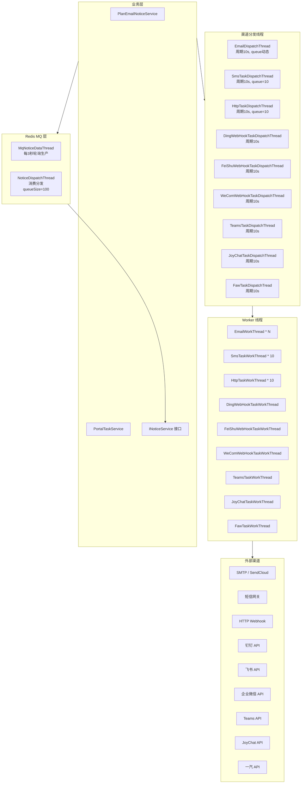
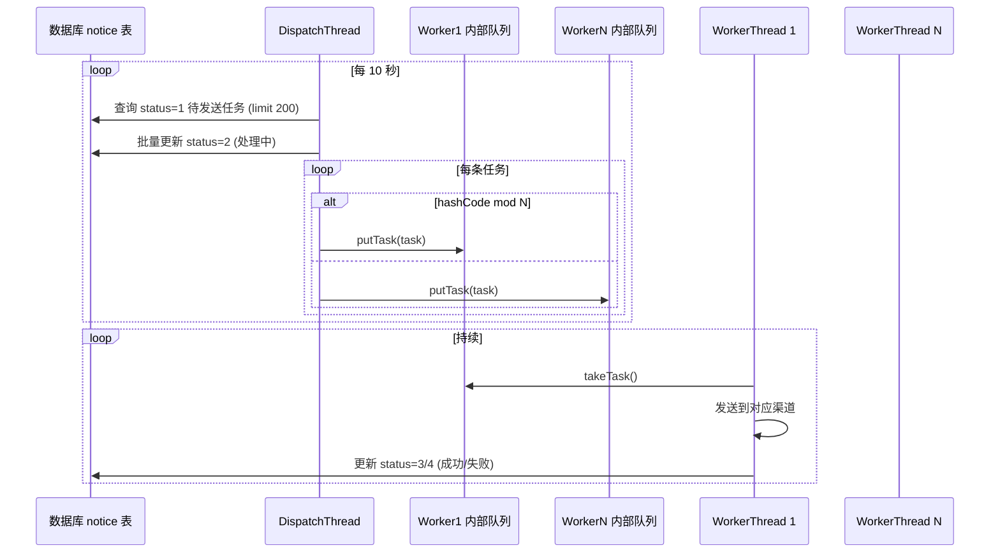
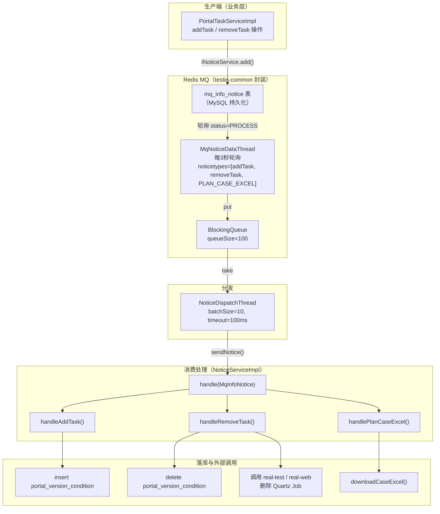
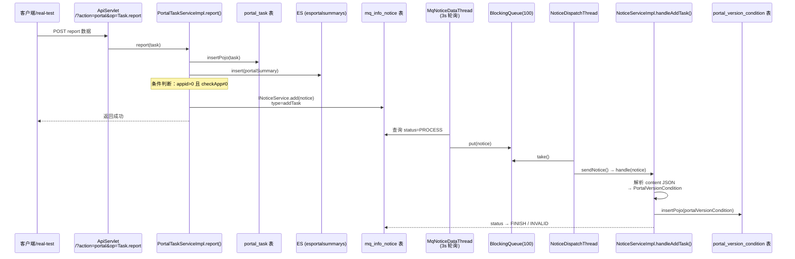
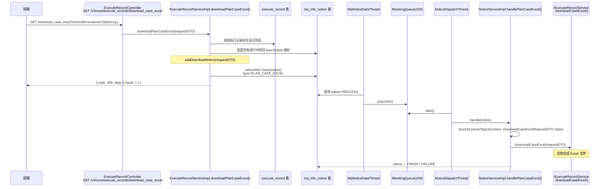
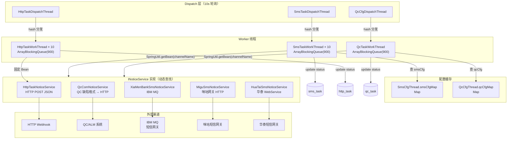
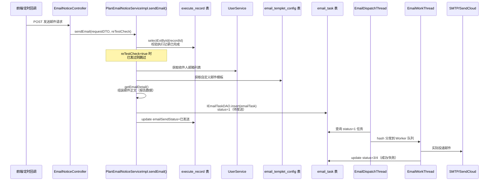
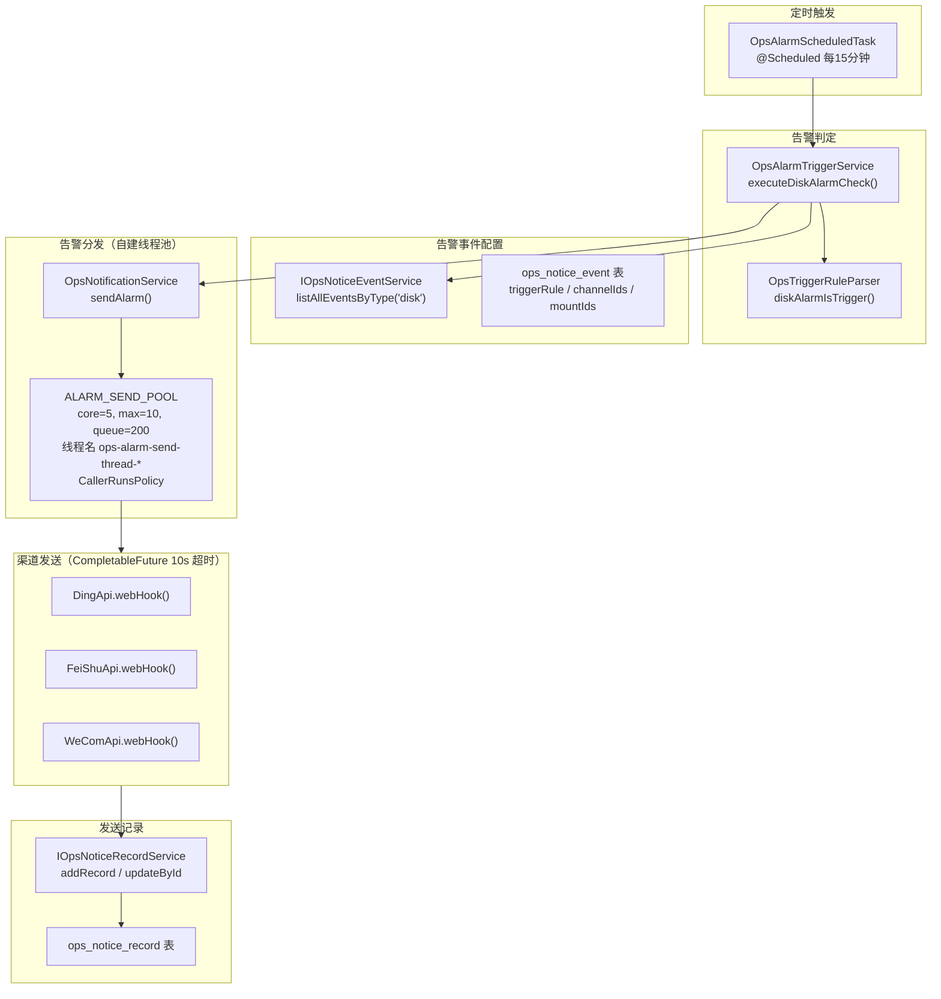

# 通知系统

> 9 渠道分发 + Dispatcher+Worker 模式 + MQ 消费。所有通知渠道线程在 `SpringStartRunner.run()` 中统一启动。

## 架构总览



## 9 大渠道一览

| 渠道 | 分发线程 | Worker 线程 | 发包周期 | 并行度 |
|------|---------|-------------|---------|--------|
| 邮件 | `EmailDispatchThread` | `EmailWorkThread` + `SendCloudEmailWorkThread` | 10s | cfgCount + cloudCount（动态） |
| 短信 | `SmsTaskDispatchThread` | `SmsTaskWorkThread` | 10s | 10 |
| HTTP | `HttpTaskDispatchThread` | `HttpTaskWorkThread` | 10s | 10 |
| 钉钉 | `DingWebHookTaskDispatchThread` | `DingWebHookTaskWorkThread` | 10s | 1（每次拉 10 条） |
| 飞书 | `FeiShuWebHookTaskDispatchThread` | `FeiShuWebHookTaskWorkThread` | 10s | 1 |
| 企业微信 | `WeComWebHookTaskDispatchThread` | `WeComWebHookTaskWorkThread` | 10s | 1 |
| Teams | `TeamsTaskDispatchThread` | `TeamsTaskWorkThread` | 10s | 1 |
| JoyChat | `JoyChatTaskDispatchThread` | `JoyChatTaskWorkThread` | 10s | 1 |
| FAW（一汽） | `FawTaskDispatchTread` | `FawTaskWorkThread` | 10s | 1 |

## Dispatcher+Worker 模式

### 模式 A：邮件/短信/HTTP（队列+hash 分发）

这三个渠道采用相同的经典模式：



**核心机制**：
1. DispatchThread 从 DB 拉取 `status=1` 的任务，先置 `status=2` 防重
2. 按 `task.getId().hashCode() % queueSize` 哈希取模分配到 Worker 的内部阻塞队列
3. Worker 线程循环从队列 `take()` 任务，执行实际发送
4. 启动时先处理积压的 `status=2` 任务（防丢）

**代表性实现**：`EmailDispatchThread.java`（见下文详析）

### 模式 B：钉钉/飞书/企业微信/Teams/JoyChat/FAW（直接拉取+单 Worker 启动）

这 6 个 WebHook 渠道采用简化模式：

1. 通过 `ScheduledExecutorService.scheduleAtFixedRate(thread, 1, 10, SECONDS)` 每 10 秒执行
2. 查询 `msg_task` 表（`status=1`, `type=对应渠道`, `expireTime > now`），limit 10
3. 创建新的 Worker 线程处理该批次：`new DingWebHookTaskWorkThread(list).start()`

代码示例（钉钉）：
```java
// DingWebHookTaskDispatchThread.java
@Override
public void run() {
    LambdaQueryWrapper<MsgTask> queryWrapper = new LambdaQueryWrapper<>();
    queryWrapper.gt(MsgTask::getExpireTime, System.currentTimeMillis());
    queryWrapper.eq(MsgTask::getStatus, 1);
    queryWrapper.eq(MsgTask::getType, MsgTypeEnum.DINDWEBHOOK.getValue());
    queryWrapper.lt(MsgTask::getPublicTime, System.currentTimeMillis());
    queryWrapper.lt(MsgTask::getNoticeNum, 10);
    queryWrapper.orderByDesc(MsgTask::getLevel);
    queryWrapper.last("limit 10");
    List<MsgTask> list = imMsgTaskDAO.selectList(queryWrapper);
    if (list != null && list.size() > 0) {
        DingWebHookTaskWorkThread workThread = new DingWebHookTaskWorkThread(list);
        workThread.start();
    }
}
```

### EmailDispatchThread 详解

**文件**：`src/main/java/cn/testin/schedule/email/EmailDispatchThread.java`

- 启动时等待 `EmailCfgThread` 加载邮件配置（SMTP 配置列表）
- `queueSize = emailCfgList.size()`（每个 SMTP 配置一个 Worker）
- `cloudqueueSize = froms.length`（SendCloud 邮箱数量）
- 总共初始化 `queueSize + cloudqueueSize` 个 Worker 线程
- 每个 Worker 内部有 `ConcurrentLinkedQueue<DbEmailTask>` 队列
- DispatchThread 的 `process()` 方法：
  - 只在所有 Worker 队列为空时才拉新任务
  - 一次拉取 200 条，先更新为 `status=2`，再分发
  - 按 `SendType.INNER_SERVICE`（自有SMTP）或 `SendType.SENDCLOUD_SERVICE`（SendCloud）分别 hash 分发

### HttpTaskDispatchThread 详解

**文件**：`src/main/java/cn/testin/schedule/http/HttpTaskDispatchThread.java`

- 固定 `queueSize = 10`
- Worker 内部阻塞队列 `BlockingQueue<DbHttpTask>` 大小 2000
- Worker 拿到任务后调用 `INoticeService.sendNotice()` 执行 HTTP 回调
- 失败重试次数根据 `DbHttpTask.retryCount` 判断

### SmsTaskDispatchThread 详解

**文件**：`src/main/java/cn/testin/schedule/sms/SmsTaskDispatchThread.java`

- 固定 `queueSize = 10`，Worker 内部 LinkedBlockingQueue 大小 = 200
- 逻辑与 HTTP 几乎一致，差异化在于：
  - Worker 拿任务后根据 `DbSmsTask.type` 找到对应的 `INoticeService` Bean（通过 `SpringUtil.getBean(smsCfg.getChannelName())`）
  - 支持多短信通道厂商动态路由

## MQ 消费层（NoticeServiceImpl）

Portal 任务变更通知采用 **生产→MQ→消费** 的异步模式，通过 Redis MQ（testin-common 的 `MqInfoNotice` 机制）解耦。

### 整体架构



> 注意：此处的 `INoticeService` 是 `cn.testin.common.mq.business.interfaces.INoticeService`（testin-common 公共包），不是前述 Worker 线程使用的 `cn.testin.business.interfaces.notice.INoticeService`。

### 生产端：PortalTaskServiceImpl 推入通知

```java
// PortalTaskServiceImpl.java — addTask 操作后推入通知
INoticeService inoticeservice = (INoticeService) SpringHelper.getBean("INoticeService");
MqInfoNotice notice = new MqInfoNotice();
notice.setType(PortalConfigEnum.NoticeType.addTask.getValue());
notice.setContent(contentJson.toString());  // eid, projectid, appid, syspfId, bizCode, taskid 等
inoticeservice.add(notice);  // 写入 mq_info_notice 表
```

触发场景：
| 操作 | noticeType | 来源方法 |
|------|-----------|---------|
| 新增 Portal 任务 | `addTask` | `PortalTaskServiceImpl.report()` → `insertPojo` 后 |
| 删除 Portal 任务 | `removeTask` | `PortalTaskServiceImpl.deleteTask()` |
| 批量删除 Portal 任务 | `removeTask` | `PortalTaskServiceImpl.batchDeleteTask()` |

### 消费端：NoticeServiceImpl.handle() 处理逻辑

**文件**：`src/main/java/cn/testin/business/impl/NoticeServiceImpl.java`

`NoticeServiceImpl extends AbstractNoticeServiceImpl`（common 包），核心方法 `handle(MqInfoNotice notice)`：

```java
// 从 mq_info_notice 表查回完整记录，仅处理 status=PROCESS 的
MqInfoNotice dbNotice = super.imqinfonoticedao.get(notice.getVhost(), notice.getType(), notice.getId());

// 按 noticeType 路由
if (addTask)    → handleAddTask(notice);     // 写入 portal_version_condition
if (removeTask) → handleRemoveTask(notice);  // 删除 portal_version_condition + 远程删 Quartz Job
if (PLAN_CASE_EXCEL) → handlePlanCaseExcel(notice); // 调 downloadCaseExcel()

// 更新 mq_info_notice 状态
RESULT_SUCCESS → STATUS_FINISH   // 处理成功，完结
RESULT_FAILURE → execNum+1       // 失败重试，超过3次延迟10s，超过10次+1小时 → STATUS_INVALID
RESULT_INVALID → STATUS_INVALID  // 数据非法，直接作废
```

### 三种通知类型：端到端数据流

#### 1. addTask — 新增 Portal 任务 → 写入版本条件

**触发时机**：Portal 任务创建成功（`taskCreate=1`，即首次上报），且满足 `appid > 0` 且 `checkApp ≠ 0`。

**API 入口**：`POST /?action=portal&op=Task.report`（ApiServlet），见 [portal-Task](../07-开放接口文档/任务管理/portal-Task.md) 方法 #5 `report`。

**完整数据流**：



**消费端处理详情**（`NoticeServiceImpl.handleAddTask()`）：

```java
// 1. 从 notice.getContent() 解析 JSONObject，提取字段：
//    eid, projectid, appid(可选), packagename(可选), appName(可选),
//    pkgid(可选), appVersion(可选), syspfId, bizCode, channelId(可选), suiteId(可选)

// 2. 构造 PortalVersionCondition 对象
PortalVersionCondition portalVersionCondition = new PortalVersionCondition();
portalVersionCondition.setEid(contentJson.getInt("eid"));
portalVersionCondition.setProjectid(contentJson.getInt("projectid"));
portalVersionCondition.setSyspfId(contentJson.getInt("syspfId"));
portalVersionCondition.setBizCode(contentJson.getInt("bizCode"));
// ... appid/packagename/appName/pkgid/appVersion/channelId/suiteId 按需设置

// 3. 写入 portal_version_condition 表
PortalVersionConditionDAO dao = SpringUtil.getBean(PortalVersionConditionDAO.class);
boolean insertResult = dao.insertPojo(portalVersionCondition);

// 4. 返回值：
//    insertResult=true  → RESULT_SUCCESS(1)  → mq_info_notice.status → FINISH
//    Exception          → RESULT_INVALID(-1) → mq_info_notice.status → INVALID（直接作废）
```

**落库**：`db_portal.portal_version_condition` — 存储任务的 eid/projectId/appId/packageName/syspfId/bizCode 等信息，供后续查询该任务的版本兼容条件。

**⚠️ 注意**：当 `appid == null || appid <= 0` 时，`PortalTaskServiceImpl.report()` 直接返回 `true`，**不触发 MQ 通知**（第 115-117 行）。同理 `checkApp == 0`（待检测应用）也不触发通知。

---

#### 2. removeTask — 删除 Portal 任务 → 清理版本条件 + 远程 Quartz Job

**触发时机**：通过 ApiServlet 删除单个/批量 Portal 任务，且 `appid > 0` 且 `checkApp ≠ 0`。

**API 入口**：
- `POST /?action=portal&op=Task.delete`（ApiServlet），见 [portal-Task](../07-开放接口文档/任务管理/portal-Task.md) 方法 #6 `delete`
- `POST /?action=portal&op=Task.batchDelete`（ApiServlet），见 [portal-Task](../07-开放接口文档/任务管理/portal-Task.md) 方法 #7 `batchDelete`

**完整数据流**：



```mermaid
sequenceDiagram
    participant Client as 客户端
    participant Api as ApiServlet<br/>/?action=portal&op=Task.delete
    participant PortalSvc as PortalTaskServiceImpl.remove()
    participant PortalDB as portal_task 表
    participant ES as ES
    participant RealAPI as TaskApi.cancel()
    participant MQ as mq_info_notice 表
    participant MQThread as MqNoticeDataThread
    participant BQ as BlockingQueue(100)
    participant Dispatch as NoticeDispatchThread
    participant Handler as NoticeServiceImpl.handleRemoveTask()
    participant Remote as real-test / real-web
    participant VCDB as portal_version_condition 表

    Client->>Api: POST delete 请求
    Api->>PortalSvc: remove(taskid, eid)
    PortalSvc->>PortalDB: delete(taskid, eid)
    PortalSvc->>ES: deleteByTaskid(taskid)
    PortalSvc->>RealAPI: TaskApi.cancel(taskid)
    Note over PortalSvc: 条件判断：appid>0 且 checkApp≠0
    PortalSvc->>MQ: INoticeService.add(notice)<br/>type=removeTask
    PortalSvc-->>Client: 返回成功

    MQThread->>MQ: 查询 status=PROCESS
    MQThread->>BQ: put(notice)
    Dispatch->>BQ: take()
    Dispatch->>Handler: handle(notice)
    Handler->>Handler: 解析 content JSON

    alt bizCode = JUNIT_TEST (App)
        Handler->>Remote: DELETE real-test<br/>/delete/statement?task_id=xxx
    else bizCode = WEB/DESKTOP
        Handler->>Remote: DELETE real-web<br/>/delete/quartz/job?task_id=xxx
    end

    Handler->>VCDB: delete(portalVersionCondition)
    Handler-->>MQ: status → FINISH / FAILURE
```

**消费端处理详情**（`NoticeServiceImpl.handleRemoveTask()`）：

```java
// 1. 解析 content JSON（与 addTask 相同的字段提取）
JSONObject contentJson = new JSONObject(notice.getContent());
int bizCode = contentJson.getInt("bizCode");
String taskId = contentJson.optString("taskid");

// 2. ★先删远程★ 根据 bizCode 路由到不同服务删除 Quartz 定时任务：
ServiceRemoteV3Api serviceRemoteV3Api = SpringUtil.getBean(ServiceRemoteV3Api.class);
if (BizConfigEnum.JUNIT_TEST.getBizCode().equals(bizCode)) {
    // App 任务 → real-test: DELETE /delete/statement?task_id=xxx
    serviceRemoteV3Api.remoteDelete(
        ApiUtil.getServiceApiUrl(AbstractApi.realTestPrefixName)
        + AbstractApi.DELETE_STATEMENT + "?task_id=" + taskId, ...);
} else {
    // Web/桌面任务 → real-web: DELETE /delete/quartz/job?task_id=xxx
    serviceRemoteV3Api.remoteDelete(
        ApiUtil.getServiceApiUrl(AbstractApi.realWebPrefixName)
        + AbstractApi.DELETE_QUARTZ_JOB + "?task_id=" + taskId, ...);
}

// 3. ★再删本地★ portal_version_condition 记录
PortalVersionConditionDAO dao = SpringUtil.getBean(PortalVersionConditionDAO.class);
if (dao.delete(portalVersionCondition)) {
    return RESULT_SUCCESS;   // → mq_info_notice.status → FINISH
}
return RESULT_FAILURE;       // → 重试或延迟
```

**关键行为**：
- **远程删除失败不阻塞本地删除**：`remoteDelete()` 放在 try-catch 中，异常仅打日志，不影响后续 `dao.delete()` 执行
- **本地删除失败 → RESULT_FAILURE**：触发重试机制（execNum < 3 立即重试，≥3 延迟 10s）
- 与 addTask 不同，removeTask 失败时返回 `RESULT_FAILURE(0)`（可重试），而非 `RESULT_INVALID(-1)`（直接作废）

**批量删除**（`batchRemove`）：对每个 taskid 循环发送独立的 `removeTask` MQ 通知（第 509-565 行），每个通知都独立经过 MQ → Dispatch → handleRemoveTask 流程。

---

#### 3. PLAN_CASE_EXCEL — 导出用例 Excel（异步下载）

**触发时机**：用户在测试计划执行记录完成后请求导出用例 Excel。

**API 入口**：`GET /v3/core/execute_records/download_case_excel`（Spring MVC），见 [ExecuteRecordController](../07-开放接口文档/测试计划/ExecuteRecordController.md)。

**完整数据流**：



**生产端**（`ExecuteRecordServiceImpl.downloadPlanCaseExcel()` → `addDownloadNotice()`）：

```java
// downloadPlanCaseExcel() — 第 2102 行
// 1. 校验执行记录存在且状态为已完成
ExecuteRecordExt recordExt = executeRecordDAO.selectExtById(requestDTO.getRecordId());
if (!PlanExecuteStatusEnum.getFinishStatuses().contains(recordExt.getExecuteStatus())) {
    throw new GeneralException("当前执行记录不存在或者未完成");
}
// 2. 检查是否有进行中的同 execTaskId 下载通知（防重）
List<MqInfoNotice> pending = noticeDAO.listBySpecificPending(
    Config.MODULE_NODE_ID, requestDTO.getExecTaskId(),
    PortalConfigEnum.NoticeType.PLAN_CASE_EXCEL.getValue());
if (!CollectionUtils.isEmpty(pending)) {
    throw new GeneralException("当前任务有进行中的下载任务");
}
// 3. 推入 MQ 通知
addDownloadNotice(requestDTO);

// addDownloadNotice() — 第 2150 行
MqInfoNotice notice = new MqInfoNotice();
notice.setType(PortalConfigEnum.NoticeType.PLAN_CASE_EXCEL.getValue());
notice.setContent(JsonUtil.toJsonString(requestDTO));  // DownloadCaseExcelRequestDTO 序列化
notice.setNoticemark(requestDTO.getExecTaskId());
noticeDAO.insert(notice);  // 直接写入 mq_info_notice 表（不走 INoticeService.add()）
```

**消费端**（`NoticeServiceImpl.handlePlanCaseExcel()`）：

```java
// 解析 content → DownloadCaseExcelRequestDTO
DownloadCaseExcelRequestDTO requestDTO = JsonUtil.parseObject(
    notice.getContent(), DownloadCaseExcelRequestDTO.class);
// 委托 IExecuteRecordService 执行实际导出逻辑
IExecuteRecordService service = SpringUtil.getBean(IExecuteRecordService.class);
return service.downloadCaseExcel(requestDTO);
// 返回值直接透传：成功返回 1，失败返回 0
```

**与其他两种类型的差异**：
| 对比项 | addTask / removeTask | PLAN_CASE_EXCEL |
|--------|---------------------|-----------------|
| 生产入口 | PortalTaskServiceImpl | ExecuteRecordServiceImpl |
| 写入方式 | `INoticeService.add(notice)` | `noticeDAO.insert(notice)` 直写 |
| 防重检查 | 无 | 检查同 execTaskId 是否有进行中通知 |
| 消费动作 | 操作 portal_version_condition | 委托 downloadCaseExcel() 执行实际导出 |

### 重试与容错

| 条件 | 动作 |
|------|------|
| `RESULT_SUCCESS` | `execNum+1`, `status → FINISH` |
| `RESULT_FAILURE` + execNum < 3 | `execNum+1`, 立即重试（下次轮询即捞起） |
| `RESULT_FAILURE` + execNum ≥ 3 | `execNum+1`, `publishtime +10s` 延迟 |
| `RESULT_FAILURE` + execNum > 10 + 超过1小时 | `status → INVALID` 作废 |
| `RESULT_INVALID`（数据非法） | `status → INVALID` 直接作废 |

### INoticeService 接口体系

> 注意区分：平台基础功能服务 中存在**两个**不同的 `INoticeService` 接口：
> - `cn.testin.business.interfaces.notice.INoticeService`（本模块定义，send 签名为 `Object send(Object cfg, Object task)`，Worker 线程使用）
> - `cn.testin.common.mq.business.interfaces.INoticeService`（testin-common 公共包，带 jobqueue 方法，MQ 消费层使用）

#### 接口定义与实现类

**文件**：`src/main/java/cn/testin/business/interfaces/notice/INoticeService.java`

```java
public interface INoticeService {
    Object send(Object cfg, Object task);
}
```

5 个实现类均继承 `AbstractNoticeService`，后者提供 `postData()` 通用 HTTP POST 方法（支持 HTTPS 忽略证书、JSON/Form 两种模式）：

| Bean 名称 | 实现类 | cfg 类型 | task 类型 | 发送方式 |
|-----------|--------|---------|-----------|----------|
| `httpTaskNoticeService` | `HttpTaskNoticeService` | `null` | `DbHttpTask` | HTTP POST JSON |
| `qcComNoticeService` | `QcComNoticeService` | `DbQcCfg` | `DbQcTask` | HTTP POST JSON（QC 缺陷格式转换） |
| `xiaMenBankSmsNoticeService` | `XiaMenBankSmsNoticeService` | `DbSmsCfg` | `DbSmsTask` | IBM MQ 消息队列 |
| `MiguSmsNoticeService` | `MiguSmsNoticeService` | `DbSmsCfg` | `DbSmsTask` | HTTP POST（咪咕短信网关，单批≤20人） |
| `HuaTaiSmsNoticeService` | `HuaTaiSmsNoticeService` | `DbSmsCfg` | `DbSmsTask` | HTTP POST WebService |

#### 动态 Bean 查找：策略模式

**SmsTaskWorkThread** 和 **QcTaskWorkThread** 通过数据库配置字段 `channelName` 动态获取对应的 `INoticeService` Bean，实现了**运行时可切换的发送策略**：

```java
// SmsTaskWorkThread.java — 从配置表读取 channelName，按名取 Bean
INoticeService iSmsNoticeService = SpringUtil.getBean(smsCfg.getChannelName());
Boolean noticeresult = (Boolean)iSmsNoticeService.send(smsCfg, task);
```

```java
// QcTaskWorkThread.java — 同样的模式
INoticeService iQcNoticeService = SpringUtil.getBean(qcCfg.getChannelName());
Object resultObj = iQcNoticeService.send(qcCfg, task);
```

```java
// HttpTaskWorkThread.java — 固定使用 httpTaskNoticeService
INoticeService iHttpTaskNoticeService = SpringUtil.getBean(HttpTaskNoticeService.class);
Object resultObj = iHttpTaskNoticeService.send(null, task);
```

这意味着**新增短信/QC 渠道厂商不需要改 Worker 代码**，只需：
1. 新增一个 `@Service("新渠道名")` 的 `INoticeService` 实现类
2. 在 `db_notice.sms_cfg` / `qc_cfg` 表中将 `channel_name` 配置为新 Bean 名称

#### 调用链完整流程



#### Worker 重试机制

所有 Worker 线程共享同一重试逻辑：
1. 发送失败 → `noticeNum + 1`
2. 状态回退为 `STATUS_ON(1)` 等待 Dispatch 再次拉取
3. `publishtime` 推迟 2 分钟
4. 超过最大次数（SMS=6, HTTP/QC=100）或超时 → 标记 `STATUS_OFF` 停止

#### 发送结果判定差异

| Worker | 成功判定 |
|--------|---------|
| SmsTaskWorkThread | `send()` 返回 `Boolean.TRUE` |
| HttpTaskWorkThread | `send()` 返回字符串 `"200"`（HTTP 状态码） |
| QcTaskWorkThread | `send()` 返回 JSON，解析 `result=true` |

## 通知发送入口

业务层通知触发的主要入口，按数据流向分为 **MQ 异步** 和 **直写 DB** 两类：

### MQ 异步路径（→ NoticeServiceImpl.handle() 消费）

| 调用方 | API 入口 | 触发动因 | noticeType | 消费落库 |
|--------|----------|----------|------------|----------|
| `PortalTaskServiceImpl.report()` | [portal-Task](../07-开放接口文档/任务管理/portal-Task.md) `Task.report` | 新任务上报（taskCreate=1, appid>0） | `addTask` | insert → `portal_version_condition` |
| `PortalTaskServiceImpl.remove()` | [portal-Task](../07-开放接口文档/任务管理/portal-Task.md) `Task.delete` | 删除单个任务（appid>0） | `removeTask` | delete `portal_version_condition` + 远程删 Quartz Job |
| `PortalTaskServiceImpl.batchRemove()` | [portal-Task](../07-开放接口文档/任务管理/portal-Task.md) `Task.batchDelete` | 批量删除任务 | `removeTask`（循环N个） | 同上 |
| `ExecuteRecordServiceImpl.downloadPlanCaseExcel()` | [ExecuteRecordController](../07-开放接口文档/测试计划/ExecuteRecordController.md) `GET /download_case_excel` | 用户请求导出用例 Excel | `PLAN_CASE_EXCEL` | `downloadCaseExcel()` 委托执行 |

### 直写 DB 路径（不走 MQ）

| 调用方 | API 入口 | 触发动因 | 写入表 | 后续处理 |
|--------|----------|----------|--------|----------|
| `PlanEmailNoticeServiceImpl.sendEmail()` | [EmailNoticeController](../07-开放接口文档/测试计划/EmailNoticeController.md) | 测试计划执行完成，手动/自动发邮件 | `email_task` | EmailDispatchThread → EmailWorkThread → SMTP/SendCloud |
| `TaskCallbackStrategyService` | （回调链路内部） | 任务完成/失败回调后触发 | 对应渠道 task 表 | 对应 Dispatch → Worker → 外部渠道 |

### PlanEmailNoticeServiceImpl.sendEmail() 流程

测试计划邮件通知不经过 MQ，而是直接写入 `email_task` 表，由 EmailDispatchThread 分发投递：



**收件人获取**（3 种方式，优先级从高到低）：
1. `userIdList` 不为空 → `getEmailByUserId()` 按 userId 查邮箱
2. `condition` 不为空 → `getEmailListByUserCondition()` 按用户角色/姓名/邮箱筛选
3. 前两者为空 → `getEmailList()` 从执行记录的 `planEmailCfg`（JSON字段）解析通知人列表

**自定义模板**：查询 `email_templet_config` 表，若配置了自定义主题，则邮件主题前加 `customSubject_` 前缀。

**重测防护**：`reTestCheck=true` 时，若 `execute_record.emailSendStatus == EMAIL_SEND` 则跳过（第 272 行），防止重复发送。

### 相关 API 文档索引

| 文档 | 说明 |
|------|------|
| [portal-Task](../07-开放接口文档/任务管理/portal-Task.md) | ApiServlet 旧门户任务接口（report/delete/batchDelete） |
| [TaskController](../07-开放接口文档/任务管理/TaskController.md) | Spring MVC 任务管理接口（addTask/cancel/delete） |
| [ExecuteRecordController](../07-开放接口文档/测试计划/ExecuteRecordController.md) | 执行记录接口（含 downloadCaseExcel） |
| [EmailNoticeController](../07-开放接口文档/测试计划/EmailNoticeController.md) | 测试计划邮件通知接口 |
| [NoticeEventController](../07-开放接口文档/通知与消息/NoticeEventController.md) | 业务通知事件配置 |
| [NoticeChannelCfgController](../07-开放接口文档/通知与消息/NoticeChannelCfgController.md) | 业务通知渠道配置 |
| [NoticeLogController](../07-开放接口文档/通知与消息/NoticeLogController.md) | 通知日志查询 |
| [EmailTemplateCfgController](../07-开放接口文档/通知与消息/EmailTemplateCfgController.md) | 邮件模板配置 |
| [OpsNoticeEventController](../07-开放接口文档/通知与消息/OpsNoticeEventController.md) | 运维告警事件配置 |
| [OpsNoticeChannelController](../07-开放接口文档/通知与消息/OpsNoticeChannelController.md) | 运维告警渠道配置 |
| [OpsNoticeRecordController](../07-开放接口文档/通知与消息/OpsNoticeRecordController.md) | 运维告警发送记录查询 |
| [service-EmailCfg](../07-开放接口文档/通知与消息/service-EmailCfg.md) | ApiServlet 邮件配置接口 |
| [service-EmailTask](../07-开放接口文档/通知与消息/service-EmailTask.md) | ApiServlet 邮件任务接口 |
| [service-SmsCfg](../07-开放接口文档/通知与消息/service-SmsCfg.md) | ApiServlet 短信配置接口 |
| [service-SmsTask](../07-开放接口文档/通知与消息/service-SmsTask.md) | ApiServlet 短信任务接口 |
| [service-HttpTask](../07-开放接口文档/通知与消息/service-HttpTask.md) | ApiServlet HTTP 回调任务接口 |
| [service-MsgTask](../07-开放接口文档/通知与消息/service-MsgTask.md) | ApiServlet 消息任务接口（钉钉/飞书/企微等） |
| [service-Channel](../07-开放接口文档/通知与消息/service-Channel.md) | ApiServlet 通知渠道接口 |
| [service-QcCfg](../07-开放接口文档/其他ApiServlet/service-QcCfg.md) | ApiServlet QC 配置接口 |
| [service-QcTask](../07-开放接口文档/其他ApiServlet/service-QcTask.md) | ApiServlet QC 任务接口 |
| [SQL/db_notice 表索引](../../数据库管理/db_notice/00-表索引.md) | db_notice 全部 19 张通知相关表 |

## Redis MQ（活动记录）

独立于上述通知系统，`ActionRedisConsumerThread` 消费 Redis 队列：

**文件**：`src/main/java/cn/testin/schedule/action/ActionRedisConsumerThread.java`

```java
// 阻塞从 Redis List 取数据（brpop 180s 超时）
List<String> actionLogStrList = jedis.brpop(180, REDIS_QUEUE_KEY_ACTION);
// 放入工作队列
workQueue.put(actionLogJsonStr);
```

`ActionPersistenceThread` 从 `workQueue` 取出后持久化到 DB。

## 线程启动入口

所有通知相关线程统一在 `SpringStartRunner.run()` 中启动，详情参见 [横切-后台线程全景](横切-后台线程全景.md)。

**文件**：`src/main/java/cn/testin/config/SpringStartRunner.java`

## 运维告警（Ops Alarm）

> 独立的告警触发 + 分发体系，与上述 Dispatcher+Worker 模式渠道分发**不是同一套线程**。运维告警使用自己独立的线程池 `ALARM_SEND_POOL`（AsyncConfig 13 池之外的第 14 个线程池）。

### 告警架构



### 一、告警触发（OpsAlarmTriggerService）

**文件**：`src/main/java/cn/testin/business/impl/notice/ops/alarm/OpsAlarmTriggerService.java`

由 `OpsAlarmScheduledTask`（每 15 分钟）调用，入口方法 `executeDiskAlarmCheck(List<OpsDiskAlarmInfo>)`：

```
executeDiskAlarmCheck(latestDiskAlarmRecords)
  │
  ├── 1. 获取所有启用的 disk 类型告警事件
  │      eventService.listAllEventsByType("disk") → List<OpsNoticeEvent>
  │
  ├── 2. 收集所有事件配置的 mountIds（挂载点ID）
  │      只处理配置了 mountIds 的事件
  │
  ├── 3. 遍历每条磁盘监控数据
  │      ├── 过滤：mountId 不在关注集合中 → 跳过
  │      ├── bizId = nodeIp + "-" + mountPath（如 "192.168.1.100-/"）
  │      │
  │      ├── 规则匹配：遍历所有启用事件
  │      │     OpsTriggerRuleParser.diskAlarmIsTrigger(triggerRule, diskRecord)
  │      │     → 收集所有 matchedEvents
  │      │
  │      ├── 优先级筛选：getHighestPriorityEvent(matchedEvents)
  │      │     按 OpsTriggerRuleEnum.getPriority() 升序取第一个
  │      │     (priority 1 > 2 > 3)
  │      │
  │      └── 4. 模板替换 + 发送
  │            ├── OpsNoticeEventTypeEnum.DiskBuiltInTemplate() 获取模板
  │            ├── buildDiskAlarmContent() 占位符替换:
  │            │     ${usagePercent} → 磁盘使用率
  │            │     ${nodeIp}        → 节点IP
  │            │     ${mountPath}     → 挂载路径
  │            │     ${alarmTime}     → 当前时间 (yyyy-MM-dd HH:mm:ss)
  │            │     ${triggerRule}   → 触发规则描述
  │            └── notificationService.sendAlarm(event, content, bizId)
```

**关键设计**：
- **只触发最高优先级规则**：即使一条监控数据同时满足多条规则，也只发送优先级最高（priority 数字最小）的那条
- **bizId 去重语义**：`IP-挂载点` 格式，下游可用此字段判断同一对象是否已告警

### 二、告警分发（OpsNotificationService）

**文件**：`src/main/java/cn/testin/business/impl/notice/ops/alarm/OpsNotificationService.java`

独立于 Dispatcher+Worker 体系，自建线程池：

```java
// OpsNotificationService.java
private static final ThreadPoolExecutor ALARM_SEND_POOL = new ThreadPoolExecutor(
    5,                                          // corePoolSize
    10,                                         // maxPoolSize
    60, TimeUnit.SECONDS,                       // 空闲存活
    new LinkedBlockingQueue<>(200),             // 队列容量
    new ThreadFactory() {                       // 线程名: ops-alarm-send-thread-*
        public Thread newThread(Runnable r) {
            return new Thread(r, "ops-alarm-send-thread-" + (++count));
        }
    },
    new ThreadPoolExecutor.CallerRunsPolicy()   // 队列满 → 主线程执行（不丢任务）
);
```

**sendAlarm 流程**：

```
sendAlarm(event, sendContent, bizId)
  │
  ├── 1. 解析 channelIds（如 "1,2,3" → [1L, 2L, 3L]）
  │
  └── 2. 遍历每个 channelId → ALARM_SEND_POOL.submit()
        │
        └── asyncSendSingleChannel(channelId)
              │
              ├── 校验渠道: channelMapper.selectById(channelId)
              │     ├── null 或 status != 1 → 跳过
              │     └── 支持类型: 钉钉 / 飞书 / 企业微信 Webhook
              │
              ├── 2. 创建 OpsNoticeRecord（初始 status=0 失败）
              │     noticeRecordService.addRecord(record)
              │
              ├── 3. sendByTimeOut(content, channel)
              │     CompletableFuture.supplyAsync()
              │       → sendByChannelType(channel, content)
              │         ├── 钉钉   → DingApi.webHook(url, content, secret)
              │         ├── 飞书   → FeiShuApi.webHook(url, content, secret)
              │         └── 企业微信 → WeComApi.webHook(url, content)
              │     .get(10, TimeUnit.SECONDS)  ← 10秒超时
              │
              └── 4. 更新发送状态
                    ├── 成功 → sendStatus=1, errorMsg=null
                    └── 失败/超时 → sendStatus=0, errorMsg="请排查webhook是否可以通信"
```

### 三、与其他通知体系的对比

| 维度 | 业务通知（9渠道 Dispatcher+Worker） | 运维告警（Ops Alarm） |
|------|----------------------------------|---------------------|
| 线程模型 | 每渠道 1 个 DispatchThread + N 个 WorkThread，由 SpringStartRunner 启动 | 1 个自建 `ALARM_SEND_POOL`（core=5, max=10），static 初始化 |
| 触发方式 | 业务事件驱动（任务完成/创建/取消） | 定时轮询（每 15 分钟 `OpsAlarmScheduledTask`） |
| 消息存储 | 渠道 task 表（`email_task` / `sms_task` / `msg_task` 等） | `ops_notice_record` 表 |
| 渠道类型 | 9 种（邮件/SMS/HTTP/钉钉/飞书/企微/Teams/JoyChat/FAW） | 3 种（钉钉/飞书/企业微信 Webhook） |
| 超时控制 | 无（依赖 Worker 线程阻塞） | CompletableFuture + 10s 超时 |
| 配置来源 | `channel_cfg` + `notice_channel_cfg` 表 | `ops_notice_event` + `ops_notice_channel` 表 |

**文件**：
- `src/main/java/cn/testin/business/impl/notice/ops/alarm/OpsAlarmTriggerService.java`
- `src/main/java/cn/testin/business/impl/notice/ops/alarm/OpsNotificationService.java`
- `src/main/java/cn/testin/business/impl/notice/ops/alarm/OpsAlarmScheduledTask.java`
- `src/main/java/cn/testin/util/ops/OpsTriggerRuleParser.java`

## 相关文件索引

| 文件 | 说明 |
|------|------|
| `src/main/java/cn/testin/config/SpringStartRunner.java` | 通知线程统一启动 |
| `src/main/java/cn/testin/business/impl/NoticeServiceImpl.java` | MQ 消费处理器（addTask/removeTask/PLAN_CASE_EXCEL） |
| `src/main/java/cn/testin/business/impl/realportal/PortalTaskServiceImpl.java` | MQ 生产端（Portal 任务变更推入通知） |
| `src/main/java/cn/testin/schedule/email/EmailDispatchThread.java` | 邮件分发线程 |
| `src/main/java/cn/testin/schedule/email/EmailWorkThread.java` | 邮件 Worker |
| `src/main/java/cn/testin/schedule/email/SendCloudEmailWorkThread.java` | SendCloud 邮件 Worker |
| `src/main/java/cn/testin/schedule/email/EmailCfgThread.java` | 邮件配置加载 |
| `src/main/java/cn/testin/schedule/sms/SmsTaskDispatchThread.java` | 短信分发线程 |
| `src/main/java/cn/testin/schedule/sms/SmsTaskWorkThread.java` | 短信 Worker |
| `src/main/java/cn/testin/schedule/sms/SmsCfgThread.java` | 短信配置加载 |
| `src/main/java/cn/testin/schedule/http/HttpTaskDispatchThread.java` | HTTP 通知分发 |
| `src/main/java/cn/testin/schedule/http/HttpTaskWorkThread.java` | HTTP Worker |
| `src/main/java/cn/testin/schedule/msg/dingding/DingWebHookTaskDispatchThread.java` | 钉钉分发 |
| `src/main/java/cn/testin/schedule/msg/dingding/DingWebHookTaskWorkThread.java` | 钉钉 Worker |
| `src/main/java/cn/testin/schedule/msg/feishu/FeiShuWebHookTaskDispatchThread.java` | 飞书分发 |
| `src/main/java/cn/testin/schedule/msg/feishu/FeiShuWebHookTaskWorkThread.java` | 飞书 Worker |
| `src/main/java/cn/testin/schedule/msg/wecom/WeComWebHookTaskDispatchThread.java` | 企业微信分发 |
| `src/main/java/cn/testin/schedule/msg/wecom/WeComWebHookTaskWorkThread.java` | 企业微信 Worker |
| `src/main/java/cn/testin/schedule/msg/teams/TeamsTaskDispatchThread.java` | Teams 分发 |
| `src/main/java/cn/testin/schedule/msg/teams/TeamsTaskWorkThread.java` | Teams Worker |
| `src/main/java/cn/testin/schedule/msg/joychat/JoyChatTaskDispatchThread.java` | JoyChat 分发 |
| `src/main/java/cn/testin/schedule/msg/joychat/JoyChatTaskWorkThread.java` | JoyChat Worker |
| `src/main/java/cn/testin/schedule/msg/faw/FawTaskDispatchTread.java` | FAW 分发 |
| `src/main/java/cn/testin/schedule/msg/faw/FawTaskWorkThread.java` | FAW Worker |
| `src/main/java/cn/testin/schedule/qc/QcCfgThread.java` | QC 配置加载 |
| `src/main/java/cn/testin/schedule/qc/QcCfgDispatchThread.java` | QC 分发线程 |
| `src/main/java/cn/testin/schedule/qc/QcTaskWorkThread.java` | QC Worker |
| `src/main/java/cn/testin/business/interfaces/notice/INoticeService.java` | 通知服务接口（core 定义） |
| `src/main/java/cn/testin/business/impl/notice/AbstractNoticeService.java` | 通知基类（postData 通用 HTTP POST） |
| `src/main/java/cn/testin/business/impl/notice/HttpTaskNoticeService.java` | INoticeService 实现：HTTP 回调 |
| `src/main/java/cn/testin/business/impl/notice/QcComNoticeService.java` | INoticeService 实现：QC 缺陷提交 |
| `src/main/java/cn/testin/business/impl/notice/XiaMenBankSmsNoticeService.java` | INoticeService 实现：厦门银行短信（MQ） |
| `src/main/java/cn/testin/business/impl/notice/MiguSmsNoticeService.java` | INoticeService 实现：咪咕短信 |
| `src/main/java/cn/testin/business/impl/notice/HuaTaiSmsNoticeService.java` | INoticeService 实现：华泰短信 |
| `src/main/java/cn/testin/schedule/action/ActionRedisConsumerThread.java` | Redis 队列消费者 |
| `src/main/java/cn/testin/schedule/action/ActionPersistenceThread.java` | 活动记录持久化 |
| `src/main/java/cn/testin/business/impl/notice/ops/alarm/OpsAlarmTriggerService.java` | 运维告警触发判定（磁盘规则匹配） |
| `src/main/java/cn/testin/business/impl/notice/ops/alarm/OpsNotificationService.java` | 运维告警多渠道分发（自建线程池） |
| `src/main/java/cn/testin/business/impl/notice/ops/alarm/OpsAlarmScheduledTask.java` | 运维告警定时扫描（15min） |
| `src/main/java/cn/testin/util/ops/OpsTriggerRuleParser.java` | 告警规则解析器 |
