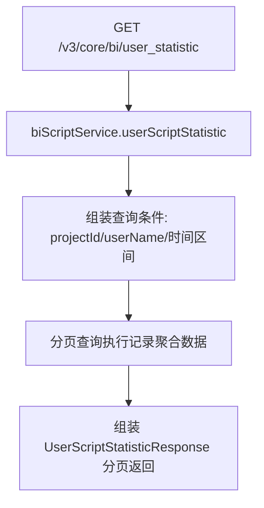
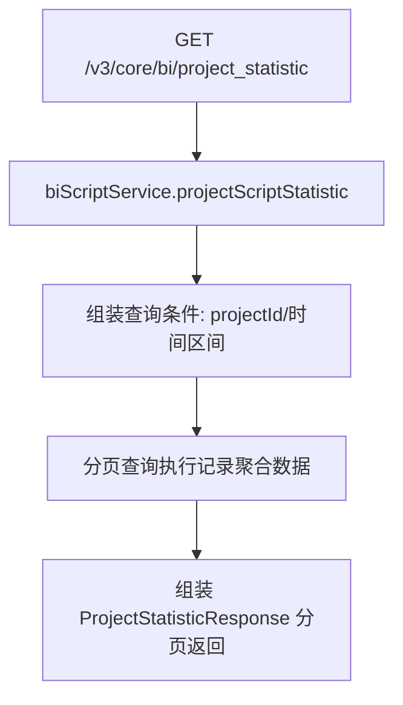

# BiStatisticController -- BI 统计（用户/项目脚本执行统计）

> 分支：syy.release.z7.8.1.0
> 源文件：`src/main/java/cn/testin/controller/bi/BiStatisticController.java`
> 类级路由：`/v3/core/bi`
> Service 接口：`cn.testin.business.interfaces.bi.IBiScriptService`
> 实现类：`cn.testin.business.impl.bi.BiScriptServiceImpl`
> 业务：按用户或项目维度统计脚本执行情况（总数/通过/失败/耗时等），支持时间区间过滤与分页。

## 接口列表总表

| 方法 | 路径 | 方法名 | 说明 | 操作日志 |
|---|---|---|---|---|
| GET | `/v3/core/bi/user_statistic` | userStatistic | 按用户统计脚本执行情况（分页） | 无 |
| GET | `/v3/core/bi/project_statistic` | projectStatistic | 按项目统计脚本执行情况（分页） | 无 |

统一响应包装：`ResponseResult<BasePageListResponseDTO<T>>`。

---

## 1. GET /v3/core/bi/user_statistic -- 用户脚本执行统计

### 入口

`BiStatisticController.userStatistic(...)` -- BiStatisticController.java

### 请求参数（Query）

| 字段 | 类型 | 必填 | 说明 |
|---|---|---|---|
| search_project_id | Integer | 否 | 按项目ID过滤 |
| search_user_name | String | 否 | 按用户名模糊过滤 |
| start_time | Long | 是 | 统计起始时间（毫秒时间戳） |
| end_time | Long | 是 | 统计结束时间（毫秒时间戳） |
| user_id | Integer | 是 | 当前用户ID（鉴权/数据隔离） |
| project_id | Integer | 是 | 当前项目ID |
| page | Integer | 是 | 页码 |
| page_size | Integer | 是 | 每页条数 |

### 响应结构

`ResponseResult<BasePageListResponseDTO<UserScriptStatisticResponse>>`。

### 返回参数

| 字段 | 类型 | 说明 |
|---|---|---|
| code | Integer | 状态码，0 成功 |
| msg | String | 提示信息 |
| data | Object | 分页数据对象 |
| data.list | Array\<UserScriptStatisticResponse\> | 用户维度统计列表 |
| data.list[].userId | Integer | 用户 ID |
| data.list[].userName | String | 用户名 |
| data.list[].projectId | Integer | 项目 ID |
| data.list[].projectName | String | 项目名 |
| data.list[].scriptCreateTotal | Integer | 脚本创建总数 |
| data.list[].scriptUpdateTotal | Integer | 脚本更新总数 |
| data.list[].taskExecTotal | Integer | 任务执行总数 |
| data.list[].effectiveScriptTotal | Integer | 有效脚本数 |
| data.list[].scriptPassTotal | Integer | 脚本通过数 |
| data.list[].scriptFailTotal | Integer | 脚本失败数 |
| data.page | Integer | 当前页 |
| data.pageSize | Integer | 每页条数 |
| data.totalPage | Integer | 总页数 |
| data.totalRow | Long | 总记录数 |

### 实现意图

按用户维度聚合脚本执行记录：在指定时间区间内，按 `userId` 分组统计各脚本的执行次数与通过/失败情况；支持按项目、用户名进一步过滤。数据来源为执行记录与脚本执行明细表。

### mermaid



### 调用链

```
BiStatisticController.userStatistic
└─ BiScriptServiceImpl.userScriptStatistic
   → 执行记录 + 脚本明细聚合查询
```

### 涉及表

| 表 | 操作 |
|---|---|
| execute_record 系列表（execute_record / execute_record_task / execute_record_task_script / execute_record_task_script_detail） | 读（聚合统计） |

### 异常

| 条件 | 异常 |
|---|---|
| 参数校验失败 | GeneralException（Service 层校验） |

---

## 2. GET /v3/core/bi/project_statistic -- 项目脚本执行统计

### 入口

`BiStatisticController.projectStatistic(...)` -- BiStatisticController.java

### 请求参数（Query）

| 字段 | 类型 | 必填 | 说明 |
|---|---|---|---|
| search_project_id | Integer | 否 | 按项目ID过滤 |
| start_time | Long | 是 | 统计起始时间（毫秒时间戳） |
| end_time | Long | 是 | 统计结束时间（毫秒时间戳） |
| page | Integer | 是 | 页码 |
| page_size | Integer | 是 | 每页条数 |

### 响应结构

`ResponseResult<BasePageListResponseDTO<ProjectStatisticResponse>>`。

### 返回参数

| 字段 | 类型 | 说明 |
|---|---|---|
| code | Integer | 状态码，0 成功 |
| msg | String | 提示信息 |
| data | Object | 分页数据对象 |
| data.list | Array\<ProjectStatisticResponse\> | 项目维度统计列表 |
| data.list[].projectId | Integer | 项目 ID |
| data.list[].projectName | String | 项目名 |
| data.list[].scriptCreateTotal | Integer | 脚本创建总数 |
| data.list[].scriptUpdateTotal | Integer | 脚本更新总数 |
| data.list[].taskExecTotal | Integer | 任务执行总数 |
| data.list[].effectiveScriptTotal | Integer | 有效脚本数 |
| data.list[].scriptPassTotal | Integer | 脚本通过数 |
| data.list[].scriptFailTotal | Integer | 脚本失败数 |
| data.page | Integer | 当前页 |
| data.pageSize | Integer | 每页条数 |
| data.totalPage | Integer | 总页数 |
| data.totalRow | Long | 总记录数 |

### 实现意图

按项目维度聚合脚本执行记录：在指定时间区间内，按 `projectId` 分组统计各脚本的执行次数与通过/失败情况。与用户统计的区别在于不区分操作人，仅按项目和脚本维度聚合。

### mermaid



### 调用链

```
BiStatisticController.projectStatistic
└─ BiScriptServiceImpl.projectScriptStatistic
   → 执行记录 + 脚本明细聚合查询
```

### 涉及表

| 表 | 操作 |
|---|---|
| execute_record 系列表（execute_record / execute_record_task / execute_record_task_script / execute_record_task_script_detail） | 读（聚合统计） |

### 异常

| 条件 | 异常 |
|---|---|
| 参数校验失败 | GeneralException（Service 层校验） |

---

## 备注

- 两个接口均为纯统计查询，无写操作、无事务、无操作日志。
- 统计口径由 `BiScriptServiceImpl` 确定（通过/失败/超时/取消的分类逻辑见 Service 实现）。
- 响应 DTO 见 `cn.testin.controller.bi.dto` 包：`UserScriptStatisticResponse`、`ProjectStatisticResponse`。

相关文档：[00-分支索引](00-分支索引.md) · [ScriptStatisticController](../测试计划/ScriptStatisticController.md)
