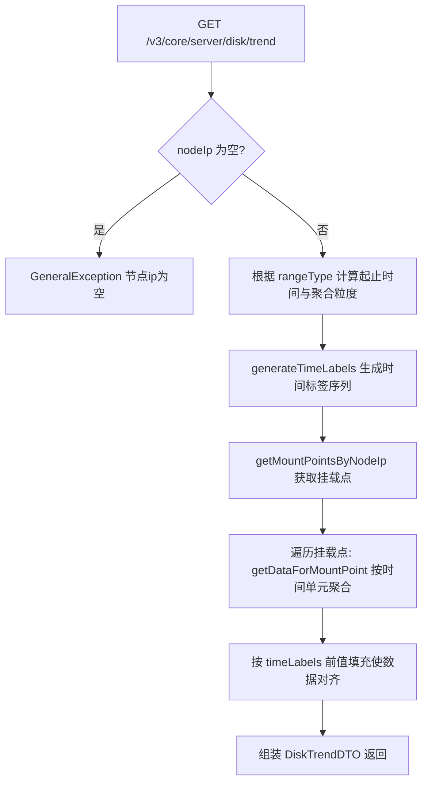
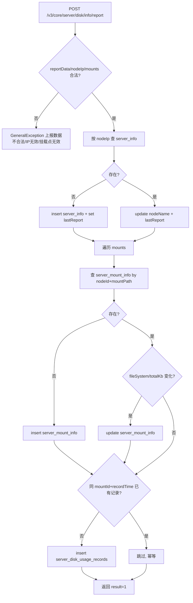

# DiskMonitorController -- 磁盘监控（挂载点/趋势/数据上报）

> 分支：syy.release.z7.8.1.0
> 源文件：`src/main/java/cn/testin/controller/disk/DiskMonitorController.java`
> 类级路由：`/v3/core/server`
> Service 接口：`cn.testin.business.interfaces.common.IDiskMonitorService`
> 实现类：`cn.testin.business.impl.common.DiskMonitorServiceImpl`
> 业务：服务器节点磁盘监控，包括活跃节点挂载点查询、节点IP列表、磁盘使用趋势（24小时/7天）、磁盘数据上报。

## 接口列表总表

| 方法 | 路径 | 方法名 | 说明 | 操作日志 |
|---|---|---|---|---|
| GET | `/v3/core/server/disk/mounts_info` | getActiveNodesWithMounts | 获取活跃节点及其磁盘挂载点信息 | 无 |
| GET | `/v3/core/server/node_ips` | getNodeIps | 获取所有节点IP列表 | 无 |
| GET | `/v3/core/server/disk/trend` | getDiskUsageTrendDaily | 获取节点磁盘使用趋势（24小时/7天） | 无 |
| POST | `/v3/core/server/disk/info/report` | handleReport | 节点磁盘数据上报 | 无 |

统一响应包装：`ResponseResult<T>`。

---

## 1. GET /v3/core/server/disk/mounts_info -- 活跃节点挂载点信息

### 入口

`DiskMonitorController.getActiveNodesWithMounts()` -- DiskMonitorController.java

### 请求参数

无。

### 响应结构

`ResponseResult<List<NodeMountDTO>>`，列表元素：

| 字段 | 类型 | 说明 |
|---|---|---|
| nodeId | Integer | 节点ID |
| nodeIp | String | 节点IP地址 |
| nodeName | String | 节点名称 |
| mounts | List\<MountInfoDTO\> | 该节点下所有挂载点 |

`MountInfoDTO` 包含：

| 字段 | 类型 | 说明 |
|---|---|---|
| mountId | Integer | 挂载点ID |
| mountPath | String | 挂载路径（如 /、/data） |
| fileSystem | String | 文件系统类型 |
| totalKb | Long | 总容量（KB） |
| totalSize | String | 格式化后总容量（如 "100.0 GB"） |

### 实现意图

查询所有活跃节点（`server_info.status = 1`），为每个节点查出其全部挂载点信息（`server_mount_info`），组装为 `NodeMountDTO` 列表。容量从 KB 单位格式化为人类可读字符串。

### 调用链

```
DiskMonitorController.getActiveNodesWithMounts
└─ DiskMonitorServiceImpl.getActiveNodesWithMounts
   ├─ IServerInfoDao.selectList (status=1)     → server_info
   └─ IServerMountInfoDao.selectList (by nodeId) → server_mount_info
```

### 涉及表

| 表 | 操作 |
|---|---|
| server_info | 读（status=1 活跃节点） |
| server_mount_info | 读（按 nodeId 关联） |

---

## 2. GET /v3/core/server/node_ips -- 节点IP列表

### 入口

`DiskMonitorController.getNodeIps()` -- DiskMonitorController.java

### 请求参数

无。

### 响应结构

`ResponseResult<List<String>>`：所有节点IP列表。

### 调用链

```
DiskMonitorController.getNodeIps
└─ DiskMonitorServiceImpl.getAllNodeIps
   → IServerInfoDao.selectAllNodeIps → server_info
```

### 涉及表

| 表 | 操作 |
|---|---|
| server_info | 读 |

---

## 3. GET /v3/core/server/disk/trend -- 磁盘使用趋势

### 入口

`DiskMonitorController.getDiskUsageTrendDaily(@RequestParam String nodeIp, @RequestParam Integer rangeType)` -- DiskMonitorController.java

### 请求参数

| 字段 | 类型 | 必填 | 说明 |
|---|---|---|---|
| node_ip | String | 是 | 节点IP地址 |
| range_type | Integer | 是 | 统计范围：1=近24小时（按小时聚合），2=近7天（按天聚合） |

### 响应结构

`ResponseResult<DiskTrendDTO>`：

| 字段 | 类型 | 说明 |
|---|---|---|
| nodeIp | String | 节点IP |
| timeLabels | List\<String\> | 时间轴标签（如 `["2025-01-01 10:00", ...]` 或 `["2025-01-01", ...]`） |
| series | List\<MountPointSeries\> | 各挂载点的时间序列数据 |

`MountPointSeries` 包含：

| 字段 | 类型 | 说明 |
|---|---|---|
| mountPoint | String | 挂载路径 |
| usagePercentList | List\<Integer\> | 使用率百分比序列（对齐 timeLabels） |
| maxUsedKbList | List\<Long\> | 最大已用空间序列（KB） |
| totalCapacityList | List\<Long\> | 总容量序列（KB） |

### 实现意图

根据范围类型确定时间窗口与聚合粒度（24小时按小时、7天按天），生成固定时间标签序列 → 获取节点所有挂载点 → 遍历挂载点从 `server_disk_usage_records` 拉取聚合数据 → 按时间标签对齐填充（前值填充法：无数据的时间点沿用上一时刻的值）→ 组装返回。

### mermaid



### 调用链

```
DiskMonitorController.getDiskUsageTrendDaily
└─ DiskMonitorServiceImpl.getDiskUsageTrend
   ├─ IServerMountInfoDao.getMountPointsByNodeIp        → server_mount_info
   ├─ generateTimeLabels（HOUR/DAY）
   └─ IServerDiskUsageRecordsDao.getDataForMountPoint   → server_disk_usage_records
```

### 涉及表

| 表 | 操作 |
|---|---|
| server_mount_info | 读 |
| server_disk_usage_records | 读（按时段聚合） |

### 异常

| 条件 | 异常 |
|---|---|
| nodeIp 为空 | GeneralException(paraInvalid, "节点ip为空") |

---

## 4. POST /v3/core/server/disk/info/report -- 节点磁盘数据上报

### 入口

`DiskMonitorController.handleReport(@RequestBody NodeMountDTO reportData)` -- DiskMonitorController.java

### 请求参数（NodeMountDTO，JSON Body）

| 字段 | 类型 | 必填 | 说明 |
|---|---|---|---|
| nodeIp | String | 是 | 节点IP（为空抛"上报节点IP无效"） |
| nodeName | String | 否 | 节点名称 |
| reportTime | String | 是 | 上报时间（`yyyy-MM-dd HH:mm:ss` 格式） |
| mounts | List\<MountInfoDTO\> | 是（非空） | 挂载点数据列表 |

`MountInfoDTO` 上报字段：

| 字段 | 类型 | 说明 |
|---|---|---|
| mountPath | String | 挂载路径 |
| fileSystem | String | 文件系统类型 |
| totalKb | Long | 总容量（KB） |
| usedKb | Long | 已用空间（KB） |
| usagePercent | Integer | 使用率百分比 |

### 响应结构

- 成功：`ResponseResult.success({result: 1})`。
- 失败：`ResponseResult.error(500, errorMsg, {result: 0})`。

### 实现意图

三步曲（`@Transactional` 事务）：

1. **维护服务器信息**：按 nodeIp 查 `server_info`，无则 insert，有则更新 `nodeName` 和 `lastReport` 时间。
2. **维护挂载点信息**：遍历 mounts，按 nodeId+mountPath 查 `server_mount_info`，无则 insert，有则检查 fileSystem/totalKb 变化后 update。
3. **写入使用记录**：检查同 mountId+recordTime 是否已有记录（幂等），无则 insert 到 `server_disk_usage_records`。

### mermaid



### 调用链

```
DiskMonitorController.handleReport
└─ DiskMonitorServiceImpl.processReport (@Transactional)
   ├─ IServerInfoDao.selectOne / insert / updateById          → server_info
   ├─ IServerMountInfoDao.selectOne / insert / updateByPrimaryKey → server_mount_info
   └─ IServerDiskUsageRecordsDao.existsRecord / insert        → server_disk_usage_records
```

### 涉及表

| 表 | 操作 |
|---|---|
| server_info | 读 / 写（insert or update） |
| server_mount_info | 读 / 写（insert or update） |
| server_disk_usage_records | 读（幂等检查）/ 写（insert） |

### 异常

| 条件 | 异常 |
|---|---|
| reportData 为 null | GeneralException(paraInvalid, "上报数据不合法") |
| nodeIp 为空 | GeneralException(paraInvalid, "上报节点IP无效") |
| mounts 为空 | GeneralException(paraInvalid, "节点" + nodeIp + " 的挂载点无效") |
| 处理过程其他异常 | catch 后返回 error(500, e.getMessage(), {result:0}) |

---

## 备注

- 磁盘数据上报接口具有幂等性：同一 mountId + recordTime 组合不会重复插入记录。
- `processReport` 带 `@Transactional`，服务器/挂载点/使用记录三步整体成败一致。
- 另有定时任务 `maintenanceServerDiskJob`（每天凌晨3点）清理：删除10天前的 `server_disk_usage_records`，清理超过10天未上报的失效服务器及其挂载点和记录（分批500条）。
- `getDiskUsageTrend` 中前值填充策略确保图表时间轴连续，无数据点不会断线。

相关文档：[00-分支索引](00-分支索引.md)
