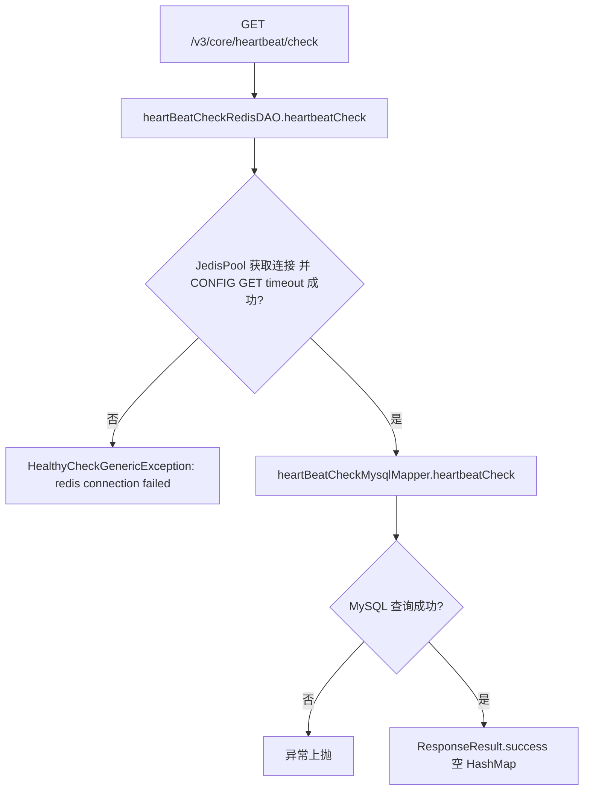

# HeartBeatController -- 健康检查（Redis + MySQL 连通性）

> 分支：syy.release.z7.8.1.0
> 源文件：`src/main/java/cn/testin/controller/HeartBeatController.java`
> 类级路由：`/core`
> 业务：服务健康检查探针，验证 Redis 连接池与 MySQL 数据库连通性，供负载均衡 / K8s 探活使用。

## 接口列表总表

| 方法 | 路径 | 方法名 | 说明 | 操作日志 |
|---|---|---|---|---|
| GET | `/v3/core/heartbeat/check` | check | Redis + MySQL 连通性检查 | 无 |

统一响应包装：`ResponseResult<T>`；成功返回空 `HashMap`，失败抛出 `HealthyCheckGenericException` 由全局异常处理器转 HTTP 500。

---

## 1. GET /v3/core/heartbeat/check -- 健康检查

### 入口

`HeartBeatController.check()` -- HeartBeatController.java

### 请求参数

无。

### 响应结构

- 成功：`ResponseResult.success(new HashMap<>())`，HTTP 200。
- 失败：`@ExceptionHandler(HealthyCheckGenericException.class)` 拦截，返回 `ResponseResult.error(errCode, errMsg)`，HTTP 500。

### 实现意图

依次执行两步检查：

1. **Redis 连通性**：从 `JedisPool` 获取连接，执行 `CONFIG GET timeout` 命令；获取失败或执行异常均抛出 `HealthyCheckGenericException("redis connection failed!")`。
2. **MySQL 连通性**：调用 `HeartBeatCheckMysqlMapper.heartbeatCheck()`（MyBatis Mapper 执行一条轻量 SQL，如 `SELECT 1`）；异常上抛。

任一步失败即整体失败，返回 500。

### mermaid



### 调用链

```
HeartBeatController.check
├─ HeartBeatCheckRedisDAOImpl.heartbeatCheck
│  └─ JedisPool.getResource → Jedis.configGet("timeout")
└─ HeartBeatCheckMysqlMapper.heartbeatCheck
   └─ MyBatis Mapper SQL（轻量连接检查）
```

### 涉及表

无直接业务表读写；Redis 执行 `CONFIG GET timeout` 命令，MySQL 执行 Mapper 定义的心跳 SQL。

### 异常

| 条件 | 异常 |
|---|---|
| Redis 连接失败或命令异常 | HealthyCheckGenericException(connDatabaseFailed, "redis connection failed!") |
| MySQL 查询异常 | 异常上抛至 @ExceptionHandler，HTTP 500 |

### 代码摘录

```java
@RequestMapping(value = "/heartbeat/check", method = RequestMethod.GET)
@ResponseBody
public ResponseResult check() {
    heartBeatCheckRedisDAO.heartbeatCheck();
    heartBeatCheckMysqlMapper.heartbeatCheck();
    return ResponseResult.success(new HashMap<>());
}
```

---

## 备注

- 本接口为纯探活端点，无鉴权、无操作日志、无事务。
- Redis 检查通过 `JedisPool` 连接池，不依赖 Spring Data Redis 模板。
- MySQL Mapper 定义见 `cn.testin.dao.heartbeat.HeartBeatCheckMysqlMapper`，典型实现为 `SELECT 1` 或类似轻量查询。

相关文档：[00-分支索引](00-分支索引.md)
