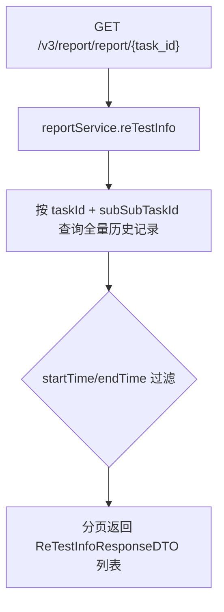
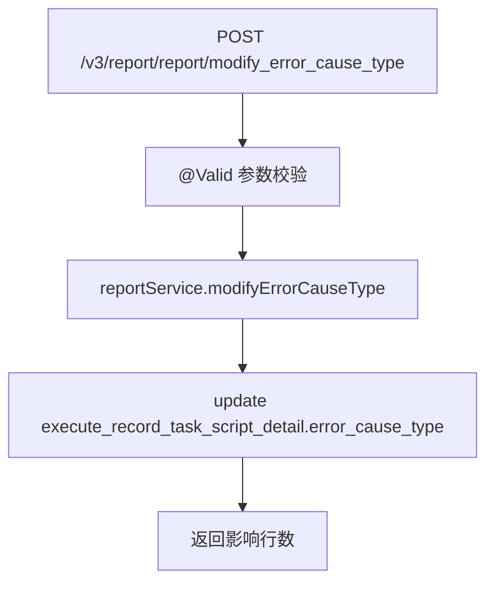

# ReportController -- 脚本历史补测记录与错误类型维护

> 分支：syy.release.z7.8.1.0
> 源文件：`src/main/java/cn/testin/controller/ReportController.java`
> 类级路由：`/report`
> Service 接口：`cn.testin.business.interfaces.report.IReportService`
> 实现类：`cn.testin.business.impl.report.ReportServiceImpl`
> 业务：查询脚本历史补测（重测）记录列表（按 taskId + subSubTaskId），以及维护执行记录脚本明细的自定义错误分类。

## 接口列表总表

| 方法 | 路径 | 方法名 | 说明 | 操作日志 |
|---|---|---|---|---|
| GET | `/v3/report/report/{task_id}` | list | 分页查询脚本历史补测记录 | 无 |
| POST | `/v3/report/report/modify_error_cause_type` | modifyErrorCauseType | 更新脚本执行的错误原因类型（自定义分类） | 无 |

统一响应包装：`ResponseResult<T>`；分页用 `BasePageListResponseDTO`；写操作用 `BaseDataResultDTO`。

---

## 1. GET /v3/report/report/{task_id} -- 查询脚本历史补测记录

### 入口

`ReportController.list(@PathVariable String taskId, @RequestParam String subSubTaskId, ...)` -- ReportController.java

### 请求参数

| 字段 | 来源 | 类型 | 必填 | 默认值 | 说明 |
|---|---|---|---|---|---|
| task_id | Path | String | 是 | -- | 任务ID |
| sub_sub_task_id | Query | String | 是 | -- | 子子任务ID（脚本执行单元标识） |
| page | Query | Integer | 否 | 1 | 页码 |
| page_size | Query | Integer | 否 | 10 | 每页条数 |
| start_time | Query | Long | 否 | -- | 补测起始时间（毫秒时间戳） |
| end_time | Query | Long | 否 | -- | 补测结束时间（毫秒时间戳） |

### 响应结构

`ResponseResult<BasePageListResponseDTO<ReTestInfoResponseDTO>>`。

### 返回参数（ReTestInfoResponseDTO 元素结构）

| 字段 | 类型 | 说明 |
|---|---|---|
| code | Integer | 状态码，0 成功 |
| msg | String | 提示信息 |
| data | Object | 分页数据对象 |
| data.list | Array\<ReTestInfoResponseDTO\> | 补测记录列表 |
| data.list[].scriptNo | Integer | 脚本编号 |
| data.list[].scriptName | String | 脚本名称 |
| data.list[].scriptTags | Array\<String\> | 脚本标签 |
| data.list[].appReportDevice | Object | App 设备信息（AppDeviceResponseDTO，App 任务才有） |
| data.list[].webReportDevice | Object | Web 设备信息（WebDeviceResponseDTO，Web 任务才有） |
| data.list[].execStatus | Integer | 执行状态 |
| data.list[].timeConsuming | Long | 耗时（毫秒） |
| data.list[].errorMsg | String | 错误信息 |
| data.list[].errorCode | Integer | 错误码 |
| data.list[].taskId | String | 任务 ID |
| data.list[].subTaskId | String | 子任务 ID |
| data.list[].subSubTaskId | String | 子子任务 ID |
| data.list[].outputParams | String | 输出参数 |
| data.list[].inputParams | String | 输入参数 |
| data.list[].resultCategory | Integer | 结果分类（枚举） |
| data.list[].reportRunInfo | Object | 运行信息（ReportRunInfo，见下） |
| data.list[].sourceConfigId | Integer | 数据源配置 ID |
| data.list[].sourceConfigName | String | 数据源配置名称 |
| data.list[].sourceConfigParentId | Integer | 数据源配置父 ID |
| data.page | Integer | 当前页 |
| data.pageSize | Integer | 每页条数 |
| data.totalPage | Integer | 总页数 |
| data.totalRow | Long | 总记录数 |

`reportRunInfo`（ReportRunInfo）字段：

| 字段 | 类型 | 说明 |
|---|---|---|
| ucomid | String | UCOM 客户端标识 |
| ucomVersion | String | UCOM 版本 |
| jetlag | Long | 时差 |
| installPath | String | 安装路径 |
| installTime | Long | 安装时间 |
| startTime | Long | 启动时间 |
| uninstallTime | Long | 卸载时间 |
| execTime | Long | 执行时间 |
| totalTime | Long | 总耗时 |
| testProcesses | Array\<TestProcess\> | 测试进程列表（字段见 real-test 侧） |
| errorCode | Integer | 错误码 |
| errorMsg | String | 错误信息 |
| pfCode | Integer | 平台码 |
| runParam | String | 运行参数 |
| videoInfo | Object | 录像信息（VideoInfo） |
| stepInfo | Object | 步骤信息（StepInfo） |
| warningTags | Array\<WarningTag\> | 告警标签列表 |

`appReportDevice`（AppDeviceResponseDTO）关键字段：`cloud/deviceid/ucomid/modelid/releaseVer/modelName/brandName/aliasName/dpiWidth/dpiHeight/screenSize/execStatus/resultCategory/startExecTime/finishTime/network/round/retestMark/status` 等。
`webReportDevice`（WebDeviceResponseDTO）关键字段：`ucomid/osName/osVersion/type/version/location/ip/systemBitness/webDeviceType/cpuArch/systemVersion/systemName/systemType`。

### 实现意图

查询某个任务下某个脚本执行单元（subSubTaskId）的全部执行记录历史（含首次 + 历次补测），按时间排序分页返回。支持按时间区间过滤。

### mermaid



### 调用链

```
ReportController.list
└─ ReportServiceImpl.reTestInfo
   → execute_record_task_script_detail 按 taskId + subSubTaskId + 时间查询
```

### 涉及表

| 表 | 操作 |
|---|---|
| execute_record_task_script_detail | 读（历史补测记录查询） |

---

## 2. POST /v3/report/report/modify_error_cause_type -- 更新错误原因类型

### 入口

`ReportController.modifyErrorCauseType(@RequestBody @Valid MaintainErrorCauseTypeDTO requestDTO)` -- ReportController.java

### 请求参数（MaintainErrorCauseTypeDTO，JSON Body，@Valid）

| 字段 | 类型 | 必填 | 说明 |
|---|---|---|---|
| errorCauseTypeId | Integer | 是 | 错误原因类型ID（null 抛 `errorCauseTypeId is null`） |
| taskId | String | 是 | 任务ID（blank 抛异常） |
| subTaskId | String | 是 | 子任务ID（blank 抛异常） |
| subSubTaskId | String | 是 | 子子任务ID（blank 抛异常） |
| taskType | Integer | 是 | 任务类型（null 抛 `taskType is null`；决定路由 App/Web 侧） |
| userId | Integer | 否 | 操作人用户ID |

### 响应结构

`ResponseResult<BaseDataResultDTO>`，`data.result` = 更新影响行数。

### 实现意图

允许人工对执行记录的脚本明细标注错误原因分类（如：脚本问题、设备问题、环境问题、产品缺陷等），用于后续质量分析和缺陷归类。更新 `execute_record_task_script_detail.error_cause_type` 字段。

### mermaid



### 调用链

```
ReportController.modifyErrorCauseType
└─ ReportServiceImpl.modifyErrorCauseType
   → execute_record_task_script_detail update errorCauseType
```

### 涉及表

| 表 | 操作 |
|---|---|
| execute_record_task_script_detail | 写（update errorCauseType） |

### 异常

| 条件 | 异常 |
|---|---|
| @Valid 校验失败 | Spring 参数绑定异常（400） |
| 记录不存在 | update 影响行数可能为 0（不抛异常） |

---

## 备注

- "补测记录"指同一个子子任务（subSubTaskId）在首次执行后的重测/补测记录，通过 `execute_record_task_script_detail` 表的多条历史记录体现。
- `errorCauseType` 的自定义分类依赖 `MaintainErrorCauseTypeDTO` 中的枚举映射，业务侧可扩展。
- 响应 DTO `ReTestInfoResponseDTO` 定义见 `cn.testin.api.bean.response` 包，由 API 层共用。
- 无 `@UnderlineToCamel` 注解，路径参数和 Query 参数按标准 Spring MVC 绑定。

相关文档：[00-分支索引](00-分支索引.md)
