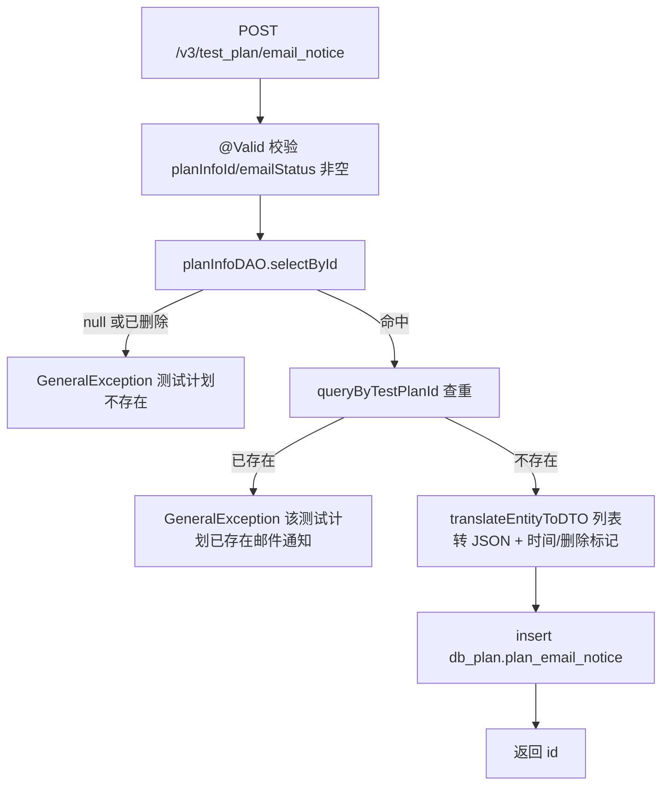
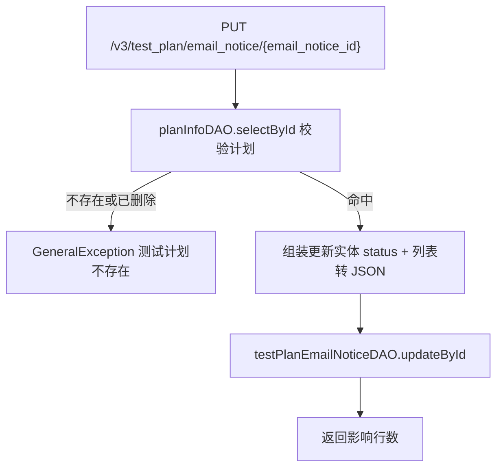
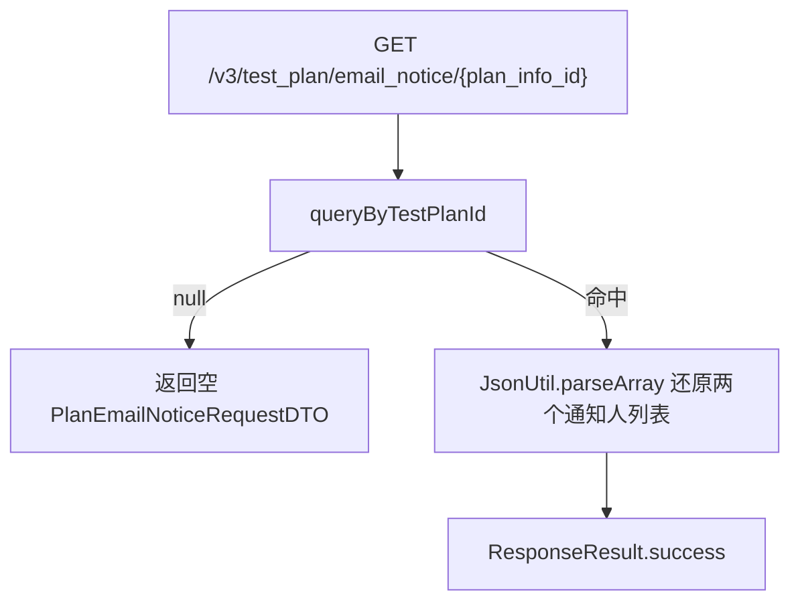

# EmailNoticeController — 测试计划邮件通知配置

> 分支：syy.release.z7.8.1.0
> 源文件：`src/main/java/cn/testin/controller/plan/EmailNoticeController.java`
> 类级路由：`/test_plan`
> 业务：测试计划维度邮件通知配置的增/改/查。配置项为开关（emailStatus）与完成/取消两类通知人列表；实际发信由执行完成链路调 `sendEmail` 落 email_task 表异步发送。

## 接口列表总表

| 方法 | 路径 | 方法名 | 说明 | 操作日志 |
|---|---|---|---|---|
| POST | `/v3/test_plan/email_notice` | saveEmailNotice | 新增邮件通知配置（一个计划仅一条） | `EMAIL_NOTICE_EXECUTE_UPDATE` |
| PUT | `/v3/test_plan/email_notice/{email_notice_id}` | updateEmailNotice | 按主键更新开关与通知人 | `EMAIL_NOTICE_EXECUTE_UPDATE` |
| GET | `/v3/test_plan/email_notice/{plan_info_id}` | queryEmailNoticeInfoByTestPlanId | 按计划 ID 查询邮件配置 | 无 |

统一响应包装：`ResponseResult<T>`；`BaseDataResultDTO { Long result }`。

---

## 1. POST /v3/test_plan/email_notice — 新增邮件通知配置

### 入口

`EmailNoticeController.saveEmailNotice(@RequestBody @Valid PlanEmailNoticeRequestDTO request)` — EmailNoticeController.java

### 请求参数（PlanEmailNoticeRequestDTO，JSON Body，继承 BaseRequestDTO）

| 字段 | 类型 | 必填 | 说明 |
|---|---|---|---|
| planInfoId | Long | 是（@NotNull） | 测试计划 ID；计划不存在或已删除抛错 |
| emailStatus | Integer | 是（@NotNull） | 邮件开关 0=关闭 1=开启 |
| finishNoticeLeader | List\<Integer\> | 否 | 完成后通知人 userId 列表，JSON 串落库（源码注释误写为「取消后」） |
| cancelNoticeLeader | List\<Integer\> | 否 | 取消后通知人 userId 列表，JSON 串落库（源码注释误写为「完成后」） |
| id | Long | 否 | 新增时不传 |
| userId | 基类 | 否 | 创建/更新人 |

### 响应结构

`ResponseResult<BaseDataResultDTO>`，`data.result` = 新建配置主键 id。

```json
{ "code": 0, "msg": "success", "data": { "result": 456 } }
```

### 实现意图

为测试计划创建唯一邮件通知配置：校验计划存在未删除、按 plan_info_id + is_delete=0 查重；通知人列表转 JSON 字符串后 insert。

### mermaid



### 调用链

```
EmailNoticeController.saveEmailNotice
├─ @OperateLog(EMAIL_NOTICE_EXECUTE_UPDATE) AOP 记录操作日志
└─ PlanEmailNoticeServiceImpl.saveTestPlanEmailNotice
   ├─ IPlanInfoDAO.selectById            → db_plan.plan_info（存在性）
   ├─ queryByTestPlanId                  → db_plan.plan_email_notice（查重）
   └─ IPlanEmailNoticeDAO.insert         → db_plan.plan_email_notice
```

### 涉及表

| 表 | 操作 |
|---|---|
| db_plan.plan_info | 读 |
| db_plan.plan_email_notice | 读（查重）/ 写（insert） |

### 异常

| 条件 | 异常 |
|---|---|
| @Valid 校验失败 | 参数校验异常（统一异常处理） |
| 计划不存在或已删除 | GeneralException(paraInvalid, 测试计划不存在) |
| 计划已有邮件配置 | GeneralException(paraOpInvalid, 该测试计划已存在邮件通知) |

### 关联横切

- `@OperateLog(operateLog = OperateLogEnum.EMAIL_NOTICE_EXECUTE_UPDATE)`：AOP 写操作日志。
- 用户上下文：`BaseRequestDTO.userId` 注入 create/update_user_id。

### 代码摘录

```java
DbPlanInfo dbPlanInfo = planInfoDAO.selectById(requestDTO.getPlanInfoId());
if (dbPlanInfo == null || DeleteTypeEnum.isDeleted(dbPlanInfo.getIsDelete())) {
    throw new GeneralException(CommonCode.paraInvalid.getValue(), "测试计划不存在");
}
DbPlanEmailNotice dbEntity = queryByTestPlanId(requestDTO.getPlanInfoId());
if (dbEntity != null) {
    throw new GeneralException(CommonCode.paraOpInvalid.getValue(), "该测试计划已存在邮件通知");
}
```

---

## 2. PUT /v3/test_plan/email_notice/{email_notice_id} — 更新邮件通知配置

### 入口

`EmailNoticeController.updateEmailNotice(@PathVariable Long emailNoticeId, @RequestBody @Valid PlanEmailNoticeRequestDTO request)` — EmailNoticeController.java

### 请求参数

| 字段 | 来源 | 必填 | 说明 |
|---|---|---|---|
| email_notice_id | Path | 是 | 配置主键 |
| planInfoId | Body | 是 | 用于校验计划存在 |
| emailStatus | Body | 是 | 邮件开关 |
| finishNoticeLeader | Body | 否 | 完成后通知人；null 则该列更新为 null |
| cancelNoticeLeader | Body | 否 | 取消后通知人；同上 |

### 响应结构

`ResponseResult<BaseDataResultDTO>`，`data.result` = update 影响行数（0/1）。

### 实现意图

校验计划存在后按主键更新三列（emailStatus、两个通知人 JSON）与更新人/时间。注意：通知人列表传 null 时显式落 null（清空语义），不做非空保护。

### mermaid



### 调用链

```
EmailNoticeController.updateEmailNotice
├─ @OperateLog(EMAIL_NOTICE_EXECUTE_UPDATE) AOP 记录操作日志
└─ PlanEmailNoticeServiceImpl.updateTestPlanEmailNotice
   ├─ IPlanInfoDAO.selectById           → db_plan.plan_info（存在性）
   └─ IPlanEmailNoticeDAO.updateById    → db_plan.plan_email_notice
```

### 涉及表

| 表 | 操作 |
|---|---|
| db_plan.plan_info | 读 |
| db_plan.plan_email_notice | 写（updateById） |

### 异常

| 条件 | 异常 |
|---|---|
| 计划不存在或已删除 | GeneralException(paraInvalid, 测试计划不存在) |

### 关联横切

- `@OperateLog(EMAIL_NOTICE_EXECUTE_UPDATE)` 操作日志。
- 注意：不校验 emailNoticeId 本身是否存在，主键不存在时静默返回 0。

### 代码摘录

```java
DbPlanEmailNotice emailNotice = new DbPlanEmailNotice();
emailNotice.setId(emailNoticeId);
emailNotice.setEmailStatus(requestDTO.getEmailStatus());
emailNotice.setFinishNoticeLeader(requestDTO.getFinishNoticeLeader() == null ? null
        : jsonUtils.toJsonString(requestDTO.getFinishNoticeLeader()));
emailNotice.setCancelNoticeLeader(requestDTO.getCancelNoticeLeader() == null ? null
        : jsonUtils.toJsonString(requestDTO.getCancelNoticeLeader()));
return testPlanEmailNoticeDAO.updateById(emailNotice);
```

---

## 3. GET /v3/test_plan/email_notice/{plan_info_id} — 查询邮件通知配置

### 入口

`EmailNoticeController.queryEmailNoticeInfoByTestPlanId(@PathVariable("plan_info_id") Long planInfoId)` — EmailNoticeController.java

### 请求参数

| 字段 | 来源 | 必填 | 说明 |
|---|---|---|---|
| plan_info_id | Path | 是 | 测试计划 ID |

### 响应结构

`ResponseResult<PlanEmailNoticeRequestDTO>`；无配置时返回**空 DTO**（字段全 null，非 null data）。

| 字段 | 类型 | 说明 |
|---|---|---|
| id | Long | 配置主键 |
| planInfoId | Long | 计划 ID |
| emailStatus | Integer | 0 关 / 1 开 |
| finishNoticeLeader | List\<Integer\> | 完成通知人（JSON 解析还原） |
| cancelNoticeLeader | List\<Integer\> | 取消通知人（JSON 解析还原） |

### 实现意图

按计划 ID 查未删除配置，JSON 字符串列解析回 Integer 列表返回；无配置返回空对象便于前端判空。

### mermaid



### 调用链

```
EmailNoticeController.queryEmailNoticeInfoByTestPlanId
└─ PlanEmailNoticeServiceImpl.queryEmailNoticeInfoByTestPlanId
   └─ queryByTestPlanId → IPlanEmailNoticeDAO.selectOne → db_plan.plan_email_notice
```

### 涉及表

| 表 | 操作 |
|---|---|
| db_plan.plan_email_notice | 读 |

### 异常

无显式异常。

### 关联横切

- 无操作日志、纯查询。

---

## 备注：非 Controller 暴露的核心能力 — sendEmail

`PlanEmailNoticeServiceImpl.sendEmail(EmailSendRequestDTO, reTestCheck)`（@DSTransactional）由执行完成/取消链路触发，不对应 HTTP 端点：

```
sendEmail
├─ IExecuteRecordDAO.selectExtById            → db_plan.execute_record（未完成抛错）
├─ reTestCheck 且已发过 → 直接返回 FAIL_CODE（幂等，手动发送不受限）
├─ 收件人三路解析：指定 userIdList / UserCondition 筛选 / 执行记录快照 planEmailCfg
├─ IEmailTempletConfigService.get             → 项目自定义邮件模板（主题/不显示类型）
├─ getEmailDetail：用例与脚本两条详情组装线
│  ├─ 用例：executeRecordTaskCaseDetailService + RealTaskV3Api.selectReportCaseList/getCaseDevice
│  ├─ 脚本：executeRecordTaskScriptDetailDAO + RealTestV3Api.reportList(app) / RealWebV3Api.reportList(web/pc)
│  └─ ErrorCauseTypeServiceApi.getErrorCaustMap（错误归因名称）
├─ IEmailTaskDAO.insert(DbEmailTask)          → db_notice.email_task（异步发送队列）
└─ IExecuteRecordDAO.updateById               → 回写 email_send_status=已发送（防重测重发）
```

- Redis：`Constants.REDIS_CANCEL_KEY + executeRecordId` 取取消人姓名。
- 其他内部方法：`selectById` / `insert` / `deleteTestPlanEmailNotice`（逻辑删除）/ `queryByTestPlanId`。

相关文档：[00-分支索引](00-分支索引.md) · [PlanInfoController](PlanInfoController.md) · [ExecuteRecordController](ExecuteRecordController.md) · [ScriptStatisticController](ScriptStatisticController.md)
