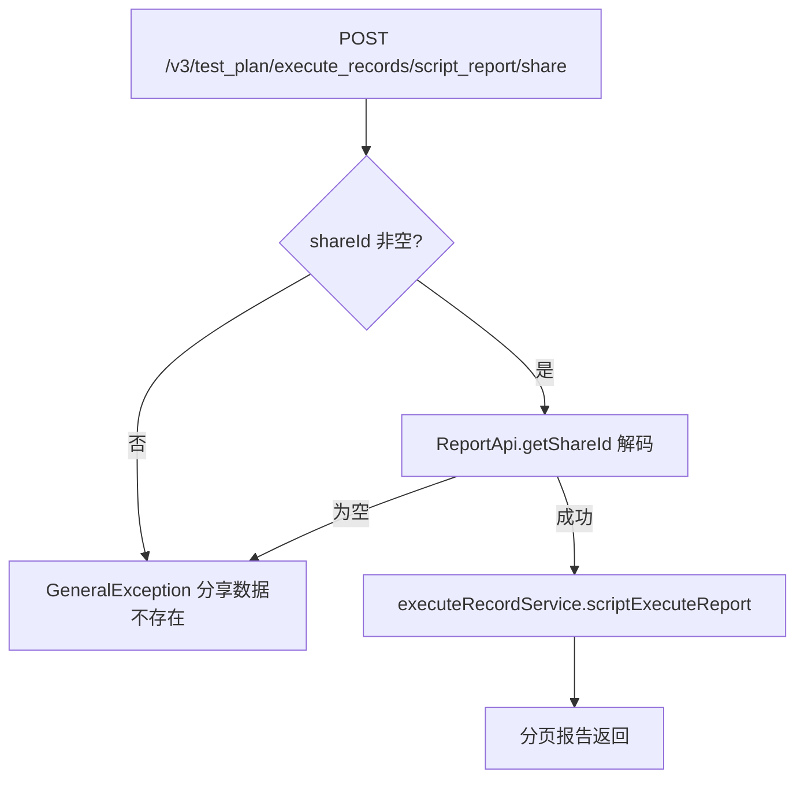

# ExecuteRecordController — 测试计划执行记录与报告

> 分支：syy.release.z7.8.1.0
> 源文件：`src/main/java/cn/testin/controller/plan/ExecuteRecordController.java`
> 类级路由：`/test_plan`
> 业务：执行记录的分页查询/更新/删除/停止/下载，以及执行报告（含分享链路）、脚本执行报告、设备信息、用例 Excel 下载、报告邮件发送。

## 接口列表总表

| 方法 | 路径 | 方法名 | 说明 | 操作日志 |
|---|---|---|---|---|
| GET | `/v3/test_plan/execute_records` | selectExecuteRecordByCondition | 分页查询执行记录 | 无 |
| GET | `/v3/test_plan/execute_records/plan_infos` | selectPlanInfoByExecuteRecordCondition | 查询执行记录中关联存在的测试计划 | 无 |
| GET | `/v3/test_plan/execute_records/download` | downloadExecuteRecordFile | 下载测试记录文件（直接写 HttpServletResponse） | 无 |
| PUT | `/v3/test_plan/execute_records/{execute_record_id}` | updateExecuteRecord | 按 id 更新执行记录（名称/报告导出 url） | 无 |
| DELETE | `/v3/test_plan/execute_records/{execute_record_id}` | deleteByExecuteRecordId | 删除一条执行记录 | `EXECUTE_RECORD_DELETE` |
| POST | `/v3/test_plan/execute_records/stop/{execute_record_id}` | stopExecuteRecord | 停止一条执行记录 | `EXECUTE_RECORD_STOP` |
| GET | `/v3/test_plan/execute_records/report` | getReportInfoByExecuteTaskId | 按 execute_task_id 获取报告信息 | 无 |
| GET | `/v3/test_plan/execute_records/report/share` | getShareReportInfoByExecuteTaskId | 按 share_id 获取分享报告 | 无 |
| GET | `/v3/test_plan/execute_records/report/script_fails` | getScriptFails | 获取脚本失败列表 | 无 |
| GET | `/v3/test_plan/execute_records/report/script_fails/share` | shareScriptFails | 获取脚本失败列表（分享） | 无 |
| GET | `/v3/test_plan/execute_records/report_url` | getReportUrl | 按 plan_info_id / execute_record_id 获取报告地址 | 无 |
| GET | `/v3/test_plan/execute_records/download_case_excel` | downloadCaseExcel | 下载计划用例 Excel | 无 |
| GET | `/v3/test_plan/execute_records/have_app_info` | haveAppInfo | 判断执行记录是否含 App 信息 | 无 |
| POST | `/v3/test_plan/execute_records/script_report` | scriptExecuteReport | 分页查询脚本执行报告 | 无 |
| GET | `/v3/test_plan/execute_records/devices` | getDeviceInfos | 查询脚本执行的设备信息 | 无 |
| POST | `/v3/test_plan/execute_records/script_report/share` | shareScriptExecuteReport | 分页查询脚本执行报告（分享） | 无 |
| GET | `/v3/test_plan/execute_records/devices/share` | getShareDeviceInfos | 查询设备信息（分享） | 无 |
| POST | `/v3/test_plan/execute_records/send_email` | sendEmail | 发送报告邮件通知 | 无 |

统一响应包装：`ResponseResult<T> { int code; String msg; T data }`；`BaseDataResultDTO { Long result }`；`BaseListResponseDTO<T> { List<T> list }`；`BasePageListResponseDTO<T>` 分页包装。
GET 接口普遍带 `@UnderlineToCamel`（query 下划线参数转驼峰）。

---

## 1. GET /v3/test_plan/execute_records — 分页查询执行记录

### 入口

`ExecuteRecordController.selectExecuteRecordByCondition(@Valid ExecuteRecordConditionRequestDTO request)`

### 请求参数（ExecuteRecordConditionRequestDTO，Query）

| 字段 | 类型 | 必填 | 说明 |
|---|---|---|---|
| page | Integer | 否 | 当前页，null 默认 `Constants.PAGE_DEFAULT` |
| page_size | Integer | 否 | 每页大小，null 默认 `Constants.PAGE_SIZE_DEFAULT` |
| plan_info_id | Long | 否 | 测试计划 id |
| plan_info_type | Integer | 否 | 计划类型 TaskTypeEnum：1 App / 3 Web / 5 桌面 |
| execute_status | Integer | 否 | 执行状态 PlanExecuteStatusEnum |
| execute_record_name | String | 否 | 执行记录名称 |
| create_start_time / create_end_time | Long | 否 | 创建时间区间 |
| create_user_name | String | 否 | 创建人名称 |
| id | Long | 否 | 执行记录 id |
| project_id | Integer | 否 | 项目 id |
| need_report_url | Integer | 否 | 是否需要报告地址 |
| test_stage | Integer | 否 | 测试阶段 |
| user_id | Integer | 否 | 用户 id |

### 响应结构

`ResponseResult<BasePageListResponseDTO<ExecuteRecordResponseDTO>>`，分页列表 + 总数。

### 实现意图

按组合条件分页查询执行记录；Controller 仅做分页默认值填充，查询逻辑全部在 `executeRecordService.selectExecuteRecordByCondition`。

### 调用链

```
ExecuteRecordController.selectExecuteRecordByCondition
└─ IExecuteRecordService.selectExecuteRecordByCondition(request) → 执行记录表分页查询
```

### 关联横切

- `@UnderlineToCamel`：query 下划线参数自动绑定驼峰字段。
- 纯查询，无操作日志、无事务。

---

## 2. GET /v3/test_plan/execute_records/plan_infos — 执行记录关联的测试计划

### 入口

`selectPlanInfoByExecuteRecordCondition(@Valid ExecuteRecordConditionRequestDTO request)`

### 请求/响应

参数同第 1 节条件 DTO；响应 `ResponseResult<BaseListResponseDTO<PlanInfoResponseDTO>>`。

### 实现意图

按执行记录筛选条件反查其中实际存在的测试计划列表（用于筛选下拉等场景）。

---

## 3. GET /v3/test_plan/execute_records/download — 下载测试记录文件

### 入口

`downloadExecuteRecordFile(ExecuteRecordConditionRequestDTO request, HttpServletResponse response)`

### 实现意图

按查询条件导出测试记录文件，由 service 直接写入 `HttpServletResponse`（流式下载，无 ResponseResult 包装）。可抛 `GeneralException`、`UnsupportedEncodingException`（文件名编码）。

---

## 4. PUT /v3/test_plan/execute_records/{execute_record_id} — 更新执行记录

### 入口

`updateExecuteRecord(@PathVariable Long executeRecordId, @RequestBody @Valid ExecuteRecordRequestDTO request)`

### 请求参数（ExecuteRecordRequestDTO，JSON Body）

| 字段 | 类型 | 必填 | 说明 |
|---|---|---|---|
| executeRecordName | String | 是 | 执行记录名称（`@NotNull`「执行记录名称不能为空」） |
| reportExcelUrl | String | 否 | 计划报告导出 url |

### 响应结构

`ResponseResult<BaseDataResultDTO>`，`data.result` = update 影响行数。

### 实现意图

按主键更新执行记录名称 / 报告导出地址。

---

## 5. DELETE /v3/test_plan/execute_records/{execute_record_id} — 删除执行记录

### 入口

`deleteByExecuteRecordId(@PathVariable Long executeRecordId, @RequestParam("type") Integer deleteType, @RequestParam("user_id") Integer userId, @RequestParam("user_name") String userName)`

### 请求参数

| 字段 | 来源 | 必填 | 说明 |
|---|---|---|---|
| execute_record_id | Path | 是 | 执行记录主键 |
| type | Query | 是 | 删除类型（DeleteTypeEnum 语义，逻辑/物理删除） |
| user_id | Query | 是 | 操作人 id |
| user_name | Query | 是 | 操作人名称（操作日志用） |

### 响应/横切

`data.result` = 删除影响行数。`@OperateLog(EXECUTE_RECORD_DELETE)` AOP 记录操作日志。

---

## 6. POST /v3/test_plan/execute_records/stop/{execute_record_id} — 停止执行记录

### 入口

`stopExecuteRecord(@PathVariable Long executeRecordId, @RequestBody @Valid BaseRequestDTO request)`

### 实现意图

停止进行中的执行记录（终止执行任务链路），Body 仅携带 `BaseRequestDTO`（userId 等上下文）。`@OperateLog(EXECUTE_RECORD_STOP)`。返回影响行数。

---

## 7. GET /v3/test_plan/execute_records/report — 获取报告信息

### 入口

`getReportInfoByExecuteTaskId(@RequestParam("execute_task_id") String executeTaskId)`

### 实现意图

按执行任务 id 获取报告聚合信息（`ExecuteRecordReportResponseDTO`）。
设计要点（源码注释）：不用自增 id 而用 execute_task_id，是因为报告页需要把标识放在 URL 中弹出新界面，自增 id 易被用户篡改以越权查看他人报告。

---

## 8. GET /v3/test_plan/execute_records/report/share — 分享报告

### 入口

`getShareReportInfoByExecuteTaskId(@RequestParam("share_id") @Validated String shareId)`

### 实现意图

分享链路：`ReportApi.getShareId(shareId)` 将分享 id 解码为 executeTaskId，再走与第 7 节相同的报告查询。

---

## 9. GET /v3/test_plan/execute_records/report/script_fails — 脚本失败列表

`getScriptFails(@RequestParam("execute_task_id") String executeTaskId)` → `ResponseResult<ScriptFailResponseDTO>`。按执行任务 id 获取脚本失败汇总列表。

## 10. GET /v3/test_plan/execute_records/report/script_fails/share — 脚本失败列表（分享）

`shareScriptFails(@RequestParam("share_id") String shareId)`：share_id → executeTaskId 后同第 9 节。

## 11. GET /v3/test_plan/execute_records/report_url — 获取报告地址

`getReportUrl(@RequestParam(value="plan_info_id", required=false) Long planInfoId, @RequestParam(value="execute_record_id", required=false) Long executeRecordId)` → `ResponseResult<ExecuteRecordReportUrlReportDTO>`。两个参数均可选，按 plan 或 record 维度取报告 URL。

---

## 12. GET /v3/test_plan/execute_records/download_case_excel — 下载计划用例 Excel

### 请求参数（DownloadCaseExcelRequestDTO，Query，`@UnderlineToCamel`）

| 字段 | 类型 | 必填 | 说明 |
|---|---|---|---|
| record_id | Long | 是 | 执行记录 id（`@NotNull`「recordId不能为空」） |
| exec_task_id | String | 是 | 执行任务 id（`@NotNull`「execTaskId不能为空」） |
| request_id | String | 否 | 请求标识 |
| user_id | Integer | 否 | 基类 BaseRequestDTO 用户上下文 |

### 响应/实现

`data.result` = 处理结果码（service `downloadPlanCaseExcel` 返回 int）；生成计划维度用例 Excel。

---

## 13. GET /v3/test_plan/execute_records/have_app_info — 是否含 App 信息

`haveAppInfo(@RequestParam("execute_record_id") Long executeRecordId)` → `data.result` 为 int 标志（0/1），用于前端决定是否展示 App 相关信息入口。

---

## 14. POST /v3/test_plan/execute_records/script_report — 脚本执行报告（分页）

### 请求参数（ScriptExecuteReportRequestDTO，JSON Body）

| 字段 | 类型 | 说明 |
|---|---|---|
| shareId | String | 分享 id（分享链路使用，本接口可空） |
| page / pageSize | Integer | 分页 |
| selectLast | Integer | 是否取最后一次执行 |
| executeRecordId / executeRecordTaskId | Long | 执行记录 / 执行任务 id |
| scriptNo / scriptName | Integer / String | 脚本序号 / 名称 |
| scriptTag / scriptTags | String / List<String> | 脚本标签（单个/多个） |
| scriptStatus / executeStatus | Integer | 脚本状态 / 执行状态 |
| executeResult / testResult | Integer | 执行结果 / 测试结果 |
| resultCategory | Integer | 结果分类 |
| errorCauseTypeId / errorCauseMessage | Integer / String | 错误原因类型 / 信息 |
| deviceIp / deviceId | String | 设备 IP / 设备 id |
| subPlanName / taskName | String | 子计划名 / 任务名 |

### 响应

`ResponseResult<BasePageListResponseDTO<ScriptExecuteReportResponseDTO>>`。

---

## 15. GET /v3/test_plan/execute_records/devices — 设备信息

`getDeviceInfos(ScriptExecuteReportRequestDTO request)`（Query + `@UnderlineToCamel`）→ `ResponseResult<BaseListResponseDTO<TaskDeviceInfoDTO>>`。按脚本报告筛选条件查询涉及的设备列表。

---

## 16. POST /v3/test_plan/execute_records/script_report/share — 脚本执行报告（分享）

### 实现意图

分享链路前置校验：`shareId` 为空或 `ReportApi.getShareId(shareId)` 解码为空，均抛 `GeneralException(paraInvalid, 分享数据不存在)`；通过后复用 `scriptExecuteReport` 查询逻辑（请求体中 executeTaskId 由分享 id 解码）。

### mermaid



## 17. GET /v3/test_plan/execute_records/devices/share — 设备信息（分享）

与 16 相同的 shareId 双重校验（空 / 解码失败 → 「分享数据不存在」），通过后复用 `getDeviceInfos`。

---

## 18. POST /v3/test_plan/execute_records/send_email — 发送报告邮件

### 请求参数（EmailSendRequestDTO，JSON Body）

| 字段 | 类型 | 说明 |
|---|---|---|
| executeRecordId | Long | 执行记录 id |
| userIdList | List<Integer> | 收件用户 id 列表 |
| condition | UserCondition | 筛选条件 |

### 实现意图

`planEmailNoticeService.sendEmail(request, false)` 发送执行报告邮件通知（第二参 false = 非定时任务触发，手动发送）。`data.result` 为发送结果码。

---

## 调用链汇总

```
ExecuteRecordController
├─ IExecuteRecordService
│  ├─ selectExecuteRecordByCondition / selectPlanInfoByExecuteRecordCondition
│  ├─ downloadExecuteRecordFile(request, HttpServletResponse)
│  ├─ updateExecuteRecord / deleteById / stopExecuteRecord
│  ├─ getReportByInfoByExecuteTaskId / getScriptFails / getReportUrl
│  ├─ downloadPlanCaseExcel / haveAppInfo
│  └─ scriptExecuteReport / getDeviceInfos
├─ IPlanEmailNoticeService.sendEmail(request, false)
└─ cn.testin.api.realtest.ReportApi.getShareId(shareId)   → 分享 id 解码（外部 realtest 服务）
```

## 关联横切

- 操作日志：`EXECUTE_RECORD_DELETE`（删除）、`EXECUTE_RECORD_STOP`（停止），其余接口无操作日志。
- `@UnderlineToCamel`：第 1/2/3/12/15/17 节 GET 接口的 query 参数下划线转驼峰绑定。
- 分享链路统一约定：share 接口均通过 `ReportApi.getShareId` 解码，失败抛 `GeneralException(paraInvalid, 分享数据不存在)`；报告主查询（7/9）不鉴权，靠 execute_task_id 不可猜测性防越权（源码注释明确此设计）。
- 全局异常：GeneralException 由统一异常处理器转 ResponseResult 错误码。

相关文档：[00-分支索引](00-分支索引.md) · [PlanInfoConfigController](PlanInfoConfigController.md) · [PlanInfoExecutePeriodController](PlanInfoExecutePeriodController.md) · [PlanInfoScheduledController](PlanInfoScheduledController.md)
