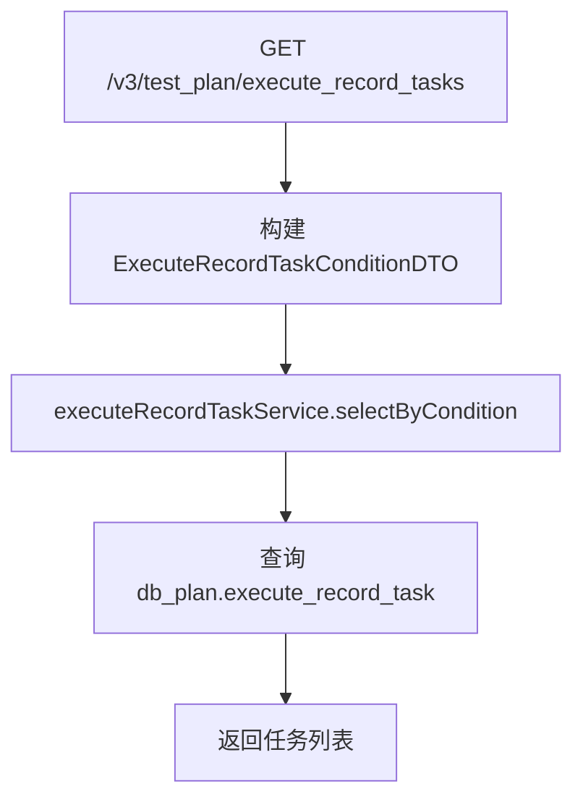
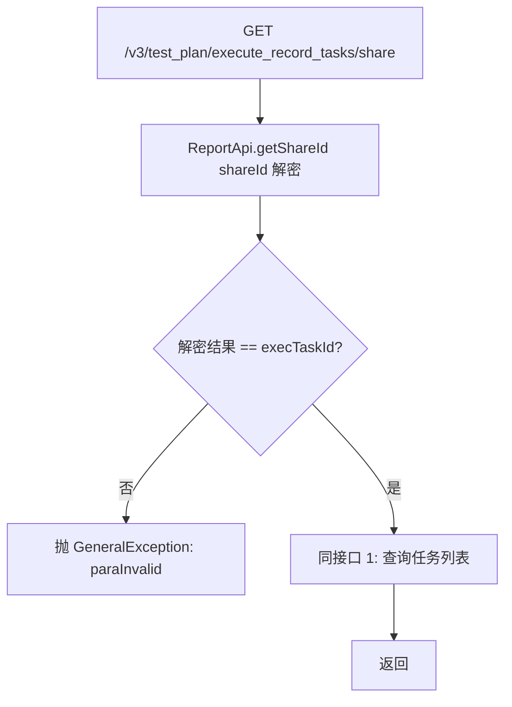
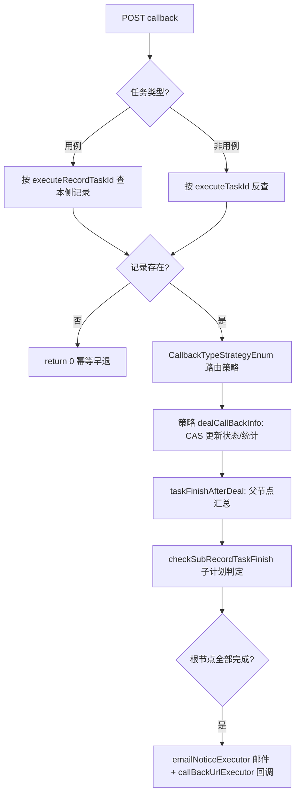

# ExecuteRecordTaskController — 执行记录任务

> 分支：syy.release.z7.8.1.0
> 源文件：`src/main/java/cn/testin/controller/plan/ExecuteRecordTaskController.java`
> 类级路由：`/test_plan`
> Service 实现：`cn.testin.business.impl.plan.ExecuteRecordTaskServiceImpl`（约 3500 行，回调/停止/重测/汇总等核心逻辑）
> 业务：管理测试计划执行后产生的执行任务记录——任务树查询、callBack 回调处理、停止/重测/删除、设备执行状态等。

## 接口列表总表

| # | 方法 | 路径 | 方法名 | 说明 |
|---|---|---|---|---|
| 1 | GET | `/v3/test_plan/execute_record_tasks` | selectExecuteRecordTaskById | 查询执行记录任务列表（按 executeRecordId + 可选过滤） |
| 2 | GET | `/v3/test_plan/execute_record_tasks/share` | getShareExecuteRecordTaskById | 分享版任务列表（shareId 鉴权） |
| 3 | POST | `/v3/test_plan/execute_record_tasks/callback` | executeRecordTaskCallback | **核心**：外部执行完成后回调，更新状态+汇总+通知 |
| 4 | POST | `/v3/test_plan/execute_record_tasks/stop/{id}` | stopTasks | 停止单个任务（@OperateLog），暂不支持用例类型 |
| 5 | POST | `/v3/test_plan/execute_record_tasks/relations` | selectExecuteTaskIdRelations | 按 executeTaskId 列表查关联的执行记录 |
| 6 | POST | `/v3/test_plan/execute_record_tasks/reset_task` | resetTask | 重测（复测）任务 |
| 7 | DELETE | `/v3/test_plan/execute_record_tasks/delete_task` | deleteTask | 删除一条执行任务记录 |
| 8 | POST | `/v3/test_plan/execute_record_tasks/batch_reset` | batchReset | 按配置批量重测 |
| 9 | POST | `/v3/test_plan/execute_record_tasks/batch_reset/device_type` | getCaseDeviceTypesByResetInfo | 查询重测时涉及的设备类型 |
| 10 | POST | `/v3/test_plan/execute_record_task/list_report_case` | getRetestReportCase | 获取复测报告用例列表（分页） |
| 11 | GET | `/v3/test_plan/execute_record_tasks/updateValid` | getValid | 手动重新计算执行有效时间 |
| 12 | GET | `/v3/test_plan/execute_record_tasks/device` | selectDeviceInfo | 查询设备执行状况（按 planRecordId） |
| 13 | GET | `/v3/test_plan/execute_record_tasks/get_case_detail` | getExecuteRecordTaskCaseDetail | 查询用例执行详情 |
| 14 | POST | `/v3/test_plan/execute_record_tasks/flush_case` | flushCase | 刷新用例详情快照（运维接口，无鉴权） |
| 15 | GET | `/v3/test_plan/execute_record_tasks/spot_info` | getSpotByPlan | 获取执行记录关联的插桩（Spot）信息 |
| 16 | POST | `/v3/test_plan/execute_record_tasks/refresh_report_input_param` | refreshReportInputParam | 刷新报告输入参数 |

统一响应包装：`ResponseResult<T> { int code; String msg; T data }`。

---

## 1. GET /v3/test_plan/execute_record_tasks — 查询执行记录任务列表

### 入口

`ExecuteRecordTaskController:57` → `IExecuteRecordTaskService.selectExecuteRecordTaskByCondition`

- 源文件行号：`ExecuteRecordTaskController.java`

### 请求参数（query）

| 字段 | 类型 | 必填 | 说明 |
|------|------|------|------|
| execute_record_id | Long | 是 | 执行记录 ID |
| sub_plan_name | String | 否 | 子计划名称（模糊过滤） |
| task_name | String | 否 | 任务名称（模糊过滤） |
| execute_status | Integer | 否 | 执行状态过滤 |

### 响应结构

`ResponseResult<BaseListResponseDTO<ExecuteRecordTaskResponseDTO>>`，`data.list` 为执行记录任务树数组。

### 实现意图

根据执行记录 ID 查询其下完整任务执行树，支持按子计划名/任务名/执行状态过滤。返回的任务列表中每个节点包含层级关系（parentId），前端据此渲染执行树。

### 流程



### 涉及表与 SQL

- db_plan.execute_record_task（按 executeRecordId 查询，拼装树结构）

---

## 2. GET /v3/test_plan/execute_record_tasks/share — 分享版任务列表

### 入口

`ExecuteRecordTaskController:78` → 先 `ReportApi.getShareId(shareId)` 校验，校验通过再 `IExecuteRecordTaskService.selectExecuteRecordTaskByCondition`

- 源文件行号：`ExecuteRecordTaskController.java`

### 请求参数（query）

| 字段 | 类型 | 必填 | 说明 |
|------|------|------|------|
| share_id | String | 是 | 分享凭证 |
| exec_task_id | String | 是 | 执行任务 ID（须与 shareId 解密结果一致） |
| execute_record_id | Long | 是 | 执行记录 ID |
| sub_plan_name | String | 否 | 子计划名称 |
| task_name | String | 否 | 任务名称 |

### 响应结构

同上（`BaseListResponseDTO<ExecuteRecordTaskResponseDTO>`）。

### 实现意图

对外分享链接场景：先调用 `ReportApi.getShareId(shareId)` 拿真实 execTaskId，与请求中的 execTaskId 比对，不一致则鉴权失败抛 GeneralException。鉴权通过后走同一查询逻辑。

### 流程



### 调用链与跨服务

- `ReportApi.getShareId` → 见 ren.testin.api.realtest.ReportApi（跨仓库调用，服务名待确认）

### 涉及表与 SQL

- db_plan.execute_record_task（同接口 1）

### 异常与错误码

- CommonCode.paraInvalid：shareId 校验失败

---

## 3. POST /v3/test_plan/execute_record_tasks/callback — 执行完成回调（核心）

### 入口

`ExecuteRecordTaskController:100` → `IExecuteRecordTaskService.executeRecordTaskCallback`

- 源文件行号：`ExecuteRecordTaskController.java` → `ExecuteRecordTaskServiceImpl.java`

### 请求参数（TaskExecuteCallbackRequestDTO，JSON Body，@Valid）

| 字段 | 类型 | 必填 | 说明 |
|------|------|------|------|
| executeTaskId | String | 是 | 外部执行系统返回的任务 ID |
| executeRecordTaskId | Long | 否 | 本侧执行记录任务 ID（用例任务时用） |
| callbackType | Integer | 是 | 回调类型：1=任务完成回调，2=脚本结果回调等，由 CallbackTypeStrategyEnum 路由 |
| taskType | Integer | 否 | 任务类型（区分是否用例任务） |

（具体字段以 `cn.testin.dto.request.plan.TaskExecuteCallbackRequestDTO` 为准，还包含执行结果统计字段如 successScriptCount/failScriptCount/timeOutScriptCount/executeCostTime 等）

### 响应结构

`ResponseResult<BaseDataResultDTO>`，`data.result` = 策略处理结果（1=成功，0=失败）。

### 实现意图

**这是执行链路闭环的核心入口**。外部执行系统完成一个任务后回调此接口：

1. **定位本侧记录**：用例任务按 executeRecordTaskId 查，非用例任务按 executeTaskId 反查，查不到则返回 0（幂等早退，但注意：result=1 不等于 DB 已更新，存在策略内部幂等或异常吞掉导致丢数据的情况）。
2. **策略路由**：按 callbackType 从 `CallbackTypeStrategyEnum` 取对应 `TaskCallbackStrategyService` 策略实例。
3. **策略处理**：各策略负责 CAS 更新本节点状态、父节点汇总统计（成功/失败/超时脚本数、耗时等）。
4. **taskFinishAfterDeal**：策略处理完后，若节点完成则触发后续链——父节点向上遍历累加完成数、前置任务失败时级联取消后续任务、检查子计划/根节点是否全部完成、全部完成则发邮件通知（emailNoticeExecutor）+ 回调 URL（callBackUrlExecutor）。

### 流程



### 调用链与跨服务

- 无跨仓库调用（回调仅操作本侧 DB）

### 涉及表与 SQL

- db_plan.execute_record_task（SELECT/CAS UPDATE 状态、统计字段）
- db_plan.execute_record（更新根节点完成状态）

### 异常与错误码

- 策略内部异常被 catch 吞掉，返回 0（仅日志记录）。**注意**：返回 1 仅代表策略未抛异常，不等于数据已落库——存在幂等早退等分支。

### 关联横切

- 线程池：`emailNoticeExecutor`（邮件通知）、`callBackUrlExecutor`（回调 URL）
- 无 `@OperateLog`

### 关键代码摘录

```java
// ExecuteRecordTaskServiceImpl.java
if (TaskTypeEnum.isCase(request.getTaskType())) {
    dbExecuteRecordTask = selectById(request.getExecuteRecordTaskId(), false);
} else {
    dbExecuteRecordTask = getRecordTaskInfoByExecuteTaskId(request.getExecuteTaskId());
}
if (dbExecuteRecordTask == null) { return 0; }
CallbackTypeStrategyEnum strategyEnum = CallbackTypeStrategyEnum.getStrategyByType(request.getCallbackType());
if (strategyEnum == null) { return 0; }
try {
    strategyEnum.getService().dealCallBackInfo(dbExecuteRecordTask, request);
} catch (Exception exception) {
    Logit.errorLog("executeRecordTaskCallback error ...", new Throwable(exception));
    return 0;
}
return 1;
```

---

## 4. POST /v3/test_plan/execute_record_tasks/stop/{execute_record_task_id} — 停止单个任务

### 入口

`ExecuteRecordTaskController:112` → `IExecuteRecordTaskService.stopTask`

- 源文件行号：`ExecuteRecordTaskController.java`
- `@OperateLog(EXECUTE_RECORD_TASK_STOP)`

### 路径参数

| 字段 | 类型 | 必填 | 说明 |
|------|------|------|------|
| execute_record_task_id | Long | 是 | 执行记录任务节点 ID |

### 请求体

BaseRequestDTO（含 userId 等操作人信息）。

### 响应结构

`ResponseResult<BaseDataResultDTO>`，result = 影响行数。

### 实现意图

停止指定的执行记录任务。实现中暂不支持用例类型任务（TaskTypeEnum.isCase），对于不支持的类型返回 0。

### 调用链与跨服务

- `IRealTaskV3Api` → [app处理服务](../../../app处理服务（real-test）/07-开放接口文档/00-模块索引.md) 或 任务管理服务（调用下游取消）

### 涉及表与 SQL

- db_plan.execute_record_task（更新状态为取消）

### 关联横切

- `@OperateLog(OperateLogEnum.EXECUTE_RECORD_TASK_STOP)`

---

## 5. POST /v3/test_plan/execute_record_tasks/relations — 按 executeTaskId 查关联关系

### 入口

`ExecuteRecordTaskController:125` → `IExecuteRecordTaskService.selectExecuteTaskIdRelations`

### 请求参数（ExecuteTaskIdRelationsRequestDTO）

| 字段 | 类型 | 必填 | 说明 |
|------|------|------|------|
| executeTaskIds | List<String> | 是 | 外部执行任务 ID 列表 |

### 响应结构

`ResponseResult<BaseListResponseDTO<ExecuteTaskWithExecuteRecordResponseDTO>>`，返回每条任务关联的本侧执行记录信息。

### 实现意图

按外部执行系统的 taskId 批量反查本侧的执行记录任务+执行记录+计划信息，用于跨系统数据关联。

### 涉及表与 SQL

- db_plan.execute_record_task（JOIN execute_record、plan_info 等反查关联）

---

## 6. POST /v3/test_plan/execute_record_tasks/reset_task — 重测任务

### 入口

`ExecuteRecordTaskController:139` → `IExecuteRecordService.resetTask`

- 源文件行号：`ExecuteRecordTaskController.java`

### 请求参数（RestTaskRequestDTO）

（重置任务所需配置，具体见 DTO 定义）

### 响应结构

`ResponseResult<BaseDataResultDTO>`，result = 影响行数。

### 实现意图

对已失败的执行记录任务发起重新测试。Service 层会校验任务状态、构造重置请求发往外部执行系统。

### 调用链与跨服务

- [app处理服务](../../../app处理服务（real-test）/07-开放接口文档/00-模块索引.md) 或 任务管理服务（提交重测请求）

### 涉及表与 SQL

- db_plan.execute_record_task（重置状态）

---

## 7. DELETE /v3/test_plan/execute_record_tasks/delete_task — 删除执行任务

### 入口

`ExecuteRecordTaskController:145` → `IExecuteRecordService.deleteTask`

### 请求参数（query）

| 字段 | 类型 | 必填 | 说明 |
|------|------|------|------|
| execute_record_id | Long | 是 | 执行记录 ID |
| execute_record_task_id | Long | 是 | 执行记录任务 ID |

### 响应结构

`ResponseResult<BaseDataResultDTO>`，result = 影响行数。

---

## 8. POST /v3/test_plan/execute_record_tasks/batch_reset — 批量重测

### 入口

`ExecuteRecordTaskController:158` → `IExecuteRecordService.batchReset`

### 请求参数（ExecuteRecordBatchResetRequestDTO）

含批量重测配置（设备类型、重测范围等）。

### 响应结构

`ResponseResult<ExecuteRecordBatchResetResponseDTO>`（含批量重测结果汇总）。

### 实现意图

按设备类型等条件批量筛选失败任务并重测。Service 中分设备类型组包，调用外部执行系统批量提交。

### 调用链与跨服务

- [app处理服务](../../../app处理服务（real-test）/07-开放接口文档/00-模块索引.md) 或 任务管理服务

### 涉及表与 SQL

- db_plan.execute_record_task（批量查询+更新）

---

## 9. POST /v3/test_plan/execute_record_tasks/batch_reset/device_type — 重测设备类型查询

### 入口

`ExecuteRecordTaskController:169` → `IExecuteRecordService.getCaseDeviceTypesByResetInfo`

### 请求参数

同批量重测请求（ExecuteRecordBatchResetRequestDTO）。

### 响应结构

`ResponseResult<CaseDeviceTypeResponseDTO>`，data.taskHasSuiteType 为设备类型列表。

### 实现意图

在执行批量重测前，先查询涉及哪些设备类型，供前端确认/选择后再发起重测。

---

## 10. POST /v3/test_plan/execute_record_task/list_report_case — 复测报告用例列表

### 入口

`ExecuteRecordTaskController:178` → `IExecuteRecordTaskService.listReportCase`

### 请求参数（RetestReportCaseRequestDTO）

分页查询复测报告的用例数据。

### 响应结构

`ResponseResult<BasePageListResponseDTO<TaskExecuteRecordReportCaseResponse>>`。

---

## 11. GET /v3/test_plan/execute_record_tasks/updateValid — 手动刷新有效时间

### 入口

`ExecuteRecordTaskController:189` → `IExecuteRecordTaskService.calculateExecuteValidTimeUpdate`

### 请求参数

| 字段 | 类型 | 必填 | 说明 |
|------|------|------|------|
| execute_record_id | Long | 是 | 执行记录 ID |

### 响应结构

`ResponseResult<BaseDataResultDTO>`（空 result）。

### 实现意图

手动触发重新计算执行记录下所有任务的有效执行时间（滑动窗口合并各脚本执行区间，排除等待时段）。用于数据校准。

---

## 12. GET /v3/test_plan/execute_record_tasks/device — 查询设备执行状况

### 入口

`ExecuteRecordTaskController:201` → `IExecuteRecordTaskService.selectDeviceInfo`

### 请求参数

| 字段 | 类型 | 必填 | 说明 |
|------|------|------|------|
| plan_record_id | Long | 是 | 计划执行记录 ID |

### 响应结构

`ResponseResult<BaseListResponseDTO<DeviceInfoResponseDTO>>`。

### 实现意图

查询该执行记录下所有设备的使用状态（在线/离线/占用等）。

### 调用链与跨服务

- [device-manager](../../../设备控制中心（real-controlcenter）/07-开放接口文档/00-模块索引.md)：`DeviceV3Api` 查询设备信息

---

## 13. GET /v3/test_plan/execute_record_tasks/get_case_detail — 查询用例执行详情

### 入口

`ExecuteRecordTaskController:207` → `IExecuteRecordTaskService.getExecuteRecordTaskCaseDetail`

### 请求参数

| 字段 | 类型 | 必填 | 说明 |
|------|------|------|------|
| execute_record_task_id | Long | 是 | 执行记录任务 ID |

### 响应结构

`ResponseResult<BaseListResponseDTO<ExecuteRecordTaskCaseDetailResponse>>`。

---

## 14. POST /v3/test_plan/execute_record_tasks/flush_case — 刷新用例执行详情快照

### 入口

`ExecuteRecordTaskController:213` → `IExecuteRecordTaskCaseDetailService.flushCaseDetail`

### 实现意图

运维接口，无参数、无鉴权。将当前用例执行详情重新刷新/写快照。返回受影响行数。

---

## 15. GET /v3/test_plan/execute_record_tasks/spot_info — 获取插桩（Spot）信息

### 入口

`ExecuteRecordTaskController:219` → `IExecuteRecordTaskService.getRecordTaskByCondition`

### 请求参数

| 字段 | 类型 | 必填 | 说明 |
|------|------|------|------|
| execute_record_id | Long | 是 | 执行记录 ID |

### 响应结构

`ResponseResult<List<SpotInformation>>`。

---

## 16. POST /v3/test_plan/execute_record_tasks/refresh_report_input_param — 刷新报告输入参数

### 入口

`ExecuteRecordTaskController:225` → `IExecuteRecordTaskService.refreshReportInputParam`

### 请求参数（RefreshReportInputParamRequestDTO）

（含执行记录 ID、需要刷新的参数等）

### 响应结构

`ResponseResult<BaseDataResultDTO>`，result = 影响行数。

---

## 附：疑点与注意事项

1. **callback 返回 1 不等于落库成功**：策略内部有幂等早退/异常吞掉分支，仅日志记录。如需严格置信，应观察 DB 状态而非依赖返回值。详见 vault memory: 项目\_callback\_result\_semantics。
2. **stopTask 暂不支持用例任务**：若传入用例类型的执行记录任务 ID，实现返回 0 不操作。
3. **deleteTask 可能恒返回 0**：具体实现存在固定 return 0 的情况。
4. **flush_case 无鉴权**：运维刷数接口，任何人可调用，需注意生产环境访问控制。
5. 本分支（syy.release.z7.8.1.0）**不包含暂停/恢复（pause/resume）端点**——该特性在 temp0623 分支开发中，尚未合入。
