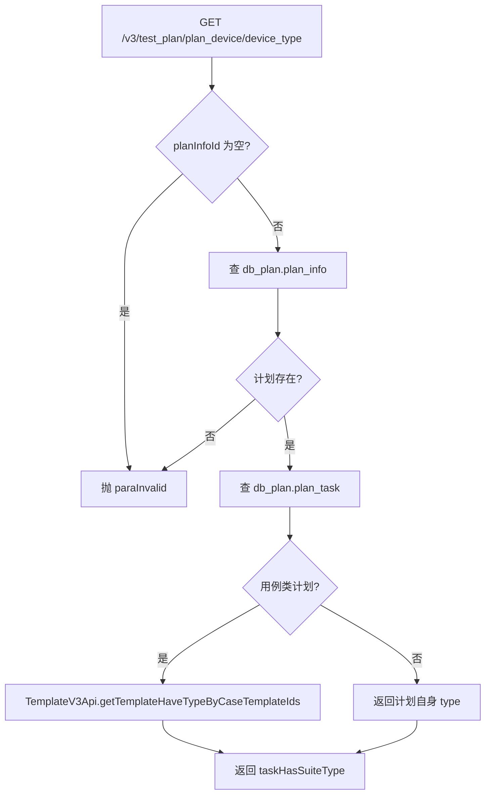
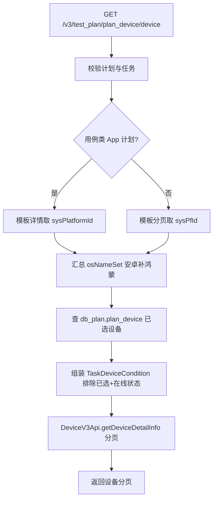
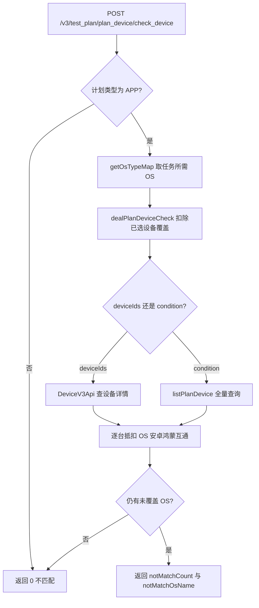
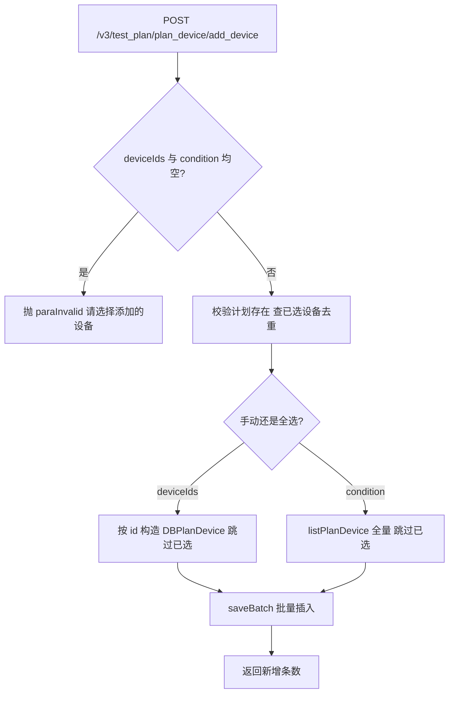
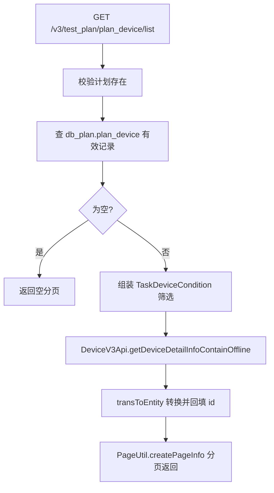
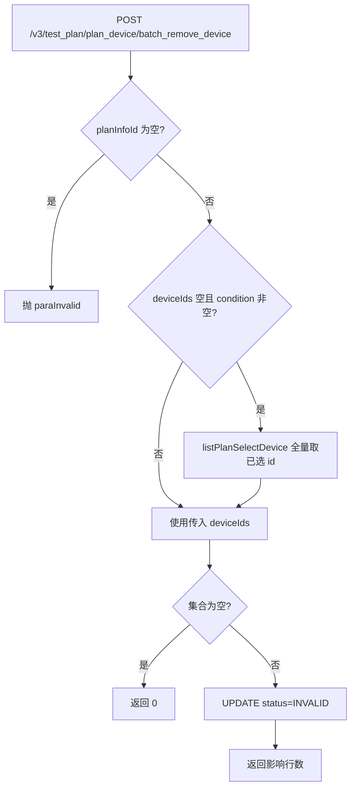
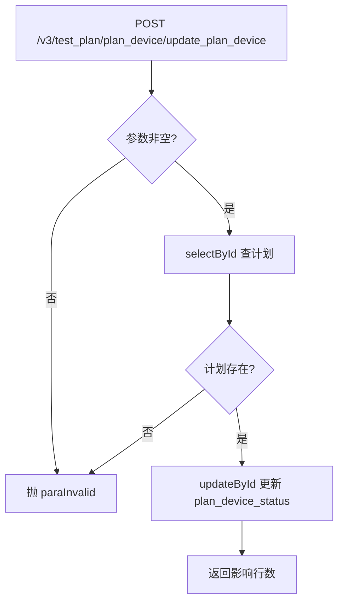
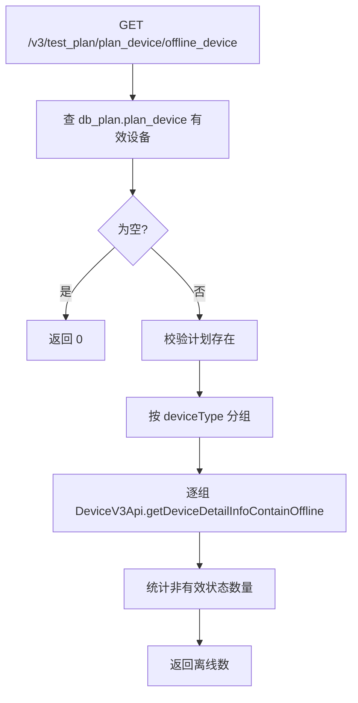

# PlanDeviceController 接口文档

测试计划设备圈选控制器：负责测试计划的设备类型查询、可选设备分页查询、按 App 提测包校验设备兼容性、圈选（添加）设备、已选设备分页、批量移除设备、更新计划设备开关状态、离线设备统计。

- 包路径：`cn.testin.controller`
- 基础路径：`/test_plan`（对外完整路径统一加 `/v3` 前缀，即 `/v3/test_plan`）
- 实现类：`cn.testin.business.impl.plan.PlanDeviceServiceImpl`（接口 `cn.testin.business.interfaces.plan.IPlanDeviceService`）
- 外部依赖：[device-manager](../../../设备控制中心（real-controlcenter）/07-开放接口文档/00-模块索引.md)（DeviceV3Api，走 ControlCenter 服务 `/v3/ControlCenter/device/list`）、任务模板服务（TemplateV3Api，realTask/realTest/COMMON_API 服务）

## 接口列表总表

| # | 方法 | 完整路径 | 说明 |
|---|------|----------|------|
| 1 | GET | /v3/test_plan/plan_device/device_type | 查询计划任务包含的设备类型 |
| 2 | GET | /v3/test_plan/plan_device/device | 获取可选择计划设备列表（分页） |
| 3 | POST | /v3/test_plan/plan_device/check_device | 按应用提测包校验设备兼容性 |
| 4 | POST | /v3/test_plan/plan_device/add_device | 圈选（添加）计划设备 |
| 5 | GET | /v3/test_plan/plan_device/list | 获取已选设备列表（分页） |
| 6 | POST | /v3/test_plan/plan_device/batch_remove_device | 批量移除已选设备 |
| 7 | POST | /v3/test_plan/plan_device/update_plan_device | 更新计划设备开关状态 |
| 8 | GET | /v3/test_plan/plan_device/offline_device | 查询离线设备数量 |

统一响应包装 `ResponseResult<T>`（code/msg/data），成功 code 为成功码；参数类错误抛 `GeneralException`，错误码为 `CommonCode.paraInvalid`。

---

## 1. 查询计划任务包含的设备类型

### 入口
- `PlanDeviceController.templateHaveType`（PlanDeviceController.java）
- → `IPlanDeviceService.templateHaveType` → `PlanDeviceServiceImpl.templateHaveType`（PlanDeviceServiceImpl.java）

### 请求参数（Query）

| 字段 | 类型 | 必填 | 说明 |
|------|------|------|------|
| plan_info_id | Long | 是 | 测试计划 id |

### 响应结构
`ResponseResult<CaseDeviceTypeResponseDTO>`

| 字段 | 类型 | 说明 |
|------|------|------|
| taskHasSuiteType | List<Integer> | 计划任务覆盖的设备/平台类型列表 |

### 实现意图
校验计划存在后查询计划下全部任务；用例类计划（TaskTypeEnum.isCase）调用模板服务 `getTemplateHaveTypeByCaseTemplateIds` 取任务模板覆盖的套件类型；非用例类计划直接返回计划自身类型。任务为空时返回空列表。

### 流程图


### 调用链与跨服务
- IPlanInfoDAO.selectOne → db_plan.plan_info
- IPlanTaskDAO.selectPlanTasksByCondition → db_plan.plan_task
- TemplateV3Api.getTemplateHaveTypeByCaseTemplateIds → 任务模板服务（realTask/realTest 前缀）

### 涉及表与 SQL
- db_plan.plan_info：`SELECT * FROM db_plan.plan_info WHERE id = #{planInfoId} AND is_delete = 0`
- db_plan.plan_task：按计划 id 条件查询任务列表

### 异常与错误码
- CommonCode.paraInvalid：计划ID不能为空 / 计划不存在

### 关联横切
- GeneralException 由全局异常处理器统一转响应。

### 关键代码摘录
```java
if (TaskTypeEnum.isCase(dbPlanInfo.getType())) {
    taskHasSuiteType = templateV3Api.getTemplateHaveTypeByCaseTemplateIds(taskIdList);
} else {
    taskHasSuiteType.add(dbPlanInfo.getType());
}
result.setTaskHasSuiteType(taskHasSuiteType);
```

---

## 2. 获取可选择计划设备列表

### 入口
- `PlanDeviceController.templateDevice`（PlanDeviceController.java，带 `@UnderlineToCamel`）
- → `IPlanDeviceService.listPlanDevice` → `PlanDeviceServiceImpl.listPlanDevice`（PlanDeviceServiceImpl.java）

### 请求参数（Query，下划线自动转驼峰，DeviceRequestConditionDTO）

| 字段 | 类型 | 必填 | 说明 |
|------|------|------|------|
| plan_info_id | Long | 是 | 测试计划 id |
| device_type | Integer | 否 | 设备类型（不传用计划类型） |
| eid | Integer | 否 | 企业 id |
| project_id | Integer | 否 | 项目 id |
| page | Integer | 否 | 当前页 |
| page_size | Integer | 否 | 页大小 |
| brand_name | String | 否 | 品牌筛选 |
| os_name | Integer | 否 | 系统类型筛选 |
| status | Integer | 否 | 设备状态筛选 |
| ucom_ip | String | 否 | 上位机 ip |
| remark | String | 否 | 备注 |

### 响应结构
`ResponseResult<BasePageListResponseDTO<DeviceDetailResponseDTO>>`，分页字段 page/pageSize/total/list；list 元素为设备详情（deviceId、brandName、modelName、osName、status、ucomIp 等，来自设备服务）。

### 实现意图
先校验计划与计划任务存在；用例类 App 计划走 `getTaskTemplateDetailNewByIds` 取套件平台 sysPlatformId，其他计划走 `getTaskTemplateResponseByCondition` 取 sysPfId，汇总出任务所需 OS 集合（含安卓自动补充鸿蒙）。再排除已圈选设备（notInDeviceIds），叠加自定义筛选与在线状态集合，最终调 [device-manager](../../../设备控制中心（real-controlcenter）/07-开放接口文档/00-模块索引.md) 分页查询可选设备。

### 流程图


### 调用链与跨服务
- IPlanInfoDAO / IPlanTaskDAO → db_plan.plan_info、db_plan.plan_task
- TemplateV3Api → 任务模板服务
- DeviceV3Api.getDeviceDetailInfo → [device-manager](../../../设备控制中心（real-controlcenter）/07-开放接口文档/00-模块索引.md)（POST /v3/ControlCenter/device/list）
- IPlanDeviceDAO.selectList → db_plan.plan_device

### 涉及表与 SQL
- db_plan.plan_info、db_plan.plan_task：同上
- db_plan.plan_device：`SELECT * FROM db_plan.plan_device WHERE plan_info_id = #{planInfoId} AND status = 1 [AND device_type = #{deviceType}]`

### 异常与错误码
- CommonCode.paraInvalid：requestDTO 为 null / 计划ID不能为空 / 计划不存在 / 计划任务不存在

### 关联横切
- `@UnderlineToCamel`：query 下划线参数转驼峰绑定。

### 关键代码摘录
```java
if (osNameSet.contains(AppDeviceOsTypeEnum.ANDROID.getType())) {
    osNameSet.add(AppDeviceOsTypeEnum.HARMONY_OS.getType());
}
wrapper.eq(DBPlanDevice::getPlanInfoId, planInfoId);
wrapper.eq(DBPlanDevice::getStatus, StatusTypeEnum.VALID.getType());
List<DBPlanDevice> dbPlanDevices = planDeviceDAO.selectList(wrapper);
taskDeviceCondition.setStatuses(DeviceStatusEnum.getOnlineStatus());
return deviceV3Api.getDeviceDetailInfo(null, deviceType, dbPlanInfo.getProjectId(), requestDTO.getEid(), taskDeviceCondition);
```

---

## 3. 按应用提测包校验设备兼容性

### 入口
- `PlanDeviceController.checkDevice`（PlanDeviceController.java）
- → `IPlanDeviceService.checkDevice` → `PlanDeviceServiceImpl.checkDevice`（PlanDeviceServiceImpl.java）

### 请求参数（Body，AddPlanDeviceRequestDTO）

| 字段 | 类型 | 必填 | 说明 |
|------|------|------|------|
| planInfoId | Long | 是 | 测试计划 id |
| deviceType | Integer | 否 | 设备类型 |
| deviceIds | List<String> | 二选一 | 手动选择的设备 id 列表 |
| condition | DeviceRequestConditionDTO | 二选一 | 全选时的筛选条件（自动置 page=1、pageSize=最大值） |
| eid | Integer | 否 | 企业 id |
| projectId | Integer | 否 | 项目 id |
| checkDevice | Integer | 否 | 是否校验设备 0不校验 1校验（本方法内未使用） |

### 响应结构
`ResponseResult<CheckDeviceResultResponseDTO>`

| 字段 | 类型 | 说明 |
|------|------|------|
| notMatchCount | Integer | 模板与设备不匹配的类型数量，0 表示全部覆盖 |
| notMatchOsName | List<String> | 缺失的设备类型英文名 |

### 实现意图
非 APP 类型计划（web/pc）直接返回通过。APP 计划先由任务模板得到所需 OS 类型集合（getOsTypeMap），并扣除已选设备已覆盖的类型（dealPlanDeviceCheck）；再对待选设备（手动 deviceIds 或按 condition 全选回调查询）逐个抵扣，安卓可抵扣鸿蒙、鸿蒙可抵扣安卓。抵扣后仍为正的 OS 类型即为不匹配项。

### 流程图


### 调用链与跨服务
- getOsTypeMap → TemplateV3Api.getTaskTemplateResponseByCondition（模板服务）
- dealPlanDeviceCheck → IPlanDeviceDAO + DeviceV3Api.getDeviceDetailInfo
- condition 分支 → 本类 listPlanDevice → [device-manager](../../../设备控制中心（real-controlcenter）/07-开放接口文档/00-模块索引.md)

### 涉及表与 SQL
- db_plan.plan_info、db_plan.plan_task：同接口 1
- db_plan.plan_device：`SELECT * FROM db_plan.plan_device WHERE plan_info_id = #{planInfoId} AND status = 1`

### 异常与错误码
- CommonCode.paraInvalid：计划ID不能为空 / 计划不存在 / 计划任务不存在 / 设备不存在 deviceIds：... / 设备无效，请联系管理员

### 关联横切
- Logit.errorLog 记录模板为空、条件无效等异常现场。

### 关键代码摘录
```java
if (AppDeviceOsTypeEnum.ANDROID.getType().equals(device.getOsName())) {
    if (osTypeMap.containsKey(AppDeviceOsTypeEnum.HARMONY_OS.getType()) && osTypeMap.get(AppDeviceOsTypeEnum.HARMONY_OS.getType()) > 0) {
        osTypeMap.put(AppDeviceOsTypeEnum.HARMONY_OS.getType(), osTypeMap.get(AppDeviceOsTypeEnum.HARMONY_OS.getType()) - 1);
    }
}
if (osTypeMap.containsKey(device.getOsName()) && osTypeMap.get(device.getOsName()) > 0) {
    osTypeMap.put(device.getOsName(), osTypeMap.get(device.getOsName()) - 1);
}
```

---

## 4. 圈选（添加）计划设备

### 入口
- `PlanDeviceController.addDevice`（PlanDeviceController.java）
- → `IPlanDeviceService.addPlanDevice` → `PlanDeviceServiceImpl.addPlanDevice`（PlanDeviceServiceImpl.java）

### 请求参数（Body，AddPlanDeviceRequestDTO）
同接口 3。deviceIds 与 condition 至少传一个，否则报错。

### 响应结构
`ResponseResult<BaseDataResultDTO>`，data 为本次实际新增条数（Long）。

### 实现意图
校验参数与计划存在后，查出计划已选有效设备 id 集合做去重；手动模式按 deviceIds 直接构造记录，全选模式复用 listPlanDevice 拿全部可选设备再构造记录（跳过已选）。deviceType 缺省取计划类型，最后 `saveBatch` 批量入库，返回新增数量。

### 流程图


### 调用链与跨服务
- condition 分支内部调 listPlanDevice → [device-manager](../../../设备控制中心（real-controlcenter）/07-开放接口文档/00-模块索引.md) + 模板服务
- this.saveBatch（MyBatis-Plus）→ db_plan.plan_device

### 涉及表与 SQL
- db_plan.plan_info：`SELECT * FROM db_plan.plan_info WHERE id = #{planInfoId} AND is_delete = 0`
- db_plan.plan_device：查重 `SELECT * FROM db_plan.plan_device WHERE plan_info_id = #{planInfoId} [AND device_type = #{deviceType}] AND status = 1`；批量 `INSERT INTO db_plan.plan_device (plan_info_id, device_id, device_type, create_time, update_time, status) VALUES (...)`

### 异常与错误码
- CommonCode.paraInvalid：参数不能为空 / 请选择添加的设备 / 计划ID不能为空 / 计划不存在

### 关联横切
- `@DS(Constants.DB_PLAN)` 切换 db_plan 数据源；`@Transactional(rollbackFor = Exception.class)` 保证批量插入原子性。

### 关键代码摘录
```java
@DS(Constants.DB_PLAN)
@Transactional(rollbackFor = Exception.class)
@Override
public Integer addPlanDevice(AddPlanDeviceRequestDTO requestDTO) throws GeneralException {
    ...
    if (selectedDeviceIds.contains(deviceId)) {
        continue; // 已添加的不再添加
    }
    dbPlanDevice.setStatus(StatusTypeEnum.VALID.getType());
    ...
    this.saveBatch(dbPlanDevices);
    return dbPlanDevices.size();
}
```

---

## 5. 获取已选设备列表（分页）

### 入口
- `PlanDeviceController.listPlanSelectDevice`（PlanDeviceController.java，带 `@UnderlineToCamel`）
- → `IPlanDeviceService.listPlanSelectDevice` → `PlanDeviceServiceImpl.listPlanSelectDevice`（PlanDeviceServiceImpl.java）

### 请求参数（Query，DeviceRequestConditionDTO）
同接口 2（plan_info_id 必填，其余筛选可选）。

### 响应结构
`ResponseResult<BasePageListResponseDTO<PlanDeviceDTO>>`，元素含计划设备主键 id、deviceId、brandName、modelName、releaseVersion、ucomId/ucomIp、debugMode、status（0空闲 1运行中 2掉线 9未知）、action、modelAlias、osName、webDeviceType、errorMsg、screenMode、syspfName、source、timePeriodList 等。

### 实现意图
查计划有效圈选记录，建立 deviceId→主键 id 映射；再调 [device-manager](../../../设备控制中心（real-controlcenter）/07-开放接口文档/00-模块索引.md) 的 `getDeviceDetailInfoContainOffline`（不存在的设备也补一条掉线状态记录）取详情，用 `PlanDeviceDTO.transToEntity` 转换并回填主键 id，手工分页返回。

### 流程图


### 调用链与跨服务
- IPlanDeviceDAO.selectList → db_plan.plan_device
- DeviceV3Api.getDeviceDetailInfoContainOffline → [device-manager](../../../设备控制中心（real-controlcenter）/07-开放接口文档/00-模块索引.md)

### 涉及表与 SQL
- db_plan.plan_info：存在性校验
- db_plan.plan_device：`SELECT * FROM db_plan.plan_device WHERE plan_info_id = #{planInfoId} [AND device_type = #{deviceType}] AND status = 1`

### 异常与错误码
- CommonCode.paraInvalid：参数不能为空 / 计划ID不能为空 / 计划不存在

### 关联横切
- `@UnderlineToCamel`；空结果统一用 PageUtil.createEmptyPageInfo。

### 关键代码摘录
```java
List<DeviceDetailResponseDTO> deviceDetailInfo = deviceV3Api.getDeviceDetailInfoContainOffline(
        new ArrayList<>(deviceIds), deviceType, dbPlanInfo.getProjectId(), requestDTO.getEid(), taskDeviceCondition);
for (DeviceDetailResponseDTO dto : deviceDetailInfo) {
    PlanDeviceDTO planDeviceDTO = PlanDeviceDTO.transToEntity(dto);
    planDeviceDTO.setId(deviceMap.get(dto.getDeviceId()));
    planDeviceList.add(planDeviceDTO);
}
```

---

## 6. 批量移除已选设备

### 入口
- `PlanDeviceController.deletePlanDevice`（PlanDeviceController.java）
- → `IPlanDeviceService.deletePlanDevice` → `PlanDeviceServiceImpl.deletePlanDevice`（PlanDeviceServiceImpl.java）

### 请求参数（Body，DeletePlanDeviceRequestDTO）

| 字段 | 类型 | 必填 | 说明 |
|------|------|------|------|
| planInfoId | Long | 是 | 测试计划 id |
| deviceIds | List<String> | 二选一 | 待移除设备 id 列表 |
| condition | DeviceRequestConditionDTO | 二选一 | 全选移除时的筛选条件（仅在 deviceIds 为空时生效） |
| eid | Integer | 否 | 企业 id |
| projectId | Integer | 否 | 项目 id |

### 响应结构
`ResponseResult<BaseDataResultDTO>`，data 为实际置为失效的记录条数。

### 实现意图
deviceIds 为空且传了 condition 时，先回调 listPlanSelectDevice 全量查出当前已选设备 id；随后用 LambdaUpdateWrapper 将这些设备在计划下的记录 status 置为 INVALID（逻辑删除），返回影响行数。两者皆空时不操作返回 0。

### 流程图


### 调用链与跨服务
- condition 分支 → 本类 listPlanSelectDevice → [device-manager](../../../设备控制中心（real-controlcenter）/07-开放接口文档/00-模块索引.md)
- IPlanDeviceDAO.update → db_plan.plan_device

### 涉及表与 SQL
- db_plan.plan_device：`UPDATE db_plan.plan_device SET status = 0, update_time = NOW() WHERE device_id IN (#{deviceIds}) AND plan_info_id = #{planInfoId}`（status 0=INVALID 1=VALID）

### 异常与错误码
- CommonCode.paraInvalid：参数不能为空 / 计划ID不能为空

### 关联横切
- 逻辑删除（status 置失效），非物理删除。

### 关键代码摘录
```java
LambdaUpdateWrapper<DBPlanDevice> updateWrapper = new LambdaUpdateWrapper<>();
updateWrapper.set(DBPlanDevice::getStatus, StatusTypeEnum.INVALID.getType());
updateWrapper.set(DBPlanDevice::getUpdateTime, new Date());
updateWrapper.in(DBPlanDevice::getDeviceId, deviceIds);
updateWrapper.eq(DBPlanDevice::getPlanInfoId, requestDTO.getPlanInfoId());
return planDeviceDAO.update(null, updateWrapper);
```

---

## 7. 更新计划设备开关状态

### 入口
- `PlanDeviceController.updatePlanDevice`（PlanDeviceController.java）
- → `IPlanDeviceService.updatePlanDevice` → `PlanDeviceServiceImpl.updatePlanDevice`（PlanDeviceServiceImpl.java）

### 请求参数（Body，UpdatePlanDeviceRequestDTO）

| 字段 | 类型 | 必填 | 说明 |
|------|------|------|------|
| planInfoId | Long | 是 | 测试计划 id |
| planDeviceStatus | Integer | 是 | 计划指定设备按钮状态（开启/关闭） |

### 响应结构
`ResponseResult<BaseDataResultDTO>`，data 为更新影响行数（通常 1）。

### 实现意图
校验两参数非空并确认计划存在，将 plan_info 的 plan_device_status 字段更新为入参值，即开启/关闭测试计划执行设备开关。注意这里更新的是计划表而非设备表。

### 流程图


### 调用链与跨服务
- IPlanInfoDAO.selectById / updateById → db_plan.plan_info；无跨服务调用。

### 涉及表与 SQL
- db_plan.plan_info：`UPDATE db_plan.plan_info SET plan_device_status = #{planDeviceStatus} WHERE id = #{planInfoId}`

### 异常与错误码
- CommonCode.paraInvalid：参数不能为空 / 计划不存在

### 关联横切
- 无显式事务/数据源注解，走默认数据源。

### 关键代码摘录
```java
DbPlanInfo dbPlanInfo = iPlanInfoDAO.selectById(planInfoId);
if (dbPlanInfo == null) {
    throw new GeneralException(CommonCode.paraInvalid.getValue(), "计划不存在");
}
dbPlanInfo.setId(planInfoId);
dbPlanInfo.setPlanDeviceStatus(planDeviceStatus);
return iPlanInfoDAO.updateById(dbPlanInfo);
```

---

## 8. 查询离线设备数量

### 入口
- `PlanDeviceController.offlineDevice`（PlanDeviceController.java）
- → `IPlanDeviceService.offlineDevice` → `PlanDeviceServiceImpl.offlineDevice`（PlanDeviceServiceImpl.java）

### 请求参数（Query）

| 字段 | 类型 | 必填 | 说明 |
|------|------|------|------|
| plan_info_id | Integer | 是 | 测试计划 id |
| eid | Integer | 否 | 企业 id，默认 1 |

### 响应结构
`ResponseResult<BaseDataResultDTO>`，data 为离线（非有效状态）设备数量。

### 实现意图
查计划有效圈选设备，按 deviceType 分组后分批调 [device-manager](../../../设备控制中心（real-controlcenter）/07-开放接口文档/00-模块索引.md) 的 `getDeviceDetailInfoContainOffline`（设备服务查不到的设备也补一条 DISCONNECT 记录），统计 `DeviceStatusEnum.isEffectiveStatus` 为 false 的设备数返回。无圈选设备直接返回 0；计划不存在抛异常。

### 流程图


### 调用链与跨服务
- IPlanDeviceDAO.selectList → db_plan.plan_device
- IPlanInfoDAO.selectOne → db_plan.plan_info
- DeviceV3Api.getDeviceDetailInfoContainOffline → [device-manager](../../../设备控制中心（real-controlcenter）/07-开放接口文档/00-模块索引.md)（按设备类型多次调用）

### 涉及表与 SQL
- db_plan.plan_device：`SELECT * FROM db_plan.plan_device WHERE plan_info_id = #{planInfoId} AND status = 1`
- db_plan.plan_info：`SELECT * FROM db_plan.plan_info WHERE id = #{planInfoId} AND is_delete = 0`

### 异常与错误码
- CommonCode.paraInvalid：计划不存在

### 关联横切
- eid 缺省值 1（Constants.EID_DEFAULT 语义）；离线判定依赖 DeviceStatusEnum.isEffectiveStatus。

### 关键代码摘录
```java
Map<Integer, Set<String>> deviceTypeMap = new HashMap<>();
for (DBPlanDevice device : dbPlanDevices) {
    deviceTypeMap.computeIfAbsent(device.getDeviceType(), k -> new HashSet<>()).add(device.getDeviceId());
}
int result = 0;
for (DeviceDetailResponseDTO dto : deviceDetailList) {
    if (!DeviceStatusEnum.isEffectiveStatus(dto.getStatus())) {
        result++;
    }
}
```

---

## 附：横切与约定

- 数据源：计划域表均在 db_plan 库；addPlanDevice 显式 `@DS(Constants.DB_PLAN)` + 事务，其余依赖默认配置。
- MyBatis-Plus Lambda 查询为主，`PlanDeviceMapper.xml` 为空（无自定义 SQL）。
- 设备详情、在线状态均来自 [device-manager](../../../设备控制中心（real-controlcenter）/07-开放接口文档/00-模块索引.md)（ControlCenter / RealScheduling 服务），本服务不存设备实时状态。
- 安卓与鸿蒙设备类型互通抵扣规则贯穿 checkDevice、listPlanDevice、processDevices 等逻辑。
