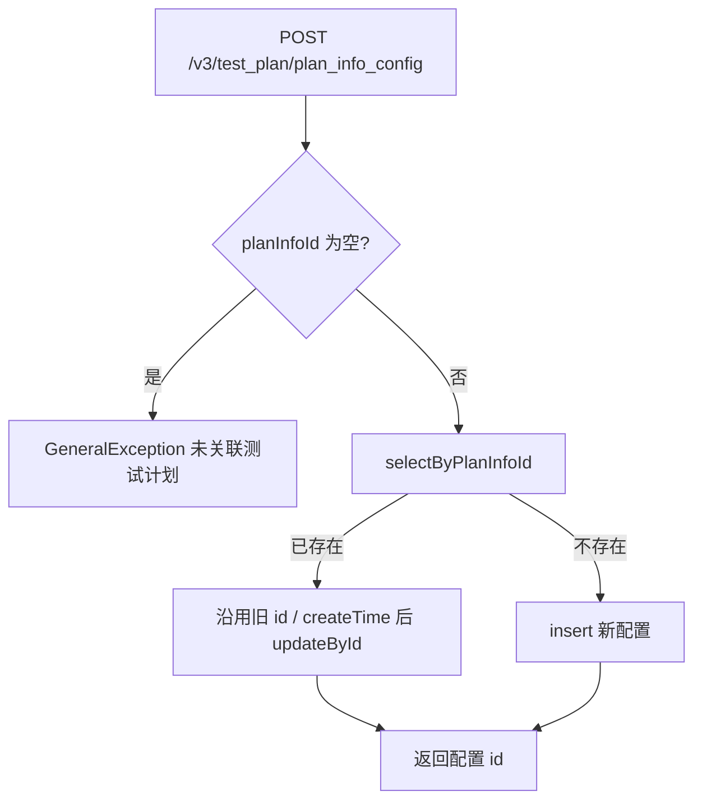
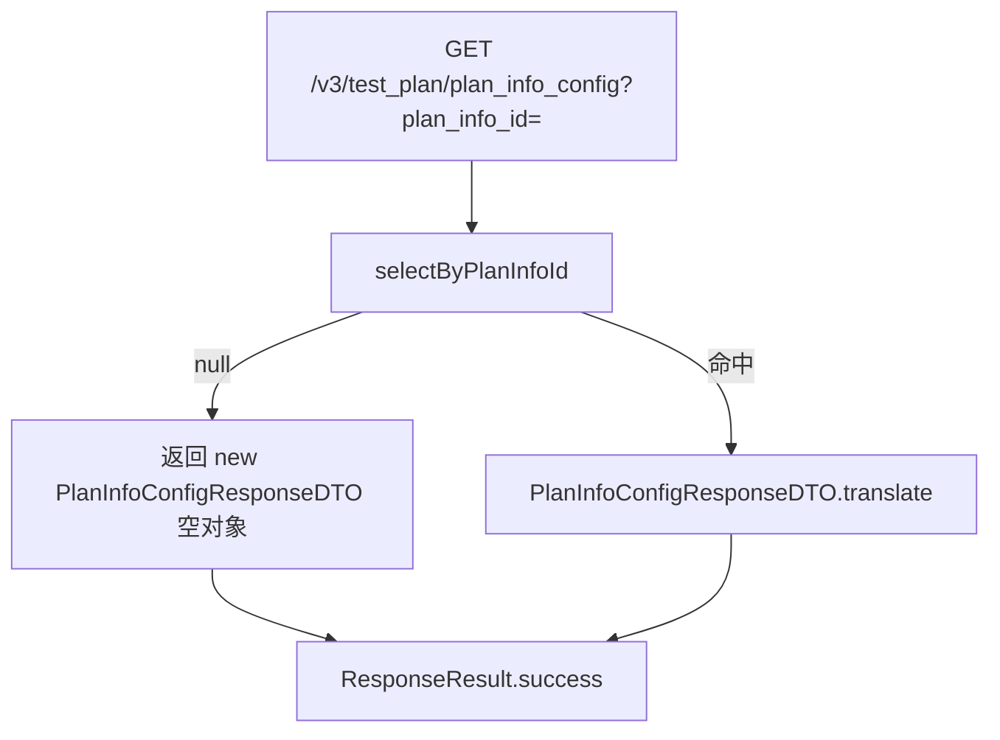
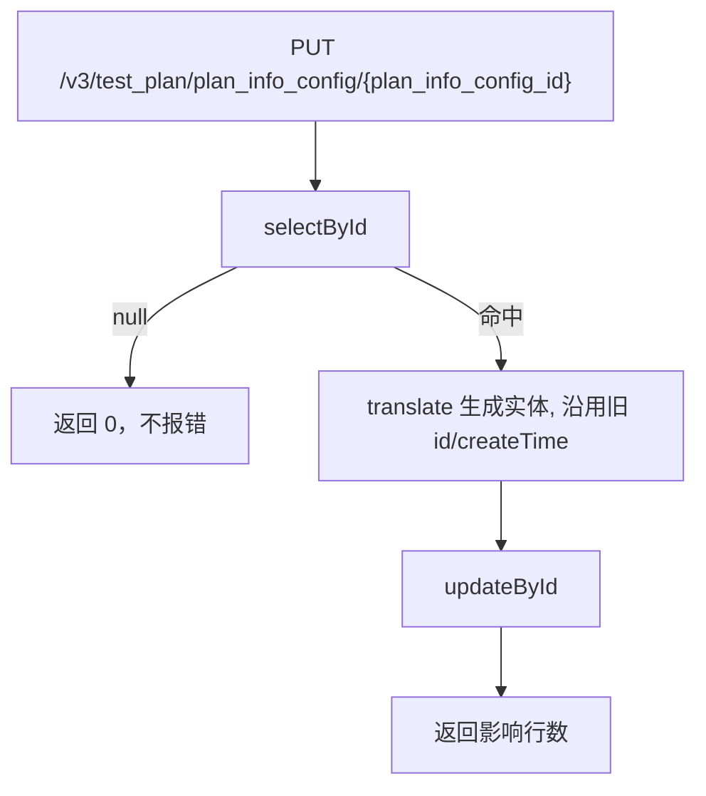

# PlanInfoConfigController — 测试计划配置

> 分支：syy.release.z7.8.1.0
> 源文件：`src/main/java/cn/testin/controller/plan/PlanInfoConfigController.java`
> 类级路由：`/test_plan`
> 业务：测试计划级配置（当前仅子计划执行顺序 `subExecuteOrder`）的保存/查询/更新。一个计划对应一条配置，新增接口实为 upsert。

## 接口列表总表

| 方法 | 路径 | 方法名 | 说明 | 操作日志 |
|---|---|---|---|---|
| POST | `/v3/test_plan/plan_info_config` | addPlanInfoConfig | 保存计划配置（存在则更新，不存在则插入） | 无 |
| GET | `/v3/test_plan/plan_info_config` | getPlanInfoConfig | 按计划 ID 查询配置 | 无 |
| PUT | `/v3/test_plan/plan_info_config/{plan_info_config_id}` | updatePlanInfoConfig | 按配置主键更新 | 无 |

统一响应包装：`ResponseResult<T> { int code; String msg; T data }`；`BaseDataResultDTO { Long result }`。

---

## 1. POST /v3/test_plan/plan_info_config — 保存计划配置（upsert）

### 入口

`PlanInfoConfigController.addPlanInfoConfig(@RequestBody PlanInfoConfigRequestDTO request)`

### 请求参数（PlanInfoConfigRequestDTO，JSON Body）

| 字段 | 类型 | 必填 | 说明 |
|---|---|---|---|
| planInfoId | Long | 是 | 关联测试计划，为 null 抛「未关联测试计划」 |
| subExecuteOrder | Integer | 否 | 子计划执行顺序；null 时 translate 置 0 |

### 响应结构

`ResponseResult<BaseDataResultDTO>`，`data.result` = 配置记录主键 id（无论 insert 还是 update）。

```json
{ "code": 0, "msg": "success", "data": { "result": 45 } }
```

### 实现意图

以「一个计划一条配置」为前提的幂等保存：按 planInfoId 查已有配置，存在则保留原 id 与 createTime 执行 updateById，否则 insert 新记录。注意：update 分支会重置 updateTime 与 is_delete=0（translate 生成全新实体）。

### mermaid



### 调用链

```
PlanInfoConfigController.addPlanInfoConfig
└─ PlanInfoConfigServiceImpl.addPlanInfoConfig
   ├─ IPlanInfoConfigDAO.selectByPlanInfoId → db_plan.plan_info_config（查已有）
   ├─ DbPlanInfoConfig.translate(request)   （subExecuteOrder null→0、时间戳、is_delete=0）
   ├─ 存在：IPlanInfoConfigDAO.updateById
   └─ 不存在：IPlanInfoConfigDAO.insert
```

### 涉及表

| 表 | 操作 |
|---|---|
| db_plan.plan_info_config | 读 / 写（insert 或 updateById） |

### 异常

| 条件 | 异常 |
|---|---|
| planInfoId 为空 | GeneralException(paraInvalid, 未关联测试计划) |

### 关联横切

- 无操作日志、无事务注解；upsert 的「查-写」非原子，并发同计划保存存在极小概率双写（业务上配置仅两个字段，影响可忽略）。
- 计划删除时由 `deleteByPlanInfoId` 级联逻辑删除（LambdaUpdateWrapper 置 is_delete=1）。

### 代码摘录

```java
DbPlanInfoConfig dbPlanInfoConfig = planInfoConfigDAO.selectByPlanInfoId(request.getPlanInfoId());
DbPlanInfoConfig planInfoConfig = DbPlanInfoConfig.translate(request);
if (dbPlanInfoConfig != null) {
    planInfoConfig.setId(dbPlanInfoConfig.getId());
    planInfoConfig.setCreateTime(dbPlanInfoConfig.getCreateTime());
    result = planInfoConfigDAO.updateById(planInfoConfig);
} else {
    result = planInfoConfigDAO.insert(planInfoConfig);
}
return planInfoConfig.getId();
```

---

## 2. GET /v3/test_plan/plan_info_config — 查询计划配置

### 入口

`PlanInfoConfigController.getPlanInfoConfig(@RequestParam("plan_info_id") Long planInfoId)`

### 请求参数

| 字段 | 来源 | 必填 | 说明 |
|---|---|---|---|
| plan_info_id | Query | 是 | 测试计划 ID |

### 响应结构

`ResponseResult<PlanInfoConfigResponseDTO>`：

| 字段 | 类型 | 说明 |
|---|---|---|
| id | Long | 配置主键 |
| planInfoId | Long | 关联测试计划 |
| subExecuteOrder | Integer | 子计划执行顺序 |

无配置时返回**空对象**（字段全 null），不抛异常。

### 实现意图

按计划 ID 直查配置并转换 DTO；容忍无配置场景，返回空 DTO 由前端判空。

### mermaid



### 调用链

```
PlanInfoConfigController.getPlanInfoConfig
└─ PlanInfoConfigServiceImpl.getPlanInfoConfig
   ├─ IPlanInfoConfigDAO.selectByPlanInfoId → db_plan.plan_info_config
   └─ PlanInfoConfigResponseDTO.translate
```

### 涉及表

| 表 | 操作 |
|---|---|
| db_plan.plan_info_config | 读 |

### 异常

- 无业务异常；plan_info_id 缺失由 Spring 参数绑定层报 400。

### 关联横切

- 纯查询，无日志/事务。注意 selectByPlanInfoId 未显式过滤 is_delete 时需以 DAO 实现为准（逻辑删除记录是否返回）。

### 代码摘录

```java
DbPlanInfoConfig dbPlanInfoConfig = planInfoConfigDAO.selectByPlanInfoId(planInfoId);
if (dbPlanInfoConfig == null) {
    return new PlanInfoConfigResponseDTO();
}
return PlanInfoConfigResponseDTO.translate(dbPlanInfoConfig);
```

---

## 3. PUT /v3/test_plan/plan_info_config/{plan_info_config_id} — 更新计划配置

### 入口

`PlanInfoConfigController.updatePlanInfoConfig(@PathVariable("plan_info_config_id") Long planInfoConfigId, @RequestBody PlanInfoConfigRequestDTO request)`

### 请求参数

| 字段 | 来源 | 必填 | 说明 |
|---|---|---|---|
| plan_info_config_id | Path | 是 | 配置主键 |
| planInfoId | Body | 否 | 关联计划（translate 会整体覆盖写入） |
| subExecuteOrder | Body | 否 | 子计划执行顺序，null→0 |

### 响应结构

`ResponseResult<BaseDataResultDTO>`，`data.result` = update 影响行数；**配置不存在时静默返回 0**。

### 实现意图

按配置主键整体覆盖更新：先 selectById 确认存在（不存在直接返回 0，不抛异常），再用 translate 生成实体并沿用原 id/createTime 执行 updateById。

### mermaid



### 调用链

```
PlanInfoConfigController.updatePlanInfoConfig
└─ PlanInfoConfigServiceImpl.updatePlanInfoConfig
   ├─ IPlanInfoConfigDAO.selectById → db_plan.plan_info_config
   ├─ DbPlanInfoConfig.translate(request)
   └─ IPlanInfoConfigDAO.updateById
```

### 涉及表

| 表 | 操作 |
|---|---|
| db_plan.plan_info_config | 读 / 写（updateById 整体覆盖） |

### 异常

- 无显式业务异常；记录不存在返回 result=0。注意为整体覆盖语义：body 未携带的字段会按 translate 默认值覆盖（subExecuteOrder→0，planInfoId→null），调用方需传全量。

### 关联横切

- 无操作日志、无事务。

### 代码摘录

```java
DbPlanInfoConfig dbPlanInfoConfig = planInfoConfigDAO.selectById(planInfoConfigId);
if (dbPlanInfoConfig == null) {
    return 0;
}
DbPlanInfoConfig planInfoConfig = DbPlanInfoConfig.translate(request);
planInfoConfig.setId(dbPlanInfoConfig.getId());
planInfoConfig.setCreateTime(dbPlanInfoConfig.getCreateTime());
return planInfoConfigDAO.updateById(planInfoConfig);
```

---

相关文档：[00-分支索引](00-分支索引.md) · [PlanInfoScheduledController](PlanInfoScheduledController.md) · [PlanInfoExecutePeriodController](PlanInfoExecutePeriodController.md)
