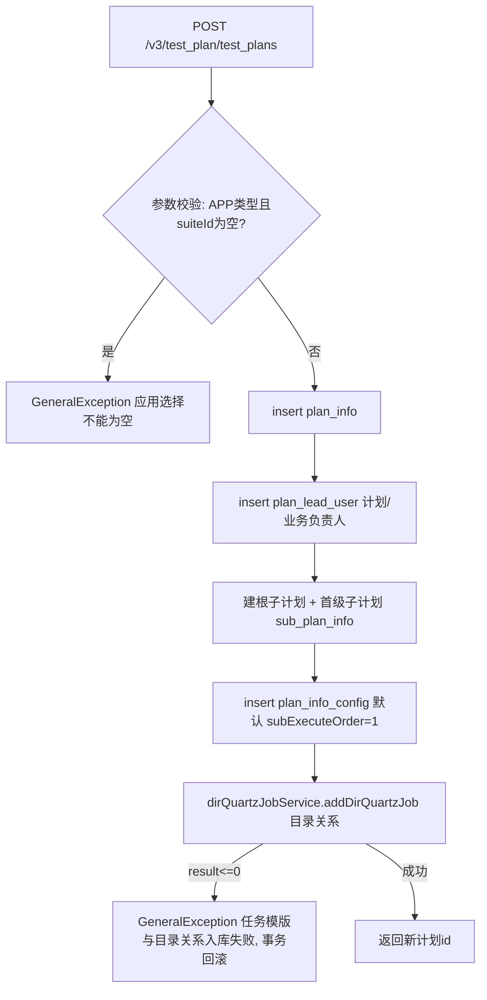
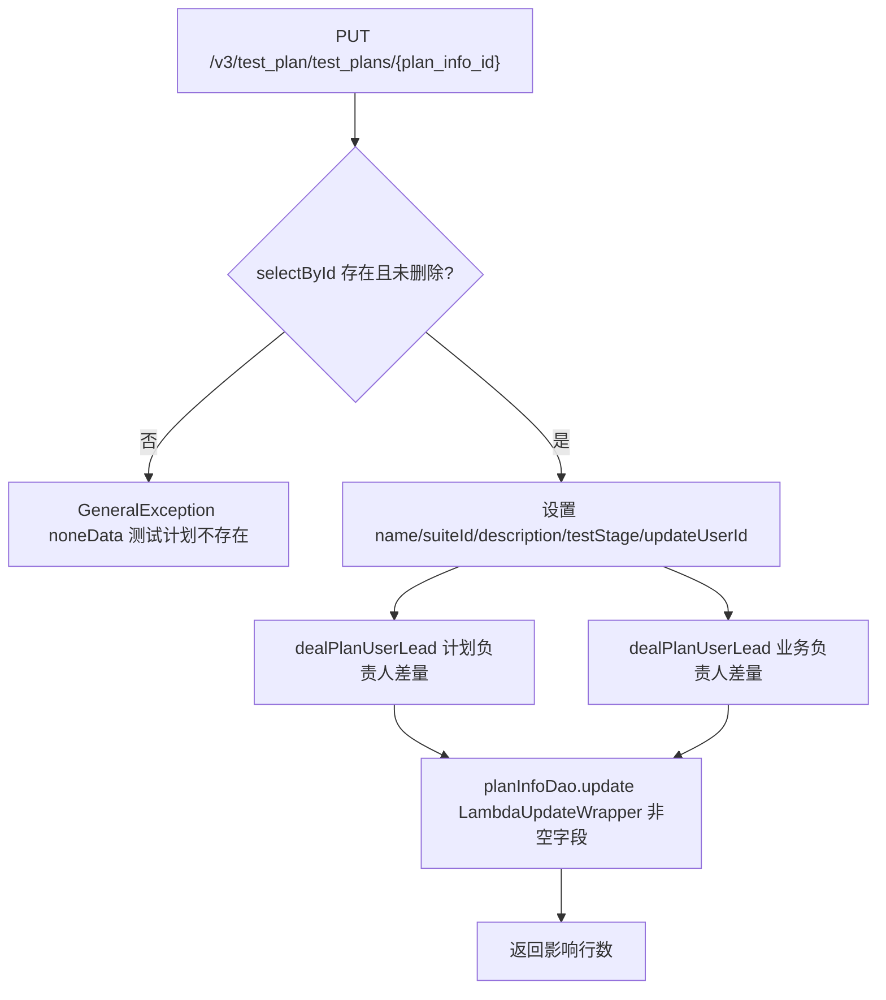
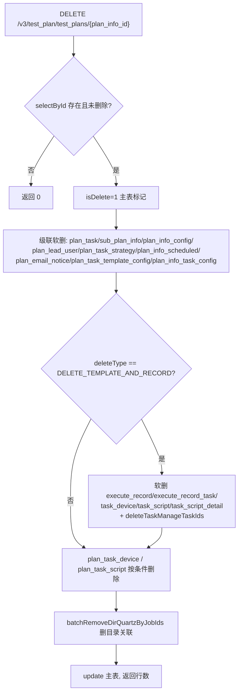
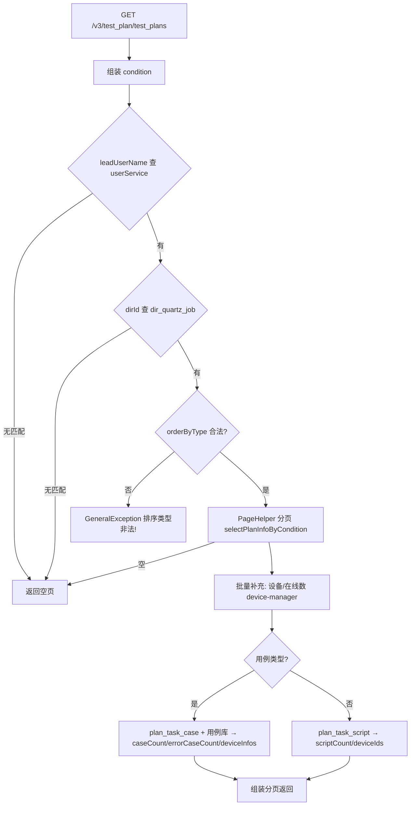
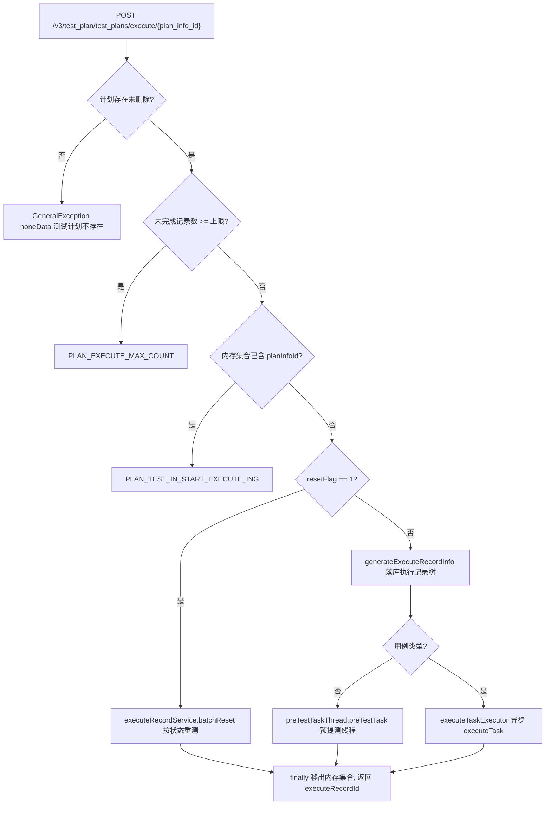
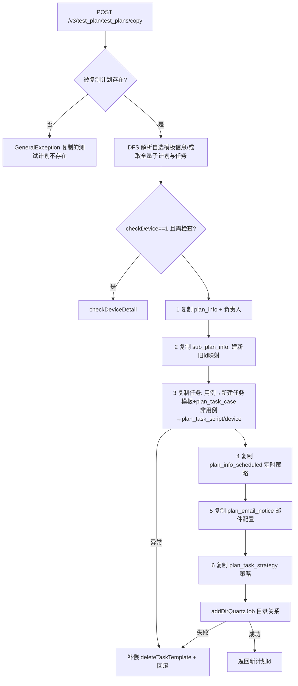
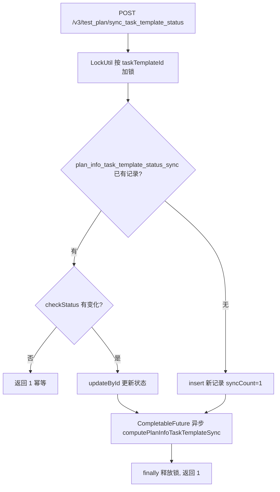

# PlanInfoController — 测试计划核心（增删改查/执行/复制/同步）

> 分支：syy.release.z7.8.1.0
> 源文件：`src/main/java/cn/testin/controller/plan/PlanInfoController.java`
> 类级路由：`/test_plan`
> 业务：测试计划（plan_info）的生命周期管理、手动执行入口、全量同步（脚本/设备/基础信息）、复制、设备校验、任务模板状态同步回写。
> 实现类：`PlanInfoServiceImpl`（`@DS(Constants.DB_PLAN)`，多数写操作 `@Transactional`；删除用 `@DSTransactional` 跨库事务）。

## 接口列表总表

| 方法 | 路径 | 方法名 | 说明 | 操作日志 |
|---|---|---|---|---|
| POST | `/v3/test_plan/test_plans` | addPlanInfo | 新增测试计划（自动建根/首级子计划、默认执行配置、目录关系） | 无 |
| PUT | `/v3/test_plan/test_plans/{plan_info_id}` | updatePlanInfo | 更新基础信息 + 负责人差量维护 | `PLAN_INFO_UPDATE` |
| DELETE | `/v3/test_plan/test_plans/{plan_info_id}` | deletePlanInfo | 逻辑删除计划并级联软删全部关联数据（可选级联执行记录） | `TEST_PLAN_DELETE` |
| GET | `/v3/test_plan/test_plans/{plan_info_id}` | getPlanInfoById | 查询计划详情（含任务数） | 无 |
| GET | `/v3/test_plan/test_plans` | selectPagePlanInfoByCondition | 分页条件查询（名称/负责人/目录/阶段/排序） | 无 |
| POST | `/v3/test_plan/test_plans/execute/{plan_info_id}` | executePlanInfo | 手动执行计划（生成执行记录，异步预提测/执行；支持重测） | 无 |
| POST | `/v3/test_plan/test_plans/sync/plan_task_script_device` | syncPlanTaskScriptInfo | 全量同步计划任务的脚本/用例与设备（运维/迁移用） | 无 |
| POST | `/v3/test_plan/test_plans/sync/plan_task_base_info` | syncPlanTaskBaseInfo | 全量同步计划任务的模板基础配置（运维/迁移用） | 无 |
| GET | `/v3/test_plan/test_plans/task_template/scripts` | getScriptDetailInfoByPlanInfoId | 查询计划下「子计划-任务-脚本」树形明细 | 无 |
| GET | `/v3/test_plan/test_plans/task_template/cases` | getCaseDetailInfoByPlanInfoId | 查询计划下「子计划-任务-用例」树形明细 | 无 |
| POST | `/v3/test_plan/test_plans/copy` | copyTestPlan | 复制测试计划（可全量/自选复制任务模板） | `PLAN_INFO_COPY` |
| POST | `/v3/test_plan/check_device` | checkDevice | 批量查询设备状态并按状态排序（计划维度标注占用） | 无 |
| POST | `/v3/test_plan/sync_task_template_status` | syncTaskTemplateStatus | 任务模板审核状态回写，触发计划侧同步计算（异步） | 无 |

统一响应包装：`ResponseResult<T> { int code; String msg; T data }`；`BaseDataResultDTO { Long result }`；分页 `BasePageListResponseDTO`；列表 `BaseListResponseDTO`。

---

## 1. POST /v3/test_plan/test_plans — 新增测试计划

### 入口

`PlanInfoController.addPlanInfo(@RequestBody @Valid PlanInfoRequestDTO request)`

### 请求参数（PlanInfoRequestDTO，JSON Body）

| 字段 | 类型 | 必填 | 说明 |
|---|---|---|---|
| planInfoName | String | 是（@NotNull） | 测试计划名称 |
| planInfoType | Integer | 是（@NotNull） | 计划类型 TaskTypeEnum（1 APP / 3 Web / 5 PC / 用例 CASE） |
| suiteId | Integer | APP 类型必填 | 应用 id；APP 类型为空抛「应用选择不能为空」 |
| leadUserIds | List\<Integer\> | 否 | 计划负责人 id 集合 |
| businessUserIds | List\<Integer\> | 否 | 业务负责人 id 集合 |
| planInfoDescription | String | 否 | 描述 |
| testStage | Integer | 否 | 测试阶段 TestStageEnum |
| planDeviceStatus | Integer | 否 | 是否启用计划指定设备 PlanDeviceStatusEnum |
| dirId | Integer | 否 | 计划目录 id（写入目录-任务关系） |

继承 `BaseRequestDTO`：`userId`、`projectId`。

### 响应结构

`ResponseResult<BaseDataResultDTO>`，`data.result` = 新建计划主键 id。

### 实现意图

一次事务内完成计划创建的全套初始化：插入 plan_info → 插入负责人（计划/业务两类）→ 自动创建「根子计划 + 与计划同名的首级子计划」→ 插入默认执行配置（sub_execute_order=1）→ 写目录-任务关联（dir_quartz_job），最后一步失败抛错回滚。

### mermaid



### 调用链

```
PlanInfoController.addPlanInfo
└─ PlanInfoServiceImpl.insertPlanInfoRequest   (@DS(DB_PLAN) @Transactional)
   ├─ checkPlanInfoParam
   ├─ PlanInfoRequestDTO.translateDTOToEntity
   ├─ IPlanInfoDAO.insert                     → db_plan.plan_info
   ├─ IPlanLeadUserService.insert(批量)        → plan_lead_user（PLAN_USER / BUSINESS_USER）
   ├─ ISubPlanInfoService.insertSubPlanInfoRequest ×2  → sub_plan_info（根 + 首级）
   ├─ IPlanInfoConfigService.insert           → plan_info_config
   └─ IDirQuartzJobService.addDirQuartzJob    → dir_quartz_job（目录-任务关系）
```

### 涉及表

| 表 | 操作 |
|---|---|
| db_plan.plan_info | 写（insert） |
| db_plan.plan_lead_user | 写 |
| db_plan.sub_plan_info | 写（根 + 首级两条） |
| db_plan.plan_info_config | 写（默认配置） |
| dir_quartz_job | 写（目录关联） |

### 异常

| 条件 | 异常 |
|---|---|
| request 为 null | GeneralException(paraInvalid, 请求参数错误) |
| APP 类型 suiteId 为空 | GeneralException(paraInvalid, 应用选择不能为空) |
| 目录关系入库失败 | GeneralException(paraInvalid, 任务模版与目录关系入库失败) |

### 关联横切

- 无操作日志、无 Quartz 任务（定时策略另由 [PlanInfoScheduledController](PlanInfoScheduledController.md) 维护）。
- 新增时不复制任何任务模板；任务通过任务域接口后续关联。

---

## 2. PUT /v3/test_plan/test_plans/{plan_info_id} — 更新测试计划

### 入口

`PlanInfoController.updatePlanInfo(@PathVariable Long planInfoId, @RequestBody @Valid PlanInfoRequestDTO request)`

### 请求参数

| 字段 | 来源 | 必填 | 说明 |
|---|---|---|---|
| plan_info_id | Path | 是 | 计划主键 |
| planInfoName / suiteId / planInfoDescription / testStage | Body | 否 | 覆盖式更新（update 包装器对 null 字段多数跳过；testStage 为 null 时显式置 null） |
| leadUserIds / businessUserIds | Body | 否 | 全量目标集合，服务端做差量增删 |
| userId | Body 基类 | 否 | 更新人 |

### 响应结构

`ResponseResult<BaseDataResultDTO>`，`data.result` = update 影响行数。

### 实现意图

校验计划存在未删除 → 覆盖更新基础字段 → 对两类负责人做「请求集合 vs 现有集合」差量：新增 insert、移除 deleteByIds → 按主键选择性 update。

### mermaid



### 调用链

```
PlanInfoController.updatePlanInfo
├─ @OperateLog(PLAN_INFO_UPDATE) AOP 记录操作日志
└─ PlanInfoServiceImpl.updatePlanInfoRequest  (@DS(DB_PLAN) @Transactional)
   ├─ IPlanInfoDAO.selectById                     → plan_info（存在性）
   ├─ IPlanLeadUserService.selectPlanLeadUserByPlanInfoId → plan_lead_user（读）
   ├─ dealPlanUserLead ×2 → insert / deleteByIds  → plan_lead_user（差量写）
   └─ IPlanInfoDAO.update(LambdaUpdateWrapper)    → plan_info（选择性更新）
```

### 涉及表

| 表 | 操作 |
|---|---|
| db_plan.plan_info | 读 / 写 |
| db_plan.plan_lead_user | 读 / 写（差量增删） |

### 异常

| 条件 | 异常 |
|---|---|
| 计划不存在或已删除 | GeneralException(noneData, 测试计划不存在) |

### 关联横切

- `@OperateLog(PLAN_INFO_UPDATE)`：AOP 写操作日志。
- 注意：该接口不更新 planDeviceStatus / type / dirId（实体虽带入 update 包装器，但 updatePlanInfoRequest 未 set 这些字段）。

---

## 3. DELETE /v3/test_plan/test_plans/{plan_info_id} — 删除测试计划

### 入口

`PlanInfoController.deletePlanInfo(@PathVariable Long planInfoId, @RequestParam("type") Integer deleteType, @RequestParam("user_id") Integer userId, @RequestParam(value="user_name", required=false) String userName)`

### 请求参数

| 字段 | 来源 | 必填 | 说明 |
|---|---|---|---|
| plan_info_id | Path | 是 | 计划主键 |
| type | Query | 是 | 删除类型 PlanInfoDeleteTypeEnum；DELETE_TEMPLATE_AND_RECORD 时级联删除执行记录侧数据 |
| user_id | Query | 是 | 操作人（写入 update_user_id / 级联删除人） |
| user_name | Query | 否 | 操作人名称（操作日志展示用） |

### 响应结构

`ResponseResult<BaseDataResultDTO>`，`data.result` = 主表 update 影响行数；计划不存在/已删除返回 0（不抛错）。

### 实现意图

逻辑删除计划主表，并级联软删全部计划侧关联数据；`type=DELETE_TEMPLATE_AND_RECORD` 时进一步软删执行记录、执行任务、任务设备/脚本/脚本明细，并调用执行侧删除任务管理 taskIds。全程 `@DSTransactional` 跨库事务。最后删除目录关联。

### mermaid



### 调用链

```
PlanInfoController.deletePlanInfo
├─ @OperateLog(TEST_PLAN_DELETE) AOP 记录操作日志
└─ PlanInfoServiceImpl.deletePlanInfo  (@DSTransactional)
   ├─ IPlanInfoDAO.selectById                          → plan_info
   ├─ IPlanTaskService.deleteByPlanInfoId              → plan_task（软删，含 Quartz 清理）
   ├─ ISubPlanInfoService.deleteByPlanInfoId           → sub_plan_info
   ├─ IPlanInfoConfigService.deleteByPlanInfoId        → plan_info_config
   ├─ IPlanLeadUserService.deleteByPlanInfoId          → plan_lead_user
   ├─ IPlanTaskStrategyService.deleteByPlanInfoId      → plan_task_strategy
   ├─ IPlanInfoScheduledService.deleteByPlanInfoId     → plan_info_scheduled（含 Quartz Job 清理）
   ├─ IPlanEmailNoticeService.deleteTestPlanEmailNotice → plan_email_notice
   ├─ IPlanTaskTemplateConfigService.deleteByPlanInfoId → plan_task_template_config
   ├─ IPlanInfoTaskConfigService.deleteByPlanInfoId    → plan_info_task_config
   ├─ [可选] IExecuteRecordService / IExecuteRecordTaskService /
   │   executeRecordTaskDevice/Script/ScriptDetailService → execute_record 系列表（软删）
   ├─ IPlanTaskDeviceService / IPlanTaskScriptService deleteByCondition → plan_task_device / plan_task_script
   ├─ IDirQuartzJobService.batchRemoveDirQuartzByJobIds → dir_quartz_job
   └─ IPlanInfoDAO.update                              → plan_info（主表软删落库）
```

### 涉及表

| 表 | 操作 |
|---|---|
| db_plan.plan_info | 读 / 写（软删） |
| db_plan.plan_task / sub_plan_info / plan_info_config / plan_lead_user / plan_task_strategy / plan_info_scheduled / plan_email_notice / plan_task_template_config / plan_info_task_config / plan_task_device / plan_task_script | 写（级联软删/按条件删除） |
| execute_record 系列（execute_record / execute_record_task / _task_device / _task_script / _task_script_detail） | 写（deleteType 级联时） |
| dir_quartz_job | 写（删除目录关联） |

### 异常

| 条件 | 异常 |
|---|---|
| 计划不存在或已删除 | 不抛错，返回 result=0 |
| 级联过程任何异常 | @DSTransactional 整体回滚，异常上抛 |

### 关联横切

- `@OperateLog(TEST_PLAN_DELETE)`：AOP 写操作日志。
- 级联链长、跨多库，依赖 `@DSTransactional`；「删除任务管理 taskIds」注释标明最好用线程处理但需考虑重启，当前为同步调用。

---

## 4. GET /v3/test_plan/test_plans/{plan_info_id} — 查询计划详情

### 入口

`PlanInfoController.getPlanInfoById(@PathVariable Long planInfoId)`

### 响应结构

`ResponseResult<PlanInfoResponseDTO>`，关键字段：

| 字段 | 类型 | 说明 |
|---|---|---|
| id / planInfoName / planInfoType / projectId / suiteId | — | 基础信息 |
| leadUserIds / businessUserIds | List\<Integer\> | 负责人（Ext 查询带出） |
| scheduled | PlanInfoScheduledResponseDTO | 关联定时策略（id/type/cron/status，见 [PlanInfoScheduledController](PlanInfoScheduledController.md)） |
| taskCount | Integer | 关联任务数（仅 TASK_LIST 类型，不含前后置） |
| planDeviceStatus / testStage | Integer | 设备启用标记 / 测试阶段 |
| createTime / updateTime / createUserId / updateUserId | — | 审计字段（时间为毫秒时间戳） |

### 实现意图

`selectExtById` 连表查出计划 + 负责人 + 定时策略的扩展行，补充任务数后转 DTO；不存在或已删抛「测试计划不存在」。

### 调用链

```
PlanInfoController.getPlanInfoById
└─ PlanInfoServiceImpl.getPlanInfoById
   ├─ IPlanInfoDAO.selectExtById                       → plan_info（Ext：负责人/定时策略）
   ├─ IPlanTaskService.getTaskCountByPlanInfoIds       → plan_task（TASK_LIST 计数）
   └─ PlanInfoResponseDTO.translateEntityExtToDTO
```

### 异常

| 条件 | 异常 |
|---|---|
| 记录不存在或 is_delete=1 | GeneralException(paraInvalid, 测试计划不存在) |

---

## 5. GET /v3/test_plan/test_plans — 分页条件查询

### 入口

`PlanInfoController.selectPagePlanInfoByCondition(@Valid PlanInfoConditionRequestDTO request)`（`@UnderlineToCamel`：query 下划线参数自动转驼峰）

### 请求参数（Query）

| 字段 | 类型 | 必填 | 说明 |
|---|---|---|---|
| plan_info_type | Integer | 是（@NotNull） | 计划类型 |
| plan_info_id / plan_info_name / suite_id / test_stage / dir_id | — | 否 | 精确/模糊过滤；suite_id 仅 APP 类型生效，否则强制置空 |
| lead_user_name / business_user_name | String | 否 | 按负责人姓名过滤（先查 user 服务得 id 集合，查无此人直接返回空页） |
| create_start_time / create_end_time | Long | 否 | 创建时间区间（DTO 中存在字段，实际 condition 未传递——见备注） |
| order_by_col / order_by_type | String | 否 | 排序字段（PlanOrderEnum 映射）/ asc/desc，非法排序类型抛错，默认 desc |
| page / page_size | Integer | 否 | 默认 PAGE_DEFAULT / PAGE_SIZE_DEFAULT |

### 响应结构

`ResponseResult<BasePageListResponseDTO<PlanInfoResponseDTO>>`，列表项在第 4 节字段基础上额外带：

| 字段 | 说明 |
|---|---|
| taskCount / scriptCount / deviceCount / caseCount / errorCaseCount | 关联任务数 / 脚本数 / 设备数 / 用例数 / 错误用例数 |
| deviceIds / deviceInfos | 非用例类型给 deviceId 字符串集合；用例类型给完整设备信息 |
| onlineDeviceCount | 在线设备数 |

### 实现意图

组装 PlanInfoConditionDTO：负责人姓名先经 userService 翻译成 userId 集合（查无直接返回空页）；dirId 经 dir_quartz_job 反查计划 id 集合（为空返回空页）；排序字段经 PlanOrderEnum 白名单映射防注入。PageHelper 分页查主表后，批量补充设备（device-manager 查在线状态）、脚本号集合/用例集合（case 类型走 plan_task_case + 用例库校验错误用例）、任务计数。

### mermaid



### 调用链

```
PlanInfoController.selectPagePlanInfoByCondition
└─ PlanInfoServiceImpl.selectPlanInfoByCondition
   ├─ UserService.getUserIdByUserName                    → [user-manager](../../00-首页.md)（姓名→id）
   ├─ IDirQuartzJobService.getDirQuartzJobIds            → dir_quartz_job（目录反查）
   ├─ PageHelper.startPage + IPlanInfoDAO.selectPlanInfoByCondition → plan_info
   ├─ getPlanInfoWithDeviceIds → plan_task_device + DeviceV3Api → [device-manager](../../../设备控制中心（real-controlcenter）/07-开放接口文档/00-模块索引.md)（在线状态）
   ├─ getPlanInfoWithCaseIds（用例类型）→ plan_task_case + ICaseInfoService（错误用例判定）
   ├─ getPlanInfoWithScriptNos（非用例类型）→ plan_task_script
   └─ IPlanTaskService.getTaskCountByPlanInfoIds         → plan_task
```

### 涉及表

| 表 | 操作 |
|---|---|
| db_plan.plan_info | 读（分页） |
| db_plan.plan_task / plan_task_device / plan_task_script / plan_task_case | 读（批量补充） |
| dir_quartz_job | 读（目录过滤） |

### 异常

| 条件 | 异常 |
|---|---|
| orderByType 非 asc/desc | GeneralException(paraInvalid, 排序类型非法!) |
| orderByCol 不在 PlanOrderEnum 白名单 | GeneralException（PlanOrderEnum.getDataOrderByOder 抛出） |

### 关联横切

- 备注：`createStartTime/createEndTime` 在请求 DTO 中存在，但组装 condition 时未透传，当前版本该过滤不生效。
- 错误用例判定依赖用例服务状态，见「修复无法查询用例错误信息」提交（e033f5c04）。

---

## 6. POST /v3/test_plan/test_plans/execute/{plan_info_id} — 执行测试计划

### 入口

`PlanInfoController.executePlanInfo(@PathVariable Long planInfoId, @RequestBody @Valid PlanInfoExecuteRequestDTO request)`

### 请求参数（PlanInfoExecuteRequestDTO，JSON Body）

| 字段 | 类型 | 必填 | 说明 |
|---|---|---|---|
| checkDevice | Integer | 否 | 1=执行前检查设备可用性 |
| checkCase | Integer | 否 | 是否检查用例（字段存在，实现未使用） |
| executeRecordName | String | 否 | 执行记录名称，超 100 字符抛错；重测时作为查询条件 |
| resetFlag | Integer | 否 | 1=重测（不新生成记录，在既有记录上重测） |
| executeRecordId | Long | 否 | 指定重测记录；不填则按计划+名称查最新一条，查无抛「无可重测的数据」 |
| scriptStatus | List\<Integer\> | 否 | 重测状态范围，默认 [2,3,4,5]（未通过/超时/取消/跳过） |
| appPackageId | Integer | 否 | 重测时替换的应用包 id |
| enablePreTask / enablePostTask | Integer | 否 | 重测前置/后置任务，默认 0 |
| callBackUrl / callBackMethod | String | 否 | 执行完成回调地址/方法 |

### 响应结构

`ResponseResult<BaseDataResultDTO>`，`data.result` = 执行记录 id（重测时为 null）。

### 实现意图

手动触发一次计划执行：防并发（内存集合 START_EXECUTE_PLAN_INFO + 未完成记录数上限，上限取 system 参数 `enterprise-info/TEST_PLAN_EXECUTE_COUNT`，默认 1）→ 可选设备检查/用例状态检查 → 重测走 `batchReset`；否则 `generateExecuteRecordInfo` 全量落库执行记录树（执行记录 + 根/子执行任务 + 任务明细 + 统计回写），随后非用例类型起 `PreTestTaskThread` 预提测线程、用例类型直接丢 `executeTaskExecutor` 异步执行。

### mermaid



### 调用链

```
PlanInfoController.executePlanInfo
└─ PlanInfoServiceImpl.executePlanInfo  (@DS(DB_PLAN) @Transactional)
   ├─ existExecutePlanInfo → IExecuteRecordService.selectExecuteRecordByCondition + ISystemService.getParam
   ├─ checkDeviceDetail（可选）→ plan_device / plan_task_device + DeviceV3Api → [device-manager](../../../设备控制中心（real-controlcenter）/07-开放接口文档/00-模块索引.md)
   ├─ checkCaseStatus（用例类型）→ plan_task 分页校验 relationTaskTemplateStatus
   ├─ 重测：IExecuteRecordService.batchReset          → execute_record 系列表
   └─ 新执行：generateExecuteRecordInfo
      ├─ ISubPlanInfoService.selectSubPlanInfoListByCondition  → sub_plan_info
      ├─ insertExecuteRecord                        → execute_record
      ├─ IExecuteRecordConfigService.insertByDbPlanInfoConfig  → execute_record_config
      ├─ IExecuteRecordTaskService init/insertBatch → execute_record_task（根 + 子计划）
      ├─ getRecordTaskTotalAndCreateRecordTaskDetail → execute_record_task_config / task_device / task_script（或 task_case）
      └─ 统计回写 execute_record_task（taskTotal/caseNum/deviceTotal/scriptTotal）
   ├─ PreTestTaskThread.preTestTask（非用例，预提测线程）
   └─ executeTaskExecutor.execute → IExecuteRecordTaskService.executeTask（用例，异步执行）
```

### 涉及表

| 表 | 操作 |
|---|---|
| db_plan.plan_info / sub_plan_info / plan_task / plan_info_config / plan_info_task_config / plan_task_strategy / plan_device / plan_task_device / plan_task_script / plan_task_case | 读（生成执行快照来源） |
| execute_record / execute_record_config / execute_record_task / execute_record_task_config / execute_record_task_device / execute_record_task_script（或 _task_case） | 写（执行记录树） |

### 异常

| 条件 | 异常 |
|---|---|
| 计划不存在或已删除 | GeneralException(noneData, 测试计划不存在) |
| 存在执行中记录达上限 | PLAN_EXECUTE_MAX_COUNT |
| 并发重复提交 | PLAN_TEST_IN_START_EXECUTE_ING |
| executeRecordName 超 100 字符 | GeneralException(paraInvalid, 执行名称不能超过100个字符) |
| 设备检查不通过 | PLAN_TEST_HAVE_INVALID_DEVICE |
| 用例类型存在失效模板 | PLAN_TEST_HAVE_INVALID_CASE |
| 重测查无记录 | GeneralException(paraInvalid, 当前测试计划下无可重测的数据) |
| 无可执行子计划 | GeneralException(noneData, 无可执行的子计划列表) |

### 关联横切

- 并发控制为 JVM 内存集合，多实例部署下不互斥；真正防重靠「未完成记录数上限」。
- 执行链路后续由 Quartz / 执行记录域接管，见「代码流程-计划执行链路」与 [PlanInfoScheduledController](PlanInfoScheduledController.md)。
- `enablePreTask` 赋值时误用了 `request.getEnablePostTask()`（resetRequestDTO.setEnablePreTask(request.getEnablePostTask())），疑似缺陷，重测前置任务开关实际跟随后置开关。

---

## 7. POST /v3/test_plan/test_plans/sync/plan_task_script_device — 全量同步脚本/用例与设备

### 入口

`PlanInfoController.syncPlanTaskScriptInfo()`

### 请求参数

无（全量扫描所有计划）。

### 响应结构

`ResponseResult<BaseDataResultDTO>`（空 data）。

### 实现意图

运维/数据迁移用：遍历全部测试计划 → 分页（50/页）扫描 plan_task → 按 relationTaskId 分组后从任务模板服务拉最新明细 → 「先删后插」重建 plan_task_script（或 plan_task_case）与 plan_task_device；用例类型额外回写 plan_task.relation_data_source_id。整库级大事务（`@Transactional` 包住全量循环），执行时间长。

### 调用链

```
PlanInfoController.syncPlanTaskScriptInfo
└─ PlanInfoServiceImpl.syncPlanTaskScriptAndDeviceInfo  (@DS(DB_PLAN) @Transactional)
   ├─ IPlanInfoDAO.selectPlanInfoByCondition(空条件)        → plan_info（全量）
   ├─ IPlanTaskService.selectPlanTasksByCondition(分页50)   → plan_task
   ├─ 用例类型：TemplateV3Api.getTaskTemplateDetailNewByIds → [TemplateService](../../../外部服务/TemplateService.md)（needCase/needDevice/needBaseInfo）
   │   ├─ planTaskCaseService deleteByCondition + insertBatch → plan_task_case
   │   └─ planTaskService.updateByPrimaryKeySelective（relationDataSourceId）→ plan_task
   └─ 非用例：planTaskService.getTaskTemplateResponseByCondition（needScriptDetail + 基础信息）
       ├─ planTaskScriptService deleteByCondition + insertBatch → plan_task_script
       └─ planTaskDeviceService deleteByCondition + insertBatch → plan_task_device
```

### 涉及表

| 表 | 操作 |
|---|---|
| db_plan.plan_info / plan_task | 读（全量/分页）；plan_task 写（用例类型回写数据源） |
| db_plan.plan_task_script / plan_task_case / plan_task_device | 写（按任务先删后插） |

### 异常

| 条件 | 异常 |
|---|---|
| 模板服务调用失败或中途 DB 异常 | 全量事务回滚，异常上抛 |

### 关联横切

- 无鉴权/操作日志注解，属内部运维端点，注意网关侧暴露范围。
- 「先删后插」非幂等中途失败依赖大事务回滚；建议低峰调用。

---

## 8. POST /v3/test_plan/test_plans/sync/plan_task_base_info — 全量同步模板基础配置

### 入口

`PlanInfoController.syncPlanTaskBaseInfo()`

### 请求参数

无（全量扫描所有计划）。

### 响应结构

`ResponseResult<BaseDataResultDTO>`（空 data）。

### 实现意图

与第 7 节同构，但只同步模板基础信息到 plan_task_template_config（taskTemplateId/type/envId/osType/appPackageId/suiteId）：用例类型按任务维度删除重建，非用例类型按计划维度删除重建。同为整库级大事务。

### 调用链

```
PlanInfoController.syncPlanTaskBaseInfo
└─ PlanInfoServiceImpl.syncPlanTaskBaseInfo  (@DS(DB_PLAN) @Transactional)
   ├─ IPlanInfoDAO.selectPlanInfoByCondition → plan_info（全量）
   ├─ IPlanTaskService.selectPlanTasksByCondition(分页50) → plan_task
   ├─ 用例：TemplateV3Api.getTaskTemplateDetailNewByIds(needBaseInfo) → [TemplateService](../../../外部服务/TemplateService.md)
   │   └─ planTaskTemplateConfigService deleteByPlanTaskId + insertBatch → plan_task_template_config
   └─ 非用例：planTaskService.getTaskTemplateResponseByCondition(needBaseInfo)
       └─ planTaskTemplateConfigService deleteByPlanInfoId + insertBatch → plan_task_template_config
```

### 涉及表

| 表 | 操作 |
|---|---|
| db_plan.plan_info / plan_task | 读 |
| db_plan.plan_task_template_config | 写（删除重建） |

### 关联横切

- 同第 7 节：内部运维端点，注意非用例分支按 planInfoId 删除（deleteByPlanInfoId）与用例分支按任务删除（deleteByPlanTaskId）粒度不一致。

---

## 9. GET /v3/test_plan/test_plans/task_template/scripts — 计划脚本树形明细

### 入口

`PlanInfoController.getScriptDetailInfoByPlanInfoId(@RequestParam("plan_info_id") Long planInfoId)`

### 请求参数

| 字段 | 来源 | 必填 | 说明 |
|---|---|---|---|
| plan_info_id | Query | 是 | 计划主键 |

### 响应结构

`ResponseResult<PlanTaskInfoResponseDTO<PlanTaskScriptDetailResponseDTO>>`，三层树：

```
根子计划(type=SUB_PLAN)
└─ next: 子计划(SUB_PLAN)
   └─ next: 任务(TASK_PLAN, relationTaskType/relationTaskId)
      └─ dataInfos: 脚本明细 { scriptNo 或 scriptGroupId, executeCount, name, checkStatus, scriptType, suiteId, scriptTags, 设计/更新人, updateTime }
```

每个节点带 `scriptCount`/`count`（DFS 自底向上累计）。脚本服务查无该脚本/脚本组时 name="-"、checkStatus=-1。

### 实现意图

为「复制计划时自选任务模板」等场景提供计划内容全貌：子计划-任务骨架来自本地 DB，脚本/脚本组明细批量调脚本服务补齐。

### 调用链

```
PlanInfoController.getScriptDetailInfoByPlanInfoId
└─ PlanInfoServiceImpl.getScriptDetailInfoByPlanInfoId
   ├─ selectById（存在性）                              → plan_info
   ├─ dealSubPlanInfoResult → sub_plan_info（骨架）
   ├─ dealTaskPlanInfoResult → plan_task（任务层）
   ├─ IPlanTaskScriptService.selectByCondition          → plan_task_script
   ├─ getScriptGroupDetail → ScriptV3Api.getScriptGroupList   → [script-service](../../../脚本服务/00-首页.md)
   ├─ getScriptNosDetails  → ScriptV3Api.getScriptList        → [script-service](../../../脚本服务/00-首页.md)
   └─ dfsCalculateCount（计数回填）
```

### 涉及表

| 表 | 操作 |
|---|---|
| db_plan.plan_info / sub_plan_info / plan_task / plan_task_script | 读 |

### 异常

| 条件 | 异常 |
|---|---|
| 计划不存在或已删除 | GeneralException(paraInvalid, 测试计划不存在) |

---

## 10. GET /v3/test_plan/test_plans/task_template/cases — 计划用例树形明细

### 入口

`PlanInfoController.getCaseDetailInfoByPlanInfoId(@RequestParam("plan_info_id") Long planInfoId)`

### 请求/响应

与第 9 节同构，`dataInfos` 为用例明细 `{ caseId, executeCount, caseName, caseLevel, caseVersion, caseTagList, caseStatus, createUserId/updateUserId, dataSourceId/dataSourceName, createTime/updateTime }`；用例查无时 caseName="-"、caseStatus=-1。

### 调用链

```
PlanInfoController.getCaseDetailInfoByPlanInfoId
└─ PlanInfoServiceImpl.getCaseDetailInfoByPlanInfoId
   ├─ selectById / sub_plan_info / plan_task（同第 9 节）
   ├─ IPlanTaskCaseService.selectByCondition            → plan_task_case
   ├─ getCaseIdsDetails → ICaseInfoService.getCaseInfoListByCondition（用例库批量补齐）
   └─ dfsCalculateCount
```

### 涉及表

| 表 | 操作 |
|---|---|
| db_plan.plan_info / sub_plan_info / plan_task / plan_task_case | 读 |

### 异常

| 条件 | 异常 |
|---|---|
| 计划不存在或已删除 | GeneralException(paraInvalid, 测试计划不存在) |

---

## 11. POST /v3/test_plan/test_plans/copy — 复制测试计划

### 入口

`PlanInfoController.copyTestPlan(@RequestBody PlanCopyRequestDTO request)`

### 请求参数（PlanCopyRequestDTO，JSON Body）

| 字段 | 类型 | 必填 | 说明 |
|---|---|---|---|
| copyPlanInfoId | Long | 是 | 被复制计划 id，不存在抛「复制的测试计划不存在」 |
| checkDevice | Integer | 否 | 1=复制前检查设备（自选模式下仅当所选任务非空才检查） |
| planInfo | PlanInfoRequestDTO | 是 | 新计划基础信息（同第 1 节校验） |
| enableCopyTaskTemplate | Integer | 否 | 1=复制任务模板，0/null=不复制 |
| allCopyTaskTemplate | Integer | 否 | 1=全量复制，0=按 taskTemplateScriptInfo/taskTemplateCaseInfo 自选 |
| taskTemplateScriptInfo / taskTemplateCaseInfo | 树形结构 | 自选时必填 | 第 9/10 节响应结构，DFS 解析出所选子计划/任务/脚本/用例 |
| taskTemplateAddSuffix | String | 否 | 复制出的任务模板名称后缀 |
| dirId | Integer | 否 | 新计划目录 id |

### 响应结构

`ResponseResult<BaseDataResultDTO>`，`data.result` = 新计划 id。

### 实现意图

深复制一个计划：复制主表 + 负责人 → 子计划（保留 orderNum/executeTime/parallelPriority，新旧 id 映射）→ 任务（用例类型经 [app处理服务](../../../app处理服务（real-test）/07-开放接口文档/00-模块索引.md) 新建任务模板并复制用例；非用例复制脚本/设备关联）→ 定时策略 → 邮件配置 → 执行策略 → 目录关系。任一步异常时回滚 DB 并补偿删除已新建的任务模板（deleteTaskTemplate：用例走 RealTaskV3Api，APP/Web/PC 走 serviceRemoteV1Api 远程停/删 Job）。

### mermaid



### 调用链

```
PlanInfoController.copyTestPlan
├─ @OperateLog(PLAN_INFO_COPY) AOP 记录操作日志
└─ PlanInfoServiceImpl.copyTestPlan  (@DS(DB_PLAN) @Transactional)
   ├─ dfsDealTaskTemplateScriptInfo / dfsDealTaskTemplateCaseInfo（自选解析）
   ├─ checkDeviceDetail（可选）→ plan_device/plan_task_device + DeviceV3Api → [device-manager](../../../设备控制中心（real-controlcenter）/07-开放接口文档/00-模块索引.md)
   ├─ insert copyDbPlanInfo + insertPlanLeadUserIds → plan_info / plan_lead_user
   ├─ copySubPlanInfo → sub_plan_info（新旧id映射）
   ├─ copyPlanTaskInfo
   │   ├─ 用例：RealTaskV3Api 新建任务模板 → [real-test](../../../app处理服务（real-test）/07-开放接口文档/00-模块索引.md)；plan_task / plan_task_case 入库
   │   └─ 非用例：plan_task / plan_task_script / plan_task_device 入库
   ├─ copyPlanInfoScheduled → plan_info_scheduled
   ├─ copyPlanEmailNotice → plan_email_notice
   ├─ copyPlanTaskStrategy → plan_task_strategy
   ├─ IDirQuartzJobService.addDirQuartzJob → dir_quartz_job
   └─ 异常补偿：deleteTaskTemplate → RealTaskV3Api（用例）/ ServiceRemoteV1Api（APP SCHEDULED_JOB_BATCH_STOP、Web/PC QUARTZ_BATCH_DELETE）
```

### 涉及表

| 表 | 操作 |
|---|---|
| db_plan.plan_info / plan_lead_user / sub_plan_info / plan_task / plan_task_case / plan_task_script / plan_task_device / plan_info_scheduled / plan_email_notice / plan_task_strategy | 写（复制新建） |
| dir_quartz_job | 写 |

### 异常

| 条件 | 异常 |
|---|---|
| 被复制计划不存在 | GeneralException(paraInvalid, 复制的测试计划不存在) |
| 新计划参数校验失败（APP 无 suiteId） | GeneralException(paraInvalid, 应用选择不能为空) |
| 目录关系入库失败 | GeneralException(paraInvalid, 任务模版与目录关系入库失败)，补偿删模板后回滚 |
| 中途任意异常 | 补偿 deleteTaskTemplate，异常上抛回滚 |

### 关联横切

- `@OperateLog(PLAN_INFO_COPY)`：AOP 写操作日志。
- 补偿逻辑只清理「本次新建的任务模板」，DB 由事务回滚；远程 Job 删除与 DB 回滚之间存在不一致窗口。

---

## 12. POST /v3/test_plan/check_device — 设备状态查询（计划维度）

### 入口

`PlanInfoController.checkDevice(@RequestBody DeviceRequestDTO request)`

### 请求参数（DeviceRequestDTO，JSON Body）

| 字段 | 类型 | 必填 | 说明 |
|---|---|---|---|
| deviceIds | List\<String\> | 是 | 设备 id 集合 |
| type | Integer | 是 | 1 APP / 3 Web / 5 PC |
| planInfoId | Long | 否 | 用于标注「被本计划占用」及回填 IP/浏览器信息 |

### 响应结构

`ResponseResult<BaseListResponseDTO<DeviceInfoResponseDTO>>`，列表按设备状态序（DeviceTaskStatuesEnum.order）升序；状态为「占用」且被本计划引用时改写为「执行中」，并回填 plan_task_device.ip；Web 类型解析 deviceId 下划线格式回填 browserInfo。

### 调用链

```
PlanInfoController.checkDevice
└─ PlanInfoServiceImpl.checkDevice
   ├─ IPlanTaskDeviceService.selectDistinctByCondition → plan_task_device（本计划占用集合）
   ├─ DeviceV3Api.getDeviceInfo → [device-manager](../../../设备控制中心（real-controlcenter）/07-开放接口文档/00-模块索引.md)（批量设备状态）
   └─ 状态改写 + ip/browserInfo 回填 + 排序
```

### 涉及表

| 表 | 操作 |
|---|---|
| db_plan.plan_task_device | 读 |

### 异常

无显式校验异常；设备服务返回空则返回空列表。

---

## 13. POST /v3/test_plan/sync_task_template_status — 任务模板状态回写

### 入口

`PlanInfoController.syncTaskTemplateStatus(@RequestBody PlanInfoTaskTemplateStatusSyncRequestDTO request)`

### 请求参数（JSON Body）

| 字段 | 类型 | 必填 | 说明 |
|---|---|---|---|
| taskTemplateId | Integer | 是 | 任务模板 id |
| taskTemplateCheckStatus | Integer | 是 | 模板最新审核状态 |

### 响应结构

`ResponseResult<BaseDataResultDTO>`，`data.result` 恒为 1。

### 实现意图

任务模板审核状态变更时由模板侧回调本接口：按 taskTemplateId 加 JVM 级锁（LockUtil，KEY=TASK_TEMPLATE_SYNC）→ 已有记录且状态不同才更新、无记录则插入（sync_count=1）→ 状态变化时通过 planInfoTaskTemplateCheckExecutor 异步触发 `computePlanInfoTaskTemplateSync`，把状态同步计算到各引用计划。状态相同则直接返回（幂等）。

### mermaid



### 调用链

```
PlanInfoController.syncTaskTemplateStatus
└─ PlanInfoServiceImpl.syncTaskTemplateStatus
   ├─ LockUtil.getLock(new KEY(TASK_TEMPLATE_SYNC, taskTemplateId))（JVM 锁）
   ├─ IPlanInfoTaskTemplateStatusSyncDAO.selectByTaskTemplateId / updateById / insert
   │   → db_plan.plan_info_task_template_status_sync
   └─ CompletableFuture(planInfoTaskTemplateCheckExecutor)
      └─ IPlanInfoTaskTemplateSyncService.computePlanInfoTaskTemplateSync（异步同步计算）
```

### 涉及表

| 表 | 操作 |
|---|---|
| db_plan.plan_info_task_template_status_sync | 读 / 写 |

### 关联横切

- 锁为 JVM 级，多实例部署下同 taskTemplateId 不互斥；重复回调靠「状态相同早退」保证幂等。
- 同步计算为 fire-and-forget 异步，失败无重试（本方法内不感知）。

---

## 备注：相关文档与外部服务引用

相关文档：[00-分支索引](00-分支索引.md) · [PlanInfoConfigController](PlanInfoConfigController.md) · [PlanInfoExecutePeriodController](PlanInfoExecutePeriodController.md) · [PlanInfoScheduledController](PlanInfoScheduledController.md)

### 外部服务引用

本文档用到的外部服务双链（已登记见 [外部服务-索引](../../../外部服务/外部服务-索引.md)）：

- [device-manager](../../../设备控制中心（real-controlcenter）/07-开放接口文档/00-模块索引.md) — DeviceV3Api：设备状态查询/执行前设备检查（接口 5/6/11/12）
- [script-service](../../../脚本服务/00-首页.md) — ScriptV3Api：脚本/脚本组明细批量查询（接口 9）
- [TemplateService](../../../外部服务/TemplateService.md) — TemplateV3Api：任务模板明细（接口 7/8 全量同步）
- [app处理服务](../../../app处理服务（real-test）/07-开放接口文档/00-模块索引.md) — RealTaskV3Api / ServiceRemoteV1Api(realTest 前缀)：复制计划新建/删除任务模板、APP 远程停 Job（接口 11）
- [user-manager](../../00-首页.md) — UserService.getUserIdByUserName：负责人姓名反查 id（接口 5）
- [web/pc处理服务](../../../web-pc处理服务/00-首页.md) — ServiceRemoteV1Api(COMMON_API, QUARTZ_BATCH_DELETE)：Web/PC 复制补偿删除远程 Job（接口 11；未登记，待补建 stub）
