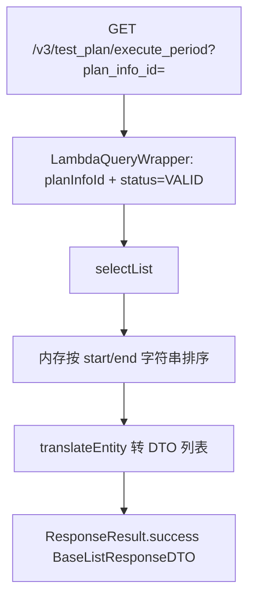
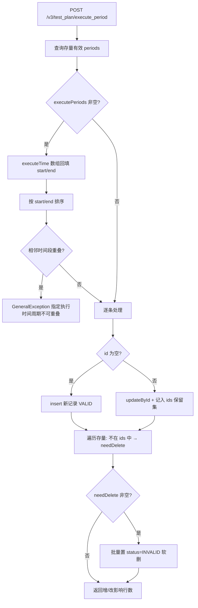

# PlanInfoExecutePeriodController — 测试计划执行时间段配置

> 分支：syy.release.z7.8.1.0
> 源文件：`src/main/java/cn/testin/controller/plan/PlanInfoExecutePeriodController.java`
> 类级路由：`/test_plan`
> 业务：测试计划允许执行的时间段（period）列表维护。写入为**全量提交**语义：按 id 更新 / 无 id 新增 / 未提交的存量记录置失效。

## 接口列表总表

| 方法 | 路径 | 方法名 | 说明 | 操作日志 |
|---|---|---|---|---|
| GET | `/v3/test_plan/execute_period` | getPlanInfoExecutePeriods | 查询计划有效时间段列表（按开始时间排序） | 无 |
| POST | `/v3/test_plan/execute_period` | dealPlanInfoExecutePeriods | 全量提交时间段：增/改/失效删除（事务） | `PLAN_EXECUTE_PERIOD_UPDATE`（任务执行周期更新） |

统一响应包装：`ResponseResult<T>`；列表为 `BaseListResponseDTO<T>`，单值结果 `BaseDataResultDTO { Long result }`。

---

## 1. GET /v3/test_plan/execute_period — 查询执行时间段

### 入口

`PlanInfoExecutePeriodController.getPlanInfoExecutePeriods(@RequestParam("plan_info_id") Long planInfoId)`

### 请求参数

| 字段 | 来源 | 必填 | 说明 |
|---|---|---|---|
| plan_info_id | Query | 是 | 测试计划 ID |

### 响应结构

`ResponseResult<BaseListResponseDTO<PlanInfoExecutePeriodResponseDTO>>`，列表元素：

| 字段 | 类型 | 说明 |
|---|---|---|
| id | Integer | 主键 |
| planInfoId | Long | 关联测试计划 |
| executeStartTime | String | 时间段开始（如 "08:00"） |
| executeEndTime | String | 时间段结束 |
| executeTime | List\<String\> | [start, end]，适配前端 |
| createTime | Long | 创建时间（毫秒时间戳） |
| updateTime | Long | 更新时间（毫秒时间戳） |
| status | Integer | 0 删除 / 1 正常 |

仅返回 status=VALID 的记录；内存排序：先按 executeStartTime，相同再按 executeEndTime（字符串比较）。

### 实现意图

给出计划当前生效的全部执行时间段，供前端配置面板回显与执行链路判定「当前时刻是否允许执行」。

### mermaid



### 调用链

```
PlanInfoExecutePeriodController.getPlanInfoExecutePeriods
└─ PlanInfoExecutePeriodServiceImpl.getPlanInfoExecutePeriods
   └─ getExecutePeriods(planInfoId, sortByExecuteTime=true)
      ├─ IPlanInfoExecutePeriodDAO.selectList → db_plan.plan_info_execute_period
      └─ 排序（start 相同比 end）
```

### 涉及表

| 表 | 操作 |
|---|---|
| db_plan.plan_info_execute_period | 读（status=1） |

### 异常

- 无业务异常；plan_info_id 缺失由参数绑定层报 400。

### 关联横切

- 纯查询；`getExecutePeriods` 同时被内部执行链路复用（sortByExecuteTime 可关）。

### 代码摘录

```java
queryWrapper.eq(DbPlanInfoExecutePeriod::getPlanInfoId, planInfoId);
queryWrapper.eq(DbPlanInfoExecutePeriod::getStatus, StatusTypeEnum.VALID.getType());
List<DbPlanInfoExecutePeriod> dbPlanInfoExecutePeriods = planInfoExecutePeriodDAO.selectList(queryWrapper);
if (sortByExecuteTime) {
    dbPlanInfoExecutePeriods.sort((a1, a2) -> {
        if (a1.getExecuteStartTime().equals(a2.getExecuteStartTime())) {
            return a1.getExecuteEndTime().compareTo(a2.getExecuteEndTime());
        }
        return a1.getExecuteStartTime().compareTo(a2.getExecuteStartTime());
    });
}
```

---

## 2. POST /v3/test_plan/execute_period — 全量提交执行时间段

### 入口

`PlanInfoExecutePeriodController.dealPlanInfoExecutePeriods(@RequestBody PlanInfoExecutePeriodRequestDTO request)`

### 请求参数（PlanInfoExecutePeriodRequestDTO，JSON Body）

| 字段 | 类型 | 必填 | 说明 |
|---|---|---|---|
| planInfoId | Long | 是 | 测试计划 ID |
| executePeriods | List\<PlanInfoExecutePeriodDetailDTO\> | 否 | 全量时间段列表；空列表等价于清空全部 |

PlanInfoExecutePeriodDetailDTO：

| 字段 | 类型 | 说明 |
|---|---|---|
| id | Integer | 已有记录主键；null 表示新增 |
| planInfoId | Long | （DTO 内字段，实际以请求级 planInfoId 为准） |
| executeStartTime | String | 时间段开始 |
| executeEndTime | String | 时间段结束 |
| executeTime | List\<String\> | [start, end]；当 start/end 为空且该数组非空时自动回填 start/end |

继承 `BaseRequestDTO`：`userId` 用于 create/update_user_id。

### 响应结构

`ResponseResult<BaseDataResultDTO>`，`data.result` = 新增 + 更新累计影响行数（不含失效删除）。

### 实现意图

以一次请求表达时间段列表的目标终态：

1. 兼容前端 [start,end] 数组形式，回填 start/end；
2. 排序后校验相邻时间段不重叠（pre.end > cur.start 即报错）；
3. 无 id 的记录 insert；有 id 的记录 update 并记入保留集合；
4. 存量有效记录中未出现在保留集合内的，批量置 status=INVALID（软删）。

### mermaid



### 调用链

```
PlanInfoExecutePeriodController.dealPlanInfoExecutePeriods
├─ @OperateLog(PLAN_EXECUTE_PERIOD_UPDATE) AOP 记录操作日志
└─ PlanInfoExecutePeriodServiceImpl.dealPlanInfoExecutePeriods
   ├─ @DS(Constants.DB_PLAN)  路由到计划库
   ├─ @Transactional(rollbackFor = Exception.class)
   ├─ getExecutePeriods(planInfoId, false)  → 存量有效记录
   ├─ 重叠校验（排序后相邻比较）
   ├─ IPlanInfoExecutePeriodDAO.insert      → plan_info_execute_period（新记录）
   ├─ IPlanInfoExecutePeriodDAO.updateById  → plan_info_execute_period（保留记录）
   └─ IPlanInfoExecutePeriodDAO.update(LambdaUpdateWrapper status=INVALID, id in needDelete)
```

### 涉及表

| 表 | 操作 |
|---|---|
| db_plan.plan_info_execute_period | 读 / insert / updateById / 批量 update 置失效 |

### 异常

| 条件 | 异常 |
|---|---|
| 相邻时间段重叠（pre.end > cur.start，字符串比较） | GeneralException(paraInvalid, 指定执行时间周期不可重叠) |

### 关联横切

- `@OperateLog(operateLog = OperateLogEnum.PLAN_EXECUTE_PERIOD_UPDATE)`：AOP 写操作日志（TEST_PLAN / UPDATE /「任务执行周期更新」）。
- `@DS(Constants.DB_PLAN)`：dynamic-datasource 路由 db_plan 数据源。
- `@Transactional(rollbackFor = Exception.class)`：增/改/删任一步失败整体回滚。
- 语义注意：executeStartTime/EndTime 为字符串类型，排序与重叠判断均为字典序比较，依赖前端传入统一格式（如 HH:mm）。

### 代码摘录

```java
PlanInfoExecutePeriodDetailDTO pre = null;
for (PlanInfoExecutePeriodDetailDTO dbPlanInfoExecutePeriod : request.getExecutePeriods()) {
    if (pre == null) { pre = dbPlanInfoExecutePeriod; continue; }
    if (pre.getExecuteEndTime().compareTo(dbPlanInfoExecutePeriod.getExecuteStartTime()) > 0) {
        throw new GeneralException(CommonCode.paraInvalid.getValue(), "指定执行时间周期不可重叠");
    }
    pre = dbPlanInfoExecutePeriod;
}
```

```java
LambdaUpdateWrapper<DbPlanInfoExecutePeriod> updateWrapper = new LambdaUpdateWrapper<>();
updateWrapper.set(DbPlanInfoExecutePeriod::getStatus, StatusTypeEnum.INVALID.getType());
updateWrapper.set(DbPlanInfoExecutePeriod::getUpdateTime, new Date());
updateWrapper.set(DbPlanInfoExecutePeriod::getUpdateUserId, request.getUserId());
updateWrapper.in(DbPlanInfoExecutePeriod::getId, needDelete);
planInfoExecutePeriodDAO.update(null, updateWrapper);
```

---

相关文档：[00-分支索引](00-分支索引.md) · [PlanInfoScheduledController](PlanInfoScheduledController.md) · [PlanInfoConfigController](PlanInfoConfigController.md)
