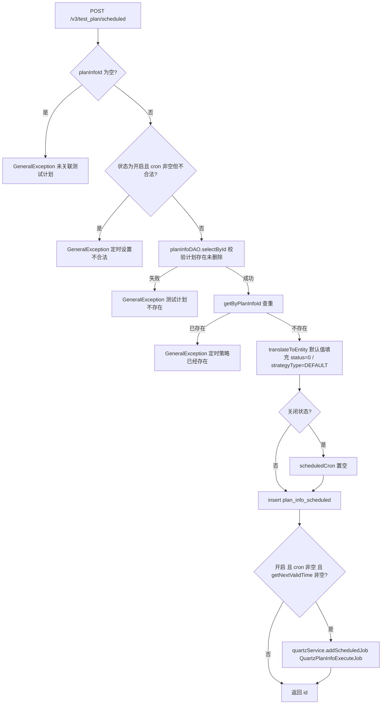
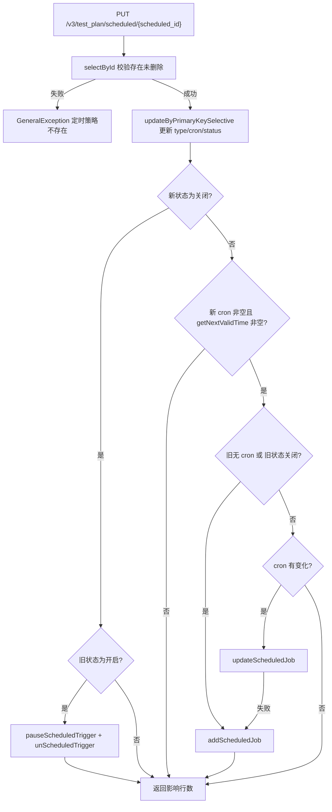
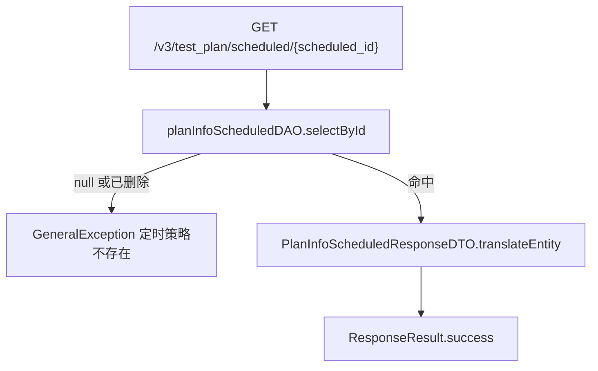

# PlanInfoScheduledController — 测试计划定时执行（Cron）

> 分支：syy.release.z7.8.1.0
> 源文件：`src/main/java/cn/testin/controller/plan/PlanInfoScheduledController.java`
> 类级路由：`/test_plan`
> 业务：测试计划 Cron 定时策略的增/改/查。写操作同时维护 Quartz 任务（Job 名 `{planInfoId}_{scheduledId}`，分组 `PLAN_INFO_EXECUTE_GROUP`）。

## 接口列表总表

| 方法 | 路径 | 方法名 | 说明 | 操作日志 |
|---|---|---|---|---|
| POST | `/v3/test_plan/scheduled` | addPlanInfoScheduled | 新增定时策略（一个计划仅允许一条） | 无 |
| PUT | `/v3/test_plan/scheduled/{scheduled_id}` | updatePlanInfoScheduled | 更新定时策略（cron/状态），同步增删改 Quartz 任务 | `PLAN_CRON_UPDATE`（定时触发计划执行） |
| GET | `/v3/test_plan/scheduled/{scheduled_id}` | getScheduledById | 查询定时策略详情 | 无 |

统一响应包装：`ResponseResult<T> { int code; String msg; T data }`；`BaseDataResultDTO { Long result }`。

---

## 1. POST /v3/test_plan/scheduled — 新增定时策略

### 入口

`PlanInfoScheduledController.addPlanInfoScheduled(@RequestBody PlanInfoScheduledRequestDTO request)`

### 请求参数（PlanInfoScheduledRequestDTO，JSON Body）

| 字段 | 类型 | 必填 | 说明 |
|---|---|---|---|
| planInfoId | Long | 是 | 关联测试计划 ID，为 null 抛「未关联测试计划」 |
| scheduledType | Integer | 否 | 定时配置设置类型 |
| scheduledCron | String | 开启时必填 | cron 表达式；开启状态下非空则校验合法性 |
| scheduledStatus | Integer | 否 | 0=关闭（CLOSE_SCHEDULED），1=开启（OPEN_SCHEDULED）；null 落库为 0 |

继承 `BaseRequestDTO`：`userId`（请求上下文用户，用于 create/update_user_id）。

### 响应结构

`ResponseResult<BaseDataResultDTO>`，`data.result` = 新建定时策略主键 id。

```json
{ "code": 0, "msg": "success", "data": { "result": 123 } }
```

### 实现意图

为测试计划创建唯一的 Cron 定时执行策略：先校验计划存在且未删除、策略不重复；关闭状态下强制清空 cron 落库；若开启且 cron 合法且存在下一次触发时间，则向 Quartz 注册 `QuartzPlanInfoExecuteJob`，Job 参数携带 `planInfoId`。

### mermaid



### 调用链

```
PlanInfoScheduledController.addPlanInfoScheduled
└─ PlanInfoScheduledServiceImpl.addPlanInfoScheduled
   ├─ IPlanInfoDAO.selectById                → db_plan.plan_info
   ├─ IPlanInfoScheduledDAO.getByPlanInfoId  → db_plan.plan_info_scheduled（查重）
   ├─ PlanInfoScheduledRequestDTO.translateToEntity（status 默认 0、strategyType=DEFAULT、is_delete=0）
   ├─ IPlanInfoScheduledDAO.insert           → db_plan.plan_info_scheduled
   └─ IQuartzService(planInfoExecuteQuartzService)
      ├─ getNextValidTime(cron, now)
      └─ addScheduledJob(QuartzPlanInfoExecuteJob, "{planInfoId}_{scheduledId}", PLAN_INFO_EXECUTE_GROUP, cron, {planInfoId})
```

### 涉及表

| 表 | 操作 |
|---|---|
| db_plan.plan_info | 读（存在性校验） |
| db_plan.plan_info_scheduled | 读（查重）/ 写（insert） |

### 异常

| 条件 | 异常 |
|---|---|
| planInfoId 为空 | GeneralException(paraInvalid, 未关联测试计划) |
| 开启状态 cron 非空但不合法 | GeneralException(paraInvalid, 定时设置不合法) |
| 计划不存在或已删除 | GeneralException(paraInvalid, 测试计划不存在) |
| 计划已有定时策略 | GeneralException(paraInvalid, 定时策略已经存在) |

### 关联横切

- 认证/用户上下文：`BaseRequestDTO.userId` 由请求上下文注入。
- Quartz：`QuartzPlanInfoExecuteJob` 到点触发计划执行链路（见代码流程-计划执行链路）。
- 全局异常：GeneralException 由统一异常处理器转 ResponseResult 错误码。

### 代码摘录

```java
if (PlanInfoScheduledStatusEnum.isOpenScheduled(dbPlanInfoScheduled.getScheduledStatus())
        && StringUtils.hasLength(request.getScheduledCron())) {
    Date nextValidTime = quartzService.getNextValidTime(request.getScheduledCron(), new Date());
    if (nextValidTime == null) {
        return dbPlanInfoScheduled.getId();
    }
    Map<String, Long> param = new HashMap<>();
    param.put(Constants.PLAN_INFO_ID_FIELD, dbPlanInfoScheduled.getPlanInfoId());
    quartzService.addScheduledJob(QuartzPlanInfoExecuteJob.class,
            dbPlanInfoScheduled.getPlanInfoId() + "_" + dbPlanInfoScheduled.getId(),
            Constants.PLAN_INFO_EXECUTE_GROUP, request.getScheduledCron(), param);
}
```

---

## 2. PUT /v3/test_plan/scheduled/{scheduled_id} — 更新定时策略

### 入口

`PlanInfoScheduledController.updatePlanInfoScheduled(@PathVariable("scheduled_id") Long planInfoScheduledId, @RequestBody PlanInfoScheduledRequestDTO request)`

### 请求参数

| 字段 | 来源 | 必填 | 说明 |
|---|---|---|---|
| scheduled_id | Path | 是 | 定时策略主键 |
| scheduledType | Body | 否 | 定时配置设置类型 |
| scheduledCron | Body | 见校验 | cron；与 scheduledStatus 同时为空抛「参数不能为空」 |
| scheduledStatus | Body | 见校验 | 0 关闭 / 1 开启；null 表示沿用旧状态 |
| userId | Body 基类 | 否 | 更新人 |

校验顺序：开启且 cron 非空 → 校验 cron 合法性；cron 与 status 同时为空 → 抛错。

### 响应结构

`ResponseResult<BaseDataResultDTO>`，`data.result` = update 影响行数（0/1）。

### 实现意图

按主键选择性更新 cron/状态，并据「旧状态 × 新状态 × 新旧 cron」做 Quartz 任务生命周期管理：关闭（旧开新关）→ pause + unschedule；开启且 cron 有效 → 旧关或原来无 cron 则新增 Job，cron 变化则更新 Job，更新失败兜底重新 add。

### mermaid



### 调用链

```
PlanInfoScheduledController.updatePlanInfoScheduled
├─ @OperateLog(PLAN_CRON_UPDATE) AOP 记录操作日志
└─ PlanInfoScheduledServiceImpl.updatePlanInfoScheduled
   ├─ IPlanInfoScheduledDAO.selectById                    → plan_info_scheduled（存在性）
   ├─ IPlanInfoScheduledDAO.updateByPrimaryKeySelective   → plan_info_scheduled（更新）
   └─ IQuartzService
      ├─ 关闭：pauseScheduledTrigger / unScheduledTrigger
      └─ 开启：getNextValidTime / addScheduledJob / updateScheduledJob（失败兜底 add）
```

### 涉及表

| 表 | 操作 |
|---|---|
| db_plan.plan_info_scheduled | 读 / 写（selective update） |

### 异常

| 条件 | 异常 |
|---|---|
| 开启且 cron 非空不合法 | GeneralException(paraInvalid, 定时设置不合法) |
| cron 与 status 同时为空 | GeneralException(paraInvalid, 参数不能为空) |
| 策略不存在或已删除 | GeneralException(paraInvalid, 定时策略不存在) |

### 关联横切

- `@OperateLog(operateLog = OperateLogEnum.PLAN_CRON_UPDATE)`：AOP 写操作日志（对象类型 TEST_PLAN、操作 UPDATE、文案「定时触发计划执行」）。
- Quartz 任务一致性：DB 更新与 Quartz 操作非事务，存在 DB 成功而 Quartz 失败的窗口。

### 代码摘录

```java
if (PlanInfoScheduledStatusEnum.isCloseScheduled(newStatus)) {
    if (PlanInfoScheduledStatusEnum.isOpenScheduled(oldStatus)) {
        quartzService.pauseScheduledTrigger(dbPlanInfoScheduled.getPlanInfoId() + "_" + dbPlanInfoScheduled.getId(), Constants.PLAN_INFO_EXECUTE_GROUP);
        quartzService.unScheduledTrigger(dbPlanInfoScheduled.getPlanInfoId() + "_" + dbPlanInfoScheduled.getId(), Constants.PLAN_INFO_EXECUTE_GROUP);
    }
    return result;
}
```

---

## 3. GET /v3/test_plan/scheduled/{scheduled_id} — 查询定时策略详情

### 入口

`PlanInfoScheduledController.getScheduledById(@PathVariable("scheduled_id") Long planInfoScheduledId)`

### 请求参数

| 字段 | 来源 | 必填 | 说明 |
|---|---|---|---|
| scheduled_id | Path | 是 | 定时策略主键 |

### 响应结构

`ResponseResult<PlanInfoScheduledResponseDTO>`：

| 字段 | 类型 | 说明 |
|---|---|---|
| id | Long | 定时策略主键 |
| planInfoId | Long | 关联测试计划 |
| scheduledType | Integer | 定时配置设置类型 |
| scheduledCron | String | cron 表达式（规则生成或手填） |
| scheduledStatus | Integer | 0 未启用 / 1 启用 |

### 实现意图

按主键查询单条定时策略并转换为响应 DTO；不存在或已逻辑删除视为「定时策略不存在」。

### mermaid



### 调用链

```
PlanInfoScheduledController.getScheduledById
└─ PlanInfoScheduledServiceImpl.getScheduledById
   ├─ IPlanInfoScheduledDAO.selectById → db_plan.plan_info_scheduled
   └─ PlanInfoScheduledResponseDTO.translateEntity
```

### 涉及表

| 表 | 操作 |
|---|---|
| db_plan.plan_info_scheduled | 读 |

### 异常

| 条件 | 异常 |
|---|---|
| 记录不存在或 is_delete=1 | GeneralException(paraInvalid, 定时策略不存在) |

### 关联横切

- 无操作日志、无事务、无 Quartz 交互，纯查询。

### 代码摘录

```java
DbPlanInfoScheduled dbPlanInfoScheduled = planInfoScheduledDAO.selectById(planInfoScheduledId);
if (dbPlanInfoScheduled == null || DeleteTypeEnum.isDeleted(dbPlanInfoScheduled.getIsDelete())) {
    throw new GeneralException(CommonCode.paraInvalid.getValue(), "定时策略不存在");
}
return PlanInfoScheduledResponseDTO.translateEntity(dbPlanInfoScheduled);
```

---

## 备注：非 Controller 暴露的相关服务能力

`IPlanInfoScheduledService` 另有两个被内部复用的方法（不对应 HTTP 端点）：

- `deleteByPlanInfoId(planInfoId)`：计划删除时级联软删策略，并 pause + delete Quartz Job。
- `selectNeedScheduleInfo(id)` / `selectDbPlanScheduledByPlanInfoId(planInfoId)`：调度扫描与执行链路查询使用（见 [PlanInfoController](PlanInfoController.md)、Quartz 计划执行链路）。

相关文档：[00-分支索引](00-分支索引.md) · [PlanInfoConfigController](PlanInfoConfigController.md) · [PlanInfoExecutePeriodController](PlanInfoExecutePeriodController.md)
