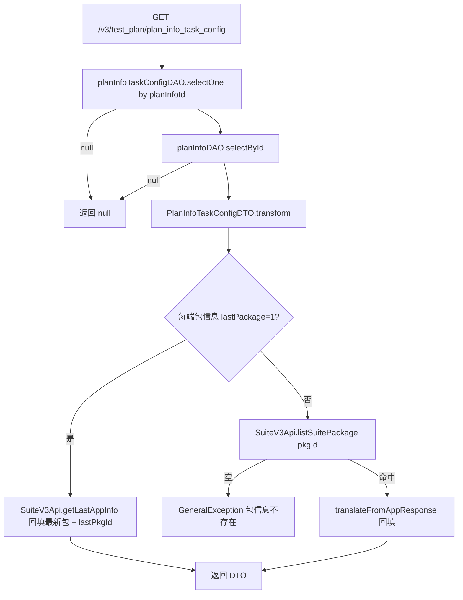
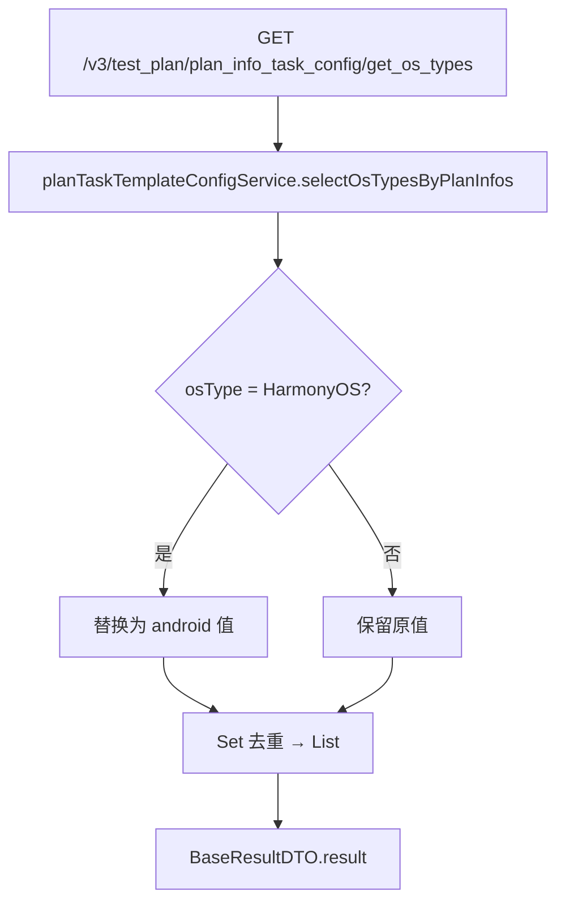
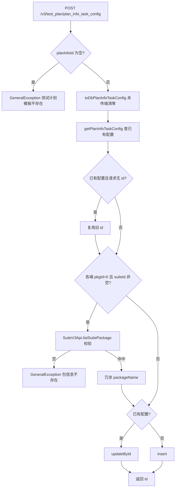
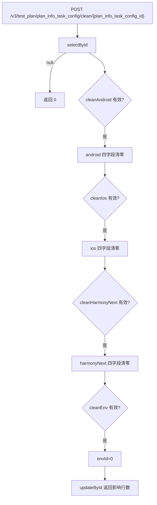
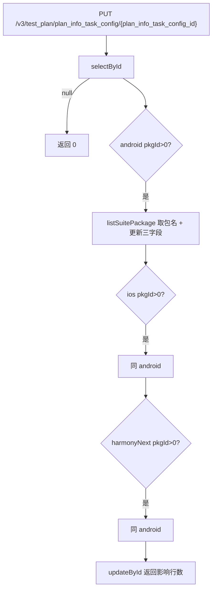

# PlanInfoTaskConfigController — 测试计划任务配置（App 包/环境）

> 分支：syy.release.z7.8.1.0
> 源文件：`src/main/java/cn/testin/controller/plan/PlanInfoTaskConfigController.java`
> 类级路由：`/test_plan`
> 业务：测试计划维度任务配置的查/增/改/清理，配置内容为 iOS / Android / HarmonyNext 三端 App 套件与安装包、环境 envId、设备离线配置。包名等冗余信息通过文件系统服务（SuiteV3Api）实时回填。

## 接口列表总表

| 方法 | 路径 | 方法名 | 说明 | 操作日志 |
|---|---|---|---|---|
| GET | `/v3/test_plan/plan_info_task_config` | getPlanInfoTaskConfig | 查询计划任务配置（含三端包信息实时回填） | 无 |
| GET | `/v3/test_plan/plan_info_task_config/get_os_types` | getOsType | 查询计划涉及的 OS 类型（HarmonyOS 归并为 android） | 无 |
| POST | `/v3/test_plan/plan_info_task_config` | addPlanInfoTaskConfig | 新增/覆盖保存任务配置（upsert） | 无 |
| POST | `/v3/test_plan/plan_info_task_config/clean/{plan_info_task_config_id}` | cleanPlanInfoTaskConfig | 按标志位清空三端包/环境字段 | 无 |
| PUT | `/v3/test_plan/plan_info_task_config/{plan_info_task_config_id}` | updatePlanInfoTaskConfig | 按主键更新三端包信息 | 无 |

统一响应包装：`ResponseResult<T> { int code; String msg; T data }`；`BaseResultDTO { Object result }`。

---

## 1. GET /v3/test_plan/plan_info_task_config — 查询任务配置

### 入口

`PlanInfoTaskConfigController.getPlanInfoTaskConfig(@RequestParam("plan_info_id") Long planInfoId)` — PlanInfoTaskConfigController.java

### 请求参数

| 字段 | 来源 | 必填 | 说明 |
|---|---|---|---|
| plan_info_id | Query | 是 | 测试计划 ID |

### 响应结构

`ResponseResult<PlanInfoTaskConfigDTO>`；无配置或计划已删除时 `data` 为 null。

| 字段 | 类型 | 说明 |
|---|---|---|
| id | Long | 配置主键 |
| planInfoId | Long | 测试计划 ID |
| iosAppPackageInfo | AppPackageInfoDTO | iOS 包信息（pkgId/suiteId/lastPackage/packageName + 远程回填 appName/versionName/build/iconFileUrl 等） |
| androidAppPackageInfo | AppPackageInfoDTO | Android 包信息，结构同上 |
| harmonyNextAppPackageInfo | AppPackageInfoDTO | HarmonyNext 包信息，结构同上 |
| envId | Integer | 环境 ID |
| deviceOfflineConfig | Integer | 设备离线配置 |
| createTime / updateTime | Long | 毫秒时间戳 |

### 实现意图

按 planInfoId 查唯一任务配置行并组装 DTO；对每一端包信息：若 `lastPackage=1`（跟随最新包），调 `SuiteV3Api.getLastAppInfo` 拉最新包并回填、记录 lastPkgId；否则按已存 packageId 调 `SuiteV3Api.listSuitePackage` 取包详情回填，远程查不到抛「包信息不存在」。

### mermaid



### 调用链

```
PlanInfoTaskConfigController.getPlanInfoTaskConfig
└─ PlanInfoTaskConfigServiceImpl.getPlanInfoTaskConfigDTO
   ├─ IPlanInfoTaskConfigDAO.selectOne        → db_plan.plan_info_task_config
   ├─ IPlanInfoDAO.selectById                 → db_plan.plan_info
   ├─ PlanInfoTaskConfigDTO.transform（包 id>0 才组装各端 info）
   └─ SuiteV3Api（文件系统远程服务）
      ├─ getLastAppInfo(projectId, suiteId, osTypes, packageName)   → 最新包
      └─ listSuitePackage(packageId)                                 → 指定包详情
```

### 涉及表

| 表 | 操作 |
|---|---|
| db_plan.plan_info_task_config | 读 |
| db_plan.plan_info | 读（存在性） |

### 异常

| 条件 | 异常 |
|---|---|
| listSuitePackage 返回空（包已删除） | GeneralException(paraInvalid, 包信息不存在) |

### 关联横切

- 跨服务：SuiteV3Api（文件系统/包管理服务）；Android 查询时 osTypes 传 `ANDROID,HARMONY_OS` 两个类型。
- 被 PlanEmailNoticeServiceImpl.getAppName 复用（邮件详情取 App 名）。

### 代码摘录

```java
if (transform.getAndroidAppPackageInfo().getLastPackage() == 1) {
    String osTypes = AppDeviceOsTypeEnum.ANDROID.getType() + "," + AppDeviceOsTypeEnum.HARMONY_OS.getType();
    AppResponseDTO appResponseDTO = suiteV3Api.getLastAppInfo(dbPlanInfo.getProjectId(),
            transform.getAndroidAppPackageInfo().getSuiteId(), osTypes,
            transform.getAndroidAppPackageInfo().getPackageName());
    if (appResponseDTO != null) {
        transform.getAndroidAppPackageInfo().setLastPkgId(appResponseDTO.getPackageId());
        transform.getAndroidAppPackageInfo().translateFromAppResponse(appResponseDTO);
    }
}
```

---

## 2. GET /v3/test_plan/plan_info_task_config/get_os_types — 查询计划 OS 类型

### 入口

`PlanInfoTaskConfigController.getOsType(@RequestParam("plan_info_id") Long planInfoId)` — PlanInfoTaskConfigController.java

### 请求参数

| 字段 | 来源 | 必填 | 说明 |
|---|---|---|---|
| plan_info_id | Query | 是 | 测试计划 ID |

### 响应结构

`ResponseResult<BaseResultDTO>`，`data.result` = `List<Integer>`（去重后的 osType 集合）。

### 实现意图

从计划任务模板配置表汇总 os_type 去重返回；**HarmonyOS 类型被归并替换为 android 类型**（前端只需区分 android/iOS 大类）。

### mermaid



### 调用链

```
PlanInfoTaskConfigController.getOsType
└─ PlanTaskTemplateConfigServiceImpl.selectOsTypesByPlanInfos
   └─ IPlanTaskTemplateConfigDAO.selectList(plan_info_id) → db_plan.plan_task_template_config（过滤 osType 非空非 0）
```

### 涉及表

| 表 | 操作 |
|---|---|
| db_plan.plan_task_template_config | 读 |

### 异常

无显式异常；planInfoId 无记录时返回空列表。

### 关联横切

- 枚举：`SyspfTypeEnum.HarmonyOS → android` 的归并逻辑在 Controller 内完成，非 Service。

---

## 3. POST /v3/test_plan/plan_info_task_config — 新增/覆盖保存任务配置

### 入口

`PlanInfoTaskConfigController.addPlanInfoTaskConfig(@RequestBody PlanInfoTaskConfigDTO planInfoTaskConfigDTO)` — PlanInfoTaskConfigController.java

### 请求参数（PlanInfoTaskConfigDTO，JSON Body）

| 字段 | 类型 | 必填 | 说明 |
|---|---|---|---|
| planInfoId | Long | 是 | 为 null 抛「测试计划模板不存在」 |
| id | Long | 否 | 不传时若计划已有配置则复用旧主键（upsert） |
| iosAppPackageInfo | AppPackageInfoDTO | 否 | pkgId/suiteId/lastPackage/packageName；整端不传则清零 |
| androidAppPackageInfo | AppPackageInfoDTO | 否 | 同上 |
| harmonyNextAppPackageInfo | AppPackageInfoDTO | 否 | 同上 |
| envId | Integer | 否 | 环境 ID，null/<=0 落库 0 |
| deviceOfflineConfig | Integer | 否 | 设备离线配置，null/<=0 落库 0 |

### 响应结构

`ResponseResult<BaseResultDTO>`，`data.result` = 配置主键 id。

### 实现意图

upsert 语义：按 planInfoId 查已有配置，存在且请求未带 id 则复用旧 id 走 updateById，否则 insert。每端包（pkgId>0 且 suiteId 非空）先调远程校验包存在并冗余 packageName 落库；DTO 转实体时未传的端被清零、isDelete=0、configStatus=VALID。

### mermaid



### 调用链

```
PlanInfoTaskConfigController.addPlanInfoTaskConfig
└─ PlanInfoTaskConfigServiceImpl.addPlanInfoTaskConfig
   ├─ getPlanInfoTaskConfig(planInfoId)            → db_plan.plan_info_task_config（查已有）
   ├─ PlanInfoTaskConfigDTO.toDbPlanInfoTaskConfig（默认值填充）
   ├─ SuiteV3Api.listSuitePackage × 最多 3 端（校验+取包名）
   └─ IPlanInfoTaskConfigDAO.updateById / insert   → db_plan.plan_info_task_config
```

### 涉及表

| 表 | 操作 |
|---|---|
| db_plan.plan_info_task_config | 读 / 写（insert 或 updateById） |

### 异常

| 条件 | 异常 |
|---|---|
| planInfoId 为空 | GeneralException(paraInvalid, 测试计划模板不存在) |
| 任一端包远程查不到 | GeneralException(paraInvalid, 包信息不存在) |

### 关联横切

- 注意：整体保存会**清零未传端**的已有包信息（toDbPlanInfoTaskConfig 默认 0/""），属全量覆盖语义而非部分更新。

### 代码摘录

```java
DbPlanInfoTaskConfig planInfoTaskConfig = getPlanInfoTaskConfig(planInfoTaskConfigDTO.getPlanInfoId());
DbPlanInfoTaskConfig dbPlanInfoTaskConfig = planInfoTaskConfigDTO.toDbPlanInfoTaskConfig();
if (planInfoTaskConfig != null && planInfoTaskConfigDTO.getId() == null) {
    dbPlanInfoTaskConfig.setId(planInfoTaskConfig.getId());
}
...
if (planInfoTaskConfig != null) {
    planInfoTaskConfigDAO.updateById(dbPlanInfoTaskConfig);
} else {
    planInfoTaskConfigDAO.insert(dbPlanInfoTaskConfig);
}
```

---

## 4. POST /v3/test_plan/plan_info_task_config/clean/{plan_info_task_config_id} — 清理配置字段

### 入口

`PlanInfoTaskConfigController.cleanPlanInfoTaskConfig(@PathVariable Long planInfoTaskConfigId, @RequestBody PlanInfoTaskConfigCleanDTO cleanDTO)` — PlanInfoTaskConfigController.java

### 请求参数

| 字段 | 来源 | 必填 | 说明 |
|---|---|---|---|
| plan_info_task_config_id | Path | 是 | 配置主键 |
| cleanAndroid | Body | 否 | 有效值时清空 android 包四字段（packageName/suiteId/appPackageId/lastPackage） |
| cleanIos | Body | 否 | 有效值时清空 ios 包四字段 |
| cleanHarmonyNext | Body | 否 | 有效值时清空 harmonyNext 包四字段 |
| cleanEnv | Body | 否 | 有效值时 envId 置 0 |

`StatusTypeEnum.isValid(x)` 判定生效（=1）。

### 响应结构

`ResponseResult<BaseResultDTO>`，`data.result` = update 影响行数；配置不存在返回 0。

### 实现意图

按主键读出整行，按四个清理标志位分别把对应端包字段清零或 envId 置 0，再整行 updateById。

### mermaid



### 调用链

```
PlanInfoTaskConfigController.cleanPlanInfoTaskConfig
└─ PlanInfoTaskConfigServiceImpl.cleanPlanInfoTaskConfig
   ├─ IPlanInfoTaskConfigDAO.selectById  → db_plan.plan_info_task_config
   └─ IPlanInfoTaskConfigDAO.updateById  → db_plan.plan_info_task_config
```

### 涉及表

| 表 | 操作 |
|---|---|
| db_plan.plan_info_task_config | 读 / 写 |

### 异常

无显式异常；主键不存在静默返回 0。

### 关联横切

- 不走远程校验，纯本地字段清理。

---

## 5. PUT /v3/test_plan/plan_info_task_config/{plan_info_task_config_id} — 更新任务配置

### 入口

`PlanInfoTaskConfigController.updatePlanInfoTaskConfig(@PathVariable Long planInfoTaskConfigId, @RequestBody PlanInfoTaskConfigDTO dto)` — PlanInfoTaskConfigController.java

### 请求参数

| 字段 | 来源 | 必填 | 说明 |
|---|---|---|---|
| plan_info_task_config_id | Path | 是 | 配置主键 |
| androidAppPackageInfo.pkgId | Body | 否 | >0 才更新该端；远程查到包则同步冗余 packageName |
| iosAppPackageInfo.pkgId | Body | 否 | 同上 |
| harmonyNextAppPackageInfo.pkgId | Body | 否 | 同上 |

### 响应结构

`ResponseResult<BaseResultDTO>`，`data.result` = update 影响行数；配置不存在返回 0。

### 实现意图

部分更新语义（与 POST 的全量覆盖不同）：只对请求中 pkgId>0 的端更新 pkgId/suiteId/lastPackage 并远程取包名；envId 分支为自赋值（无实际效果，疑似遗留代码）。

### mermaid



### 调用链

```
PlanInfoTaskConfigController.updatePlanInfoTaskConfig
└─ PlanInfoTaskConfigServiceImpl.updatePlanInfoTaskConfig
   ├─ IPlanInfoTaskConfigDAO.selectById       → db_plan.plan_info_task_config
   ├─ SuiteV3Api.listSuitePackage × 各端（包名为空不报错，仅不冗余）
   └─ IPlanInfoTaskConfigDAO.updateById       → db_plan.plan_info_task_config
```

### 涉及表

| 表 | 操作 |
|---|---|
| db_plan.plan_info_task_config | 读 / 写 |

### 异常

无显式异常抛出路径；与新增不同，远程查不到包**不抛错**只是不回填包名。

### 关联横切

- 与接口 3 的语义差异：PUT 为增量、POST 为全量覆盖，前端需区分使用。

---

## 备注：非 Controller 暴露的服务能力

`IPlanInfoTaskConfigService` 另有内部方法（不对应 HTTP 端点）：

- `getPlanInfoTaskConfig(planInfoId)`：返回原始 Db 实体，供执行链路使用。
- `deleteByPlanInfoId(planInfoId)`：计划删除时物理删除配置（注意是 delete 非软删）。

相关文档：[00-分支索引](00-分支索引.md) · [PlanInfoController](PlanInfoController.md) · [PlanTaskStrategyController](PlanTaskStrategyController.md) · [EmailNoticeController](EmailNoticeController.md)
