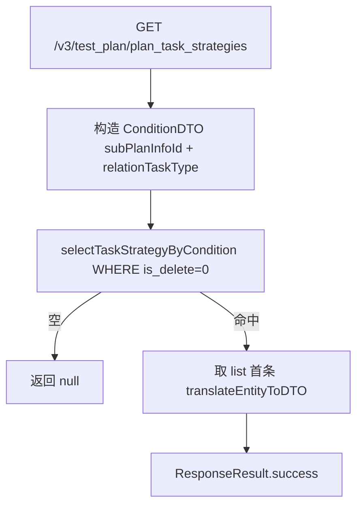
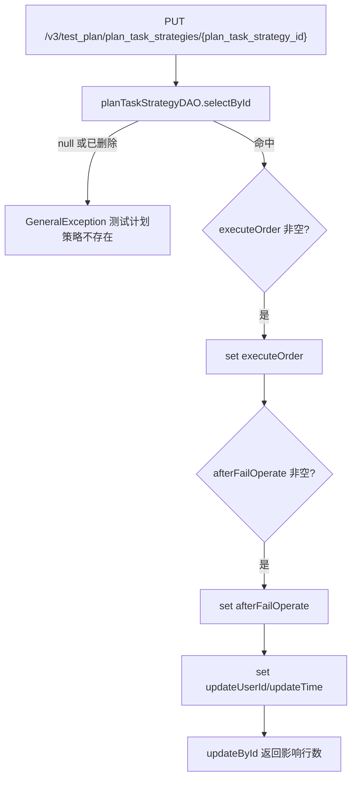

# PlanTaskStrategyController — 测试计划任务执行策略

> 分支：syy.release.z7.8.1.0
> 源文件：`src/main/java/cn/testin/controller/plan/PlanTaskStrategyController.java`
> 类级路由：`/test_plan`
> 业务：子计划维度任务类型的执行策略查询与修改，策略项为执行顺序（executeOrder）与失败后操作（afterFailOperate）。

## 接口列表总表

| 方法 | 路径 | 方法名 | 说明 | 操作日志 |
|---|---|---|---|---|
| GET | `/v3/test_plan/plan_task_strategies` | getPlanTaskStrategy | 按子计划+任务类型查询单条策略 | 无 |
| PUT | `/v3/test_plan/plan_task_strategies/{plan_task_strategy_id}` | updatePlanTaskStrategy | 按主键修改执行顺序/失败后操作 | 无 |

统一响应包装：`ResponseResult<T>`；`BaseDataResultDTO { Long result }`。

---

## 1. GET /v3/test_plan/plan_task_strategies — 查询任务策略

### 入口

`PlanTaskStrategyController.getPlanTaskStrategy(planInfoId, subPlanInfoId, relationTaskType)` — PlanTaskStrategyController.java

### 请求参数

| 字段 | 来源 | 必填 | 说明 |
|---|---|---|---|
| plan_info_id | Query | 否 | 测试计划 ID |
| sub_plan_info_id | Query | 是 | 子计划 ID |
| relation_task_type | Query | 是 | 任务类型 RelationTaskTypeEnum |

### 响应结构

`ResponseResult<PlanTaskStrategyResponseDTO>`；无命中时 `data` 为 null。

| 字段 | 类型 | 说明 |
|---|---|---|
| id | Long | 策略主键 |
| planInfoId | Long | 测试计划 ID |
| subPlanInfoId | Long | 子计划 ID |
| relationTaskType | Integer | 任务类型 RelationTaskTypeEnum |
| executeOrder | Integer | 执行顺序 ExecuteOrderTypeEnum |
| afterFailOperate | Integer | 失败后处理 AfterFailOperateTypeEnum |

### 实现意图

按条件查询未删除策略列表并取首条转 DTO。注意实现存在缺陷：构造 condition 时 `.subPlanInfoId(planInfoId).subPlanInfoId(subPlanInfoId)` 把 planInfoId 误塞进 subPlanInfoId 字段且随即被覆盖，**planInfoId 实际未生效**，查询条件仅含 subPlanInfoId + relationTaskType。

### mermaid



### 调用链

```
PlanTaskStrategyController.getPlanTaskStrategy
└─ PlanTaskStrategyServiceImpl.getPlanTaskStrategy
   └─ IPlanTaskStrategyDAO.selectTaskStrategyByCondition
      → db_plan.plan_task_strategy（PlanTaskStrategyMapper.xml，is_delete=0 + 动态条件）
```

### 涉及表

| 表 | 操作 |
|---|---|
| db_plan.plan_task_strategy | 读 |

### 异常

无显式异常；未命中返回 null。

### 关联横切

- 策略数据由子计划/任务创建链路写入（Service 的 insert 被内部复用），本接口只读。
- 已知缺陷：planInfoId 条件未生效，见「实现意图」。

### 代码摘录

```java
PlanTaskStrategyConditionDTO condition = PlanTaskStrategyConditionDTO.builder()
        .subPlanInfoId(planInfoId).subPlanInfoId(subPlanInfoId).relationTaskType(relationTaskType).build();
List<DbPlanTaskStrategy> dbPlanTaskStrategies = selectTaskStrategyByCondition(condition);
if (CollectionUtils.isEmpty(dbPlanTaskStrategies)) {
    return null;
}
return PlanTaskStrategyResponseDTO.translateEntityToDTO(dbPlanTaskStrategies.get(0));
```

---

## 2. PUT /v3/test_plan/plan_task_strategies/{plan_task_strategy_id} — 修改任务策略

### 入口

`PlanTaskStrategyController.updatePlanTaskStrategy(@PathVariable Long planTaskStrategyId, @RequestBody PlanTaskStrategyRequestDTO request)` — PlanTaskStrategyController.java

### 请求参数（PlanTaskStrategyRequestDTO，JSON Body，继承 BaseRequestDTO）

| 字段 | 类型 | 必填 | 说明 |
|---|---|---|---|
| plan_task_strategy_id | Path | 是 | 策略主键 |
| executeOrder | Integer | 否 | 执行顺序；非 null 才更新 |
| afterFailOperate | Integer | 否 | 失败后操作；非 null 才更新 |
| userId | 基类 | 否 | 更新人（落 update_user_id） |

### 响应结构

`ResponseResult<BaseDataResultDTO>`，`data.result` = update 影响行数（0/1）。

```json
{ "code": 0, "msg": "success", "data": { "result": 1 } }
```

### 实现意图

先按主键校验策略存在且未逻辑删除（否则抛「测试计划策略不存在」），再对 executeOrder / afterFailOperate 做非空选择性更新，附带更新人与更新时间。

### mermaid



### 调用链

```
PlanTaskStrategyController.updatePlanTaskStrategy
└─ PlanTaskStrategyServiceImpl.updatePlanTaskStrategyRequest
   ├─ IPlanTaskStrategyDAO.selectById  → db_plan.plan_task_strategy（存在性+软删校验）
   └─ IPlanTaskStrategyDAO.updateById  → db_plan.plan_task_strategy
```

### 涉及表

| 表 | 操作 |
|---|---|
| db_plan.plan_task_strategy | 读 / 写 |

### 异常

| 条件 | 异常 |
|---|---|
| 策略不存在或 is_delete=1 | GeneralException(paraInvalid, 测试计划策略不存在) |

### 关联横切

- 无操作日志、无事务，单行更新。
- 用户上下文：`BaseRequestDTO.userId` 由请求上下文注入。

### 代码摘录

```java
DbPlanTaskStrategy dbPlanTaskStrategy = planTaskStrategyDAO.selectById(planTaskStrategyId);
if (dbPlanTaskStrategy == null || DeleteTypeEnum.isDeleted(dbPlanTaskStrategy.getIsDelete())) {
    throw new GeneralException(CommonCode.paraInvalid.getValue(), "测试计划策略不存在");
}
if (request.getAfterFailOperate() != null) {
    dbPlanTaskStrategy.setAfterFailOperate(request.getAfterFailOperate());
}
if (request.getExecuteOrder() != null) {
    dbPlanTaskStrategy.setExecuteOrder(request.getExecuteOrder());
}
```

---

## 备注：非 Controller 暴露的服务能力

`IPlanTaskStrategyService` 另有内部方法（不对应 HTTP 端点）：

- `insert(DbPlanTaskStrategy)` / `update(DbPlanTaskStrategy)`：子计划/任务编排链路写入策略。
- `deleteByPlanInfoId(planInfoId, userId)`：计划删除时按 plan_info_id 逻辑删除全部策略。
- `deleteBySubPlanInfoId(subPlanInfoId, userId)`：子计划删除时按 sub_plan_info_id 逻辑删除策略。

相关文档：[00-分支索引](00-分支索引.md) · [SubPlanInfoController](SubPlanInfoController.md) · [PlanTaskController](PlanTaskController.md) · [PlanInfoTaskConfigController](PlanInfoTaskConfigController.md)
