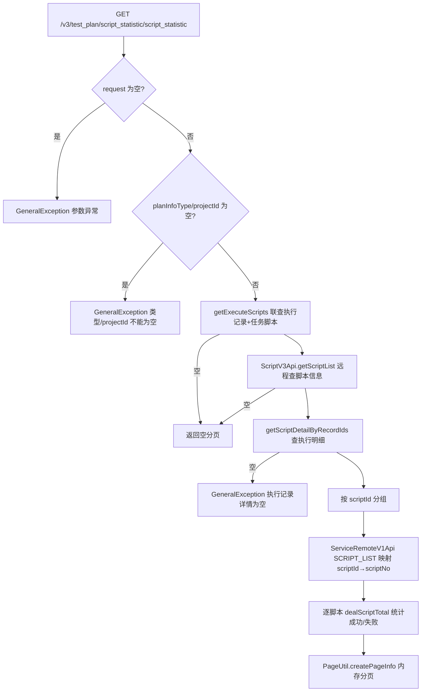

# ScriptStatisticController — 测试计划脚本执行统计

> 分支：syy.release.z7.8.1.0
> 源文件：`src/main/java/cn/testin/controller/plan/ScriptStatisticController.java`
> 类级路由：`/test_plan`
> 业务：按项目+计划类型+时间范围统计各脚本的执行总数/通过数/失败数，数据来自执行记录与脚本明细，脚本基础信息远程取自 script 服务。

## 接口列表总表

| 方法 | 路径 | 方法名 | 说明 | 操作日志 |
|---|---|---|---|---|
| GET | `/v3/test_plan/script_statistic/script_statistic` | scriptStatistic | 脚本执行统计分页列表 | 无 |

统一响应包装：`ResponseResult<T>`；`BasePageListResponseDTO<T>` 分页结构。

---

## 1. GET /v3/test_plan/script_statistic/script_statistic — 脚本执行统计

### 入口

`ScriptStatisticController.scriptStatistic(ScriptStatisticRequestDTO requestDTO)` — ScriptStatisticController.java（`@UnderlineToCamel`：下划线 query 参数自动转驼峰绑定）

### 请求参数（ScriptStatisticRequestDTO，Query 绑定，继承 BaseRequestDTO）

| 字段 | 类型 | 必填 | 说明 |
|---|---|---|---|
| planInfoType | Integer | 是 | 测试计划类型 TaskTypeEnum（app/web/desktop），null 抛「测试计划类型不能为空」 |
| projectId | Integer | 是 | 项目 ID（基类字段），null 抛「projectId不能为空」 |
| startExecTime | Long | 否 | 执行开始时间（毫秒），过滤 execute_record.create_time |
| endExecTime | Long | 否 | 执行结束时间（毫秒） |
| scriptNo | Integer | 否 | 指定脚本编号过滤 |
| scriptName | String | 否 | 脚本名称模糊过滤（远程 script 服务侧过滤） |
| page | Integer | 否 | 页码，缺省/非法取 PAGE_DEFAULT |
| pageSize | Integer | 否 | 页大小，缺省/非法取 PAGE_SIZE_DEFAULT |

### 响应结构

`ResponseResult<BasePageListResponseDTO<ScriptStatisticResponseDTO>>`，列表元素：

| 字段 | 类型 | 说明 |
|---|---|---|
| scriptNo | Integer | 脚本编号 |
| scriptName | String | 脚本名称 |
| executeScriptTotal | Integer | 执行总数 |
| successScriptCount | Integer | 通过数（resultCategory=SUCCESS） |
| failScriptCount | Integer | 失败数 = 总数 - 通过数（含未通过/超时/跳过/取消） |

无执行数据或脚本信息时返回空分页对象。

### 实现意图

四步聚合：① 按项目+类型+时间+scriptNo 联查 execute_record × execute_record_task_script 拿到 (executeRecordId, scriptNo) 集合；② 远程 script 服务按 scriptNo 集合查脚本信息（pageSize=3000）；③ 按执行记录 ID 批量查脚本执行明细 execute_record_task_script_detail；④ 明细按 scriptId 分组后经 V1 远程接口映射回 scriptNo，逐脚本统计成功/失败，内存分页返回。

### mermaid



### 调用链

```
ScriptStatisticController.scriptStatistic
└─ ScriptStatisticServiceImpl.scriptStatistic
   ├─ IExecuteRecordDAO.selectRecordByTimeAndScriptNo
   │  → db_plan.execute_record INNER JOIN db_plan.execute_record_task_script（ExecuteRecordMapper.xml）
   ├─ ScriptV3Api.getScriptList（script 服务，V3 接口，pageSize=3000）
   ├─ IExecuteRecordTaskScriptDetailDAO.getScriptDetailByRecordIds
   │  → db_plan.execute_record_task_script_detail
   └─ ServiceRemoteV1Api.remoteApi(SCRIPT_ACTION/SCRIPT_LIST)（script 服务 V1 接口，scriptId→scriptNo 映射）
```

### 涉及表

| 表 | 操作 |
|---|---|
| db_plan.execute_record | 读（JOIN） |
| db_plan.execute_record_task_script | 读（JOIN） |
| db_plan.execute_record_task_script_detail | 读 |

### 异常

| 条件 | 异常 |
|---|---|
| requestDTO 为 null | GeneralException(paraInvalid, 参数异常) |
| planInfoType 为 null | GeneralException(paraInvalid, 测试计划类型不能为空) |
| projectId 为 null | GeneralException(paraInvalid, projectId不能为空) |
| 执行明细查询为空 | GeneralException(paraInvalid, 执行记录详情为空) |

### 关联横切

- `@UnderlineToCamel`：AOP 将下划线风格 query 参数（如 plan_info_type、script_no）转驼峰后绑定 DTO。
- 跨服务：script 服务双接口（V3 getScriptList 与 V1 SCRIPT_LIST），均为只读远程调用。
- 分页为**内存分页**（全量查出后 PageUtil 切片），数据量大时有性能风险。

### 代码摘录

```java
private ScriptStatisticResponseDTO dealScriptTotal(ScriptInfoResponseDTO scriptInfoResponseDTO,
        List<DbExecuteRecordTaskScriptDetail> scriptDetails) {
    ScriptStatisticResponseDTO responseDTO = new ScriptStatisticResponseDTO();
    responseDTO.setScriptNo(scriptInfoResponseDTO.getScriptNo());
    responseDTO.setScriptName(scriptInfoResponseDTO.getScriptName());
    int success = 0, fail = 0;
    for (DbExecuteRecordTaskScriptDetail scriptDetail : scriptDetails) {
        if (ResultCategoryTypeEnum.SUCCESS.getType().equals(scriptDetail.getResultCategory())) {
            success++;
            continue;
        }
        fail++;
    }
    responseDTO.setFailScriptCount(fail);
    responseDTO.setSuccessScriptCount(success);
    responseDTO.setExecuteScriptTotal(scriptDetails.size());
    return responseDTO;
}
```

---

## 备注

- 统计口径：`resultCategory == SUCCESS` 计通过，其余全部计失败（含跳过/取消/超时）。
- 明细按 scriptId 分组后需经 V1 接口换回 scriptNo，若 V1 返回空则整体返回空 map（该分支静默返回空统计而非报错）。
- 远程脚本查询固定 pageSize=3000，超过该数量的脚本会被截断。

相关文档：[00-分支索引](00-分支索引.md) · [ExecuteRecordController](ExecuteRecordController.md) · [ExecuteRecordTaskController](ExecuteRecordTaskController.md) · [EmailNoticeController](EmailNoticeController.md)
