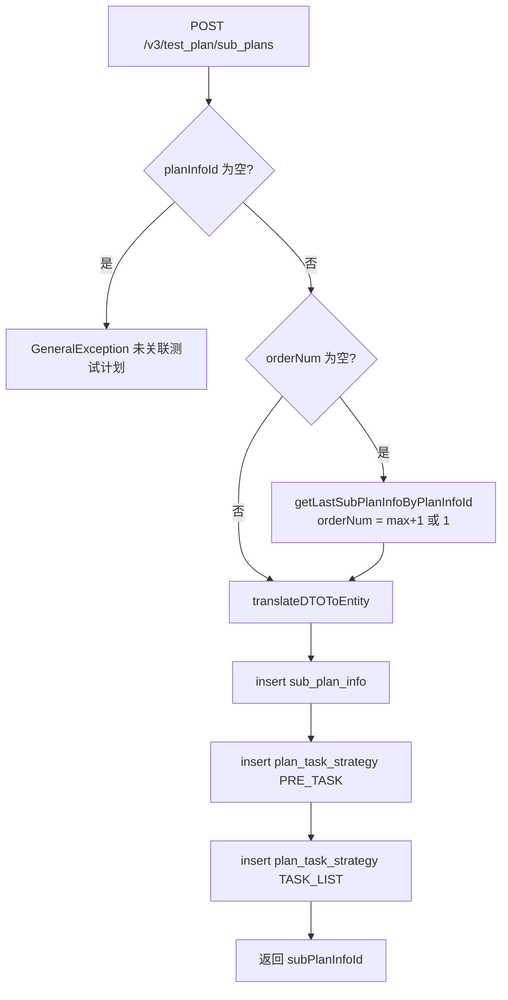
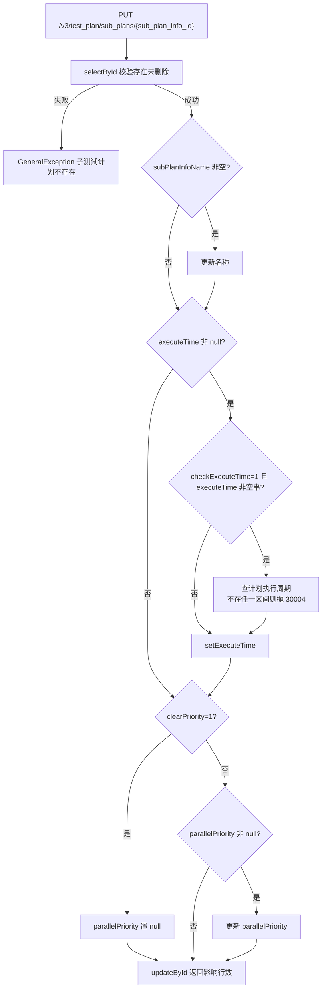
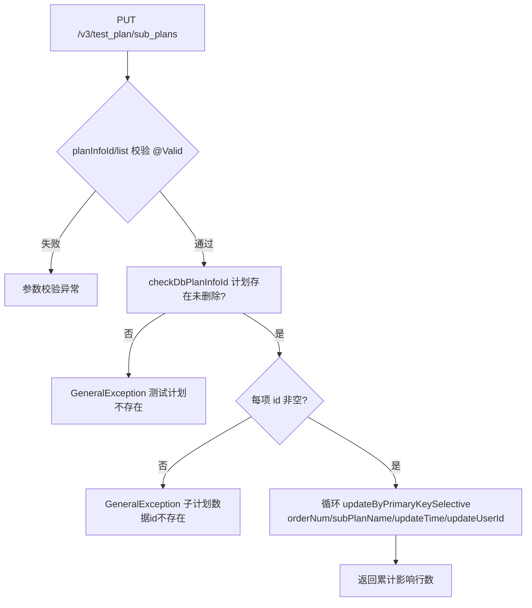
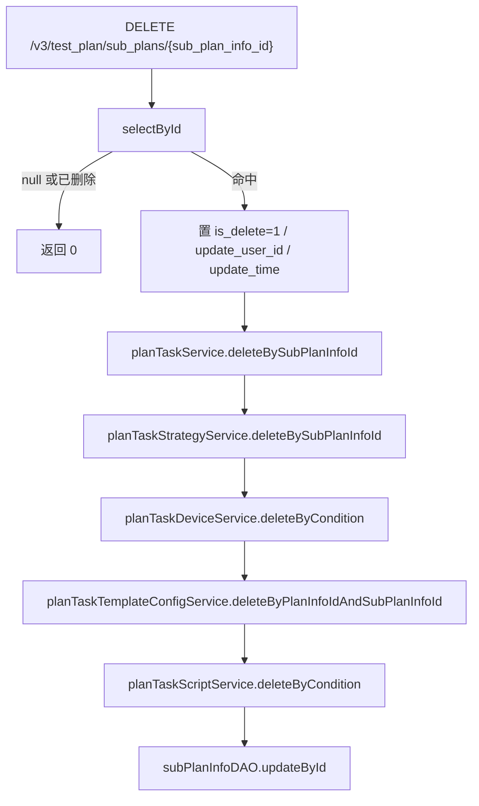
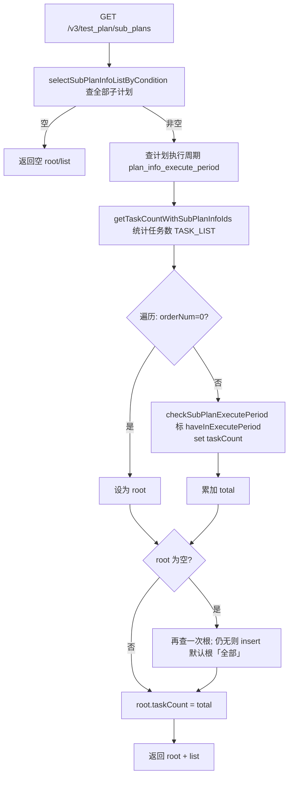
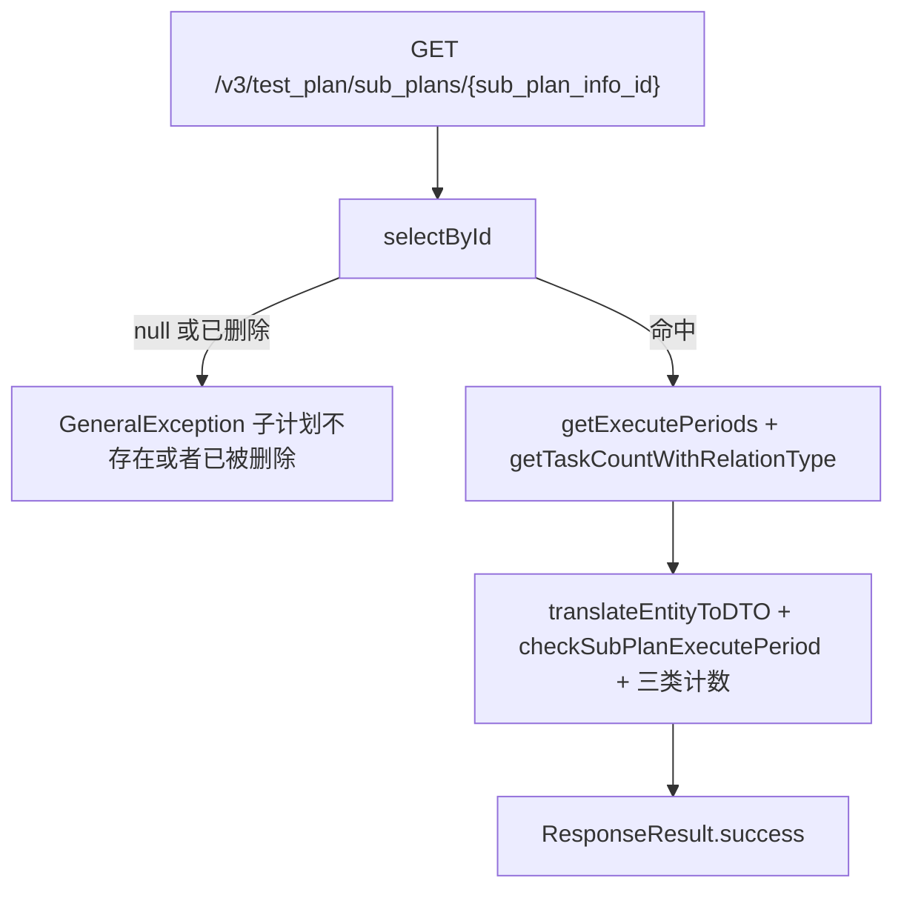

# SubPlanInfoController — 子测试计划管理

> 分支：syy.release.z7.8.1.0
> 源文件：`src/main/java/cn/testin/controller/plan/SubPlanInfoController.java`
> 类级路由：`/test_plan`
> 业务：测试计划下子计划（SubPlan）的增/改/批量改/删/查。子计划按计划内 `orderNum` 排序执行，`orderNum=0` 为根子计划（默认名「全部」）。删除为逻辑删除并级联清理任务、策略、设备、脚本、模板配置。

## 接口列表总表

| 方法 | 路径 | 方法名 | 说明 | 操作日志 |
|---|---|---|---|---|
| POST | `/v3/test_plan/sub_plans` | addSubPlanInfo | 新增子计划（默认排到末尾，并建默认前置/任务列表执行策略） | `SUB_PLAN_INFO_ADD`（测试计划下增加一个子计划） |
| PUT | `/v3/test_plan/sub_plans/{sub_plan_info_id}` | updateSubPlanInfo | 更新单个子计划（名称、执行时间、插队优先级） | `SUB_PLAN_INFO_UPDATE`（修改子计划触发执行时间） |
| PUT | `/v3/test_plan/sub_plans` | updateSubPlanInfoList | 批量更新子计划（主要是排序 orderNum，可顺带改名） | 无 |
| DELETE | `/v3/test_plan/sub_plans/{sub_plan_info_id}` | deletePlanInfo | 逻辑删除子计划并级联清理关联数据 | `SUB_PLAN_INFO_REMOVE`（测试计划下移除一个子计划） |
| GET | `/v3/test_plan/sub_plans` | selectSubPlanInfoListByCondition | 查询子计划列表（root + list，含任务数、执行周期校验标记） | 无 |
| GET | `/v3/test_plan/sub_plans/{sub_plan_info_id}` | getSubPlanInfoById | 查询单个子计划详情（含前置/任务列表/后置任务数） | 无 |

统一响应包装：`ResponseResult<T> { int code; String msg; T data }`；`BaseDataResultDTO { Long result }`。

三条操作日志的对象类型均为 TEST_PLAN、操作类型均为 UPDATE。

---

## 1. POST /v3/test_plan/sub_plans — 新增子计划

### 入口

`SubPlanInfoController.addSubPlanInfo(@RequestBody @Valid SubPlanInfoRequestDTO request)`

### 请求参数（SubPlanInfoRequestDTO，JSON Body）

| 字段 | 类型 | 必填 | 说明 |
|---|---|---|---|
| planInfoId | Long | 是 | 关联测试计划 ID，为 null 抛「未关联测试计划」 |
| subPlanInfoName | String | 否 | 子计划名称 |
| orderNum | Integer | 否 | 排序；不传则取当前计划最大 orderNum+1（无子计划时为 1） |
| executeTime | String | 否 | 子计划执行时间 |
| parallelPriority | Integer | 否 | 插队执行优先级（新增接口未使用，仅更新接口生效） |
| id / checkExecuteTime / clearPriority | - | 否 | 新增接口未使用 |

继承 `BaseRequestDTO`：`userId`（请求上下文用户，用于 create/update_user_id）。

### 响应结构

`ResponseResult<BaseDataResultDTO>`，`data.result` = 新建子计划主键 id。

```json
{ "code": 0, "msg": "success", "data": { "result": 456 } }
```

### 实现意图

在测试计划末尾追加一个子计划，并同事务创建两条默认执行策略（`plan_task_strategy`）：前置任务（PRE_TASK）与任务列表（TASK_LIST），默认策略为「失败后执行后置任务结束 + 串行执行」。

### mermaid



### 调用链

```
SubPlanInfoController.addSubPlanInfo
├─ @OperateLog(SUB_PLAN_INFO_ADD) AOP 记录操作日志
└─ SubPlanInfoServiceImpl.insertSubPlanInfoRequest   @DS(DB_PLAN) @Transactional
   ├─ ISubPlanInfoDAO.getLastSubPlanInfoByPlanInfoId → db_plan.sub_plan_info（取末位排序）
   ├─ ISubPlanInfoDAO.insert                         → db_plan.sub_plan_info
   └─ IPlanTaskStrategyService.insert × 2            → db_plan.plan_task_strategy（PRE_TASK / TASK_LIST 默认策略）
```

### 涉及表

| 表 | 操作 |
|---|---|
| db_plan.sub_plan_info | 读（取末位）/ 写（insert） |
| db_plan.plan_task_strategy | 写（insert × 2） |

### 异常

| 条件 | 异常 |
|---|---|
| planInfoId 为空 | GeneralException(paraInvalid, 未关联测试计划) |

### 关联横切

- `@OperateLog(SUB_PLAN_INFO_ADD)`：AOP 写操作日志，文案「测试计划下增加一个子计划」。
- 多数据源/事务：`@DS(Constants.DB_PLAN)` + `@Transactional(rollbackFor = Exception.class)`，子计划与默认策略同库事务。

### 代码摘录

```java
if (request.getOrderNum() == null) {
    DbSubPlanInfo dbSubPlanInfo = subPlanInfoDAO.getLastSubPlanInfoByPlanInfoId(request.getPlanInfoId());
    request.setOrderNum(dbSubPlanInfo == null ? 1 : dbSubPlanInfo.getOrderNum() + 1);
}
long subPlanInfoId = insert(request.translateDTOToEntity());
// 前置 / 任务列表 两条默认策略
dbPlanTaskStrategy.setRelationTaskType(RelationTaskTypeEnum.PRE_TASK.getType());
planTaskStrategyService.insert(dbPlanTaskStrategy);
dbPlanTaskStrategy.setId(null);
dbPlanTaskStrategy.setRelationTaskType(RelationTaskTypeEnum.TASK_LIST.getType());
planTaskStrategyService.insert(dbPlanTaskStrategy);
```

---

## 2. PUT /v3/test_plan/sub_plans/{sub_plan_info_id} — 更新单个子计划

### 入口

`SubPlanInfoController.updateSubPlanInfo(@PathVariable("sub_plan_info_id") Long subPlanInfoId, @RequestBody @Valid SubPlanInfoRequestDTO request)`

### 请求参数

| 字段 | 来源 | 必填 | 说明 |
|---|---|---|---|
| sub_plan_info_id | Path | 是 | 子计划主键；不存在或已删除抛「子测试计划不存在」 |
| subPlanInfoName | Body | 否 | 非空才更新名称 |
| executeTime | Body | 否 | 非 null 才更新执行时间；空串表示置空 |
| checkExecuteTime | Body | 否 | =1 且 executeTime 非空串时，校验执行时间必须落在计划执行周期内 |
| parallelPriority | Body | 否 | 插队执行优先级 |
| clearPriority | Body | 否 | =1 时将 parallelPriority 置空（优先于 parallelPriority 赋值） |
| userId | Body 基类 | 否 | 更新人 |

### 响应结构

`ResponseResult<BaseDataResultDTO>`，`data.result` = update 影响行数（0/1）。

### 实现意图

按主键选择性更新子计划名称、执行时间、插队优先级。当 `checkExecuteTime=1` 时，用计划维度的执行周期（`plan_info_execute_period`）校验 `executeTime` 必须落在任一周期区间内，否则报错并提示全部合法周期。

### mermaid



### 调用链

```
SubPlanInfoController.updateSubPlanInfo
├─ @OperateLog(SUB_PLAN_INFO_UPDATE) AOP 记录操作日志
└─ SubPlanInfoServiceImpl.updateSubPlanInfoRequest
   ├─ ISubPlanInfoDAO.selectById                        → sub_plan_info（存在性）
   ├─ IPlanInfoExecutePeriodService.getExecutePeriods   → plan_info_execute_period（周期校验，checkExecuteTime=1 时）
   └─ ISubPlanInfoDAO.updateById                        → sub_plan_info
```

### 涉及表

| 表 | 操作 |
|---|---|
| db_plan.sub_plan_info | 读 / 写 |
| db_plan.plan_info_execute_period | 读（周期校验） |

### 异常

| 条件 | 异常 |
|---|---|
| 子计划不存在或已删除 | GeneralException(noneData, 子测试计划不存在) |
| checkExecuteTime=1 且执行时间不在周期内 | GeneralException(30004, 不满足测试计划指定执行时间周期：{周期列表}，将不触发子计划中任务执行) |

### 关联横切

- `@OperateLog(SUB_PLAN_INFO_UPDATE)`：AOP 写操作日志，文案「修改子计划触发执行时间」。
- 注意：该方法未加 `@DS`/`@Transactional`，依赖默认数据源；`updateById` 按实体全字段更新（MyBatis-Plus 默认忽略 null 字段）。

### 代码摘录

```java
if (request.getClearPriority() != null && request.getClearPriority().equals(1)) {
    dbSubPlanInfo.setParallelPriority(null);
} else if (request.getParallelPriority() != null) {
    dbSubPlanInfo.setParallelPriority(request.getParallelPriority());
}
```

---

## 3. PUT /v3/test_plan/sub_plans — 批量更新子计划（排序）

### 入口

`SubPlanInfoController.updateSubPlanInfoList(@RequestBody @Valid SubPlanInfoListRequestDTO request)`

### 请求参数（SubPlanInfoListRequestDTO，JSON Body）

| 字段 | 类型 | 必填 | 说明 |
|---|---|---|---|
| planInfoId | Long | 是 | 关联测试计划 ID，`@NotNull`；计划不存在抛「测试计划不存在」 |
| list | List\<SubPlanInfoRequestDTO\> | 是 | `@NotEmpty`；每项 `id` 必填（null 抛「子计划数据id不存在」），`orderNum`/`subPlanInfoName` 非空才更新 |
| userId | 基类 | 否 | 更新人 |

### 响应结构

`ResponseResult<BaseDataResultDTO>`，`data.result` = 全部子项 update 影响行数累加值。

### 实现意图

拖拽排序场景：校验计划存在、列表各子计划 id 齐全后，逐条 selective 更新 orderNum（及可选名称），整体一个事务。

### mermaid



### 调用链

```
SubPlanInfoController.updateSubPlanInfoList
└─ SubPlanInfoServiceImpl.updateSubPlanInfoListRequest   @DS(DB_PLAN) @Transactional
   ├─ IPlanInfoDAO.selectById                        → plan_info（存在性）
   └─ ISubPlanInfoDAO.updateByPrimaryKeySelective ×N → sub_plan_info
```

### 涉及表

| 表 | 操作 |
|---|---|
| db_plan.plan_info | 读（存在性校验） |
| db_plan.sub_plan_info | 写（selective update × N） |

### 异常

| 条件 | 异常 |
|---|---|
| planInfoId 为空 / list 为空 | Bean Validation（关联测试计划不能为空 / 更新子计划信息列表不能为空） |
| 计划不存在或已删除 | GeneralException(noneData, 测试计划不存在) |
| 列表中某项 id 为 null | GeneralException(paraInvalid, 子计划数据id不存在) |

### 关联横切

- 无操作日志。
- 多数据源/事务：`@DS(Constants.DB_PLAN)` + `@Transactional`，任一条失败整体回滚。

---

## 4. DELETE /v3/test_plan/sub_plans/{sub_plan_info_id} — 删除子计划

### 入口

`SubPlanInfoController.deletePlanInfo(@PathVariable("sub_plan_info_id") Long subPlanInfoId, @RequestParam("user_id") Integer userId)`

### 请求参数

| 字段 | 来源 | 必填 | 说明 |
|---|---|---|---|
| sub_plan_info_id | Path | 是 | 子计划主键；不存在或已删除直接返回 0（幂等） |
| user_id | Query | 是 | 操作人，写入 update_user_id |

### 响应结构

`ResponseResult<BaseDataResultDTO>`，`data.result` = update 影响行数（0/1）。

### 实现意图

逻辑删除子计划（`is_delete=1`），并同事务级联清理该子计划下的：任务（plan_task）、执行策略（plan_task_strategy）、设备（plan_task_device）、模板配置（plan_task_template_config）、脚本（plan_task_script）。

### mermaid



### 调用链

```
SubPlanInfoController.deletePlanInfo
├─ @OperateLog(SUB_PLAN_INFO_REMOVE) AOP 记录操作日志
└─ SubPlanInfoServiceImpl.deleteSubPlanInfo   @DS(DB_PLAN) @Transactional
   ├─ ISubPlanInfoDAO.selectById / updateById                       → sub_plan_info（软删）
   ├─ IPlanTaskService.deleteBySubPlanInfoId                        → plan_task（级联）
   ├─ IPlanTaskStrategyService.deleteBySubPlanInfoId                → plan_task_strategy（级联）
   ├─ IPlanTaskDeviceService.deleteByCondition                      → plan_task_device（级联）
   ├─ IPlanTaskTemplateConfigService.deleteByPlanInfoIdAndSubPlanInfoId → plan_task_template_config（级联）
   └─ IPlanTaskScriptService.deleteByCondition                      → plan_task_script（级联）
```

### 涉及表

| 表 | 操作 |
|---|---|
| db_plan.sub_plan_info | 读 / 写（软删） |
| db_plan.plan_task / plan_task_strategy / plan_task_device / plan_task_template_config / plan_task_script | 级联删除 |

### 异常

无显式抛错；记录不存在返回 `result=0`（幂等早退）。

### 关联横切

- `@OperateLog(SUB_PLAN_INFO_REMOVE)`：AOP 写操作日志，文案「测试计划下移除一个子计划」。
- 级联清理与子计划软删同事务，任一级联失败整体回滚。

---

## 5. GET /v3/test_plan/sub_plans — 查询子计划列表

### 入口

`SubPlanInfoController.selectSubPlanInfoListByCondition(@RequestParam("plan_info_id") Long planInfoId, @RequestParam(value = "sub_plan_name", required = false) String subPlanName)`

### 请求参数

| 字段 | 来源 | 必填 | 说明 |
|---|---|---|---|
| plan_info_id | Query | 是 | 测试计划 ID |
| sub_plan_name | Query | 否 | 子计划名称模糊过滤 |

### 响应结构

`ResponseResult<SubPlanInfoListResponseDTO>`：

| 字段 | 类型 | 说明 |
|---|---|---|
| root | SubPlanInfoResponseDTO | 根子计划（orderNum=0，默认名「全部」）；taskCount = 全部子计划任务数合计 |
| list | List\<SubPlanInfoResponseDTO\> | 普通子计划列表（按 orderNum 排序），每项含 taskCount（仅任务列表类型） |

`SubPlanInfoResponseDTO` 字段：id、planInfoId、subPlanName、orderNum、executeTime、parallelPriority（DB 为 null 时回填默认值 1）、taskCount、preTaskCount、postTaskCount、createUserId、updateUserId、createTime、updateTime（均为毫秒时间戳）、haveInExecutePeriod（1/0，executeTime 是否在计划执行周期内）、executePeriodInfo（周期区间拼接串，如 `t1-t2,t3-t4`）、executeStartTime（本接口不填）。

### 实现意图

按计划查询子计划树形结构（根 + 列表）。普通子计划逐个标注 executeTime 是否落在计划执行周期内并附周期说明串；统计各子计划任务数。若根子计划不存在则兜底自动创建一条（orderNum=0，名「全部」）。

### mermaid



### 调用链

```
SubPlanInfoController.selectSubPlanInfoListByCondition
└─ SubPlanInfoServiceImpl.selectSubPlanInfoListByCondition
   ├─ ISubPlanInfoDAO.selectSubPlanInfoListByCondition     → sub_plan_info（×2：全量 + 根兜底查询）
   ├─ IPlanInfoExecutePeriodService.getExecutePeriods      → plan_info_execute_period
   ├─ IPlanTaskService.getTaskCountWithSubPlanInfoIds      → plan_task（按子计划分组计数）
   └─ ISubPlanInfoDAO.insert                               → sub_plan_info（根缺失时自动补建）
```

### 涉及表

| 表 | 操作 |
|---|---|
| db_plan.sub_plan_info | 读 / 写（根子计划兜底 insert） |
| db_plan.plan_info_execute_period | 读 |
| db_plan.plan_task | 读（分组计数） |

### 异常

无显式抛错。

### 关联横切

- 注意：此查询接口存在写副作用——根子计划缺失时会自动 insert 一条默认根。
- 响应中 preTaskCount/postTaskCount 仅在详情接口填充，列表接口恒为 null。

---

## 6. GET /v3/test_plan/sub_plans/{sub_plan_info_id} — 查询子计划详情

### 入口

`SubPlanInfoController.getSubPlanInfoById(@PathVariable("sub_plan_info_id") Long subPlanInfoId)`

### 请求参数

| 字段 | 来源 | 必填 | 说明 |
|---|---|---|---|
| sub_plan_info_id | Path | 是 | 子计划主键 |

### 响应结构

`ResponseResult<SubPlanInfoResponseDTO>`（字段同第 5 节），其中：

- taskCount = 任务列表（TASK_LIST）任务数
- preTaskCount = 前置任务（PRE_TASK）数
- postTaskCount = 后置任务（POST_TASK）数
- haveInExecutePeriod / executePeriodInfo：executeTime 非空且计划配置了执行周期时填充

### 实现意图

按主键查单条子计划，补充三类任务计数与执行周期合法性标注；不存在或已逻辑删除视为「子计划不存在或者已被删除」。

### mermaid



### 调用链

```
SubPlanInfoController.getSubPlanInfoById
└─ SubPlanInfoServiceImpl.getSubPlanInfoById
   ├─ ISubPlanInfoDAO.selectById                       → sub_plan_info
   ├─ IPlanInfoExecutePeriodService.getExecutePeriods  → plan_info_execute_period
   └─ IPlanTaskService.getTaskCountWithRelationType    → plan_task（按 PRE_TASK/TASK_LIST/POST_TASK 分组计数）
```

### 涉及表

| 表 | 操作 |
|---|---|
| db_plan.sub_plan_info | 读 |
| db_plan.plan_info_execute_period | 读 |
| db_plan.plan_task | 读（分组计数） |

### 异常

| 条件 | 异常 |
|---|---|
| 记录不存在或 is_delete=1 | GeneralException(paraInvalid, 子计划不存在或者已被删除) |

### 关联横切

- 无操作日志、无事务，纯查询。

---

## 备注：非 Controller 暴露的相关服务能力

`ISubPlanInfoService` 另有被内部复用的方法（不对应 HTTP 端点）：

- `deleteByPlanInfoId(planInfoId, userId)`：计划删除时级联软删其下全部子计划（LambdaUpdateWrapper 批量置 is_delete）。
- `selectById(subPlanInfoId)` / `selectSubPlanBaseInfoListByCondition(condition)`：执行链路按条件查询子计划基础信息（含 `needPreAndPostCount` 控制是否统计前置/后置任务数）。

相关文档：[00-分支索引](00-分支索引.md) · [PlanInfoScheduledController](PlanInfoScheduledController.md) · [PlanInfoConfigController](PlanInfoConfigController.md) · [PlanInfoExecutePeriodController](PlanInfoExecutePeriodController.md)
