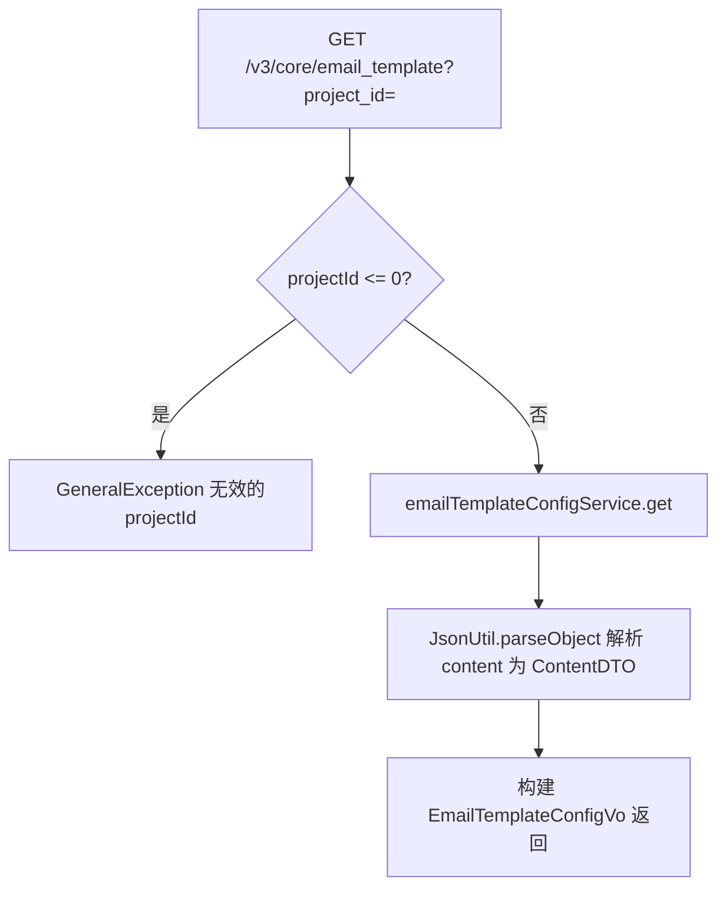
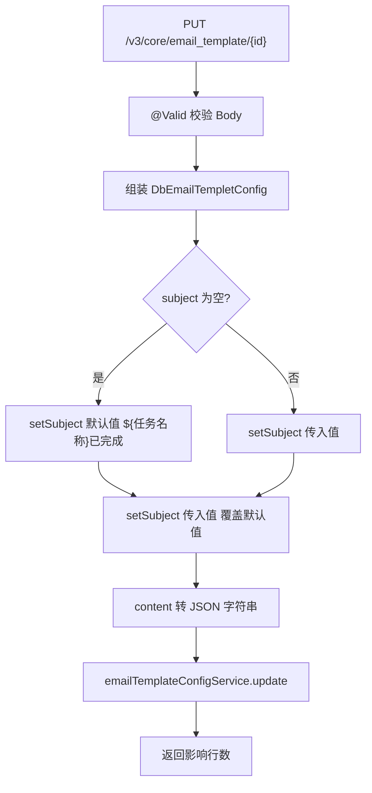

# EmailTemplateCfgController — 邮件模板配置

> 分支：syy.release.z7.8.1.0
> 源文件：`src/main/java/cn/testin/controller/EmailTemplateCfgController.java`
> 类级路由：`/core`
> 业务：项目维度的邮件模板（主题 + 内容）查询与更新。模板内容包括 ${任务名称} 等变量占位符，发信时由 sendEmail 链路替换为实际值。当前仅暴露 get/update 两个端点，新增走 ApiServlet 的 `EmailTempletCfg`。

## 接口列表总表

| 方法 | 路径 | 方法名 | 说明 | 操作日志 |
|---|---|---|---|---|
| GET | `/v3/core/email_template` | getEmailTemplate | 按 project_id 查询邮件模板 | 无 |
| PUT | `/v3/core/email_template/{id}` | updateEmailTemplate | 按主键更新邮件模板 | 无 |

统一响应包装：`ResponseResult<T>`；`BaseDataResultDTO { Long result }`。

---

## 1. GET /v3/core/email_template — 查询邮件模板

### 入口

`EmailTemplateCfgController.getEmailTemplate(@RequestParam("project_id") int projectId)`

### 请求参数

| 字段 | 来源 | 必填 | 说明 |
|---|---|---|---|
| project_id | Query | 是 | 项目 ID，必须 > 0 |

### 响应结构

`ResponseResult<EmailTemplateConfigVo>`：

| 字段 | 类型 | 说明 |
|---|---|---|
| id | Long | 模板主键 |
| projectId | Integer | 项目 ID |
| subject | String | 邮件主题（如 `${任务名称}已完成`） |
| content | ContentDTO | 邮件内容对象（由 `content` JSON 解析） |
| content.cancel | Integer | 测试详情（@NotNull） |
| content.noPass | Integer | 通过脚本（@NotNull） |
| content.overview | Integer | 未通过脚本（@NotNull） |
| content.pass | Integer | 取消脚本（@NotNull） |
| content.timeout | Integer | 超时脚本（@NotNull） |
| content.skip | Integer | 跳过脚本（@NotNull） |

> 注：ContentDTO 字段注释与字段名存在错位（如 `cancel` 注释为"测试详情"、`pass` 注释为"取消脚本"），上表说明以代码注释为准，实际语义需结合业务确认。

### 实现意图

按项目 ID 查询 `DbEmailTempletConfig`，将 content 字段从 JSON 字符串解析为 `ContentDTO` 对象后返回，保证前端字段结构一致。

### mermaid



### 调用链

```
EmailTemplateCfgController.getEmailTemplate
└─ IEmailTempletConfigService.get(templateConfig)
   └─ db_notice.email_templet_config（读）
```

### 涉及表

| 表 | 操作 |
|---|---|
| db_notice.email_templet_config | 读 |

### 异常

| 条件 | 异常 |
|---|---|
| projectId <= 0 | GeneralException(paraInvalid, 无效的projectId) |

### 关联横切

- 纯查询，无操作日志、无事务注解。

### 代码摘录

```java
DbEmailTempletConfig templateConfig = new DbEmailTempletConfig();
templateConfig.setProjectId(projectId);
templateConfig = emailTemplateConfigService.get(templateConfig);
ContentDTO contentDTO = JsonUtil.parseObject(templateConfig.getContent(), ContentDTO.class);
EmailTemplateConfigVo result = EmailTemplateConfigVo.builder()
    .id(templateConfig.getId()).subject(templateConfig.getSubject())
    .content(contentDTO).projectId(templateConfig.getProjectId()).build();
```

---

## 2. PUT /v3/core/email_template/{id} — 更新邮件模板

### 入口

`EmailTemplateCfgController.updateEmailTemplate(@PathVariable("id") Long id, @RequestBody @Valid EmailTemplateRequestDTO request)`

### 请求参数（EmailTemplateRequestDTO，JSON Body）

| 字段 | 来源 | 必填 | 说明 |
|---|---|---|---|
| id | Path | 是 | 模板主键 |
| content | Body | 是 | 邮件内容对象（ContentDTO，@NotNull），最终转 JSON 字符串存储 |
| content.cancel | Body | 是 | 测试详情（Integer，@NotNull） |
| content.noPass | Body | 是 | 通过脚本（Integer，@NotNull） |
| content.overview | Body | 是 | 未通过脚本（Integer，@NotNull） |
| content.pass | Body | 是 | 取消脚本（Integer，@NotNull） |
| content.timeout | Body | 是 | 超时脚本（Integer，@NotNull） |
| content.skip | Body | 是 | 跳过脚本（Integer，@NotNull） |
| subject | Body | 否 | 邮件主题；为空时默认设为 `${任务名称}已完成` |
| projectId | Body | 否 | 项目 ID（继承 BaseRequestDTO，无校验注解） |
| eid | Body | 否 | 企业 ID（继承 BaseRequestDTO） |
| userId | Body | 否 | 用户 ID（继承 BaseRequestDTO） |
| userName | Body | 否 | 用户名（继承 BaseRequestDTO） |

### 响应结构

`ResponseResult<BaseDataResultDTO>`，`data.result` = update 影响行数。

### 实现意图

按主键更新邮件模板：content 对象序列化为 JSON 字符串存储，subject 为空时兜底默认值。

注意：代码中设定默认值后**又被下一行无条件覆盖**（先 `if` 设默认值，再 `templateConfig.setSubject(...)` 无论是否为空均写入），可能是历史遗留的 bug —— 空主题的兜底逻辑不生效。

### mermaid



### 调用链

```
EmailTemplateCfgController.updateEmailTemplate
└─ IEmailTempletConfigService.update(templateConfig)
   └─ db_notice.email_templet_config（写）
```

### 涉及表

| 表 | 操作 |
|---|---|
| db_notice.email_templet_config | 写（update） |

### 异常

| 条件 | 异常 |
|---|---|
| @Valid 校验失败 | 参数校验异常 |

### 关联横切

- 无操作日志、无事务注解。
- 注意代码缺陷：`if(subject 为空) setSubject(默认值)` 后紧跟 `setSubject(request.getSubject())`，默认值逻辑无法生效；如需启用兜底应删除无条件 set 行或将无条件 set 放入 else 分支。

### 代码摘录

```java
if (StringUtils.isEmpty(emailTemplateRequestDTO.getSubject())) {
    templateConfig.setSubject("${任务名称}已完成");
}
templateConfig.setSubject(emailTemplateRequestDTO.getSubject()); // 此行覆盖上方默认值
```

---

相关文档：[00-分支索引](00-分支索引.md) · [service-EmailTempletCfg](service-EmailTempletCfg.md) · [EmailNoticeController](../测试计划/EmailNoticeController.md)
