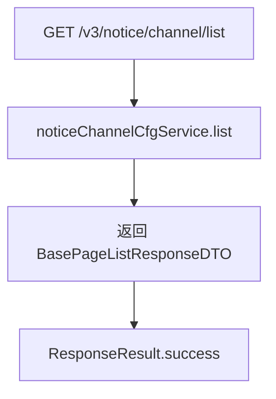
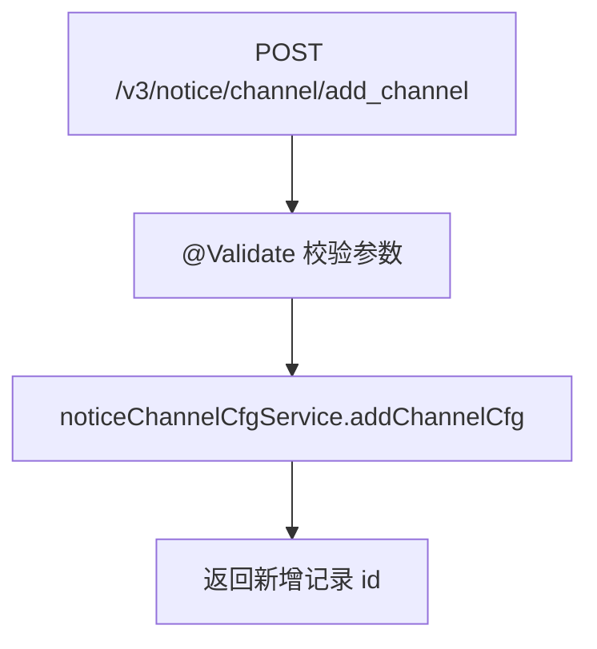
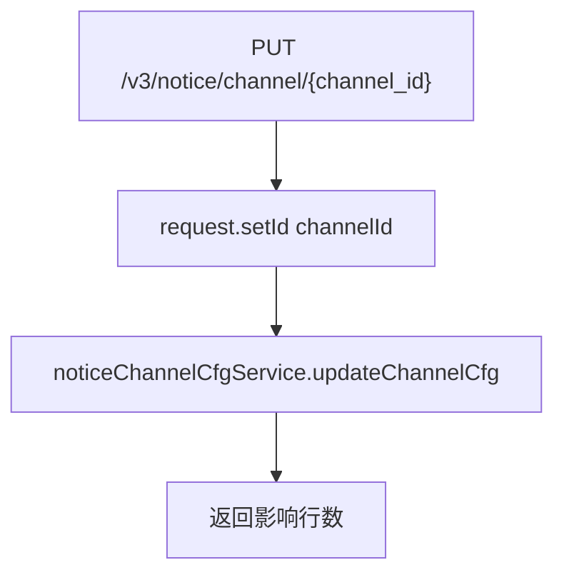
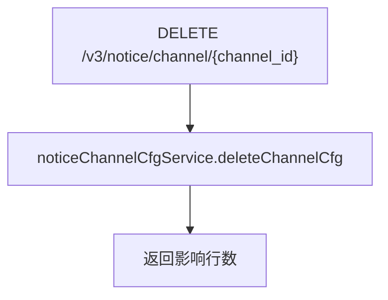

# NoticeChannelCfgController — 通知渠道配置

> 分支：syy.release.z7.8.1.0
> 源文件：`src/main/java/cn/testin/controller/v3/notice/NoticeChannelCfgController.java`
> 类级路由：`/notice`
> 业务：通知渠道配置的增删改查。渠道是消息发送的载体（邮件/短信/HTTP等），此处管理渠道基本信息（名称、描述、配置等），不包含具体通道类型参数。

## 接口列表总表

| 方法 | 路径 | 方法名 | 说明 | 操作日志 |
|---|---|---|---|---|
| GET | `/v3/notice/channel/list` | list | 分页查询渠道列表 | 无 |
| POST | `/v3/notice/channel/add_channel` | addChannel | 新增渠道配置 | 无 |
| PUT | `/v3/notice/channel/{channel_id}` | updateChannel | 按主键更新渠道配置 | 无 |
| DELETE | `/v3/notice/channel/{channel_id}` | deleteChannel | 按主键删除渠道配置 | 无 |

统一响应包装：`ResponseResult<T> { int code; String msg; T data }`；`BaseDataResultDTO { Long result }`；分页响应 `BasePageListResponseDTO<ChannelCfgResponseDTO>`。

---

## 1. GET /v3/notice/channel/list — 分页查询渠道列表

### 入口

`NoticeChannelCfgController.list(@RequestParam("project_id") Integer projectId, @RequestParam("page") Integer page, @RequestParam("page_size") Integer pageSize)`

### 请求参数

| 字段 | 来源 | 必填 | 说明 |
|---|---|---|---|
| project_id | Query | 是 | 项目 ID |
| page | Query | 是 | 页码 |
| page_size | Query | 是 | 每页条数 |

### 响应结构

`ResponseResult<BasePageListResponseDTO<ChannelCfgResponseDTO>>`，分页内 `list` 为 `List<ChannelCfgResponseDTO>`。

### 返回参数（ChannelCfgResponseDTO 元素结构）

| 字段 | 类型 | 说明 |
|---|---|---|
| id | Integer | 渠道主键 |
| type | Integer | 渠道类型（2 钉钉 webHook / 3 joyChat） |
| createTime | Long | 创建时间 |
| descr | String | 描述信息 |
| config | ChannelConfig | 配置信息（由 `config` 字段 JSON 解析） |
| config.webHookUrl | String | 第三方调用地址 |
| config.secret | String | 密钥 |
| config.passRateConfig | Integer | 通过率 |
| channelName | String | 渠道名称 |

### 实现意图

按项目 ID 分页查询该项目的渠道配置列表；直接委托 service 层返回分页结果。

### mermaid



### 调用链

```
NoticeChannelCfgController.list
└─ INoticeChannelCfgService.list(projectId, page, pageSize)
```

### 涉及表

渠道配置相关表（db_notice 库，具体表名由 INoticeChannelCfgService 实现决定）。

### 异常

无显式业务异常。

### 关联横切

- 纯查询，无操作日志、无事务注解。

---

## 2. POST /v3/notice/channel/add_channel — 新增渠道配置

### 入口

`NoticeChannelCfgController.addChannel(@RequestBody @Validate NoticeChannelCfgRequestDTO request)`

### 请求参数（NoticeChannelCfgRequestDTO，JSON Body）

| 字段 | 类型 | 必填 | 说明 |
|---|---|---|---|
| channelName | String | 是 | 通知渠道名称（@NotNull） |
| type | Integer | 是 | 渠道类型（@NotNull） |
| webHookUrl | String | 是 | 第三方机器人地址（@NotNull，且 `verifyChannel` 中 `isBlank` 校验） |
| id | Integer | 否 | 渠道主键（更新时由路径注入，新增不传） |
| secret | String | 否 | 密钥 |
| descr | String | 否 | 描述信息 |
| projectId | Integer | 否 | 关联项目（继承 BaseRequestDTO） |
| eid | Integer | 否 | 企业 ID（继承 BaseRequestDTO） |
| userId | Integer | 否 | 用户 ID（继承 BaseRequestDTO） |
| userName | String | 否 | 用户名（继承 BaseRequestDTO） |

> 注：controller 使用的 `@Validate` 为 `org.simpleframework.xml.core.Validate`（XML 序列化注解），并非标准 Bean Validation 的 `@Valid`/`@Validated`，`@NotNull` 实际是否被框架强制校验以运行配置为准；service 层 `verifyChannel` 对 `webHookUrl` 的 `isBlank` 校验保证其必填。

### 响应结构

`ResponseResult<BaseDataResultDTO>`，`data.result` = 新增记录的主键 id。

```json
{ "code": 0, "msg": "success", "data": { "result": 12 } }
```

### 实现意图

将前端传入的渠道配置写入数据库，返回新记录的 id。

### mermaid



### 调用链

```
NoticeChannelCfgController.addChannel
└─ INoticeChannelCfgService.addChannelCfg(requestDTO)
```

### 涉及表

| 表 | 操作 |
|---|---|
| db_notice 渠道配置表 | 写（insert） |

### 异常

| 条件 | 异常 |
|---|---|
| @Validate 校验失败 | 参数校验异常（统一异常处理） |

### 关联横切

- 无操作日志、无事务注解。

---

## 3. PUT /v3/notice/channel/{channel_id} — 更新渠道配置

### 入口

`NoticeChannelCfgController.updateChannel(@PathVariable("channel_id") Integer channelId, @RequestBody @Validate NoticeChannelCfgRequestDTO request)`

### 请求参数

| 字段 | 来源 | 必填 | 说明 |
|---|---|---|---|
| channel_id | Path | 是 | 渠道配置主键 |
| （同新增 DTO 字段） | Body | 是 | 渠道配置的完整更新数据 |

### 响应结构

`ResponseResult<BaseDataResultDTO>`，`data.result` = update 影响行数。

### 实现意图

按主键覆盖更新渠道信息；controller 将路径上的 channelId 注入 DTO 后委托 service。

### mermaid



### 调用链

```
NoticeChannelCfgController.updateChannel
├─ requestDTO.setId(channelId)
└─ INoticeChannelCfgService.updateChannelCfg(requestDTO)
```

### 涉及表

| 表 | 操作 |
|---|---|
| db_notice 渠道配置表 | 写（update） |

### 异常

| 条件 | 异常 |
|---|---|
| @Validate 校验失败 | 参数校验异常 |

### 关联横切

- 无操作日志、无事务注解。注意：不校验记录是否存在，不存在时 service 层可能静默返回 0。

---

## 4. DELETE /v3/notice/channel/{channel_id} — 删除渠道配置

### 入口

`NoticeChannelCfgController.deleteChannel(@PathVariable("channel_id") Integer channelId)`

### 请求参数

| 字段 | 来源 | 必填 | 说明 |
|---|---|---|---|
| channel_id | Path | 是 | 渠道配置主键 |

### 响应结构

`ResponseResult<BaseDataResultDTO>`，`data.result` = 删除影响行数。

### 实现意图

按主键删除渠道配置。

### mermaid



### 调用链

```
NoticeChannelCfgController.deleteChannel
└─ INoticeChannelCfgService.deleteChannelCfg(channelId)
```

### 涉及表

| 表 | 操作 |
|---|---|
| db_notice 渠道配置表 | 写（delete） |

### 异常

无显式业务异常。

### 关联横切

- 无操作日志、无事务注解。

---

相关文档：[00-分支索引](00-分支索引.md) · [NoticeEventController](NoticeEventController.md) · [NoticeLogController](NoticeLogController.md)
