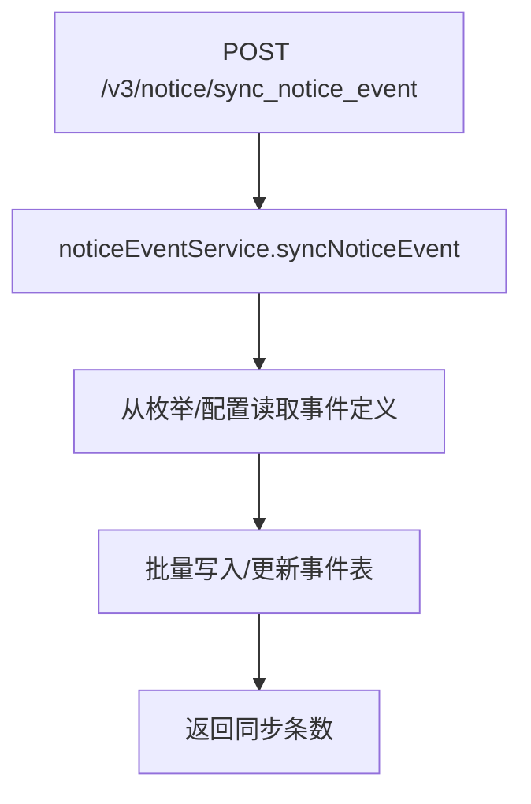
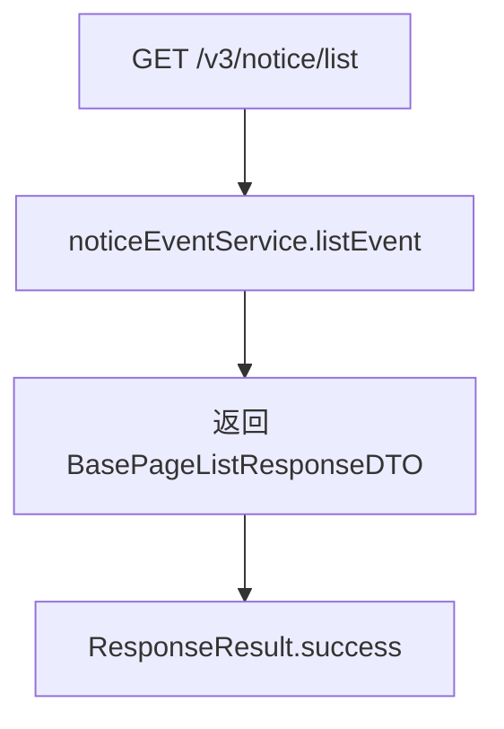
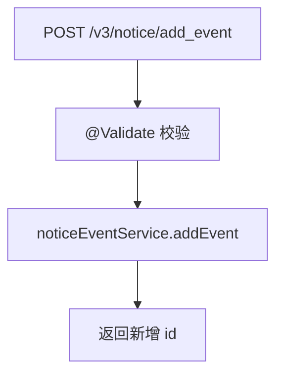
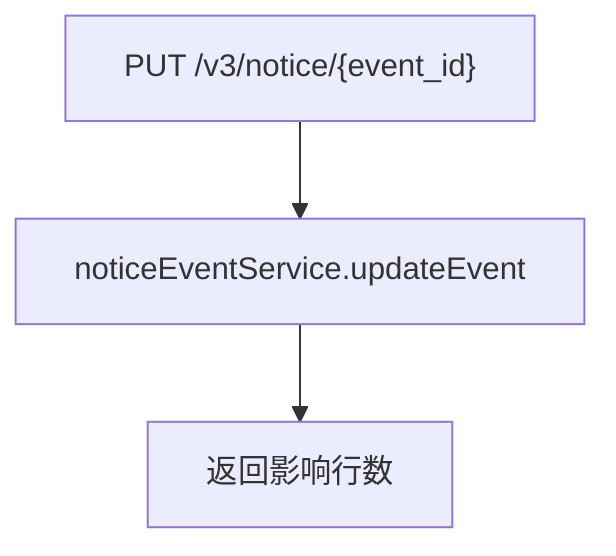
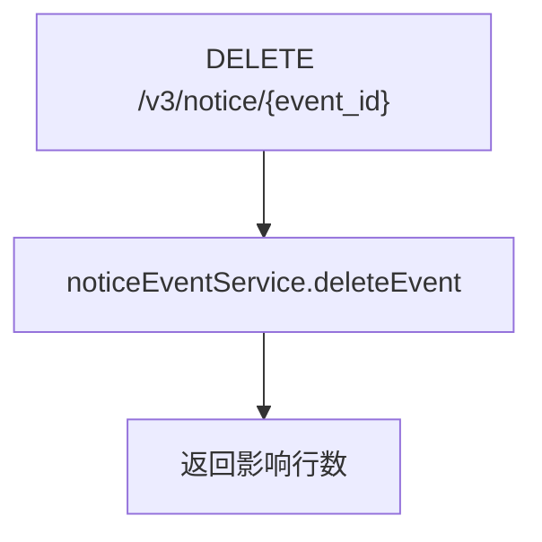

# NoticeEventController — 通知事件管理

> 分支：syy.release.z7.8.1.0
> 源文件：`src/main/java/cn/testin/controller/v3/notice/NoticeEventController.java`
> 类级路由：`/notice`
> 业务：通知事件（触发通知的业务场景定义）的增删改查与同步。事件类型决定了什么情况下触发通知；与渠道配置配合完成「什么条件→通过哪个通道→发给谁」的通知策略。

## 接口列表总表

| 方法 | 路径 | 方法名 | 说明 | 操作日志 |
|---|---|---|---|---|
| POST | `/v3/notice/notice/sync_notice_event` | syncNoticeEvent | 同步通知事件（从枚举或配置源刷新事件列表） | 无 |
| GET | `/v3/notice/notice/list` | listEvent | 分页查询通知事件列表（可按 eventType 筛选） | 无 |
| POST | `/v3/notice/notice/add_event` | addEvent | 新增通知事件 | 无 |
| PUT | `/v3/notice/notice/{event_id}` | updateEvent | 按主键更新通知事件 | 无 |
| DELETE | `/v3/notice/notice/{event_id}` | deleteEvent | 按主键删除通知事件 | 无 |

统一响应包装：`ResponseResult<T>`；`BaseDataResultDTO { Long result }`；分页响应 `BasePageListResponseDTO<NoticeEventResponseDTO>`。

---

## 1. POST /v3/notice/notice/sync_notice_event — 同步通知事件

### 入口

`NoticeEventController.syncNoticeEvent()`

### 请求参数

无请求参数。

### 响应结构

`ResponseResult<BaseDataResultDTO>`，`data.result` = 同步操作结果（如写入条数）。

### 实现意图

从事件枚举或预定义配置源同步通知事件到数据库，确保事件表与代码定义保持一致。通常用于系统初始化或事件枚举变更后手动触发刷新。

### mermaid



### 调用链

```
NoticeEventController.syncNoticeEvent
└─ INoticeEventService.syncNoticeEvent
```

### 涉及表

| 表 | 操作 |
|---|---|
| db_notice 通知事件表 | 写（同步 upsert） |

### 异常

无显式参数校验异常；service 层可能抛出 GeneralException。

### 关联横切

- 无操作日志、无事务注解。
- 幂等性取决于 service 实现（通常以事件类型/编码为唯一键做 upsert）。

---

## 2. GET /v3/notice/notice/list — 通知事件列表

### 入口

`NoticeEventController.listEvent(@RequestParam(value = "page", required = false) Integer page, @RequestParam(value = "page_size", required = false) Integer pageSize, @RequestParam("project_id") Integer projectId, @RequestParam(value = "event_type", required = false) Integer eventType)`

### 请求参数

| 字段 | 来源 | 必填 | 说明 |
|---|---|---|---|
| project_id | Query | 是 | 项目 ID |
| page | Query | 否 | 页码，不传由 service 默认 |
| page_size | Query | 否 | 每页条数 |
| event_type | Query | 否 | 事件类型筛选，不传查全部 |

### 响应结构

`ResponseResult<BasePageListResponseDTO<NoticeEventResponseDTO>>`，分页内 `list` 为 `List<NoticeEventResponseDTO>`。

### 返回参数（NoticeEventResponseDTO 元素结构）

| 字段 | 类型 | 说明 |
|---|---|---|
| id | Long | 事件主键 |
| eventType | Integer | 事件类型（NoticeEventEnum） |
| projectId | Integer | 项目 ID |
| minRule | Integer | 发送规则最小值 |
| maxRule | Integer | 发送规则最大值 |
| channelCfg | List\<ChannelCfgDTO\> | 关联渠道信息 |
| channelCfg[].id | Integer | 渠道主键 |
| channelCfg[].channelName | String | 渠道名称 |
| channelCfg[].defaultTemplateId | Integer | 默认模板 ID |
| channelCfg[].type | Integer | 渠道类型 |

### 实现意图

分页查询某项目下的通知事件列表，可按 eventType 过滤。

### mermaid



### 调用链

```
NoticeEventController.listEvent
└─ INoticeEventService.listEvent(page, pageSize, projectId, eventType)
```

### 涉及表

| 表 | 操作 |
|---|---|
| db_notice 通知事件表 | 读 |

### 异常

| 条件 | 异常 |
|---|---|
| service 层内部校验失败 | GeneralException |

### 关联横切

- 纯查询，无操作日志、无事务。

---

## 3. POST /v3/notice/notice/add_event — 新增事件

### 入口

`NoticeEventController.addEvent(@RequestBody @Validate NoticeEventRequestDTO request)`

### 请求参数（NoticeEventRequestDTO，JSON Body）

| 字段 | 类型 | 必填 | 说明 |
|---|---|---|---|
| eventType | Integer | 是 | 事件类型编码（@NotNull） |
| minRule | Integer | 是 | 触发规则最小值（@NotNull） |
| maxRule | Integer | 是 | 触发规则最大值（@NotNull） |
| channelCfgId | List\<Integer\> | 否 | 通知渠道 ID 列表（@Size(min=1)，传入时至少 1 项） |
| projectId | Integer | 否 | 关联项目（继承 BaseRequestDTO） |
| eid | Integer | 否 | 企业 ID（继承 BaseRequestDTO） |
| userId | Integer | 否 | 用户 ID（继承 BaseRequestDTO） |
| userName | String | 否 | 用户名（继承 BaseRequestDTO） |

> 注：DTO 无「事件名称」字段；controller 使用的 `@Validate` 为 `org.simpleframework.xml.core.Validate`，非标准 Bean Validation 注解，`@NotNull` 实际是否强制校验以运行配置为准。

### 响应结构

`ResponseResult<BaseDataResultDTO>`，`data.result` = 新增事件主键。

### 实现意图

新增一个通知事件定义。

### mermaid



### 调用链

```
NoticeEventController.addEvent
└─ INoticeEventService.addEvent(requestDTO)
```

### 涉及表

| 表 | 操作 |
|---|---|
| db_notice 通知事件表 | 写（insert） |

### 异常

| 条件 | 异常 |
|---|---|
| @Validate 校验失败 | 参数校验 |
| service 层业务校验失败 | GeneralException |

### 关联横切

- 无操作日志、无事务。

---

## 4. PUT /v3/notice/notice/{event_id} — 更新事件

### 入口

`NoticeEventController.updateEvent(@PathVariable("event_id") Long eventId, @RequestBody @Validate NoticeEventRequestDTO request)`

### 请求参数

| 字段 | 来源 | 必填 | 说明 |
|---|---|---|---|
| event_id | Path | 是 | 事件主键 |
| （同新增 DTO 字段） | Body | 是 | 更新数据 |

### 响应结构

`ResponseResult<BaseDataResultDTO>`，`data.result` = 影响行数。

### 实现意图

按主键更新事件信息；注意 eventId 为 Long 类型。

### mermaid



### 调用链

```
NoticeEventController.updateEvent
└─ INoticeEventService.updateEvent(eventId, requestDTO)
```

### 涉及表

| 表 | 操作 |
|---|---|
| db_notice 通知事件表 | 写（update） |

### 异常

| 条件 | 异常 |
|---|---|
| @Validate 校验失败 | 参数校验异常 |
| service 层内部校验失败 | GeneralException |

### 关联横切

- 无操作日志、无事务。

---

## 5. DELETE /v3/notice/notice/{event_id} — 删除事件

### 入口

`NoticeEventController.deleteEvent(@PathVariable("event_id") Long eventId)`

### 请求参数

| 字段 | 来源 | 必填 | 说明 |
|---|---|---|---|
| event_id | Path | 是 | 事件主键 |

### 响应结构

`ResponseResult<BaseDataResultDTO>`，`data.result` = 删除影响行数。

### 实现意图

按主键删除通知事件。

### mermaid



### 调用链

```
NoticeEventController.deleteEvent
└─ INoticeEventService.deleteEvent(eventId)
```

### 涉及表

| 表 | 操作 |
|---|---|
| db_notice 通知事件表 | 写（delete） |

### 异常

| 条件 | 异常 |
|---|---|
| service 层内部校验失败 | GeneralException |

### 关联横切

- 无操作日志、无事务。

---

相关文档：[00-分支索引](00-分支索引.md) · [NoticeChannelCfgController](NoticeChannelCfgController.md) · [NoticeLogController](NoticeLogController.md)
