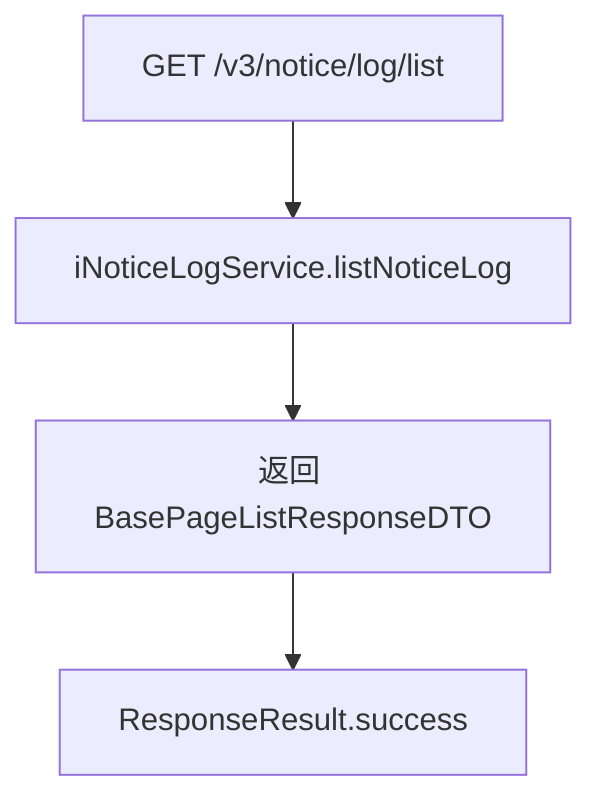

# NoticeLogController — 消息日志查询

> 分支：syy.release.z7.8.1.0
> 源文件：`src/main/java/cn/testin/controller/v3/notice/NoticeLogController.java`
> 类级路由：`/notice`
> 业务：查询消息发送日志记录。消息日志记录每次通知的发送详情（发送通道、接收人、内容、状态等），提供审计和排查入口。当前仅支持分页列表查询。

## 接口列表总表

| 方法 | 路径 | 方法名 | 说明 | 操作日志 |
|---|---|---|---|---|
| GET | `/v3/notice/log/list` | listEvent | 分页查询消息日志 | 无 |

统一响应包装：`ResponseResult<T>`；分页响应 `BasePageListResponseDTO<NoticeLogResponseDTO>`。

---

## 1. GET /v3/notice/log/list — 查询消息日志

### 入口

`NoticeLogController.listEvent(@RequestParam("page") Integer page, @RequestParam("page_size") Integer pageSize, @RequestParam("project_id") Integer projectId)`

### 请求参数

| 字段 | 来源 | 必填 | 说明 |
|---|---|---|---|
| page | Query | 是 | 页码 |
| page_size | Query | 是 | 每页条数 |
| project_id | Query | 是 | 项目 ID |

### 响应结构

`ResponseResult<BasePageListResponseDTO<NoticeLogResponseDTO>>`，`data` 内为分页结构：

| 字段 | 类型 | 说明 |
|---|---|---|
| list | List\<NoticeLogResponseDTO\> | 日志列表 |
| total | Long | 总条数 |
| page | Integer | 当前页码 |
| pageSize | Integer | 每页条数 |

`NoticeLogResponseDTO` 字段：

| 字段 | 类型 | 说明 |
|---|---|---|
| id | Long | 日志主键 |
| eventType | Integer | 事件类型 |
| minRule | Integer | 最小规则值 |
| maxRule | Integer | 最大规则值 |
| channelName | String | 发送通道名称 |
| content | String | 消息内容 |
| createTime | Long | 创建时间 |

### 实现意图

按项目 ID 分页查询消息日志，直接委托 service 层。

### mermaid



### 调用链

```
NoticeLogController.listEvent
└─ INoticeLogService.listNoticeLog(page, pageSize, projectId)
```

### 涉及表

| 表 | 操作 |
|---|---|
| db_notice 消息日志表 | 读 |

### 异常

| 条件 | 异常 |
|---|---|
| service 层内部校验失败 | GeneralException |

### 关联横切

- 纯查询接口，无操作日志、无事务。
- 注意方法名为 `listEvent` 但实际功能是查询消息日志（log），与 [NoticeEventController](NoticeEventController.md) 的 `listEvent` 同名不同功能，属于历史命名问题。

---

相关文档：[00-分支索引](00-分支索引.md) · [NoticeChannelCfgController](NoticeChannelCfgController.md)
