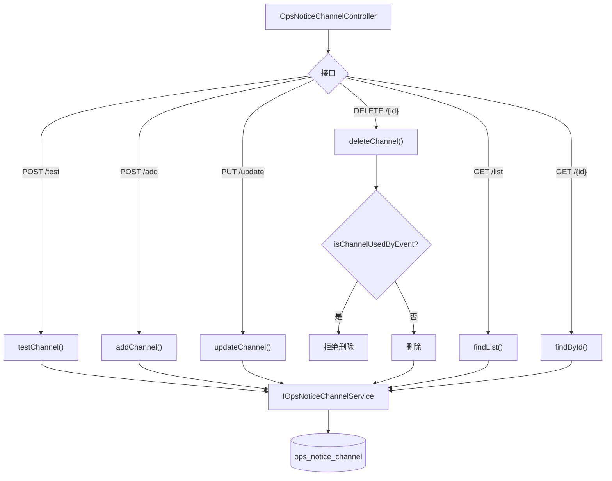

# OpsNoticeChannelController — 运维通知渠道

> 分支：syy.release.z7.8.1.0
> 源文件：`src/main/java/cn/testin/controller/notice/ops/OpsNoticeChannelController.java`
> 类级路由：`/core/ops/notice/channel`
> 业务：运维告警通知渠道（钉钉/飞书/企业微信 WebHook）的增删改查与连通性测试。与普通通知渠道（NoticeChannelCfgController）独立，专用于运维告警场景。

## 接口列表总表

| 方法 | 路径 | 方法名 | 说明 |
|------|------|--------|------|
| POST | `/v3/core/ops/notice/channel/test` | testChannel | 测试渠道连通性（发一条测试消息） |
| POST | `/v3/core/ops/notice/channel/add` | addChannel | 新增渠道 |
| PUT | `/v3/core/ops/notice/channel/update` | updateChannel | 编辑渠道 |
| DELETE | `/v3/core/ops/notice/channel/{id}` | deleteChannel | 删除渠道（关联事件时拒绝） |
| GET | `/v3/core/ops/notice/channel/list` | listChannels | 查询所有渠道 |
| GET | `/v3/core/ops/notice/channel/{id}` | getChannelById | 按 ID 查询单个渠道 |

统一响应包装：`ResponseResult<T> { int code; String msg; T data }`。

---

## 1. POST /v3/core/ops/notice/channel/test — 测试渠道连通性

### 请求参数（OpsNoticeChannel，JSON Body）

| 字段 | 来源 | 必填 | 类型 | 说明 |
|------|------|------|------|------|
| webhookUrl | Body | 是 | String | WebHook 地址（`testChannel` 中 `isBlank` 校验） |
| channelType | Body | 是 | Integer | 渠道类型（`testChannel` 中 null 校验，dingtalk/wechat） |
| id | Body | 否 | Long | 主键（测试不校验） |
| channelName | Body | 否 | String | 渠道名称（测试不校验） |
| secret | Body | 否 | String | 签名密钥 |
| status | Body | 否 | Integer | 状态（0 禁用 / 1 启用） |
| remark | Body | 否 | String | 备注 |

### 响应结构

`ResponseResult<Integer>`：成功 `data=1`，失败 `code=paraInvalid`、`msg="失败"`、`data=0`。

### 实现意图

向目标 WebHook 发送一条测试消息，验证渠道配置是否正确。委托 `IOpsNoticeChannelService.testChannel()`。

---

## 2. POST /v3/core/ops/notice/channel/add — 新增渠道

### 请求参数（OpsNoticeChannel，JSON Body）

| 字段 | 来源 | 必填 | 类型 | 说明 |
|------|------|------|------|------|
| channelName | Body | 是 | String | 渠道名称（controller `isBlank` 校验 + service 唯一性校验） |
| webhookUrl | Body | 是 | String | WebHook 地址（controller `isBlank` 校验） |
| channelType | Body | 是 | Integer | 渠道类型（service `MsgTypeEnum.getNameByCode` 非法即抛"渠道类型不合法"） |
| secret | Body | 否 | String | 签名密钥 |
| status | Body | 否 | Integer | 状态，null 时 service 默认 1（启用） |
| remark | Body | 否 | String | 备注 |
| id | Body | 否 | Long | 主键（新增不传，自增） |

### 实现意图

新增运维告警通知渠道。委托 `IOpsNoticeChannelService.addChannel()` 写入 `ops_notice_channel` 表。

---

## 3. PUT /v3/core/ops/notice/channel/update — 编辑渠道

| 字段 | 来源 | 必填 | 类型 | 说明 |
|------|------|------|------|------|
| id | Body | 是 | Long | 渠道 ID（controller null 校验） |
| channelName | Body | 否 | String | 渠道名称（service 校验唯一性） |
| webhookUrl | Body | 是（与名称同传时） | String | WebHook 地址（controller：channelName 非空且 webhookUrl 为空时抛"WebHook地址不能为空"） |
| channelType | Body | 否 | Integer | 渠道类型 |
| secret | Body | 否 | String | 签名密钥 |
| status | Body | 否 | Integer | 状态 |
| remark | Body | 否 | String | 备注 |

---

## 4. DELETE /v3/core/ops/notice/channel/{id} — 删除渠道

调用 `IOpsNoticeChannelService.isChannelUsedByEvent()` 检查是否被事件关联，若关联则拒绝删除。

---

## 5. GET /v3/core/ops/notice/channel/list — 查询所有渠道

无请求参数。返回 `ResponseResult<List<OpsNoticeChannelDTO>>`。

## 6. GET /v3/core/ops/notice/channel/{id} — 按 ID 查询

返回单个 `ResponseResult<OpsNoticeChannelDTO>`，不存在则抛异常。

### 返回参数（OpsNoticeChannelDTO 元素结构）

| 字段 | 类型 | 说明 |
|---|---|---|
| id | Long | 渠道主键 |
| channelName | String | 渠道名称 |
| channelType | Integer | 渠道类型（MsgTypeEnum：dingtalk / wechat，即钉钉/企业微信） |
| webhookUrl | String | WebHook 地址 |
| secret | String | 加签密钥 |
| status | Integer | 状态（启用/停用） |
| remark | String | 备注 |
| createTime | String | 创建时间 |
| updateTime | String | 更新时间 |

---

## 实现意图总结

运维通知渠道是一套**独立于业务通知**的轻量渠道管理。它直接存储 WebHook URL，不做通道类型抽象。渠道被 `OpsNoticeEvent` 引用，由 `OpsAlarmScheduledTask`（每15分钟）触发磁盘告警检查后，通过关联的渠道发送通知。

## mermaid



## 调用链

```
OpsNoticeChannelController
  → IOpsNoticeChannelService
    → OpsNoticeChannelServiceImpl
      → IOpsNoticeChannelDAO (MyBatis-Plus)
        → db_notice.ops_notice_channel
```

## 关联后台线程

| 线程 | 关系 |
|------|------|
| [OpsAlarmScheduledTask](横切-后台线程全景.md) | 每15分钟读取磁盘数据 → 匹配事件规则 → 通过本控制器管理的渠道发送告警 |

## 关键代码位置

| 文件 | 作用 |
|------|------|
| `controller/notice/ops/OpsNoticeChannelController.java` | 接口入口 |
| `business/interfaces/notice/ops/IOpsNoticeChannelService.java` | 服务接口 |
| `business/impl/notice/ops/OpsNoticeChannelServiceImpl.java` | 服务实现 |
| `dao/notice/ops/IOpsNoticeChannelDAO.java` | DAO |
| `business/impl/notice/ops/alarm/OpsAlarmScheduledTask.java` | 消费方（定时告警） |
