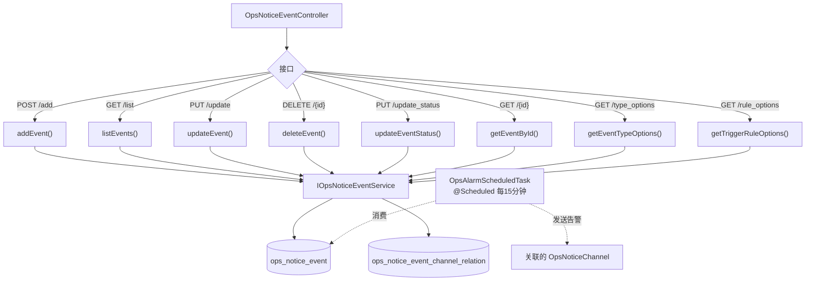

# OpsNoticeEventController — 运维通知事件

> 分支：syy.release.z7.8.1.0
> 源文件：`src/main/java/cn/testin/controller/notice/ops/OpsNoticeEventController.java`
> 类级路由：`/core/ops/notice/event`
> 业务：运维告警通知事件的增删改查。每个事件关联触发规则（如磁盘使用率 > 80%）和通知渠道，由 `OpsAlarmScheduledTask` 定时检查是否触发。

## 接口列表总表

| 方法 | 路径 | 方法名 | 说明 |
|------|------|--------|------|
| POST | `/v3/core/ops/notice/event/add` | addEvent | 新增事件 |
| GET | `/v3/core/ops/notice/event/list` | listEvents | 查询所有事件 |
| PUT | `/v3/core/ops/notice/event/update` | updateEvent | 编辑事件 |
| DELETE | `/v3/core/ops/notice/event/{id}` | deleteEvent | 删除事件（已关联记录则拒绝） |
| PUT | `/v3/core/ops/notice/event/update_status` | updateEventStatus | 启停事件状态 |
| GET | `/v3/core/ops/notice/event/{id}` | getEventById | 按 ID 查询单个事件（编辑回显） |
| GET | `/v3/core/ops/notice/event/type_options` | getEventTypeOptions | 获取事件类型下拉选项 |
| GET | `/v3/core/ops/notice/event/rule_options` | getTriggerRuleOptions | 获取触发规则下拉选项 |

统一响应包装：`ResponseResult<T> { int code; String msg; T data }`。

---

## 1. POST /v3/core/ops/notice/event/add — 新增事件

### 请求参数（OpsNoticeEventDTO，JSON Body）

| 字段 | 类型 | 必填 | 说明 |
|------|------|------|------|
| eventCode | String | 是 | 事件编码（`addEvent` 中 `isBlank` 校验） |
| eventName | String | 是 | 事件名称（`addEvent` 中 `isBlank` 校验，且需唯一） |
| triggerRule | String | 是 | 触发规则（`addEvent` 中 `isBlank` 校验，如 `usage_percent > 80`） |
| channelIds | String | 是 | 关联渠道 ID 列表，逗号分隔（`addEvent` 中 `isBlank` 校验，且须存在并启用） |
| type | String | 是 | 事件类型（`addEvent` 中 `isBlank` 校验，如 `disk`） |
| mountIdList | Array\<Integer\> | 是 | 关联挂载点 ID 列表（`CollectionUtils.isEmpty` 即抛"请选择告警磁盘分区"） |
| contentTemplate | String | 否 | 通知内容模板（支持占位符） |
| status | Integer | 否 | 状态，null 时默认 0（禁用） |

### 实现意图

创建一条运维告警事件规则。委托 `IOpsNoticeEventService.addEvent()` 写入 `ops_notice_event` 表及其渠道关联。

---

## 2. GET /v3/core/ops/notice/event/list — 查询所有事件

无请求参数。返回 `ResponseResult<List<OpsNoticeEventDTO>>`（含关联渠道信息）。

### 返回参数（OpsNoticeEventDTO 元素结构）

| 字段 | 类型 | 说明 |
|---|---|---|
| id | Long | 事件主键 |
| eventCode | String | 事件编码 |
| eventName | String | 事件名称 |
| triggerRule | String | 触发规则 |
| channelIds | String | 关联渠道 ID 列表（JSON 字符串） |
| contentTemplate | String | 通知内容模板 |
| status | Integer | 状态（启用/停用） |
| type | String | 事件类型 |
| mountIdList | Array\<Integer\> | 关联挂载点 ID 列表 |
| createTime | String | 创建时间 |
| updateTime | String | 更新时间 |

---

## 3. PUT /v3/core/ops/notice/event/update — 编辑事件

### 请求参数（OpsNoticeEventDTO，JSON Body）

| 字段 | 类型 | 必填 | 说明 |
|------|------|------|------|
| id | Long | 是 | 事件主键（controller 及 service 均 null 校验） |
| mountIdList | Array\<Integer\> | 是 | 关联挂载点 ID 列表（`validateSelectedMountInfo` 为空即抛"请选择告警磁盘分区"） |
| eventName | String | 否 | 事件名称（非空且变更时做唯一性校验） |
| channelIds | String | 否 | 关联渠道 ID（非空时校验渠道存在且启用） |
| contentTemplate | String | 否 | 通知内容模板 |
| status | Integer | 否 | 状态 |
| eventCode | String | 否 | 事件编码（非空且与现有不同则抛"不允许修改事件编码"） |
| triggerRule | String | 否 | 触发规则（非空且与现有不同则抛"不允许修改触发规则"） |
| type | String | 否 | 事件类型（非空且与现有不同则抛"不允许修改类型"） |

委托 `IOpsNoticeEventService.updateEvent()`。

---

## 4. DELETE /v3/core/ops/notice/event/{id} — 删除事件

若事件已有通知记录关联则拒绝删除。

---

## 5. PUT /v3/core/ops/notice/event/update_status — 启停事件

| 字段 | 来源 | 必填 | 说明 |
|------|------|------|------|
| id | Body | 是 | 事件 ID |
| status | Body | 是 | 目标状态 |

用于启用/停用告警规则，不删除事件本身。

---

## 6. GET /v3/core/ops/notice/event/{id} — 按 ID 查询

返回单个 `OpsNoticeEventDTO`，用于编辑回显。

---

## 7. GET /v3/core/ops/notice/event/type_options — 事件类型选项

返回事件类型枚举的下拉列表（如"磁盘告警"等），供前端表单使用。

---

## 8. GET /v3/core/ops/notice/event/rule_options — 触发规则选项

返回触发规则的下拉列表（如"磁盘使用率 > 80%"等），供前端表单使用。

---

## 实现意图总结

运维通知事件是**告警规则的配置中心**。用户配置"什么条件触发 + 通知到哪些渠道"，由 `OpsAlarmScheduledTask`（每15分钟）轮询磁盘数据并匹配规则，命中则通过关联渠道发送告警消息。与业务通知事件（NoticeEventController）独立。

## mermaid



## 调用链

```
OpsNoticeEventController
  → IOpsNoticeEventService
    → OpsNoticeEventServiceImpl
      → IOpsNoticeEventDAO (MyBatis-Plus)
        → db_notice.ops_notice_event
        → db_notice.ops_notice_event_channel_relation
```

## 关联后台线程

| 线程 | 关系 |
|------|------|
| [OpsAlarmScheduledTask](横切-后台线程全景.md) | 每15分钟读取事件规则匹配磁盘数据触发告警 |

## 关键代码位置

| 文件 | 作用 |
|------|------|
| `controller/notice/ops/OpsNoticeEventController.java` | 接口入口 |
| `business/interfaces/notice/ops/IOpsNoticeEventService.java` | 服务接口 |
| `business/impl/notice/ops/OpsNoticeEventServiceImpl.java` | 服务实现 |
| `dao/notice/ops/IOpsNoticeEventDAO.java` | DAO |
| `business/impl/notice/ops/alarm/OpsAlarmScheduledTask.java` | 消费方（定时告警检查） |
