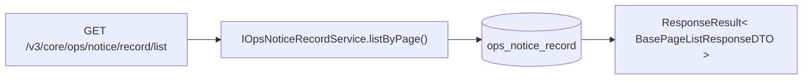

# OpsNoticeRecordController — 运维通知记录

> 分支：syy.release.z7.8.1.0
> 源文件：`src/main/java/cn/testin/controller/notice/ops/OpsNoticeRecordController.java`
> 类级路由：`/core/ops/notice/record`
> 业务：运维告警通知发送记录的只读查询。记录由 `OpsAlarmScheduledTask` 触发告警时自动写入，此处仅提供分页查询。

## 接口列表总表

| 方法 | 路径 | 方法名 | 说明 |
|------|------|--------|------|
| GET | `/v3/core/ops/notice/record/list` | listRecordsByPage | 分页查询通知发送记录 |

统一响应包装：`ResponseResult<BasePageListResponseDTO<OpsNoticeRecordDTO>>`。

---

## 1. GET /v3/core/ops/notice/record/list — 分页查询记录

### 请求参数

| 字段 | 来源 | 必填 | 类型 | 默认值 | 说明 |
|------|------|------|------|--------|------|
| page | Query | 否 | Integer | 1 | 页码 |
| page_size | Query | 否 | Integer | 1000 | 每页条数 |

### 响应结构

`BasePageListResponseDTO<OpsNoticeRecordDTO>`。

### 返回参数（OpsNoticeRecordDTO 元素结构）

| 字段 | 类型 | 说明 |
|---|---|---|
| code | Integer | 状态码，0 成功 |
| msg | String | 提示信息 |
| data | Object | 分页数据对象 |
| data.list | Array\<OpsNoticeRecordDTO\> | 通知记录列表 |
| data.list[].id | Long | 记录主键 |
| data.list[].eventId | Long | 事件 ID |
| data.list[].eventName | String | 事件名称 |
| data.list[].channelId | Long | 渠道 ID |
| data.list[].channelName | String | 渠道名称 |
| data.list[].bizId | String | 业务标识 |
| data.list[].sendStatus | Integer | 发送状态 |
| data.list[].sendStatusName | String | 发送状态名称 |
| data.list[].sendContent | String | 发送内容 |
| data.list[].errorMsg | String | 失败原因 |
| data.list[].sendTime | LocalDateTime | 发送时间 |
| data.list[].createTime | LocalDateTime | 创建时间 |
| data.page | Integer | 当前页 |
| data.pageSize | Integer | 每页条数 |
| data.totalPage | Integer | 总页数 |
| data.totalRow | Long | 总记录数 |

### 实现意图

提供运维告警通知的历史记录查询。目前仅支持分页，不支持按事件ID、渠道ID或发送状态筛选（Controller 代码中有注释提及但未实现参数）。

## mermaid



## 调用链

```
OpsNoticeRecordController
  → IOpsNoticeRecordService.listByPage(page, pageSize)
    → OpsNoticeRecordServiceImpl
      → IOpsNoticeRecordDAO (MyBatis-Plus)
        → db_notice.ops_notice_record
```

## 关联后台线程

| 线程 | 关系 |
|------|------|
| [OpsAlarmScheduledTask](横切-后台线程全景.md) | 告警触发时将发送结果写入 `ops_notice_record` 表 |

## 关键代码位置

| 文件 | 作用 |
|------|------|
| `controller/notice/ops/OpsNoticeRecordController.java` | 接口入口 |
| `business/interfaces/notice/ops/IOpsNoticeRecordService.java` | 服务接口 |
| `business/impl/notice/ops/OpsNoticeRecordServiceImpl.java` | 服务实现 |
| `dao/notice/ops/IOpsNoticeRecordDAO.java` | DAO |
