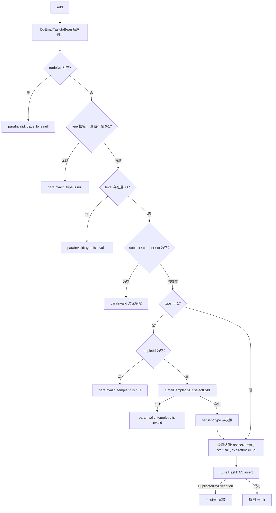

# service-EmailTask — 邮件任务

> 分支：syy.release.z7.8.1.0
> 源文件：`src/main/java/cn/testin/service/email/EmailTask.java`
> 类：`cn.testin.service.email.EmailTask extends GenericBaseService`（非 Spring MVC Controller，无注解路由）
> 入口方式：ApiServlet 网关按 `action` 定位包/类（`email.EmailTask`），`op` 反射调用方法名；参数由 `ApiRequest.reqjson`（JSONObject）传入；每个方法返回拼接好的 JSON 字符串。
> - **action**: `email`（对应包 `cn.testin.service.email`）
> - **入口格式**：`{"op": "EmailTask.方法名", "action": "email", "data": {...}}`
> 依赖：`IEmailTaskDAO`、`IEmailTempletDAO`（继承自 `GenericBaseService`，由 `SpringUtil.getBean` 注入）
> 业务：邮件任务的新增落库。邮件任务进入 `email_task` 表后由后台消费线程异步发送。

## 方法列表总表

| # | op | 方法 | 说明 |
|---|---|---|---|
| 1 | EmailTask.add | add | 新增邮件任务（参数校验 + 去重保护） |

统一返回：JSON 字符串，结构 `{ code, msg, data }`；`data.result` = insert 条数。
参数校验失败统一返回 `CommonCode.paraInvalid` + 具体提示。

---

## 1. op=EmailTask.add — 新增邮件任务

### 请求格式
{"op": "EmailTask.add", "action": "email", "data": {"tradeNo": "...", "type": 0|1, "subject": "...", "content": "...", "to": "..."}}

### 请求参数（reqjson）

| 字段 | 类型 | 必填 | 说明 |
|---|---|---|---|
| tradeNo | String | 是 | 业务流水号/交易号，不能为空 |
| type | Integer | 是 | 邮件类型：0=普通邮件，1=HTML 邮件（需传 templetId） |
| level | Integer | 否 | 优先级，不能 < 0 |
| subject | String | 是 | 邮件主题，不能为空 |
| content | String | 是 | 邮件内容，不能为空 |
| to | String | 是 | 收件人，不能为空 |
| templetId | Integer | type=1 时必填 | 邮件模板 ID，type=1 时校验模板是否存在 |
| publictime | Long | 否 | 推迟发布时间；为空默认当前时间 |

### 响应结构

`data.result` = 1（insert 成功或 DuplicateKeyException 触发幂等）。

### 实现意图

将邮件任务落库 `db_notice.email_task`。关键逻辑：
- 默认 `noticeNum=0`、`status=1`（待发送）、过期时间 = 当前 + 6 小时
- type=1（HTML 邮件）时校验 `templetId` 对应模板存在，并写入 `sendtype`
- `DuplicateKeyException` 捕获后 result 置 1（tradeNo 唯一索引或业务去重）

### mermaid



### 调用链

```
EmailTask.add
├─ DbEmailTask.toBean(reqjson)
├─ IEmailTempletDAO.selectById (仅 type=1)
└─ IEmailTaskDAO.insert → db_notice.email_task
```

### 涉及表

| 表 | 操作 |
|---|---|
| db_notice.email_templet | 读（type=1 时验证模板存在） |
| db_notice.email_task | 写（insert） |

### 异常

| 条件 | 异常 |
|---|---|
| tradeNo / type / subject / content / to 为空 | paraInvalid 对应提示 |
| type=1 且 templetId 为空或模板不存在 | paraInvalid |
| level < 0 | paraInvalid |
| 唯一键冲突 | DuplicateKeyException 捕获，result=1 |

### 关联横切

- 过期时间硬编码为 6 小时（`System.currentTimeMillis() + 6 * 60 * 60 * 1000L`）。
- 消费端由后台定时任务扫描 `status=1` 且 `publictime <= now` 的记录发送。
- 类中 `iEmailTaskDAO` 由 `GenericBaseService` 通过 `SpringUtil.getBean` 注入。

---

相关文档：[00-分支索引](00-分支索引.md) · [service-EmailCfg](service-EmailCfg.md) · [service-MsgTask](service-MsgTask.md)
