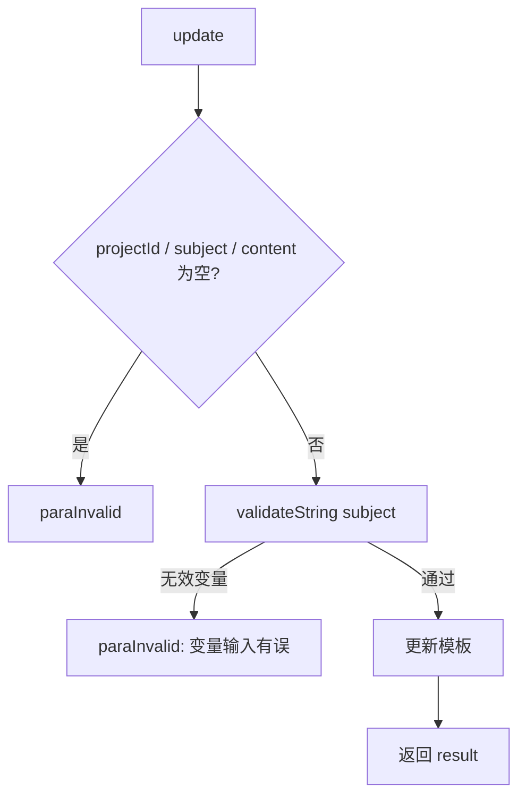

# service-EmailTempletCfg — 邮件模板配置（ApiServlet）

> 分支：syy.release.z7.8.1.0
> 源文件：`src/main/java/cn/testin/service/email/EmailTempletCfg.java`
> 类：`cn.testin.service.email.EmailTempletCfg extends GenericBaseService`（非 Spring MVC Controller）
> 入口方式：ApiServlet 网关按 `action` 定位（`email.EmailTempletCfg`），`op` 反射调用方法名；`ApiRequest.reqjson` 传参；返回 JSON 字符串。
> - **action**: `email`（对应包 `cn.testin.service.email`）
> - **入口格式**：`{"op": "EmailTempletCfg.方法名", "action": "email", "data": {...}}`
> 依赖：`IEmailTempletConfigService`（继承自 `GenericBaseService`）
> 业务：项目维度的邮件模板（主题 + 内容）配置的增改查。与 MVC 层 [EmailTemplateCfgController](EmailTemplateCfgController.md)（`/core/email_template`）功能互补：此处 add 为其提供新增入口。

## 方法列表总表

| # | op | 方法 | 说明 |
|---|---|---|---|
| 1 | EmailTempletCfg.add | add | 新增邮件模板 |
| 2 | EmailTempletCfg.update | update | 更新邮件模板（含主题变量校验） |
| 3 | EmailTempletCfg.get | get | 按 projectId 查询邮件模板 |

统一返回：JSON 字符串结构 `{ code, msg, data }`；参数校验失败返回 `paraInvalid`；无数据返回 `noneData`。

---

## 1. op=EmailTempletCfg.add — 新增邮件模板

### 请求格式
{"op": "EmailTempletCfg.add", "action": "email", "data": {"projectId": ..., "subject": "...", "content": {...}}}

### 请求参数（reqjson）

| 字段 | 类型 | 必填 | 说明 |
|---|---|---|---|
| projectId | Integer | 是 | 项目 ID，不能为空 |
| subject | String | 是 | 邮件主题，不能为空 |
| content | String/JSONObject | 是 | 邮件内容（对象或字符串），不能为空 |

### 响应结构

`data.result` = 1（成功）/ 0（失败）。

### 实现意图

按项目 ID 新增邮件模板；status 默认设为 1（启用）。

### 调用链

```
EmailTempletCfg.add → IEmailTempletConfigService.add(templetConfig)
```

---

## 2. op=EmailTempletCfg.update — 更新邮件模板

### 请求格式
{"op": "EmailTempletCfg.update", "action": "email", "data": {"id": ..., "projectId": ..., "subject": "...", "content": {...}}}

### 请求参数（reqjson）

| 字段 | 类型 | 必填 | 说明 |
|---|---|---|---|
| id | Long | 是 | 模板主键 |
| projectId | Integer | 是 | 项目 ID |
| subject | String | 是 | 邮件主题，含 `${}` 变量需通过校验 |
| content | JSONObject | 是 | 邮件内容对象，内部调用 `.toString()` 存储 |

### 主题变量校验

`validateString` 方法校验 `${}` 内的变量是否在合法列表中。合法变量：

- 任务名称
- 任务开始时间
- 任务结束时间
- 执行通过脚本数
- 执行未通过脚本数
- 执行取消脚本数
- 执行超时脚本数

### 响应结构

`data.result` = 1（成功）/ 0（失败）。

### 实现意图

更新邮件模板；相比 add 多了 id 参数和 subject 变量校验。注意 content 用 `reqjson.getJSONObject("content").toString()` 取出——意味着 content 必须是 JSON 对象而不是字符串。

### mermaid



### 调用链

```
EmailTempletCfg.update
├─ validateString(subject) 校验变量
└─ IEmailTempletConfigService.update(templetConfig)
```

---

## 3. op=EmailTempletCfg.get — 查询邮件模板

### 请求格式
{"op": "EmailTempletCfg.get", "action": "email", "data": {"projectId": ...}}

### 请求参数（reqjson）

| 字段 | 类型 | 必填 | 说明 |
|---|---|---|---|
| projectId | Integer | 是 | 项目 ID |

### 响应结构

- 命中：`data.object` = `DbEmailTempletConfig` JSON 对象。
- 未命中：返回 `noneData` 错误码。

### 调用链

```
EmailTempletCfg.get → IEmailTempletConfigService.get(templetConfig)
```

---

相关文档：[00-分支索引](00-分支索引.md) · [service-EmailCfg](service-EmailCfg.md)
