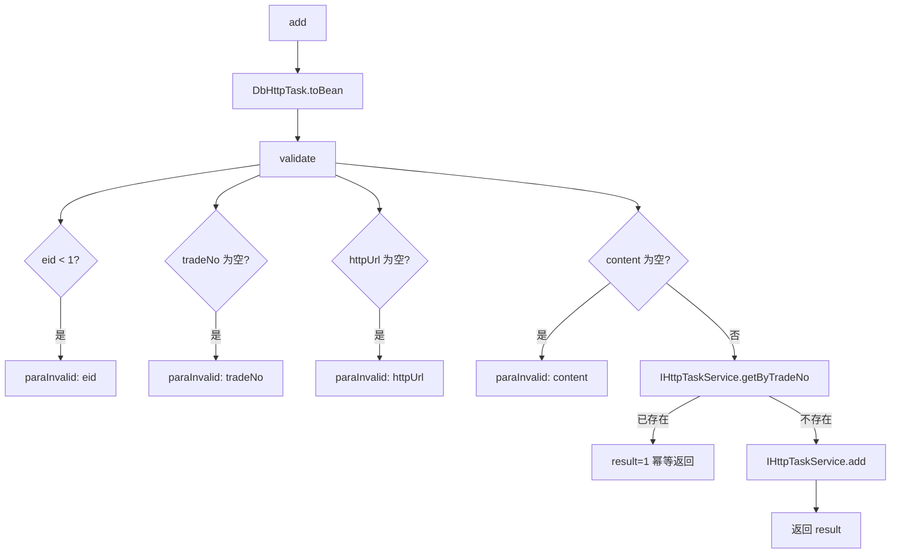

# service-HttpTask — HTTP 回调任务

> 分支：syy.release.z7.8.1.0
> 源文件：`src/main/java/cn/testin/service/http/HttpTask.java`
> 类：`cn.testin.service.http.HttpTask extends GenericBaseService`（非 Spring MVC Controller）
> 入口方式：ApiServlet 网关按 `action` 定位（`http.HttpTask`），`op` 反射调用方法名；`ApiRequest.reqjson` 传参；返回 JSON 字符串。
> - **action**: `http`（对应包 `cn.testin.service.http`）
> - **入口格式**：`{"op": "HttpTask.方法名", "action": "http", "data": {...}}`
> 依赖：`IHttpTaskService`（继承自 `GenericBaseService`）
> 业务：HTTP 回调通知任务的新增落库。按 tradeNo 去重（已存在则跳过 insert 返回 1）。任务进入库后由后台消费线程执行 HTTP 回调。

## 方法列表总表

| # | op | 方法 | 说明 |
|---|---|---|---|
| 1 | HttpTask.add | add | 新增 HTTP 通知任务（tradeNo 去重） |

统一返回：JSON 字符串 `{ code, msg, data }`。

---

## 1. op=HttpTask.add — 新增 HTTP 通知任务

### 请求格式
{"op": "HttpTask.add", "action": "http", "data": {"eid": ..., "tradeNo": "...", "httpUrl": "...", "content": "..."}}

### 请求参数（reqjson）

`DbHttpTask.toBean(reqjson)` 反序列化，经 `validate` 校验：

| 字段 | 类型 | 必填 | 说明 |
|---|---|---|---|
| eid | Integer | 是 | 企业 ID，> 0 |
| tradeNo | String | 是 | 业务流水号（去重键），不能为空 |
| httpUrl | String | 是 | HTTP 回调地址，不能为空 |
| content | String | 是 | 回调内容（JSON 字符串），不能为空 |

### 响应结构

`data.result` = 1（新增成功或已存在），或实际 insert 条数。

### 实现意图

将 HTTP 回调任务落库。**关键去重逻辑**：先按 tradeNo 查 `IHttpTaskService.getByTradeNo`，若已存在直接返回 result=1 不重复 insert；否则执行 add。

### mermaid



### 调用链

```
HttpTask.add
├─ DbHttpTask.toBean(reqjson)
├─ validate(httpTask, apirequest)
├─ IHttpTaskService.getByTradeNo(tradeNo)  → db_notice.http_task（读，去重检查）
└─ IHttpTaskService.add(httpTask)          → db_notice.http_task（写）
```

### 涉及表

| 表 | 操作 |
|---|---|
| db_notice.http_task | 读（getByTradeNo 去重）/ 写（insert） |

### 异常

| 条件 | 异常 |
|---|---|
| eid / tradeNo / httpUrl / content 为空或无效 | paraInvalid 对应提示 |

### 关联横切

- 去重基于 tradeNo，与 EmailTask 的 DuplicateKeyException 方式不同（这里是显式查重而非依赖唯一键异常）。
- 消费端由后台线程扫描待发送记录执行 HTTP POST 回调。

---

相关文档：[00-分支索引](00-分支索引.md) · [service-EmailTask](service-EmailTask.md) · [service-MsgTask](service-MsgTask.md)
