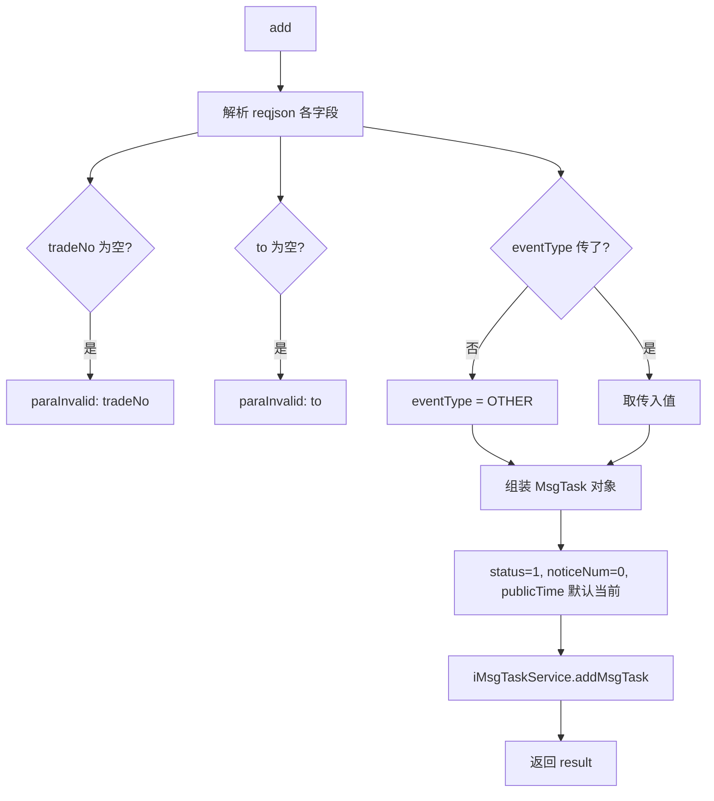

# service-MsgTask — 统一消息任务

> 分支：syy.release.z7.8.1.0
> 源文件：`src/main/java/cn/testin/service/newChannel/MsgTask.java`
> 类：`cn.testin.service.newChannel.MsgTask extends GenericBaseService`（非 Spring MVC Controller）
> 入口方式：ApiServlet 网关按 `action` 定位（`newChannel.MsgTask`），`op` 反射调用方法名；`ApiRequest.reqjson` 传参；返回 JSON 字符串。
> - **action**: `newChannel`（对应包 `cn.testin.service.newChannel`）
> - **入口格式**：`{"op": "MsgTask.方法名", "action": "newChannel", "data": {...}}`
> 依赖：`IMsgTaskService`（`MsgTaskTaskServiceImpl`，继承自 `GenericBaseService`）
> 业务：新版统一消息任务新增落库——不再区分邮件/短信/HTTP 等通道，通过 `channelId` 确定发送通道，由后台统一消费发送。相比旧的 `EmailTask`/`SmsTask`/`HttpTask` 分散入口，此为统一入口。

## 方法列表总表

| # | op | 方法 | 说明 |
|---|---|---|---|
| 1 | MsgTask.add | add | 新增统一消息任务（channelId 定位通道 + eventType 标注事件） |

统一返回：JSON 字符串 `{ code, msg, data }`。

---

## 1. op=MsgTask.add — 新增统一消息任务

### 请求格式
{"op": "MsgTask.add", "action": "newChannel", "data": {"eid": ..., "tradeNo": "...", "to": "...", "channelId": ..., "eventType": ...}}

### 请求参数（reqjson）

| 字段 | 类型 | 必填 | 说明 |
|---|---|---|---|
| eid | Integer | 否 | 企业 ID，>= 1 |
| projectid | Integer | 否 | 项目组 ID，>= 0 |
| channelId | Integer | 否 | 通道 ID，>= 0 |
| level | Integer | 否 | 优先级，>= 0 |
| templetId | Integer | 否 | 模板 ID（用 `has` 而非 `!isNull` 判断） |
| tradeNo | String | 是 | 业务流水号，不能为空 |
| subject | String | 否 | 消息主题 |
| content | String | 否 | 消息内容 |
| to | String | 是 | 接收人，不能为空 |
| publishtime | Long | 否 | 推迟发布时间，默认当前时间 |
| eventType | Integer | 否 | 事件类型编码（用 `has` 判断），默认 `NoticeEventEnum.OTHER.getType()` |

### 响应结构

`data.result` = insert 条数。

### 实现意图

新增一条消息发送任务到统一消息表（`db_notice.msg_task` 或类似表）。核心特点：
- **channelId**：指定发送通道，通道配置包含邮件/短信/HTTP 等类型的连接参数
- **eventType**：标注触发通知的业务事件类型，用于日志审计和统计
- **eventType 默认值**：未传时取 `NoticeEventEnum.OTHER`，即「其他」事件
- 系统默认 status=1（待发送）、noticeNum=0

### mermaid



### 调用链

```
MsgTask.add
├─ 手工解析 reqjson 各个字段（eid/projectid/channelId/level/templetId 等）
├─ NoticeEventEnum.OTHER 兜底 eventType
└─ IMsgTaskService.addMsgTask(msgTask) → db_notice.msg_task
```

### 涉及表

| 表 | 操作 |
|---|---|
| db_notice.msg_task（或类似统一消息表） | 写（insert） |

### 异常

| 条件 | 异常 |
|---|---|
| tradeNo 为空 | paraInvalid: tradeNo is invalid |
| to 为空 | paraInvalid: to is invalid |
| eid / channelId / level 等为负 | paraInvalid 对应提示 |

### 关联横切

- `templetId` 用 `reqjson.has("templetId")` 判断是否传入（字段存在即为有传，即使值为 null），与 `!isNull` 不同。
- `eventType` 同样用 `has` 判断是否存在而非为空。
- 与旧版分离入口（`EmailTask.add` / `SmsTask.add` / `HttpTask.add`）不同，此处不再单独区分通道类型——通道类型由 `channelId` 对应的通道配置决定，消费端根据通道类型执行对应的发送逻辑（邮件 SMTP / 短信 API / HTTP POST）。

---

相关文档：[00-分支索引](00-分支索引.md) · [service-Channel](service-Channel.md) · [service-EmailTask](service-EmailTask.md) · [service-HttpTask](service-HttpTask.md)
