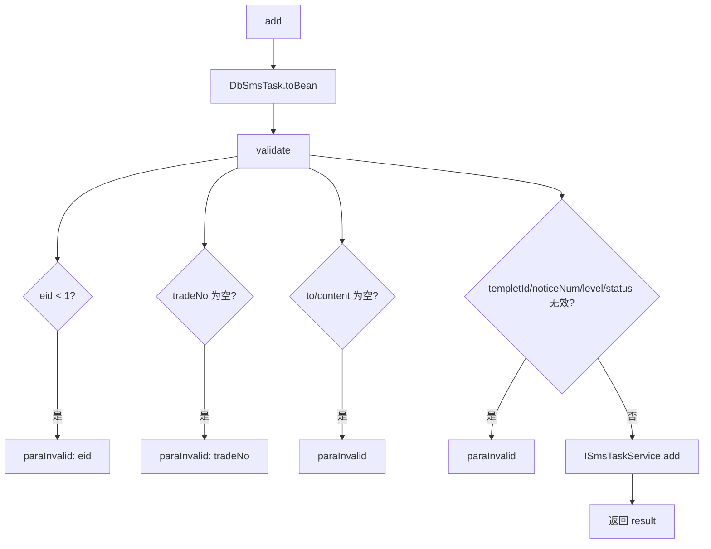

# service-SmsTask — 短信任务

> 分支：syy.release.z7.8.1.0
> 源文件：`src/main/java/cn/testin/service/sms/SmsTask.java`
> 类：`cn.testin.service.sms.SmsTask extends GenericBaseService`（非 Spring MVC Controller）
> 入口方式：ApiServlet 网关按 `action` 定位（`sms.SmsTask`），`op` 反射调用方法名；`ApiRequest.reqjson` 传参；返回 JSON 字符串。
> - **action**: `sms`（对应包 `cn.testin.service.sms`）
> - **入口格式**：`{"op": "SmsTask.方法名", "action": "sms", "data": {...}}`
> 依赖：`ISmsTaskService`（继承自 `GenericBaseService`）
> 业务：短信通知任务的新增落库。任务进入 `sms_task` 表后由后台消费线程异步发送。

## 方法列表总表

| # | op | 方法 | 说明 |
|---|---|---|---|
| 1 | SmsTask.add | add | 新增短信通知任务（参数校验 + 落库） |

统一返回：JSON 字符串 `{ code, msg, data }`。

---

## 1. op=SmsTask.add — 新增短信通知任务

### 请求格式
{"op": "SmsTask.add", "action": "sms", "data": {"eid": ..., "tradeNo": "...", "to": "...", "content": "...", "templetId": ...}}

### 请求参数（reqjson）

`DbSmsTask.toBean(reqjson)` 反序列化后，经 `validate` 全面校验：

| 字段 | 类型 | 必填 | 说明 |
|---|---|---|---|
| eid | Integer | 是 | 企业 ID，> 0 |
| tradeNo | String | 是 | 业务流水号，不能为空 |
| to | String | 是 | 接收人手机号，不能为空 |
| content | String | 是 | 短信内容，不能为空 |
| templetId | Integer | 是 | 短信模板 ID，>= 0 |
| noticeNum | Integer | 是 | 通知次数，>= 0 |
| level | Integer | 是 | 优先级，>= 0 |
| status | Integer | 是 | 处理状态，>= 0 |
| createtime | Long | 否 | 创建时间，不能 < 1（非法时返回错误） |
| updatetime | Long | 否 | 更新时间，不能 < 1 |
| publishtime | Long | 否 | 推迟发布时间，不能 < 1 |
| expiretime | Long | 否 | 过期时间，不能 < 1 |

### 响应结构

`data.result` = insert 条数。

### 实现意图

新增一条短信发送任务到 `db_notice.sms_task`。`validate` 对所有字段做严格非空/非负校验，包括时间戳合法性。

### mermaid



### 调用链

```
SmsTask.add
├─ DbSmsTask.toBean(reqjson)
├─ validate(smsTask, apirequest)   — 13 项字段逐一校验
└─ ISmsTaskService.add(smsTask)    → db_notice.sms_task
```

### 涉及表

| 表 | 操作 |
|---|---|
| db_notice.sms_task | 写（insert） |

### 异常

所有校验不通过均返回 `CommonCode.paraInvalid` + 字段级提示（如 `eid is invalid`）。

---

相关文档：[00-分支索引](00-分支索引.md) · [service-SmsCfg](service-SmsCfg.md) · [service-SmsTemplet](service-SmsTemplet.md)
