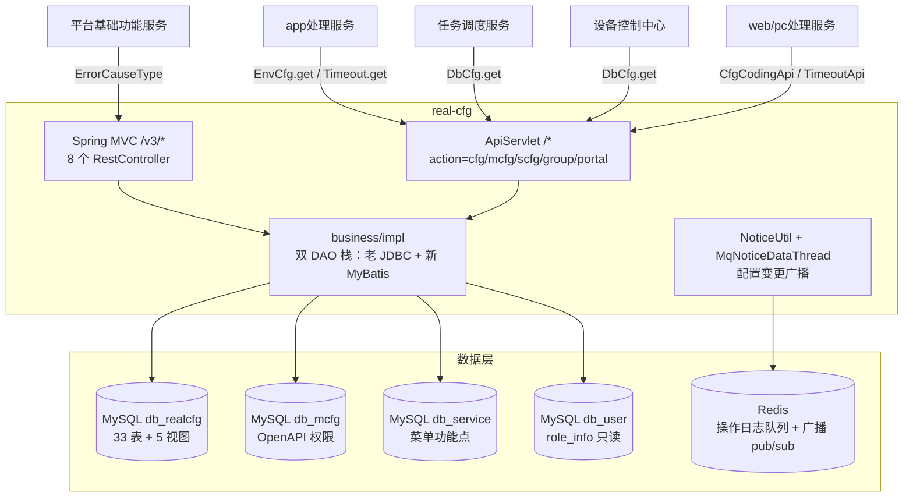

# 总体架构

## 平台定位

平台配置（real-cfg）是 Testin 云真机平台的**配置中心**，负责：平台授权（mcfg 模块/API/角色/授权）、业务配置（错误归因规则、环境配置、超时配置、数据库连接配置、设备云配置）、服务功能菜单与角色权限。它是 real 仓四个子模块之一，为所有 real-* 服务提供统一的配置读写入口。

**关键特征**：real-cfg 自身几乎不做配置缓存——配置的"缓存"在消费方 JVM 或 real-common 公共层。real-cfg 的职责是改配置后广播通知各节点刷新。

## 系统上下文

## 核心架构决策

### 1. 双 DAO 栈并存（老 JDBC + 新 MyBatis）

- **老栈**：DAO 继承 `AbstractGenericDaoImpl`，持 `IGenericJdbcDAO`（proxool 连接池），SQL 手写在 DAOImpl 里。对应 ApiServlet action=cfg 的 25 个 service 类。
- **新栈**：三个 `@MapperScan` 配置类按包隔离（`RealCfgMybatisConfig` / `McfgMybatisConfig` / `ServiceMybatisConfig`），各绑独立 SqlSessionFactory。8 个 MVC Controller 全走这条栈。

两条栈不要混用：数据源绑定不同，给老 service 加表时走 `Spring-DAO.xml` 注册。

### 2. 配置变更广播 = redismq pub/sub + 落库重发

`NoticeUtil.sendNotice` 先发 redismq（各订阅节点自行刷新），失败则落 `mq_info_notice` 表，`MqNoticeDataThread` 每 200ms 轮询重发。失败 >10 次且超 1 小时置 INVALID 放弃。目前仅角色-接口变更显式发广播（`RoleServiceImpl.addApiList/removeApiList`），其余配置变更依赖消费方自身缓存 TTL 或重启。

### 3. 本服务不做配置缓存

老业务层绝大多数方法是 DAO 直读直写（如 `DeviceCfgServiceImpl.get` 直接 `irealcfgdevicecfgdao.get(deviceid)`）。配置的"缓存"发生在消费方，real-cfg 只负责改后通知。

### 4. 下游统一走 HTTP JSON RPC

下游不连 real-cfg 的库，统一用协议 `{action, op, data}` POST 到 RealCfg 前缀地址。前缀→URL 映射在各服务自己的 `service.api.properties`。不走 RPC 框架、不走消息队列。

## 代码工程一览

| 工程 | 技术栈 | 产物 | 说明 |
|---|---|---|---|
| `real`（大仓） | Java 1.8 / Spring Boot 1.5.20 / MyBatis + JDBC 双栈 / proxool + Undertow | jar（按模块分目录） | real-common 共享，4 个子模块之一 |

## 延伸阅读

- [存储总览](00-存储总览.md) — 4 个 MySQL 库 + Redis
- [配置读取与缓存实现](../03-实现逻辑/配置读取与缓存实现.md)
- [开放接口文档](../07-开放接口文档/00-模块索引.md)
