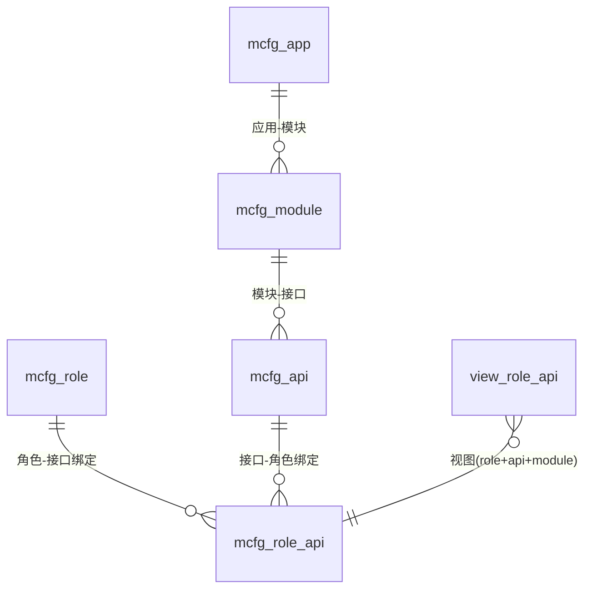
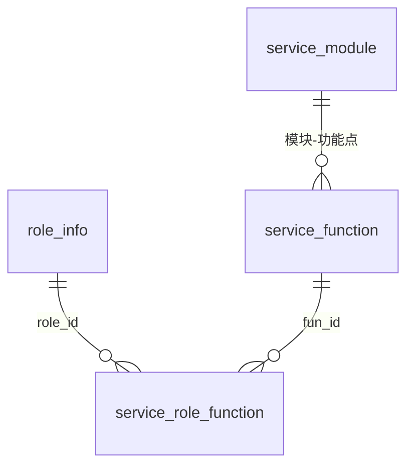

# 权限体系实现

## 概述

平台配置（real-cfg）里并存**两套互不相同的权限模型**，读代码前必须先分清：

| | A. OpenAPI 角色权限 | B. 平台菜单/功能点权限 |
|---|---|---|
| 管什么 | 开放接口：哪个角色能调哪个 API | 平台界面：哪个角色能看哪个菜单/按钮 |
| 库 | `db_mcfg` | `db_service` + `db_user` |
| 核心表 | `mcfg_role` / `mcfg_api` / `mcfg_role_api` | `service_function` / `service_role_function` / `db_user.role_info` |
| 入口 | `RoleCfg`（action=mcfg） | `ServiceCfg`（action=scfg） |
| 业务实现 | `RoleServiceImpl` | `ScfgServiceImpl` + `RoleFunctionDAOImpl` |

## A. OpenAPI 角色权限（db_mcfg）

### 数据模型



- `mcfg_role`：角色主档（name 唯一，见 `RoleServiceImpl.add` 重名校验，`real-cfg/src/main/java/cn/testin/business/impl/RoleServiceImpl.java`）；
- `mcfg_api` / `mcfg_module` / `mcfg_app`：开放接口按 应用→模块→接口 三级登记；
- `mcfg_role_api`：角色-接口多对多绑定；
- `view_role_api`：绑定 + 接口 + 模块的查询视图（表文档：[view_role_api](../../数据库管理/db_mcfg/view_role_api.md)）。

### 实现要点

入口 `RoleCfg`（`real-cfg/src/main/java/cn/testin/service/mcfg/RoleCfg.java`），op 包括 `add/delete/maintain`（角色 CRUD）、`addApi/removeApi`（批量绑定/解绑接口）、`maintainApi`（单条绑定特殊配置）、`get/list`。实现 `RoleServiceImpl`：

1. **删除保护**：角色下还有接口绑定时拒绝删除——先查 `view_role_api`，非空抛 `execFailed`（`RoleServiceImpl.java`）；
2. **批量绑定幂等**：`addApiList` 逐条查 `(roleId, apiId)` 已存在则跳过，roleId/apiId 不存在抛 `paraInvalid`；
3. **变更广播**：批量绑定/解绑成功后，对本次涉及的每个 roleId 发 `NoticeUtil.sendNotice("update", "McfgRole", roleId)`——订阅方收到后刷新本地角色→接口缓存，机制见 [配置读取与缓存实现](配置读取与缓存实现.md)；
4. **单条修改 `maintainApi` 不广播**，只校验绑定存在后 update——改单条配置依赖消费方 TTL 过期，这是与批量接口不一致的地方。

调用链：`RoleCfg.op` → `IRoleService`（bean `IRoleService`，Spring-Service.xml）→ `RoleServiceImpl` → `IMcfgRoleDAO / IMcfgRoleApiDAO / IMcfgApiDAO / IViewRoleApiDAO`（JDBC 老栈）→ `db_mcfg`。

## B. 平台菜单/功能点权限（db_service + db_user）

### 数据模型



- `db_user.role_info`：平台角色主档（角色 id、名称），**在另一个库**；
- `db_service.service_function`：功能点树。关键字段：`parent_id`（0=根目录，-1=菜单附属子操作）、`config_key`（权限标识，如 `control%` 前缀表示控制中心功能）、`display_name`、`href`、`status`、`position`（排序）；
- `db_service.service_role_function`：角色-功能点绑定，带 `status`（1 启用 / 0 停用）与 `hidden`。

表文档：[service_function](../../数据库管理/db_service/service_function.md)、[service_role_function](../../数据库管理/db_service/service_role_function.md)、[role_info](../../数据库管理/db_user/role_info.md)。

### 跨库 join 的实现

代码里把三个表名硬编码在 POJO 常量上（`real-cfg/src/main/java/cn/testin/pojo/servicecfg/RoleFunction.java`），**用 dsService 一个数据源跨库 join `db_user.role_info`**——前提是两库同实例同账号。例如全量功能点列表（`real-cfg/src/main/java/cn/testin/dao/impl/servicecfg/RoleFunctionDAOImpl.java`）：

```java
sql.append("SELECT a.id as fun_id ,a.display_name,a.parent_id,a.config_key,a.status FROM ");
sql.append(RoleFunction.table() + " a ");
sql.append(" left join db_user.role_info b on b.id = a.id where a.status = 1 and a.config_key != 'switch' ");
sql.append(" ORDER BY a.parent_id, a.position ");
```

注意：`config_key != 'switch'` 的过滤（开关类功能点不直接展示）。

### 角色功能查询（listRoleFunction）

`RoleFunctionDAOImpl.listRoleFunction`两段 SQL：

1. 主查询：`service_role_function srf LEFT JOIN service_function sf LEFT JOIN db_user.role_info ri`，条件 `srf.status=1 and sf.status=1 and sf.config_key != 'switch'`，可选按 roleId 过滤；
2. 附属子操作补偿：再查 `service_function` 中 `parent_config_key IN (已授权菜单的 config_key) AND parent_id = -1` 的记录并入结果——菜单下挂的按钮级操作靠 `parent_config_key` 关联，不占绑定表。

### 角色授权（insertRoleFunction）

`RoleFunctionDAOImpl.insert`是**先删后插的全量覆盖**：进来一个角色的功能点列表，先 `DELETE FROM service_role_function WHERE role_id=?`，再去重（HashSet）逐条 INSERT，`status=1, hidden=0`。**不是事务**，中途异常会留下半残授权，返回 null。

### 功能开关（openCloseFunction）

`updateStatus`（`RoleFunctionDAOImpl.java`）按 `config_key like 'key%'` 做**前缀级联**：同时更新 `service_function` 和其 `fun_id` 命中的 `service_role_function` 的 status——关掉父菜单 key，整棵子树一起失效。

### OEM 裁剪

`ScfgServiceImpl.modifyRoleFunction`（`real-cfg/src/main/java/cn/testin/business/impl/ScfgServiceImpl.java`）：`listFunction/listRoleFunction` 返回前，先调 `OemApi.getSystemGroup("enterprise-info", "oem_python_show")` 问平台基础功能服务（core）拿 OEM 参数，若值为 `INVALID` 则从功能列表中移除 `FunctionKeyConstant.CONTROL_THIRD_SCRIPT_MANAGE`（第三方脚本管理）——同一套部署按 OEM 客户隐藏指定功能。

### 特殊查询

- `listRoleControl`（`RoleFunctionDAOImpl.java`）：`config_key like 'control%'` 反查拥有控制中心功能的全部 roleId（去重），用于判断"哪些角色是设备控制中心用户"；
- `ViewRoleFunctionDAOImpl.listOfcompatible`（`ScfgServiceImpl.list` 调用）：`view_role_function` 视图的兼容查询，给老调用方用。

### 入口

`ServiceCfg`（`real-cfg/src/main/java/cn/testin/service/scfg/ServiceCfg.java`，action=scfg）op 一览：

| op | 说明 | 实现 |
|---|---|---|
| list | 全量角色-功能视图（兼容老接口） | `ScfgServiceImpl.list` |
| listFunction | 全部有效功能点（含 OEM 裁剪） |  |
| listFirstFunction | 一级目录功能点 |  |
| listRoleFunction | 按角色查已授权功能（roleid 可空=全部） |  |
| listRoleControl | 有 control% 功能的角色 id 列表 |  |
| insertRoleFunction | 角色全量授权（先删后插） |  |
| openCloseFunction | 按 configKey 前缀批量启停 |  |

源码里留着一段被注释的"系统内置角色（roleId<=4）不可修改"保护（`ServiceCfg.java`）——**当前内置角色授权是可以被改掉的**，操作时需注意。

## 涉及表汇总

| 库 | 表 | 作用 |
|---|---|---|
| db_mcfg | `mcfg_role`、`mcfg_role_api`、`mcfg_api`、`mcfg_module`、`mcfg_app`、`view_role_api` | OpenAPI 角色-接口 |
| db_service | `service_function`、`service_role_function`、`service_module`、`view_role_function` | 菜单功能点权限 |
| db_user | `role_info` | 角色主档（跨库 join） |
| dsMq | `mq_info_notice` | 角色变更广播失败重发 |

## 注意事项与坑

1. **两库必须同实例**：`db_service` 的查询直接 join `db_user.role_info`（`RoleFunctionDAOImpl.java`），分实例部署会 SQL 报错。
2. **授权覆盖无事务**：`insert` 先删后插不在事务里，并发给同一角色授权会互相覆盖甚至留半残数据。
3. **`config_key != 'switch'` 是约定不是约束**：新增功能点时若误用 `switch` 作 key 会被所有列表查询过滤掉。
4. **批量改绑定才广播，单条改不广播**：`RoleServiceImpl.maintainApi`不发通知，网关缓存靠 TTL 收敛。
5. **内置角色无保护**：`roleId<=4` 的保护被注释（`ServiceCfg.java`），误调 `insertRoleFunction` 可清空管理员角色授权。
