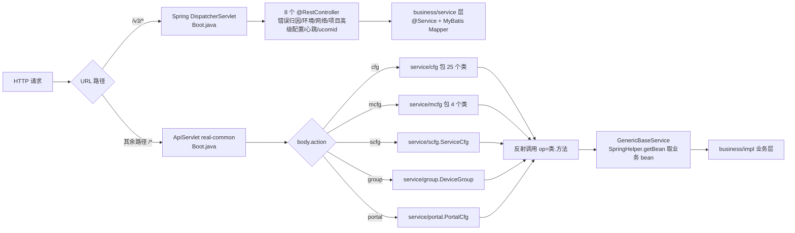
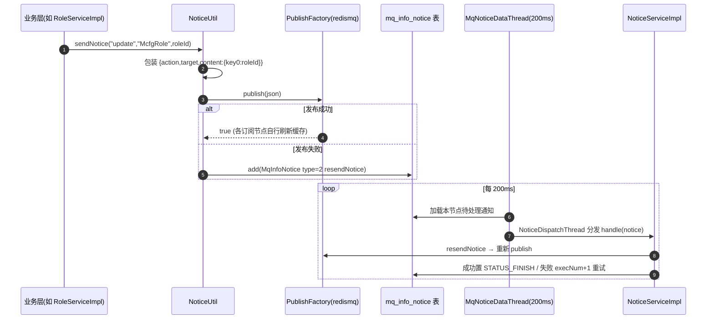
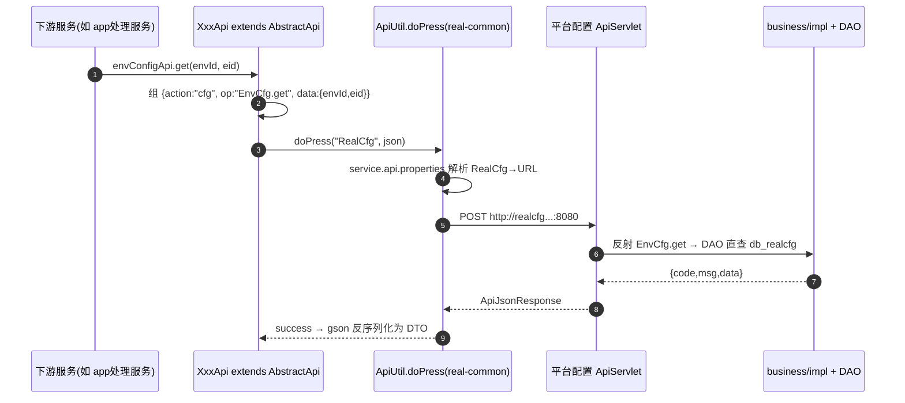

# 配置读取与缓存实现

## 概述

本文描述平台配置（real-cfg）的主干链路：**配置 CRUD 如何进库 → 变更如何广播刷新 → 下游服务如何读取**。先建立三个关键认知：

1. **本服务基本不做配置缓存**：老业务层（`cn.testin.business.impl`）绝大多数方法是 DAO 直读直写（如 `DeviceCfgServiceImpl.get` 直接 `irealcfgdevicecfgdao.get(deviceid)`，`real-cfg/src/main/java/cn/testin/business/impl/DeviceCfgServiceImpl.java`）。配置的"缓存"发生在**消费方 JVM 或 real-common 公共层**，real-cfg 的职责是改配置后发广播通知各节点失效。
2. **变更广播 = redismq + 落库重发**：`NoticeUtil.sendNotice` 先发 redismq  pub/sub，失败则落 `mq_info_notice` 表，由本进程 200ms 轮询重发，保证最终送达。
3. **下游读取 = HTTP JSON RPC**：各服务用统一协议 `{action, op, data}` POST 到 `RealCfg` 前缀对应的地址，不走 RPC 框架、不走消息队列。

## 请求入口与分发

一个进程两套 Servlet（`real-cfg/src/main/java/cn/testin/startup/Boot.java`）：

- ApiServlet 协议：body 为 JSON，`action` 决定 service 包，`op` 为 `类名.方法名`（如下游调 `EnvCfg.get`，`real-test/src/main/java/cn/testin/api/realcfg/cfg/EnvConfigApi.java`）。service 类统一继承 `GenericBaseService`，在其字段初始化时通过 `SpringHelper.getBean("IXxxService")` 拿到 XML 装配的业务 bean（`real-cfg/src/main/java/cn/testin/service/GenericBaseService.java`，bean 定义在 `real-cfg/src/main/resources/cfg/spring/Spring-Service.xml`，如  的 `IDeviceCfgService`）。
- 参数解析风格：从 `ApiRequest.getReqjson()` 逐字段 `isNull/getXxx`，校验失败抛 `GeneralException(CommonCode.paraInvalid)`，响应用 `ApiUtil.getJSONobj` 包 `{code, msg, data}`。

## 多数据源装配

启动时 `Boot.main` 先调 `DbConfigUtil.loadConfig()`（real-common，读 `cfg/db/config.json`），失败直接拒绝启动（`Boot.java`）。`config.json` 声明 6 个连接配置（`real-cfg/src/main/resources/cfg/db/config.json`）：

| cfgKey | 用途 |
|---|---|
| `dsRealcfg` | db_realcfg 主配置库（@Primary） |
| `dsMcfg` | db_mcfg OpenAPI 权限库 |
| `dsService` | db_service 菜单功能点库 |
| `dsUser` | db_user 角色库（注意：代码里多用跨库 join 而非该数据源，见 [权限体系实现](权限体系实现.md)） |
| `dsMq` | 通知消息表所在库 |
| `jedisPool` | Redis 连接池 |

数据访问是**双栈并存**：

1. **老栈（XML Spring + JDBC）**：DAO 继承 `AbstractGenericDaoImpl`，按库持有 `IGenericJdbcDAO`（`realcfgdao/mcfgdao/servicedao`，`real-cfg/src/main/java/cn/testin/dao/AbstractGenericDaoImpl.java`），底层是 proxool 连接池（`cfg/spring/Spring-MysqlDB.xml`），SQL 手写在 DAOImpl 里（如 `RoleFunctionDAOImpl.java`）。
2. **新栈（MyBatis）**：三个 `@MapperScan` 配置类按包隔离——`RealCfgMybatisConfig`（`cn.testin.mapper.realcfg` + `cn.testin.mapper.group`，`real-cfg/src/main/java/cn/testin/startup/config/RealCfgMybatisConfig.java`）、`McfgMybatisConfig.java`、`ServiceMybatisConfig.java`，各绑一个 SqlSessionFactory；分页用 PageHelper。8 个 MVC Controller 对应的新功能（错误归因、环境、项目高级配置等）全走这条栈。

## 配置变更广播（刷新机制）

### 发送侧

关键代码：

- `NoticeUtil.sendNotice(action, target, objs...)`（`real-cfg/src/main/java/cn/testin/util/NoticeUtil.java`）：把参数按 `key0/key1...` 装进 content；`publishfactory.publish` 失败时构造 `MqInfoNotice`（`vhost = Config.MODULE_NODE_ID`，type=`resendNotice(2)`）落库。
- 通知类型枚举 `CfgConfigEnum.NoticeType`（`real-cfg/src/main/java/cn/testin/pojo/realcfg/CfgConfigEnum.java`）：`cleanSource(0)` 清理设备云、`cleanDeviceCfg(1)` 清理设备云配置、`resendNotice(2)` 重发通知，有效期均 1 小时。
- 消费线程在 `Boot.main` 启动：`MqNoticeDataThread` 以 200ms 周期加载本节点（`MODULE_NODE_ID`）的 0/1/2 三类通知（`Boot.java`），`NoticeDispatchThread` 分发。

### 重试与放弃语义

`NoticeServiceImpl.handle`（`real-cfg/src/main/java/cn/testin/business/impl/NoticeServiceImpl.java`）：

- 处理前先回查 DB，通知非 `STATUS_PROCESS` 直接丢弃（防多节点重复消费）；
- 失败（RESULT_FAILURE）：`execNum+1`；**≥3 次后发布时间推后 10 秒**；**>10 次且创建超过 1 小时置 `STATUS_INVALID` 放弃**；
- 成功置 `STATUS_FINISH`。

### 本服务自消费的三个通知

`cleanSource` / `cleanDeviceCfg` / `resendNotice` 这三类通知（`CfgConfigEnum.NoticeType`，有效期均 1 小时）不是发给下游的，而是 real-cfg **本进程自产自消**的异步清理与重发机制（`Boot.main` 用 `MqNoticeDataThread` 每 200ms 只轮询这三类）：

- `cleanSource`（值 0，清理设备云信息）→ `NoticeServiceImpl.handleCleanDeviceSource`：**由 `ProjectGroupServiceImpl.remove` 触发**——删除「项目 → 子设备云」映射时，对每个 projectid>0 的项目组发该通知，处理时调 `IDeviceSourceService.delete(deviceSource)` 异步删掉对应的子设备云记录。
- `cleanDeviceCfg`（值 1，清理设备云配置）→ `NoticeServiceImpl.handleCleanDeviceCfg`：**由 `DeviceSourceServiceImpl.delete` 触发**——删除设备云（主云或子云）时发该通知（content 带 `deviceSource`/`parentName`），处理时按 `cloud` 或 `subcloud` 分页 500 条扫描 `realcfg_device_cfg`，逐台调 `DeviceCfgServiceImpl.cleanSource/cleanSubsource` 解除设备与该云的绑定，直到扫完。
- `resendNotice`（值 2，处理 redismq 通知）→ `NoticeServiceImpl.handleResendNotice`：`NoticeUtil.sendNotice` 首发失败落库后，由本线程取出重新 `publish`。

**注意触发方向与链式关系**：`DeviceSourceServiceImpl.delete` 本身是**同步**直接 `irealcfgdevicesourcedao.delete` 删掉设备云记录，再异步发 `cleanDeviceCfg` 解绑设备；而删项目组子云映射 → `cleanSource` → `IDeviceSourceService.delete(子云)` →（同步删子云）→ 再发 `cleanDeviceCfg` → 解绑设备。即「删主云」是同步删记录 + 异步解绑设备，「删子云映射」是异步删子云记录 + 异步解绑设备。

### 谁发"刷新"通知

发往**下游**的缓存刷新广播目前只有一类：角色-接口变更。`RoleServiceImpl.addApiList/removeApiList` 在改动 `mcfg_role_api` 后对每个受影响 roleId 发 `sendNotice("update", "McfgRole", roleId)`（`real-cfg/src/main/java/cn/testin/business/impl/RoleServiceImpl.java`），订阅方（开放平台网关等）收到后刷新本地的角色→接口缓存。其余配置（环境/超时/设备云等）改动**不发刷新广播**，依赖消费方自身缓存 TTL 或重启生效。

## 下游服务读取路径

下游不连 real-cfg 的库，统一走 HTTP JSON RPC：

- 前缀→URL 映射在各服务自己的 `service.api.properties`（real-cfg 的样例：`real-cfg/src/main/resources/service.api.properties`）。
- 调用方持有的前缀常量见 `AbstractApi`（如 `realCfgPrefixName = "RealCfg"`，`real-test/src/main/java/cn/testin/api/AbstractApi.java`）。

典型读取点（均为实时读库，无缓存代理）：

| 调用方 | op | 读取内容 | 代码 |
|---|---|---|---|
| app处理服务 | `EnvCfg.get` | 环境配置 | `real-test/src/main/java/cn/testin/api/realcfg/cfg/EnvConfigApi.java` |
| app处理服务 | `Timeout.get` | 超时配置 | `real-test/src/main/java/cn/testin/api/realcfg/cfg/TimeoutApi.java` |
| app处理服务 | `DbCfg.listByEnvId` | 数据库连接配置 | `real-test/src/main/java/cn/testin/api/realcfg/cfg/DBConfigApi.java` |
| app处理服务 | `PcCfg.get` | 上位机配置 | `real-test/src/main/java/cn/testin/api/realcfg/cfg/PcCfgApi.java` |
| 设备控制中心 | `DbCfg.get` | 数据库配置 | `real-controlcenter/src/main/java/cn/testin/api/real/cfg/DbConfigApi.java` |

反向地，real-cfg 也用同一套机制调别人：`cn.testin.api` 下的 `UserApi`（UserManager）、`OemApi`（core）、`UcomApi`（ControlCenter）、`ReportApi`。

## Redis 的位置

DAO 基类持有 `JedisPool`（`AbstractGenericDaoImpl.java`），通用 KV 实现 `RedisDAOImpl` 默认过期 600 秒（`real-cfg/src/main/java/cn/testin/dao/impl/redis/RedisDAOImpl.java`）；但当前全模块仅操作日志策略（`business/strategy/log/OperateLogStrategy.java`）使用，**配置主链路不过 Redis**——配置一致性靠上面的广播 + 消费方自刷新保证。

## 涉及表

- 配置主体：`db_realcfg.realcfg_*`（见 [db_realcfg 表索引](../../数据库管理/db_realcfg/00-表索引.md)）
- 权限配置：`db_mcfg.*`、`db_service.*`、`db_user.role_info`（见 [权限体系实现](权限体系实现.md)）
- 通知重发：`mq_info_notice`（dsMq 库，real-common 的 `IMqInfoNoticeDAO`）

## 注意事项与坑

1. **改配置不会自动刷新所有下游**：只有 `mcfg_role_api` 变更发了广播（`RoleServiceImpl.java`）。其余配置（环境/超时/设备云）改动后，依赖消费方自身缓存 TTL 或重启生效——给下游加新配置读取时，必须确认消费方的缓存策略。
2. **`MODULE_NODE_ID` 非法直接拒启**：`Boot.java`，`config.properties` 里 `module.node.id` 必须以 `module.id`(101) 开头（`Config.java`），通知按节点隔离，配错会消费不到重发队列。
3. **通知重发上限**：失败 >10 次且超 1 小时的通知被置 INVALID 静默丢弃（`NoticeServiceImpl.java`），没有告警，排障时先查 `mq_info_notice` 的 status。
4. **双 DAO 栈不要混**：新功能（MVC Controller）用 MyBatis Mapper + PageHelper；老 ApiServlet service 类用 `IGenericJdbcDAO` 手写 SQL。给老 service 类加表时走 `Spring-DAO.xml` 注册，不要引 Mapper（数据源绑定不同，见 `RealCfgMybatisConfig.java` 的 `sqlSessionFactoryRef` 隔离）。
5. **设备云解绑是异步的**：删设备云后 `realcfg_device_cfg` 的清理靠通知线程分页执行（`NoticeServiceImpl.java`），删除瞬间绑定关系可能短暂残留。

## 关键代码位置表

| 环节 | 类 / 方法 | 位置 |
|---|---|---|
| 双 Servlet 注册 | Boot.dispatcherMvcServlet / dispatcherV1Servlet | real-cfg/src/main/java/cn/testin/startup/Boot.java |
| 启动主流程 | Boot.main | real-cfg/src/main/java/cn/testin/startup/Boot.java |
| 通知发送 | NoticeUtil.sendNotice | real-cfg/src/main/java/cn/testin/util/NoticeUtil.java |
| 通知消费 | NoticeServiceImpl.handle | real-cfg/src/main/java/cn/testin/business/impl/NoticeServiceImpl.java |
| 通知轮询 | Boot.main（MqNoticeDataThread 200ms） | real-cfg/src/main/java/cn/testin/startup/Boot.java |
| 角色变更广播 | RoleServiceImpl.addApiList | real-cfg/src/main/java/cn/testin/business/impl/RoleServiceImpl.java |
| 数据源装配 | RealCfg/Mcfg/ServiceMybatisConfig | real-cfg/src/main/java/cn/testin/startup/config/ |
| DAO 基类 | AbstractGenericDaoImpl | real-cfg/src/main/java/cn/testin/dao/AbstractGenericDaoImpl.java |
| 下游调用样例 | EnvConfigApi.get | real-test/src/main/java/cn/testin/api/realcfg/cfg/EnvConfigApi.java |
