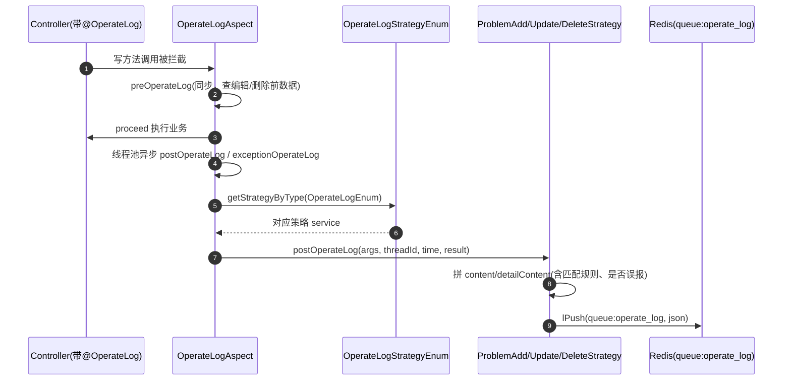

# 错误原因规则与匹配实现

## 概述

错误归因（error_cause）是 real-cfg 里唯一走**新栈（Spring MVC + MyBatis）**的业务域，也是操作日志策略模式（`@OperateLog` + 策略类）的唯一使用点。它管理四张表：

| 表 | 作用 | 关键维度 |
|---|---|---|
| `error_cause_type` | 问题类型（错误类型） | `eid` + `project_id`，`status` 逻辑删除 |
| `error_cause_log` | 错误原因（挂在某个类型下） | `error_cause_type_id` + `project_id`，`is_delete` 逻辑删除 |
| `error_cause_match_rule` | 匹配规则（错误原因 → 关键词） | `error_cause_type_id` + `error_cause_log_id` |
| `error_cause_operate_log` | 任务侧上报的错误归因操作日志 | `task_id` + `sub_task_id` + `sub_sub_task_id` |

三个 MVC 入口：`ErrorCauseTypeController`（`/realcfg/error_cause_type`）、`ErrorCauseLogController`（`/realcfg/error_cause_log`）、`ErrorCauseOperateLogController`（`/realcfg/error_cause_operate_log`），业务实现都在 `cn.testin.business.service` 包下的 `ErrorCauseTypeService` / `ErrorCauseLogService` / `ErrorCauseOperateLogService`（注意：这三个是 `@Service` 类而非接口 + impl，与其他老 service 不同）。

## 错误类型 CRUD（ErrorCauseTypeService）

调用链：`ErrorCauseTypeController` → `ErrorCauseTypeService` → `ErrorCauseTypeMapper` / `ErrorCauseLogDoMapper` / `ErrorCauseMatchRuleMapper` → `db_realcfg`。

1. **新增 `saveErrorCauseType`**：校验 name 非空、同项目下重名（`countByCondition`，`project_id = ? OR project_id = 0`）后写库。**主键是手工分配的**：`selectMaxId()` 取当前最大 id——无记录则 id 直接取 `CommonConstants.USER_ERROR_MIN`；有记录但最大 id < `USER_ERROR_MIN` 则 `maxId += 100` 作新 id（注释：部分客户自增 id 失效，故手动指定）；否则走 DB 自增。并设置 `error_report`（是否误报）。
2. **更新 `maintainErrorCauseType`**：校验 id、name 非空、重名（`countByCondition` 带 `notInId` 排除自身）后 `updateErrorCauseTypeById` 动态 set。
3. **删除 `deleteErrorCauseType`**：**逻辑删除**——`updateErrorCauseTypeById` 置 `status = INVALID`；同时级联：`updateErrorCauseLogByErrorCauseTypeId` 把该类型下错误原因 `is_delete = 1`，`deleteByErrorCauseTypeId` 物理删该类型的匹配规则。
4. **数据迁移 `syncErrorCauseType`**（`POST /realcfg/error_cause_type/sync`）：升级版本用。当 `error_cause_type` 空且 `error_cause_log` 有数据时，分页 500 条扫 `selectDistinctCase`（distinct project_id+eid），为每个项目补建名为「未设置问题类型」的默认类型（id 从 `USER_ERROR_MIN` 起递增），并 `updateQuestionIdByProjectIdEid` 把存量错误原因回填到该类型。

## 错误原因 CRUD（ErrorCauseLogService）

调用链：`ErrorCauseLogController` → `ErrorCauseLogService` → `ErrorCauseLogDoMapper` / `ErrorCauseTypeMapper` / `ErrorCauseMatchRuleMapper`。

1. **新增 `saveErrorCauseLogDo`**：校验 errorCause 非空、`errorCauseTypeId` 非空；errorCause 超 `MAX_USER_ERROR_LENGTH` 截断；重名查重（`countByErrorCauseByErrorCauseTypeId`，同一 project_id 下同 errorCause + 同 type 已存在则直接返回其数量）；插入 `error_cause_log` 后，回填「问题类型」的 update_time/update_user；若请求带 `errorCauseMatchRules` 则批量插 `error_cause_match_rule`。
2. **更新 `maintainErrorCauseLogDo`**：有 id 则 `updateById`；当 `updateMatchRule == VALID` 时先 `deleteByErrorCauseLogId` 再重插匹配规则（**全量覆盖**）；无 id 则走新增分支。
3. **删除 `deleteErrorCauseLogDo`**：`updateById` 置 `is_delete = IS_DELETE` 逻辑删除，同时 `deleteByErrorCauseLogId` 物理删匹配规则。
4. **查询**：`getByPageCondition`（分页）与 `getByCondition`（不分页）都走 `selectByCondition`，SQL 固定 `(project_id = ? OR project_id = 0) AND is_delete = 0`（**project_id=0 是跨项目共享的系统级错误原因**），按 `update_time DESC` 排序；`needRule == 1` 时用 `selectByErrorCauseLogIds` 批量取匹配规则填充。

## 匹配规则（error_cause_match_rule）

- 结构：`rule_type`（**1 = 文本包含**，当前唯一类型）、`rule_msg`（要包含的关键词）、`status`（1 有效）、`error_cause_type_id` + `error_cause_log_id` 双外键。
- 一条错误原因可挂多条匹配规则（`ErrorCauseLogDTO.errorCauseMatchRules` 列表），新增/更新时逐条 `insertBatch`。
- **规则全量导出**：`ErrorCauseTypeController.selectAllErrorCauseMatchRule` → `ErrorCauseMatchRuleMapper.selectAllErrorCauseMatchRule`，三表 join（type + log + rule），过滤 `log.is_delete = 0 AND type.status = 1 AND type.project_id = ?`，按 `type.id DESC` 输出扁平 DTO（`errorCauseTypeId/errorCauseName/errorCauseLogId/errorCauseLogName/ruleType/ruleValue`）。这是给下游（app处理服务报告侧）做失败分类用的规则清单——**匹配动作本身不在 real-cfg 执行**，real-cfg 只负责存储与提供规则。

## 任务侧操作日志（ErrorCauseOperateLogService）

调用链：`ErrorCauseOperateLogController` → `ErrorCauseOperateLogService` → `ErrorCauseOperateLogMapper`。

- `saveErrorCauseOperateLog`：先按 `errorCauseTypeId` 查类型（不存在报错），再 `saveOperateLog`。`saveOperateLog` 按 `taskId + subTaskId + subSubTaskId + recordReportCaseId` 查重——**已存在则 update（覆盖 category/errorCause/errorCauseTypeId），不存在则 insert**，实现"同一任务同一子任务幂等落一条"。
- `saveErrorCauseOperateLogBatch`：批量版，先一次性 `selectErrorCauseTypeList` 取所有涉及类型（去重 id），再循环调 `saveOperateLog`；`errorCauseTypeId == null` 的条目跳过。落库时把类型的 `error_report` 透传到操作日志。

## 操作日志 AOP 策略（错误归因的审计）

错误类型/错误原因的写操作通过 `@OperateLog` 注解 + 策略模式异步记审计（进 Redis 队列 `queue:operate_log`，不是写库）：

- `OperateLogAspect.onLogPointcutAround`（`cn.testin.aop.OperateLogAspect`）：`@Pointcut("@annotation(OperateLog)")`；**preOperateLog 必须同步执行**（避免业务太快查不到前置数据），post/exception 用 `operateLogExecutor` 线程池异步，异常吞掉不影响主流程。
- 策略注册：`InitOperateLogStrategy.init`（`@PostConstruct`）把 `ProblemAddStrategy/ProblemUpdateStrategy/ProblemDeleteStrategy` 塞进 `OperateLogStrategyEnum` 对应枚举的 service 字段。
- `ProblemUpdateStrategy.preOperateLog` 里若 `id == null`（走更新接口实为新增），post 阶段会**改派给 `ProblemAddStrategy`** 记账。
- 审计内容统一进 `OperateLogStrategy.sendOperateLogToRedis`，`moduleType = -1`，字段含 `operateObject/operateType/operateStatus/content/detailContent/createUserId/createUserName`。

## 关键坑

1. **`getByCondition`（不分页）匹配规则填不上**：`ErrorCauseLogService.getByCondition` 里 map 用 `getErrorCauseTypeId()` 作 key，取时却用 `errorCauseLogDo.getId()` 取——key 不一致导致该接口返回的 `errorCauseMatchRules` 恒为 null；分页版 `getByPageCondition` 用的是 `getErrorCauseLogId()`，正确。调用不分页接口时注意规则字段拿不到。
2. **新增错误原因的重名查重参数传错**：`saveErrorCauseLogDo` 调 `countByErrorCauseByErrorCauseTypeId(projectId, errorCause, projectId, errorCauseTypeId)`，第 3 个实参应是 `id` 却传了 `projectId`——SQL 里 `AND id != #{id}` 变成 `id != projectId`，新增时本应跳过该条件却错误排除 `id == projectId` 的行，极端场景可能漏判重名。
3. **错误类型主键手工分配**：`saveErrorCauseType` 不靠自增，靠 `selectMaxId()+100`，且默认类型 id 从 `USER_ERROR_MIN` 起——写扩展时别假设 id 连续。
4. **project_id=0 是全局共享**：错误类型/错误原因查询固定 `OR project_id = 0`，即系统级预置项对所有项目可见；新建项若 project_id=0 会变全局。

## 涉及表

| 表 | 说明 |
|---|---|
| `error_cause_type` | 问题类型，status 逻辑删除，`error_report` 标记误报 |
| `error_cause_log` | 错误原因，`is_delete` 逻辑删除 |
| `error_cause_match_rule` | 匹配规则（rule_type=1 文本包含） |
| `error_cause_operate_log` | 任务侧归因操作日志（task_id 维度幂等） |
