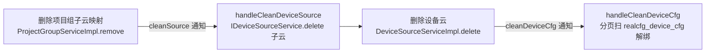

# 配置广播与设备云清理

## 主题定位

real-cfg 自己**不做配置缓存**（老业务层 DAO 直读直写），配置一致性靠「变更广播 + 消费方自刷新」实现；同时，设备云（主云/子云）的删除会触发一条**自产自消的异步清理链**。本文把这两件事的细节与坑讲透。

## 一、广播与重发机制

发送入口 `NoticeUtil.sendNotice(action, target, objs...)`（`cn.testin.util.NoticeUtil`）：把参数装成 `{action, target, content:{key0,key1...}}`，先 `publishfactory.publish` 发 redismq；失败则构造 `MqInfoNotice`（`vhost = Config.MODULE_NODE_ID`，`type = resendNotice(2)`）落 `mq_info_notice` 表。

消费线程在 `Boot.main` 启动（`cn.testin.startup.Boot`）：

- `MqNoticeDataThread` 每 200ms 加载本节点（`MODULE_NODE_ID`）三类通知（0/1/2）；
- `NoticeDispatchThread` 分发到 `NoticeServiceImpl.handle`。

`NoticeServiceImpl.handle` 的重试/放弃语义：

1. 处理前回查 DB，非 `STATUS_PROCESS` 直接丢弃（防多节点重复消费）；
2. 失败（`RESULT_FAILURE`）：`execNum+1`；**≥3 次后发布时间推后 10 秒**；**>10 次且创建超过 1 小时置 `STATUS_INVALID` 静默放弃**；
3. 成功置 `STATUS_FINISH`。

## 二、设备云删除的异步清理链

三类通知里 `cleanSource`（0）与 `cleanDeviceCfg`（1）是**本进程自产自消**的异步清理，`resendNotice`（2）是重发。三者有效期均 1 小时（`CfgConfigEnum.NoticeType`）。

- **删主云**（`DeviceSourceServiceImpl.delete`）：校验项目组/上位机未引用后，**同步** `irealcfgdevicesourcedao.delete` 删设备云记录，再发 `cleanDeviceCfg` 通知异步解绑设备。
- **删子云映射**（`ProjectGroupServiceImpl.remove`，projectid>0 时）：发 `cleanSource` 通知 → `handleCleanDeviceSource` 调 `IDeviceSourceService.delete(子云)` → 同步删子云记录 → 又发 `cleanDeviceCfg` → `handleCleanDeviceCfg` 解绑设备。
- `handleCleanDeviceCfg`：按 content 的 `parentName` 判断子云还是主云，`conditionMap` 分别用 `subcloud`/`cloud`，`list(..., 0, 500)` 分页扫描，逐台 `DeviceCfgServiceImpl.cleanSubsource/cleanSource` 从 `clouds`/`subclouds` 数组移除该云，全空删行。

**结论**：删主云 = 同步删记录 + 异步解绑设备；删子云映射 = 异步删子云记录 + 异步解绑设备。删除瞬间绑定关系可能短暂残留（靠通知线程最终收敛）。

## 三、谁触发"下游刷新"广播

发往**下游**的缓存刷新广播只有一类：`RoleServiceImpl.addApiList/removeApiList` 改 `mcfg_role_api` 后对每个 roleId 发 `sendNotice("update", "McfgRole", roleId)`。其余配置（环境/超时/设备云等）改动不发刷新广播，依赖消费方自身缓存 TTL 或重启生效。

## 四、license 资源加载

`Boot.main` 启动 `LicenseInitThread`（`cn.testin.schedule.resource.LicenseInitThread`；旧的 `ResourceInitThread` 已被注释不再启动）。它用 `LicenseFactory.createLicense(ResourceLicenseEnum.APP)` + `ResourceConfig.CA_KEY/_KEY/FINGER_PRINT` 解析 license，产出 `ResourceConfig.resource`（app，含 deviceMax/android/ios/harmonyOS 上限、expiretime、authorizedSystem）、`webResource`、`pcResource`；解析失败每 60 秒重试，成功退出线程。`Resource.get`（action=cfg）按 `type=app/web/pc` 读这三个内存对象返回（`CA_KEY` 为空直接 `configInvalid`）。

## 坑

1. `MODULE_NODE_ID` 非法直接拒启（`Boot.main`），且必须与 `module.id` 前缀一致——配错会消费不到重发队列。
2. 通知失败 >10 次且超 1 小时被置 `INVALID` 静默丢弃，无告警，排障先查 `mq_info_notice.status`。
3. 设备云删除是「记录同步删、绑定异步清」，清理窗口内 `realcfg_device_cfg` 可能残留失效绑定。
