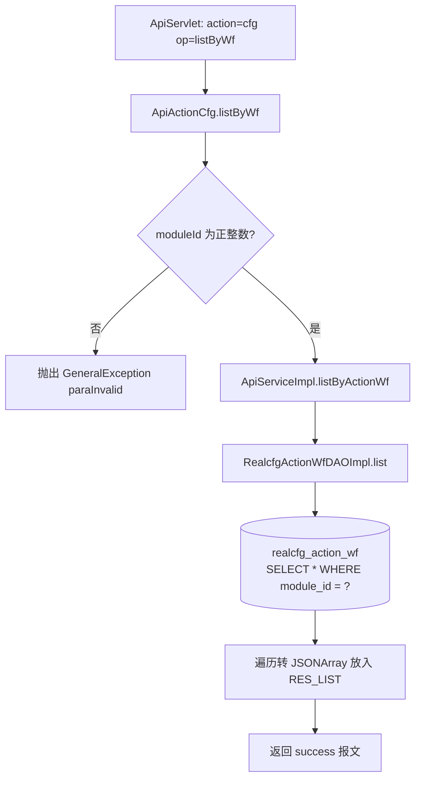
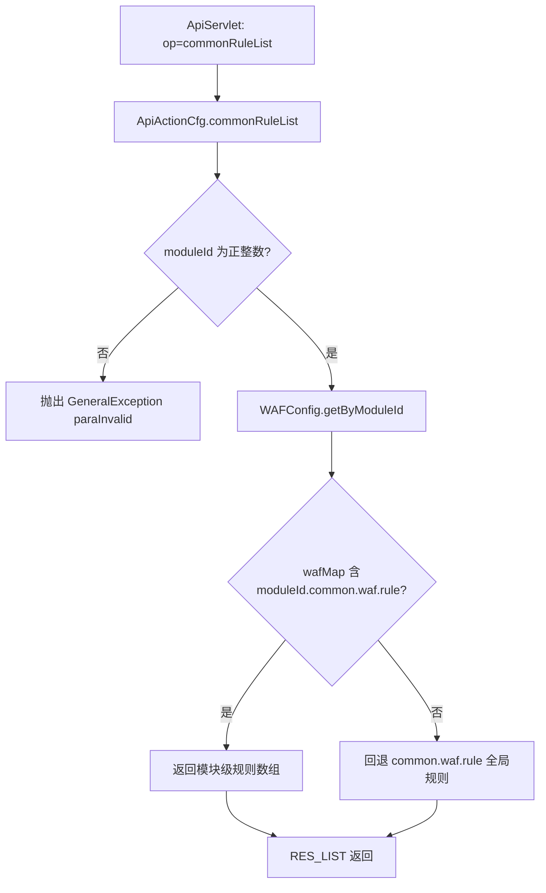

# ApiActionCfg

接口防火墙（WAF）配置查询服务：按模块查询接口级防火墙规则明细（realcfg_action_wf 表）以及通用防火墙正则规则（wafconfig.properties 文件）。

## op 一览

| op                          | 功能              |
| --------------------------- | --------------- |
| ApiActionCfg.listByWf       | 查询某模块的接口防火墙配置列表 |
| ApiActionCfg.commonRuleList | 查询某模块的通用防火墙正则规则 |

### listByWf (`ApiActionCfg.listByWf`)

- **入口**：ApiServlet，action=cfg，op=ApiActionCfg.listByWf
- **实现意图**：内部管理后台用，根据模块 ID 查询该模块下所有接口的防火墙（Web Application Firewall）配置明细，包括每个 action/op 的参数 key、长度限制、正则规则、反转规则等，用于后台展示与下发到网关校验。
- **请求参数**：

| 参数名 | 类型 | 必填 | 说明 |
| --- | --- | --- | --- |
| moduleId | Integer | 是 | 模块 ID，必须为正整数 |

- **响应结构**：datamap
  - `RES_LIST`（list）：JSONArray，元素为 `RealcfgActionWf.toJson()`，字段含 id、moduleId、apiAction、apiOp、apiKeys、minLen、maxLen、rules、reversalRules、commonRulesStatus
- **返回参数**（统一 `{code, msg, data}`，`code=0` 成功）：

| 字段 | 类型 | 说明 |
|---|---|---|
| code | Integer | 0 成功 / 非 0 失败 |
| msg | String | 提示信息 |
| data | JSONObject | 业务数据 |
| data.list | JSONArray | RealcfgActionWf 数组（id/moduleId/apiAction/apiOp/apiKeys/minLen/maxLen/rules/reversalRules/commonRulesStatus） |
- **处理流程**：



- **调用链**：cn.testin.service.cfg.ApiActionCfg → cn.testin.business.impl.ApiServiceImpl → cn.testin.dao.impl.realcfg.RealcfgActionWfDAOImpl → 表 realcfg_action_wf
- **涉及表与 SQL**：
  - `realcfg_action_wf`：SELECT（`SELECT * FROM realcfg_action_wf WHERE module_id = ?`），DAO 方法 `RealcfgActionWfDAOImpl.list(Integer)`
- **异常与校验**：moduleId 为空或 <= 0 时抛出 `GeneralException(CommonCode.paraInvalid)`，提示 "moduleId is invalid!"
- **关键代码摘录**：

```java
// real-cfg/src/main/java/cn/testin/service/cfg/ApiActionCfg.java
if (moduleId == null || moduleId <= 0) {
    String msg = CommonCode.paraInvalid.getDescr() + "(moduleId is invalid!)";
    throw new GeneralException(CommonCode.paraInvalid.getValue(), msg);
}
List<RealcfgActionWf> list = this.iapiservice.listByActionWf(moduleId);
JSONArray wfArray = new JSONArray();
if (list != null && list.size() > 0) {
    for (RealcfgActionWf wf : list) {
        wfArray.put(wf.toJson());
    }
}
datamap.put(ApiResponse.RES_LIST, wfArray);
```

### commonRuleList (`ApiActionCfg.commonRuleList`)

- **入口**：ApiServlet，action=cfg，op=ApiActionCfg.commonRuleList
- **实现意图**：查询某模块生效的通用防火墙正则规则。规则不走数据库，而是启动时从 `wafconfig.properties` 加载到 `WAFConfig.wafMap`；先找 `<moduleId>.common.waf.rule` 模块级配置，找不到则回退到全局 `common.waf.rule`。
- **请求参数**：

| 参数名 | 类型 | 必填 | 说明 |
| --- | --- | --- | --- |
| moduleId | Integer | 是 | 模块 ID，必须为正整数 |

- **响应结构**：datamap
  - `RES_LIST`（list）：String[] 正则规则数组；无配置时为空数组
- **返回参数**（统一 `{code, msg, data}`，`code=0` 成功）：

| 字段 | 类型 | 说明 |
|---|---|---|
| code | Integer | 0 成功 / 非 0 失败 |
| msg | String | 提示信息 |
| data | JSONObject | 业务数据 |
| data.list | JSONArray | String 正则规则数组 |
- **处理流程**：



- **调用链**：cn.testin.service.cfg.ApiActionCfg → cn.testin.util.WAFConfig（静态加载 wafconfig.properties），不访问数据库
- **涉及表与 SQL**：无（配置来自 real-cfg/src/main/resources/wafconfig.properties）
- **异常与校验**：moduleId 非法时抛出 `GeneralException(CommonCode.paraInvalid)`；WAFConfig 返回 null 时以空数组兜底
- **关键代码摘录**：

```java
// real-cfg/src/main/java/cn/testin/service/cfg/ApiActionCfg.java
String[] rules = WAFConfig.getByModuleId(moduleId);
if (rules == null) {
    rules = new String[]{};
}
datamap.put(ApiResponse.RES_LIST, rules);

// real-cfg/src/main/java/cn/testin/util/WAFConfig.java
String key = String.format("%s.%s", moduleId.toString(), COMMON_WAF_RULE_KEY);
if (wafMap.containsKey(key)) {
    return wafMap.get(key);
} else {
    return wafMap.get(COMMON_WAF_RULE_KEY);   // 回退全局规则
}
```
