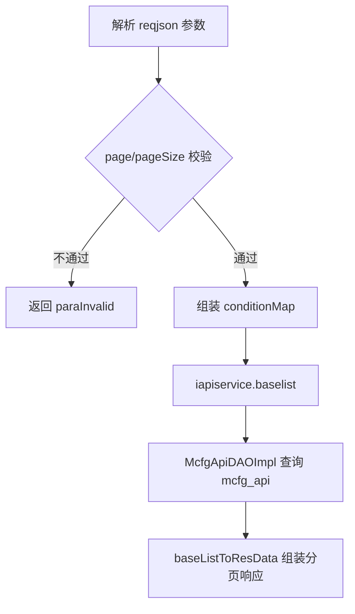
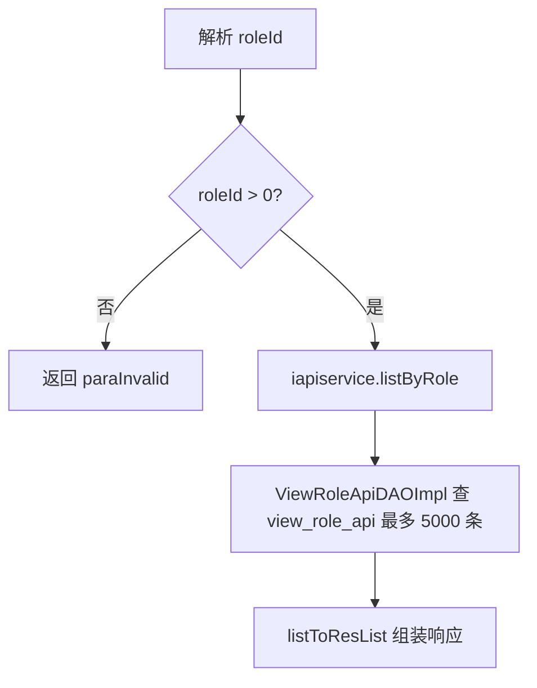

# ApiCfg

## 职责
openapi 体系中"接口（API）元数据"的查询配置类。管理 `mcfg_api` 表（每个 action/op 对应一条 API 记录）及其与角色的关联视图，供内部管理后台做 openapi 权限配置。

- 源码：`real-cfg/src/main/java/cn/testin/service/mcfg/ApiCfg.java`
- 入口：ApiServlet 按 `action=mcfg`、`op=<方法名>` 反射调用 `public String xxx(ApiRequest)` 方法。

## op 一览表

| op | 说明 | 主要表 |
|---|---|---|
| list | API 元数据分页查询 | mcfg_api |
| listByRole | 按角色查询其拥有的 API 列表 | view_role_api |

---

### list (`ApiCfg.list`)
- **入口**：ApiServlet，action=mcfg，op=ApiCfg.list
- **实现意图**：按模块 ID / apiAction / apiOp 条件分页查询 openapi 接口元数据列表，用于后台 API 管理页面。
- **请求参数**：

| 参数名 | 类型 | 必填 | 说明 |
|---|---|---|---|
| moduleId | int | 否 | 所属模块 ID（对应 mcfg_module.id） |
| apiAction | string | 否 | API 的 action 名（精确匹配） |
| apiOp | string | 否 | API 的 op 名（精确匹配） |
| page | int | 是 | 页码，必须 > 0 |
| pageSize | int | 是 | 每页条数，1 ~ Config.MaxSize |

- **响应结构**：datamap 的 key 及含义
  - `list`：McfgApi 数组（id、moduleId、apiAction、apiOp、描述、状态等）
  - `page` / `pageSize` / `totalRow` / `totalPage`：分页信息
- **返回参数**（统一 `{code, msg, data}`，`code=0` 成功）：

| 字段 | 类型 | 说明 |
|---|---|---|
| code | Integer | 0 成功 / 非 0 失败 |
| msg | String | 提示信息 |
| data | JSONObject | 业务数据 |
| data.list | JSONArray | McfgApi 数组 |
| data.page | Integer | 当前页 |
| data.pageSize | Integer | 每页条数 |
| data.totalRow | Integer | 总行数 |
| data.totalPage | Integer | 总页数 |
- **处理流程**：

- **调用链**：ApiCfg → ApiServiceImpl（business.impl）→ McfgApiDAOImpl → 表 mcfg_api
- **涉及表与 SQL**：
  - `mcfg_api`：SELECT count(*) / SELECT *（条件 `module_id=?`、`api_action=?`、`api_op=?`），mapper/DAO 方法 `McfgApiDAOImpl.baselist / list / rowsCount`
- **异常与校验**：
  - `page <= 0` 或为空 → `paraInvalid (page is invalid!)`
  - `pageSize <= 0` 或 `> Config.MaxSize` → `paraInvalid (pageSize is invalid!)`
  - 查询结果为 null → `unknown`
- **关键代码摘录**：
```java
// real-cfg/src/main/java/cn/testin/service/mcfg/ApiCfg.java
BaseList<McfgApi> baseList = this.iapiservice.baselist(conditionMap, page, pageSize);
if (baseList == null || baseList.getList() == null) {
    return ApiUtil.getResult(apirequest, CommonCode.unknown.getValue(), CommonCode.unknown.getDescr());
}
JSONObject jObj = ApiUtil.getJSONobj(apirequest, CommonCode.success.getValue(), CommonCode.success.getDescr());
Map<String, Object> datamap = new HashMap<>();
baseListToResData(datamap, baseList);
jObj.put(ApiResponse.RES_DATA, datamap);
```

---

### listByRole (`ApiCfg.listByRole`)
- **入口**：ApiServlet，action=mcfg，op=ApiCfg.listByRole
- **实现意图**：查询某个角色已配置的全部 API（含角色级协议配置），用于角色-API 授权管理页面。
- **请求参数**：

| 参数名 | 类型 | 必填 | 说明 |
|---|---|---|---|
| roleId | int | 是 | 角色 ID，必须 > 0 |

- **响应结构**：datamap 的 key 及含义
  - `list`：ViewRoleApi 数组（角色 ID、API ID、apiAction、apiOp、protocolConfig、状态等视图字段）
- **返回参数**（统一 `{code, msg, data}`，`code=0` 成功）：

| 字段 | 类型 | 说明 |
|---|---|---|
| code | Integer | 0 成功 / 非 0 失败 |
| msg | String | 提示信息 |
| data | JSONObject | 业务数据 |
| data.list | JSONArray | ViewRoleApi 数组 |
- **处理流程**：

- **调用链**：ApiCfg → ApiServiceImpl.listByRole → ViewRoleApiDAOImpl.list → 视图 view_role_api
- **涉及表与 SQL**：
  - `view_role_api`：SELECT * WHERE `role_id=?`（offset=0, max=5000），DAO 方法 `ViewRoleApiDAOImpl.list`
- **异常与校验**：
  - `roleId` 为空或 `<= 0` → `paraInvalid (roleId is invalid!)`
- **关键代码摘录**：
```java
// real-cfg/src/main/java/cn/testin/business/impl/ApiServiceImpl.java
@Override
public List<ViewRoleApi> listByRole(Integer roleId) throws GeneralException {
    Map<String, Object> conditionMap = new HashMap<>();
    conditionMap.put("roleId", roleId);
    return this.iviewroleapidao.list(conditionMap, 0, 5000);
}
```
