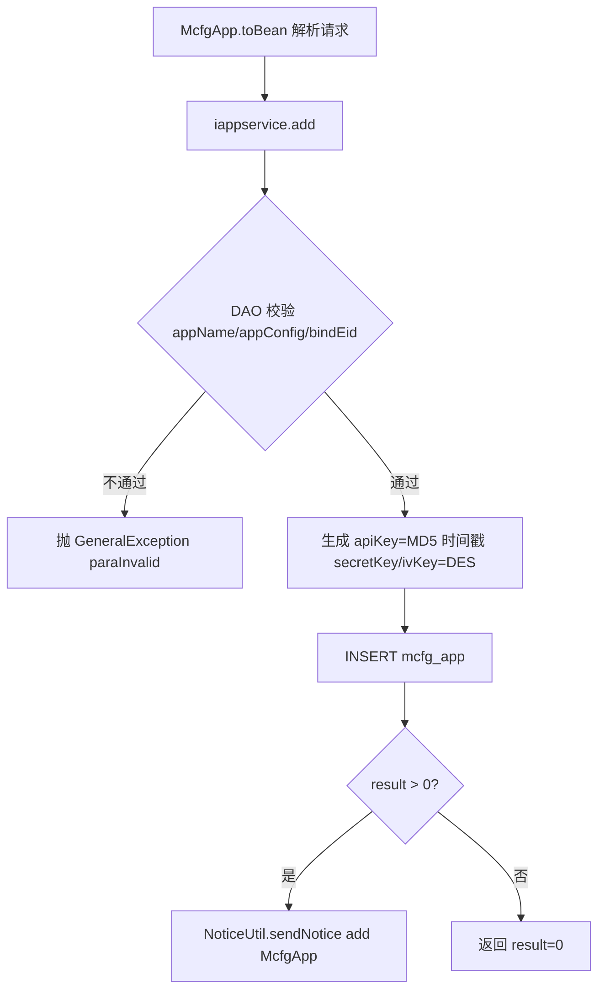
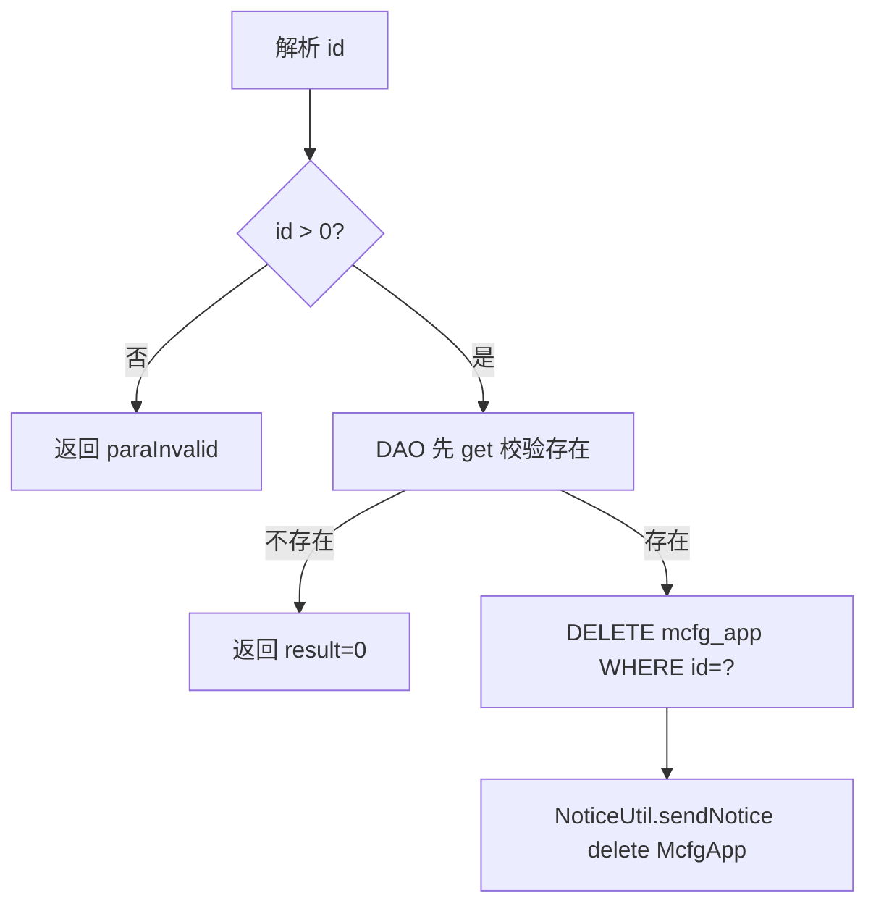
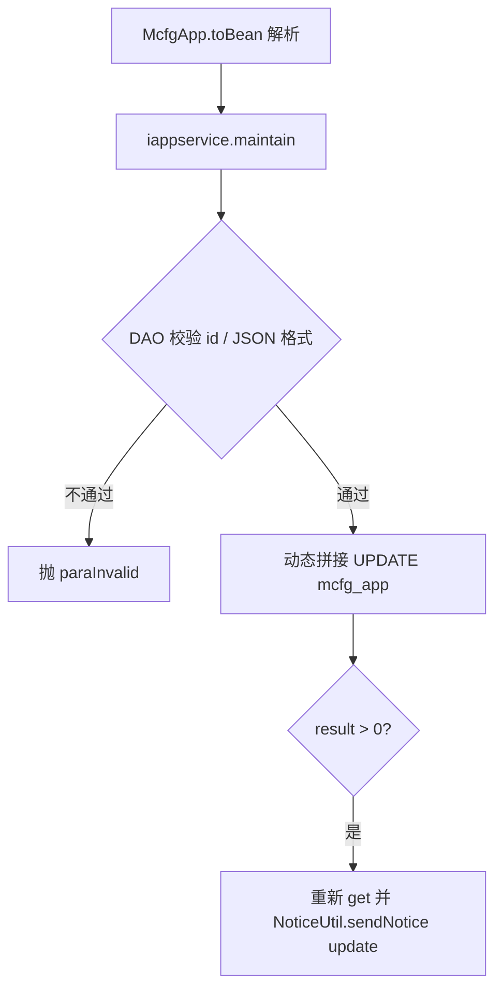
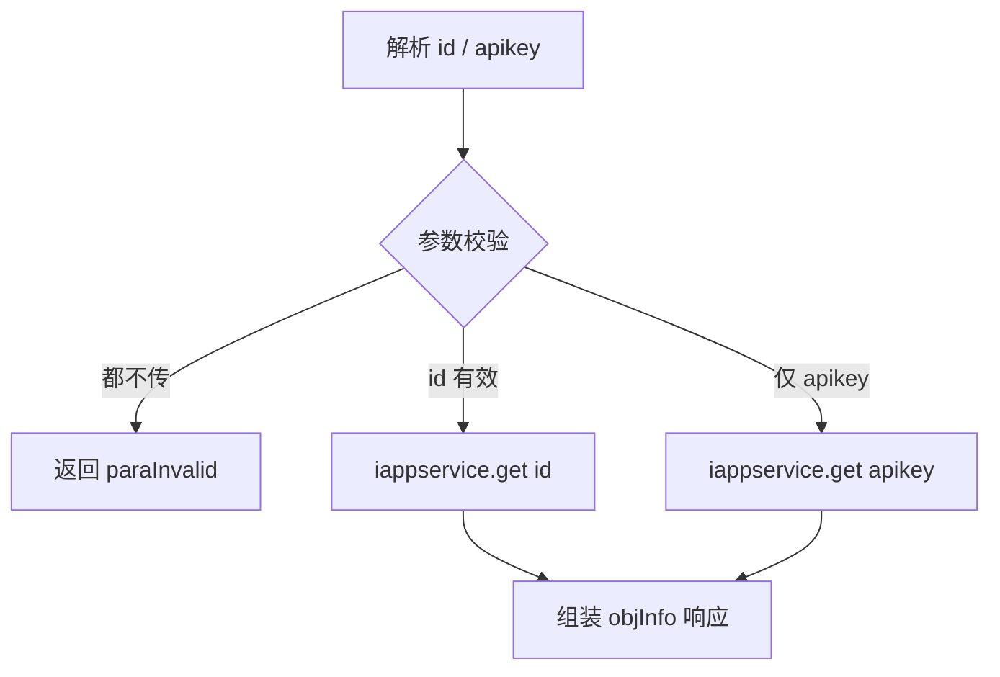
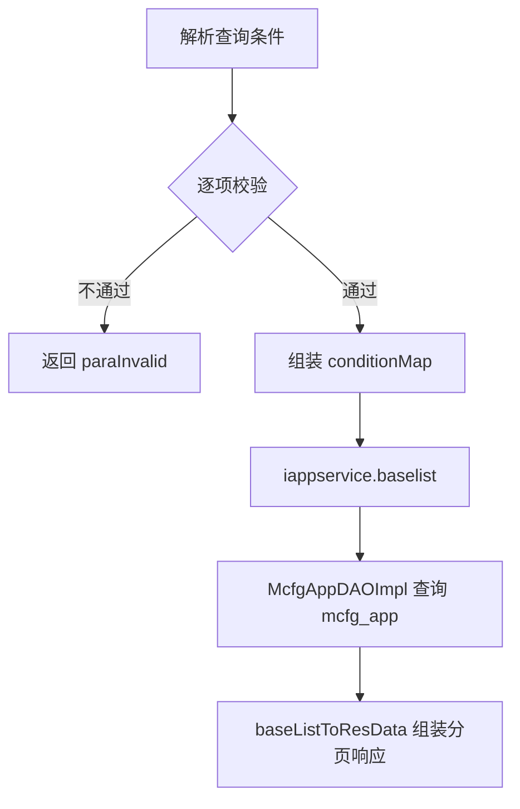

# AppCfg

## 职责
openapi 接入方（App）配置管理。维护 `mcfg_app` 表：每个接入方一条记录，包含 appName、apiKey、secretKey、ivKey、IP 白名单、绑定企业（bindEid）、角色集合（roles）等。新增时自动生成 apiKey（MD5(时间戳)）与 DES 密钥对。所有增删改成功后通过 NoticeUtil 发异步通知，供缓存/网关侧刷新。

- 源码：`real-cfg/src/main/java/cn/testin/service/mcfg/AppCfg.java`
- 入口：ApiServlet 按 `action=mcfg`、`op=<方法名>` 反射调用。

## op 一览表

| op | 说明 | 主要表 |
|---|---|---|
| add | 新增接入方 | mcfg_app |
| delete | 按 id 删除接入方 | mcfg_app |
| maintain | 按 id 更新接入方 | mcfg_app |
| get | 按 id 或 apikey 查询单个接入方 | mcfg_app |
| list | 接入方分页查询 | mcfg_app |

---

### add (`AppCfg.add`)
- **入口**：ApiServlet，action=mcfg，op=AppCfg.add
- **实现意图**：新增一个 openapi 接入方，自动生成 apiKey / secretKey / ivKey，默认状态为启用、roles 默认 `[]`、ips 默认 `127.0.0.1`。
- **请求参数**（整包 JSON 由 `McfgApp.toBean` 映射）：

| 参数名 | 类型 | 必填 | 说明 |
|---|---|---|---|
| appName | string | 是 | 接入方名称 |
| appConfig | string | 是 | 应用配置，必须是合法 JSON 字符串 |
| bindEid | int | 是 | 绑定的企业 ID |
| ips | string | 否 | IP 白名单，默认 127.0.0.1 |
| roles | string | 否 | 角色 ID 数组 JSON 字符串，默认 `[]` |
| description | string | 否 | 描述 |

- **响应结构**：datamap 的 key 及含义
  - `result`：1 成功 / 0 失败（由插入影响行数换算）
- **返回参数**（统一 `{code, msg, data}`，`code=0` 成功）：

| 字段 | 类型 | 说明 |
|---|---|---|
| code | Integer | 0 成功 / 非 0 失败 |
| msg | String | 提示信息 |
| data | JSONObject | 业务数据 |
| data.result | Integer | 1 成功 / 0 失败 |
- **处理流程**：

- **调用链**：AppCfg → AppServiceImpl.add → McfgAppDAOImpl.add → 表 mcfg_app；NoticeUtil → redismq 发布，失败时落 notice-manager（INoticeService.add 重发通知）
- **涉及表与 SQL**：
  - `mcfg_app`：INSERT（app_name, api_key, app_config, secret_key, iv_key, ips, bind_eid, roles, description, status, createtime, updatetime），DAO 方法 `McfgAppDAOImpl.add`
- **异常与校验**：
  - appName / appConfig / bindEid 为空 → `paraInvalid`
  - appConfig 非合法 JSON → `paraInvalid`
- **关键代码摘录**：
```java
// real-cfg/src/main/java/cn/testin/dao/impl/mcfg/McfgAppDAOImpl.java
MD5 md5 = new MD5();
app.setApiKey(md5.getMD5ofStr("" + System.currentTimeMillis()));
app.setSecretKey(ByteUtil.byte2hex(DES.generateKey()));
app.setIvKey(ByteUtil.byte2hex(DES.generateKey()));
Integer result = this.getMcfgdao().insert(sql.toString(), params.toArray(), configJson);
if (result > 0) {
    NoticeUtil.sendNotice("add", "McfgApp", result, app.getApiKey());
}
```

---

### delete (`AppCfg.delete`)
- **入口**：ApiServlet，action=mcfg，op=AppCfg.delete
- **实现意图**：按主键 id 物理删除接入方记录；删除成功发异步通知。
- **请求参数**：

| 参数名 | 类型 | 必填 | 说明 |
|---|---|---|---|
| id | int | 是 | 接入方主键，必须 > 0 |

- **响应结构**：datamap 的 key 及含义
  - `result`：删除影响行数（记录不存在时为 0）
- **返回参数**（统一 `{code, msg, data}`，`code=0` 成功）：

| 字段 | 类型 | 说明 |
|---|---|---|
| code | Integer | 0 成功 / 非 0 失败 |
| msg | String | 提示信息 |
| data | JSONObject | 业务数据 |
| data.result | Integer | 删除影响行数（记录不存在为 0） |
- **处理流程**：

- **调用链**：AppCfg → AppServiceImpl.delete → McfgAppDAOImpl.delete → 表 mcfg_app；NoticeUtil（notice-manager 兜底）
- **涉及表与 SQL**：
  - `mcfg_app`：SELECT（存在性校验）+ DELETE WHERE `id=?`，DAO 方法 `McfgAppDAOImpl.delete`
- **异常与校验**：
  - `id` 为空或 `<= 0` → `paraInvalid (id is invalid)`
- **关键代码摘录**：
```java
// real-cfg/src/main/java/cn/testin/dao/impl/mcfg/McfgAppDAOImpl.java
McfgApp app = get(id);
if (app == null) { return 0; }
Integer result = this.getMcfgdao().update("DELETE FROM " + McfgApp.table() + " where id = ? ", new Object[]{id});
if (result != null && result > 0) {
    NoticeUtil.sendNotice("delete", "McfgApp", id, app.getApiKey());
}
```

---

### maintain (`AppCfg.maintain`)
- **入口**：ApiServlet，action=mcfg，op=AppCfg.maintain
- **实现意图**：按 id 动态更新接入方字段（仅更新非空字段），appConfig / roles 需为合法 JSON；更新成功发异步通知。
- **请求参数**（由 `McfgApp.toBean` 映射）：

| 参数名 | 类型 | 必填 | 说明 |
|---|---|---|---|
| id | int | 是 | 接入方主键 |
| appName | string | 否 | 名称 |
| appConfig | string | 否 | 应用配置，合法 JSON |
| ips | string | 否 | IP 白名单 |
| bindEid | int | 否 | 绑定企业 ID |
| roles | string | 否 | 角色数组 JSON |
| description | string | 否 | 描述 |
| status | int | 否 | 状态（1 启用 / 0 停用） |

- **响应结构**：datamap 的 key 及含义
  - `result`：1 成功 / 0 失败
- **返回参数**（统一 `{code, msg, data}`，`code=0` 成功）：

| 字段 | 类型 | 说明 |
|---|---|---|
| code | Integer | 0 成功 / 非 0 失败 |
| msg | String | 提示信息 |
| data | JSONObject | 业务数据 |
| data.result | Integer | 1 成功 / 0 失败 |
- **处理流程**：

- **调用链**：AppCfg → AppServiceImpl.maintain → McfgAppDAOImpl.update → 表 mcfg_app；NoticeUtil（notice-manager 兜底）
- **涉及表与 SQL**：
  - `mcfg_app`：UPDATE ... WHERE `id=?`（动态字段），DAO 方法 `McfgAppDAOImpl.update`
- **异常与校验**：
  - id 为空 → `paraInvalid`
  - appConfig / roles 非合法 JSON → `paraInvalid`
- **关键代码摘录**：
```java
// real-cfg/src/main/java/cn/testin/dao/impl/mcfg/McfgAppDAOImpl.java
sql.append("updatetime = ? ");
params.add(System.currentTimeMillis());
if (mcfgapp.getAppName() != null) { sql.append(", app_name = ? "); params.add(mcfgapp.getAppName()); }
// ... 其余字段按需拼接
sql.append(" WHERE id = ?");
Integer result = this.getMcfgdao().update(sql.toString(), params.toArray());
```

---

### get (`AppCfg.get`)
- **入口**：ApiServlet，action=mcfg，op=AppCfg.get
- **实现意图**：按 id 或 apikey 查询单个接入方详情；两者至少传一个，id 优先。
- **请求参数**：

| 参数名 | 类型 | 必填 | 说明 |
|---|---|---|---|
| id | int | 否 | 主键，传入时必须 > 0 |
| apikey | string | 否 | 接入方 apiKey，传入时不能为空白 |

- **响应结构**：datamap 的 key 及含义
  - `objInfo`：McfgApp 的 JSON（存在时）
- **返回参数**（统一 `{code, msg, data}`，`code=0` 成功）：

| 字段 | 类型 | 说明 |
|---|---|---|
| code | Integer | 0 成功 / 非 0 失败 |
| msg | String | 提示信息 |
| data | JSONObject | 业务数据 |
| data.objInfo | JSONObject | McfgApp 详情（id/appName/apiKey/appConfig/secretKey/ivKey/ips/bindEid/roles/description/status/createtime/updatetime） |
- **处理流程**：

- **调用链**：AppCfg → AppServiceImpl.get → McfgAppDAOImpl.get → 表 mcfg_app
- **涉及表与 SQL**：
  - `mcfg_app`：SELECT * WHERE `id=?` 或 `api_key=?`，DAO 方法 `McfgAppDAOImpl.get(Integer) / get(String)`
- **异常与校验**：
  - `id <= 0`、`apikey` 空白、两者均不传 → `paraInvalid`
- **关键代码摘录**：
```java
// real-cfg/src/main/java/cn/testin/service/mcfg/AppCfg.java
if (id != null) {
    app = this.iappservice.get(id);
} else if (apikey != null) {
    app = this.iappservice.get(apikey);
} else {
    return ApiUtil.getResult(apirequest, CommonCode.paraInvalid.getValue(), CommonCode.paraInvalid.getDescr());
}
```

---

### list (`AppCfg.list`)
- **入口**：ApiServlet，action=mcfg，op=AppCfg.list
- **实现意图**：按 apikey（精确）/ appName（模糊）/ description（模糊）/ status 条件分页查询接入方列表。
- **请求参数**：

| 参数名 | 类型 | 必填 | 说明 |
|---|---|---|---|
| apikey | string | 否 | 精确匹配 api_key |
| appName | string | 否 | 模糊匹配 app_name（like %x%） |
| description | string | 否 | 模糊匹配 description |
| status | int | 否 | 状态，传入时必须 >= 0 |
| page | int | 是 | 页码，> 0 |
| pageSize | int | 是 | 每页条数，1 ~ Config.MaxSize |

- **响应结构**：datamap 的 key 及含义
  - `list`：McfgApp 数组
  - `page` / `pageSize` / `totalRow` / `totalPage`：分页信息
- **返回参数**（统一 `{code, msg, data}`，`code=0` 成功）：

| 字段 | 类型 | 说明 |
|---|---|---|
| code | Integer | 0 成功 / 非 0 失败 |
| msg | String | 提示信息 |
| data | JSONObject | 业务数据 |
| data.list | JSONArray | McfgApp 数组 |
| data.page | Integer | 当前页 |
| data.pageSize | Integer | 每页条数 |
| data.totalRow | Integer | 总行数 |
| data.totalPage | Integer | 总页数 |
- **处理流程**：

- **调用链**：AppCfg → AppServiceImpl.baselist → McfgAppDAOImpl.baselist → 表 mcfg_app
- **涉及表与 SQL**：
  - `mcfg_app`：SELECT count(*) / SELECT *（`api_key=?`、`app_name like ?`、`description like ?`、`status=?`），DAO 方法 `McfgAppDAOImpl.baselist / list / rowsCount`
- **异常与校验**：
  - 字符串参数传入但为空白 → `paraInvalid`
  - `status < 0`、`page <= 0`、`pageSize` 越界 → `paraInvalid`
  - 查询结果 null → `unknown`
- **关键代码摘录**：
```java
// real-cfg/src/main/java/cn/testin/service/mcfg/AppCfg.java
Map<String, Object> conditionMap = new HashMap<>();
if (apikey != null) { conditionMap.put("apikey", apikey); }
if (appName != null) { conditionMap.put("appName", appName); }
if (description != null) { conditionMap.put("description", description); }
if (status != null) { conditionMap.put("status", status); }
BaseList<McfgApp> baseList = this.iappservice.baselist(conditionMap, page, pageSize);
```
