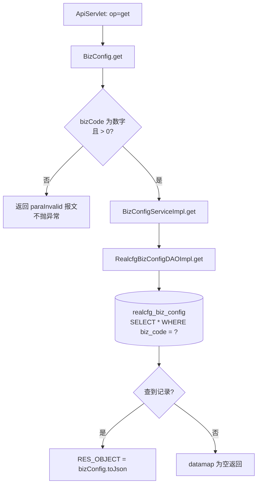
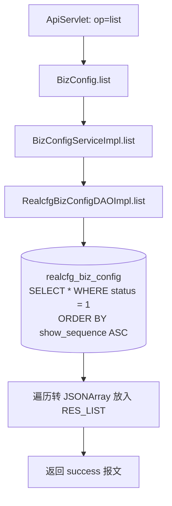

# BizConfig

业务包配置查询服务：查询平台业务包（测试类型产品）配置，对应 realcfg_biz_config 表，只读。

## op 一览

| op | 功能 |
| --- | --- |
| get | 按 bizCode 查询单个业务包配置 |
| list | 查询全部有效业务包配置列表 |

### get (`BizConfig.get`)

- **入口**：ApiServlet，action=cfg，op=BizConfig.get
- **实现意图**：根据业务编码 bizCode 查询单个业务包（如兼容测试、远程真机等业务线）的配置详情，包括名称、测试类型、扩展配置 JSON。
- **请求参数**：

| 参数名 | 类型 | 必填 | 说明 |
| --- | --- | --- | --- |
| bizCode | Integer | 是 | 业务编码，必须为数字且为正整数 |

- **响应结构**：datamap
  - `RES_OBJECT`（objInfo）：`RealcfgBizConfig.toJson()`，字段含 bizCode、name、testType、config、descr；查不到时 datamap 为空
- **返回参数**（统一 `{code, msg, data}`，`code=0` 成功）：

| 字段 | 类型 | 说明 |
|---|---|---|
| code | Integer | 0 成功 / 非 0 失败 |
| msg | String | 提示信息 |
| data | JSONObject | 业务数据 |
| data.objInfo | JSONObject | RealcfgBizConfig 详情（bizCode/name/testType/config/descr） |
- **处理流程**：



- **调用链**：cn.testin.service.cfg.BizConfig → cn.testin.business.impl.BizConfigServiceImpl → cn.testin.dao.impl.realcfg.RealcfgBizConfigDAOImpl → 表 realcfg_biz_config
- **涉及表与 SQL**：
  - `realcfg_biz_config`：SELECT（`SELECT * FROM realcfg_biz_config WHERE biz_code = ?`），DAO 方法 `RealcfgBizConfigDAOImpl.get(Integer)`
- **异常与校验**：bizCode 非法时通过 `ApiUtil.getResult` 返回 `CommonCode.paraInvalid`（注意此处是直接返回错误报文而非抛异常）；DAO 层异常被 catch 后返回 null
- **关键代码摘录**：

```java
// real-cfg/src/main/java/cn/testin/service/cfg/BizConfig.java
if (!reqjson.isNull("bizCode") && StringUtils.isNumeric(reqjson.opt("bizCode").toString())) {
    bizCode = reqjson.getInt("bizCode");
}
if (bizCode == null || bizCode <= 0) {
    String msg = CommonCode.paraInvalid.getDescr() + "(bizCode is invalid!)";
    return ApiUtil.getResult(apirequest, CommonCode.paraInvalid.getValue(), msg);
}
RealcfgBizConfig bizConfig = irealcfgbizconfigservice.get(bizCode);
```

### list (`BizConfig.list`)

- **入口**：ApiServlet，action=cfg，op=BizConfig.list
- **实现意图**：查询所有有效（status=1）的业务包配置，按展示顺序 show_sequence 升序返回，供前台/后台展示业务包菜单。无请求参数。
- **请求参数**：无

| 字段 | 类型 | 必填 | 说明 |
|---|---|---|---|
| 无 | — | 否 | 无请求参数 |
- **响应结构**：datamap
  - `RES_LIST`（list）：JSONArray，元素为 `RealcfgBizConfig.toJson()`
- **返回参数**（统一 `{code, msg, data}`，`code=0` 成功）：

| 字段 | 类型 | 说明 |
|---|---|---|
| code | Integer | 0 成功 / 非 0 失败 |
| msg | String | 提示信息 |
| data | JSONObject | 业务数据 |
| data.list | JSONArray | RealcfgBizConfig 数组 |
- **处理流程**：



- **调用链**：cn.testin.service.cfg.BizConfig → cn.testin.business.impl.BizConfigServiceImpl → cn.testin.dao.impl.realcfg.RealcfgBizConfigDAOImpl → 表 realcfg_biz_config
- **涉及表与 SQL**：
  - `realcfg_biz_config`：SELECT（`SELECT * FROM realcfg_biz_config where status = 1 order by show_sequence ASC`），DAO 方法 `RealcfgBizConfigDAOImpl.list()`
- **异常与校验**：无参数；DAO 异常被 catch 后返回 null，service 层判空返回空数组
- **关键代码摘录**：

```java
// real-cfg/src/main/java/cn/testin/service/cfg/BizConfig.java
List<RealcfgBizConfig> list = irealcfgbizconfigservice.list();
JSONArray bizConfigJsonarr = new JSONArray();
if (list != null) {
    for (RealcfgBizConfig bizConfig : list) {
        bizConfigJsonarr.put(bizConfig.toJson());
    }
}
datamap.put(ApiResponse.RES_LIST, bizConfigJsonarr);
```
