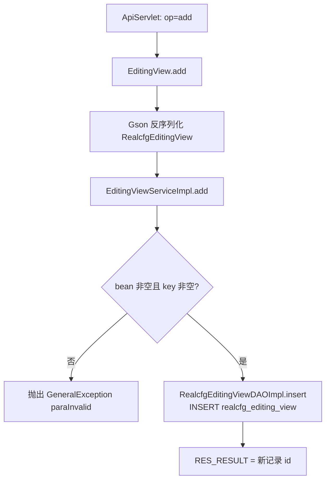
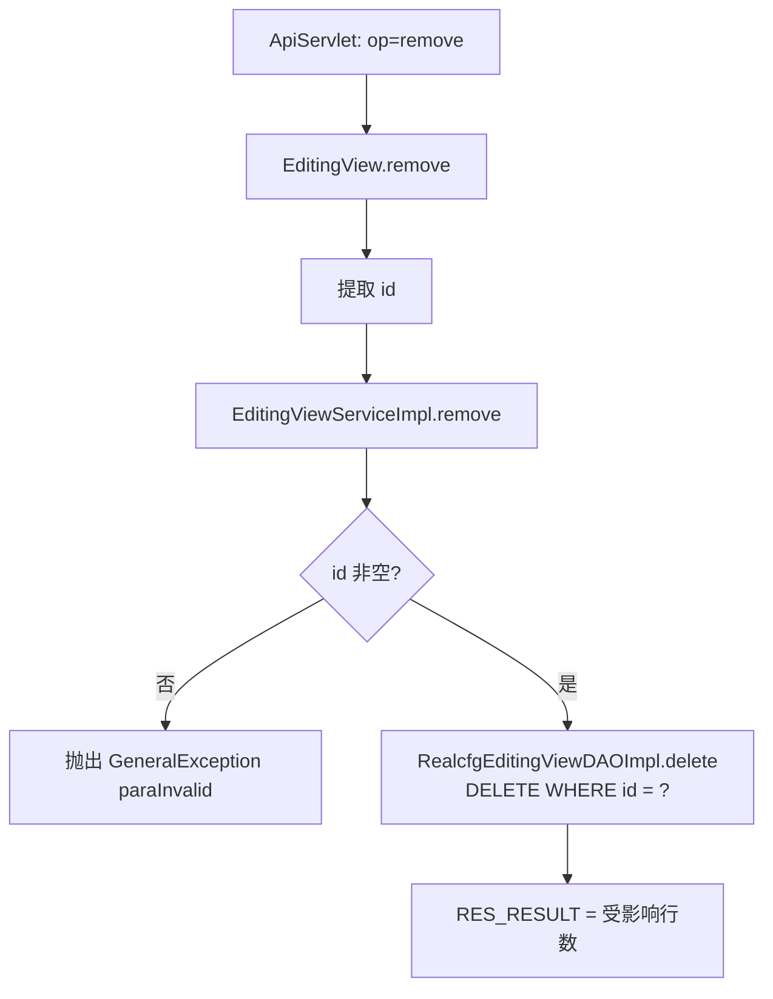
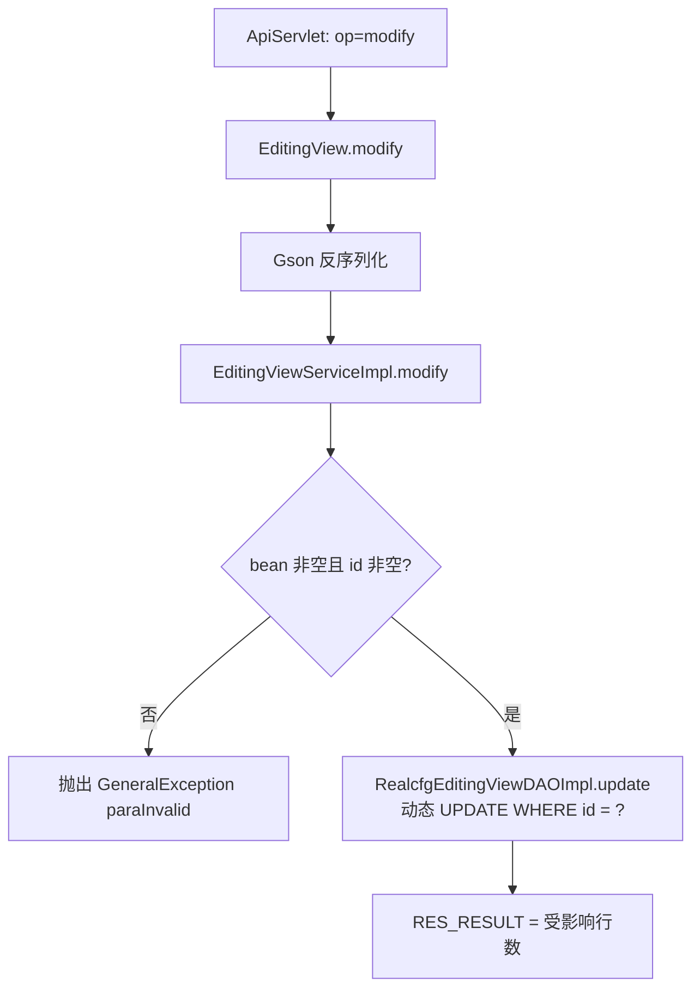
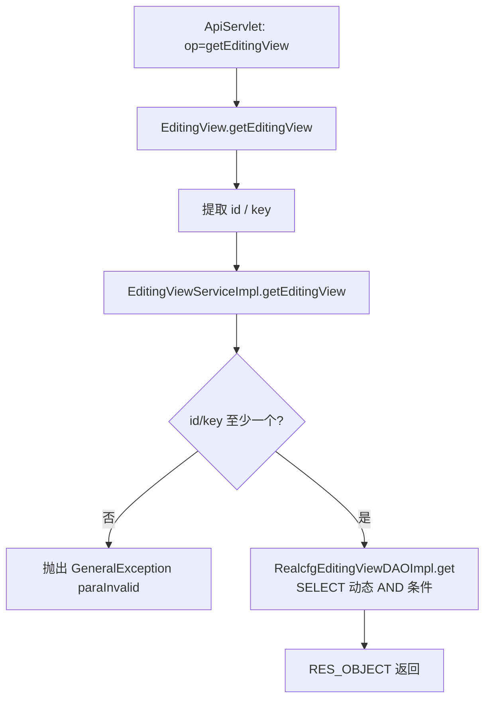
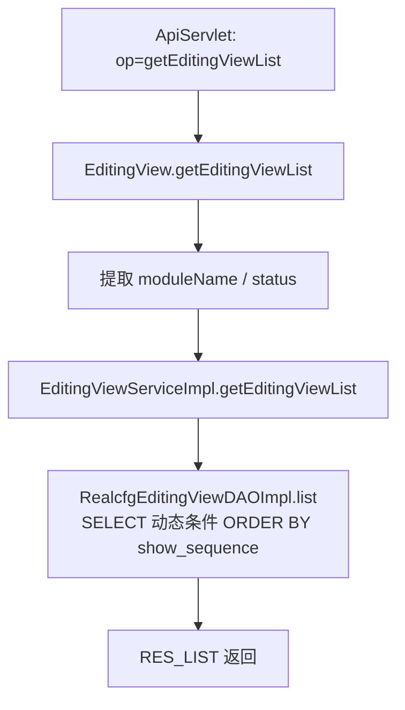

# EditingView

运营采编内容管理服务：维护按模块（moduleName）+ 键（key）组织的采编内容（realcfg_editing_view 表），如前台 Banner、公告、运营位内容，支持增删改、单查与列表查询。

## op 一览

| op | 功能 |
| --- | --- |
| add | 新增采编数据 |
| remove | 按 id 删除采编数据 |
| modify | 修改采编数据 |
| getEditingView | 按 id 或 key 查询单条采编 |
| getEditingViewList | 按模块/状态查询采编列表 |

### add (`EditingView.add`)

- **入口**：ApiServlet，action=cfg，op=EditingView.add
- **实现意图**：新增一条采编内容记录。业务层强制校验 key 非空；插入时 status 固定为启用（STATUS_ON），id 由序列 seq_realcfg_editing_view 生成。
- **请求参数**（Gson 反序列化为 RealcfgEditingView）：

| 参数名 | 类型 | 必填 | 说明 |
| --- | --- | --- | --- |
| moduleName | String | 否 | 所属模块名 |
| key | String | 是 | 采编键（业务层校验） |
| value | String | 否 | 采编内容（通常为 JSON） |
| showSequence | Integer | 否 | 展示顺序 |
| expireTime | Long | 否 | 过期时间（毫秒） |

- **响应结构**：datamap
  - `RES_RESULT`（result）：Integer，新增记录 id（>0 成功）
- **返回参数**（统一 `{code, msg, data}`，`code=0` 成功）：

| 字段 | 类型 | 说明 |
|---|---|---|
| code | Integer | 0 成功 / 非 0 失败 |
| msg | String | 提示信息 |
| data | JSONObject | 业务数据 |
| data.result | Integer | 新增记录 id（>0 成功） |
- **处理流程**：



- **调用链**：cn.testin.service.cfg.EditingView → cn.testin.business.impl.EditingViewServiceImpl → cn.testin.dao.impl.realcfg.RealcfgEditingViewDAOImpl → 表 realcfg_editing_view
- **涉及表与 SQL**：
  - `realcfg_editing_view`：INSERT（module_name, key, value, show_sequence, expire_time, status, createtime, updatetime；序列 seq_realcfg_editing_view），DAO 方法 `RealcfgEditingViewDAOImpl.insert`
- **异常与校验**：bean 为 null 或 key 为空抛 `GeneralException(CommonCode.paraInvalid)`
- **关键代码摘录**：

```java
// real-cfg/src/main/java/cn/testin/business/impl/EditingViewServiceImpl.java
if (StringUtils.isBlank(editingView.getKey())) {
    String msg = CommonCode.paraInvalid.getDescr() + "(key is null)";
    throw new GeneralException(CommonCode.paraInvalid.getValue(), msg);
}
return this.irealcfgeditingviewdao.insert(editingView);
```

### remove (`EditingView.remove`)

- **入口**：ApiServlet，action=cfg，op=EditingView.remove
- **实现意图**：按 id 物理删除一条采编记录。
- **请求参数**：

| 参数名 | 类型 | 必填 | 说明 |
| --- | --- | --- | --- |
| id | Integer | 是 | 记录 id（业务层校验非空） |

- **响应结构**：datamap
  - `RES_RESULT`（result）：Integer，受影响行数
- **返回参数**（统一 `{code, msg, data}`，`code=0` 成功）：

| 字段 | 类型 | 说明 |
|---|---|---|
| code | Integer | 0 成功 / 非 0 失败 |
| msg | String | 提示信息 |
| data | JSONObject | 业务数据 |
| data.result | Integer | 受影响行数 |
- **处理流程**：



- **调用链**：cn.testin.service.cfg.EditingView → cn.testin.business.impl.EditingViewServiceImpl → cn.testin.dao.impl.realcfg.RealcfgEditingViewDAOImpl → 表 realcfg_editing_view
- **涉及表与 SQL**：
  - `realcfg_editing_view`：DELETE（`DELETE FROM realcfg_editing_view WHERE id = ?`），DAO 方法 `RealcfgEditingViewDAOImpl.delete(Integer)`
- **异常与校验**：id 为 null 抛 `GeneralException(CommonCode.paraInvalid)` "id is null"
- **关键代码摘录**：

```java
// real-cfg/src/main/java/cn/testin/service/cfg/EditingView.java
Integer id = null;
if (!reqjson.isNull("id")) {
    id = reqjson.getInt("id");
}
Integer result = this.ieditingviewservice.remove(id);
```

### modify (`EditingView.modify`)

- **入口**：ApiServlet，action=cfg，op=EditingView.modify
- **实现意图**：按 id 修改采编记录，非空字段（moduleName/key/value/showSequence/expireTime/status）动态拼入 UPDATE。
- **请求参数**：

| 参数名 | 类型 | 必填 | 说明 |
| --- | --- | --- | --- |
| id | Integer | 是 | 记录 id（业务层校验） |
| moduleName / key / value | String | 否 | 传哪个改哪个 |
| showSequence / expireTime / status | Integer / Long | 否 | 传哪个改哪个 |

- **响应结构**：datamap
  - `RES_RESULT`（result）：Integer，受影响行数
- **返回参数**（统一 `{code, msg, data}`，`code=0` 成功）：

| 字段 | 类型 | 说明 |
|---|---|---|
| code | Integer | 0 成功 / 非 0 失败 |
| msg | String | 提示信息 |
| data | JSONObject | 业务数据 |
| data.result | Integer | 受影响行数 |
- **处理流程**：



- **调用链**：cn.testin.service.cfg.EditingView → cn.testin.business.impl.EditingViewServiceImpl → cn.testin.dao.impl.realcfg.RealcfgEditingViewDAOImpl → 表 realcfg_editing_view
- **涉及表与 SQL**：
  - `realcfg_editing_view`：UPDATE（按非空字段动态 SET + updatetime，`WHERE id = ?`），DAO 方法 `RealcfgEditingViewDAOImpl.update`
- **异常与校验**：bean 或 id 为 null 抛 `GeneralException(CommonCode.paraInvalid)`
- **关键代码摘录**：

```java
// real-cfg/src/main/java/cn/testin/dao/impl/realcfg/RealcfgEditingViewDAOImpl.java
if (StringUtils.isNotBlank(editingView.getKey())) {
    sql.append(" key = ?,");
    objs.add(editingView.getKey());
}
// ... 其余字段同理
sql.append(" updatetime = ?");
sql.append(" WHERE id = ?");
return this.getRealcfgdao().update(sql.toString(), objs.toArray());
```

### getEditingView (`EditingView.getEditingView`)

- **入口**：ApiServlet，action=cfg，op=EditingView.getEditingView
- **实现意图**：按 id 或 key 查询单条采编内容，两者都传时取交集（AND 条件）。
- **请求参数**：

| 参数名 | 类型 | 必填 | 说明 |
| --- | --- | --- | --- |
| id | Integer | 否 | 记录 id（与 key 至少传一个） |
| key | String | 否 | 采编键（与 id 至少传一个） |

- **响应结构**：datamap
  - `RES_OBJECT`（objInfo）：RealcfgEditingView 的 JSON；查不到时 datamap 为空
- **返回参数**（统一 `{code, msg, data}`，`code=0` 成功）：

| 字段 | 类型 | 说明 |
|---|---|---|
| code | Integer | 0 成功 / 非 0 失败 |
| msg | String | 提示信息 |
| data | JSONObject | 业务数据 |
| data.objInfo | JSONObject | RealcfgEditingView 详情 |
- **处理流程**：



- **调用链**：cn.testin.service.cfg.EditingView → cn.testin.business.impl.EditingViewServiceImpl → cn.testin.dao.impl.realcfg.RealcfgEditingViewDAOImpl → 表 realcfg_editing_view
- **涉及表与 SQL**：
  - `realcfg_editing_view`：SELECT（`WHERE TRUE [AND id = ?] [AND key = ?]`），DAO 方法 `RealcfgEditingViewDAOImpl.get(Integer, String)`
- **异常与校验**：id 与 key 均为空抛 `GeneralException(CommonCode.paraInvalid)` "id/key is null"
- **关键代码摘录**：

```java
// real-cfg/src/main/java/cn/testin/service/cfg/EditingView.java
RealcfgEditingView result = this.ieditingviewservice.getEditingView(id, key);
Map<String, Object> datamap = new HashMap<>();
if (null != result) {
    datamap.put(ApiResponse.RES_OBJECT, new JSONObject(Config.gson.toJson(result)));
}
```

### getEditingViewList (`EditingView.getEditingViewList`)

- **入口**：ApiServlet，action=cfg，op=EditingView.getEditingViewList
- **实现意图**：按模块名和状态过滤查询采编列表，按 show_sequence 升序返回，供前台渲染运营位内容。
- **请求参数**：

| 参数名 | 类型 | 必填 | 说明 |
| --- | --- | --- | --- |
| moduleName | String | 否 | 模块名过滤 |
| status | Integer | 否 | 状态过滤（1 启用） |

- **响应结构**：datamap
  - `RES_LIST`（list）：JSONArray，RealcfgEditingView 列表；无数据时 datamap 为空
- **返回参数**（统一 `{code, msg, data}`，`code=0` 成功）：

| 字段 | 类型 | 说明 |
|---|---|---|
| code | Integer | 0 成功 / 非 0 失败 |
| msg | String | 提示信息 |
| data | JSONObject | 业务数据 |
| data.list | JSONArray | RealcfgEditingView 数组 |
- **处理流程**：



- **调用链**：cn.testin.service.cfg.EditingView → cn.testin.business.impl.EditingViewServiceImpl → cn.testin.dao.impl.realcfg.RealcfgEditingViewDAOImpl → 表 realcfg_editing_view
- **涉及表与 SQL**：
  - `realcfg_editing_view`：SELECT（`WHERE 1 = 1 [AND module_name = ?] [AND status = ?] ORDER BY show_sequence`），DAO 方法 `RealcfgEditingViewDAOImpl.list(String, Integer)`
- **异常与校验**：无强制参数校验，条件均可选
- **关键代码摘录**：

```java
// real-cfg/src/main/java/cn/testin/service/cfg/EditingView.java
List<RealcfgEditingView> result = this.ieditingviewservice.getEditingViewList(moduleName, status);
if (null != result) {
    datamap.put(ApiResponse.RES_LIST, new JSONArray(Config.gson.toJson(result)));
}
```
