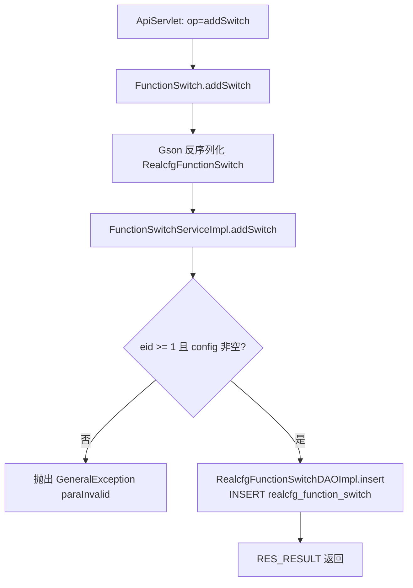
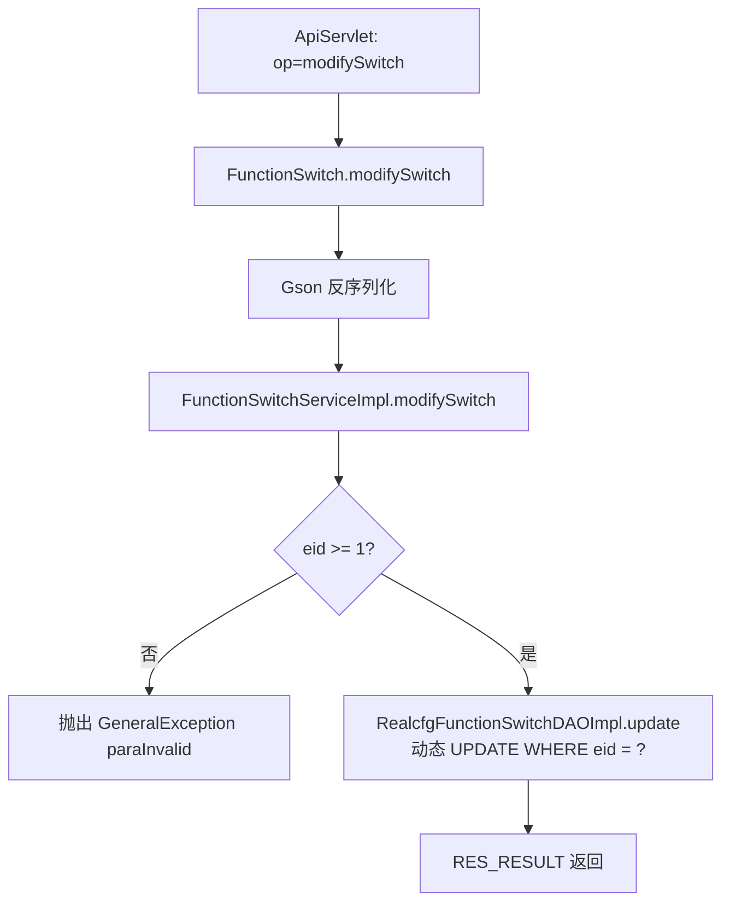
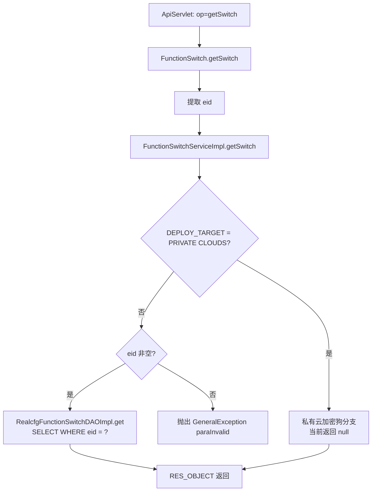
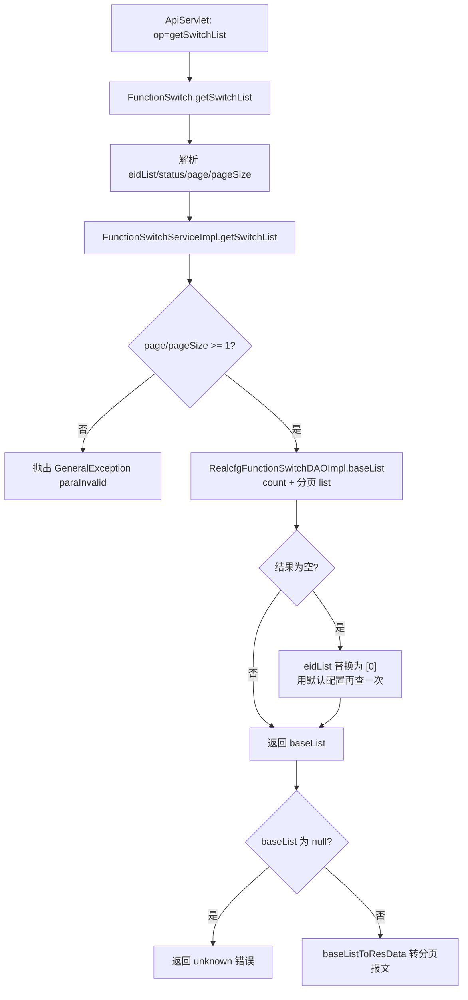

# FunctionSwitch

企业功能点开关管理服务：按企业（eid）维护功能开关配置（realcfg_function_switch 表），config 为功能点明细 JSON 数组（ConfigDetail：key/type/descr），支持新增、修改、单查与分页列表。

## op 一览

| op | 功能 |
| --- | --- |
| addSwitch | 新增企业功能开关 |
| modifySwitch | 修改企业功能开关 |
| getSwitch | 按 eid 查询功能开关 |
| getSwitchList | 分页查询功能开关列表 |

### addSwitch (`FunctionSwitch.addSwitch`)

- **入口**：ApiServlet，action=cfg，op=FunctionSwitch.addSwitch
- **实现意图**：为某企业新增一条功能点开关记录。业务层校验 eid >= 1 且 config 非空；插入时 status 固定为启用（STATUS_ON）。
- **请求参数**（Gson 反序列化为 RealcfgFunctionSwitch）：

| 参数名 | 类型 | 必填 | 说明 |
| --- | --- | --- | --- |
| eid | Integer | 是 | 企业 id，必须 >= 1 |
| config | String | 是 | 功能点配置 JSON（ConfigDetail 数组） |
| descr | String | 否 | 描述 |
| expiretime | Long | 否 | 过期时间（毫秒），0 表示不过期 |

- **响应结构**：统一返回 `{code, msg, data}` 报文，错误时无 `data` 节点。

| 字段 | 类型 | 说明 |
| --- | --- | --- |
| code | Integer | 返回码，0 成功 |
| msg | String | 提示信息 |
| data | Object | 数据对象 |
| data.result | Integer | 受影响行数（result 为 null 时无此节点） |
- **处理流程**：



- **调用链**：cn.testin.service.cfg.FunctionSwitch → cn.testin.business.impl.FunctionSwitchServiceImpl → cn.testin.dao.impl.realcfg.RealcfgFunctionSwitchDAOImpl → 表 realcfg_function_switch
- **涉及表与 SQL**：
  - `realcfg_function_switch`：INSERT（eid, config, descr, status, expiretime, createtime, updatetime），DAO 方法 `RealcfgFunctionSwitchDAOImpl.insert`
- **异常与校验**：bean 为 null、eid 非法或 config 为空抛 `GeneralException(CommonCode.paraInvalid)`
- **关键代码摘录**：

```java
// real-cfg/src/main/java/cn/testin/business/impl/FunctionSwitchServiceImpl.java
if (null == functionSwitch.getEid() || functionSwitch.getEid() < 1
        || StringUtils.isBlank(functionSwitch.getConfig())) {
    String msg = CommonCode.paraInvalid.getDescr() + "(functionSwitch is " + functionSwitch + ")";
    throw new GeneralException(CommonCode.paraInvalid.getValue(), msg);
}
return this.irealcfgfunctionswitchdao.insert(functionSwitch);
```

### modifySwitch (`FunctionSwitch.modifySwitch`)

- **入口**：ApiServlet，action=cfg，op=FunctionSwitch.modifySwitch
- **实现意图**：按企业 eid 修改功能开关（注意：UPDATE 的 WHERE 条件是 eid 而非主键 id），config/descr/status/expiretime 非空字段动态更新。
- **请求参数**：

| 参数名 | 类型 | 必填 | 说明 |
| --- | --- | --- | --- |
| eid | Integer | 是 | 企业 id，必须 >= 1 |
| config / descr | String | 否 | 传哪个改哪个 |
| status / expiretime | Integer / Long | 否 | 传哪个改哪个 |

- **响应结构**：统一返回 `{code, msg, data}` 报文，错误时无 `data` 节点。

| 字段 | 类型 | 说明 |
| --- | --- | --- |
| code | Integer | 返回码，0 成功 |
| msg | String | 提示信息 |
| data | Object | 数据对象 |
| data.result | Integer | 受影响行数（result 为 null 时无此节点） |
- **处理流程**：



- **调用链**：cn.testin.service.cfg.FunctionSwitch → cn.testin.business.impl.FunctionSwitchServiceImpl → cn.testin.dao.impl.realcfg.RealcfgFunctionSwitchDAOImpl → 表 realcfg_function_switch
- **涉及表与 SQL**：
  - `realcfg_function_switch`：UPDATE（按非空字段动态 SET + updatetime，`WHERE eid = ?`），DAO 方法 `RealcfgFunctionSwitchDAOImpl.update`
- **异常与校验**：bean 为 null 或 eid 非法抛 `GeneralException(CommonCode.paraInvalid)`
- **关键代码摘录**：

```java
// real-cfg/src/main/java/cn/testin/dao/impl/realcfg/RealcfgFunctionSwitchDAOImpl.java
if (StringUtils.isNotBlank(functionSwitch.getConfig())) {
    sql.append(" config = ?,");
    objs.add(functionSwitch.getConfig());
}
// ... descr/status/expiretime 同理
sql.append(" updatetime = ?");
sql.append(" WHERE eid = ?");
objs.add(functionSwitch.getEid());
```

### getSwitch (`FunctionSwitch.getSwitch`)

- **入口**：ApiServlet，action=cfg，op=FunctionSwitch.getSwitch
- **实现意图**：按企业 eid 查询功能开关配置。业务层对私有云部署（Config.DEPLOY_TARGET = "PRIVATE CLOUDS"）预留了从加密狗读取开关的分支（当前代码已注释，直接返回 null）；公有云分支从数据库查询。
- **请求参数**：

| 参数名 | 类型 | 必填 | 说明 |
| --- | --- | --- | --- |
| eid | Integer | 是 | 企业 id（公有云分支必填） |

- **响应结构**：统一返回 `{code, msg, data}` 报文，错误时无 `data` 节点。

| 字段 | 类型 | 说明 |
| --- | --- | --- |
| code | Integer | 返回码，0 成功 |
| msg | String | 提示信息 |
| data | Object | 数据对象 |
| data.objInfo | Object | RealcfgFunctionSwitch 对象（查不到或私有云分支时无此节点） |
| data.objInfo.eid | Integer | 企业 id |
| data.objInfo.config | String | 功能点配置 JSON（ConfigDetail 数组） |
| data.objInfo.descr | String | 描述 |
| data.objInfo.status | Integer | 状态 |
| data.objInfo.expiretime | Long | 过期时间（毫秒） |
| data.objInfo.createtime | Long | 创建时间（毫秒时间戳） |
| data.objInfo.updatetime | Long | 更新时间（毫秒时间戳） |
- **处理流程**：



- **调用链**：cn.testin.service.cfg.FunctionSwitch → cn.testin.business.impl.FunctionSwitchServiceImpl → cn.testin.dao.impl.realcfg.RealcfgFunctionSwitchDAOImpl → 表 realcfg_function_switch
- **涉及表与 SQL**：
  - `realcfg_function_switch`：SELECT（`SELECT * FROM realcfg_function_switch WHERE eid = ?`），DAO 方法 `RealcfgFunctionSwitchDAOImpl.get(Integer)`
- **异常与校验**：公有云分支下 eid 为 null 抛 `GeneralException(CommonCode.paraInvalid)` "eid is null"
- **关键代码摘录**：

```java
// real-cfg/src/main/java/cn/testin/business/impl/FunctionSwitchServiceImpl.java
if ("PRIVATE CLOUDS".equals(Config.DEPLOY_TARGET)) {
    RealcfgFunctionSwitch result = null;
    // 私有云调用加密狗（代码已注释）
    return result;
} else {
    if (null == eid) {
        throw new GeneralException(CommonCode.paraInvalid.getValue(), msg);
    }
    return this.irealcfgfunctionswitchdao.get(eid);
}
```

### getSwitchList (`FunctionSwitch.getSwitchList`)

- **入口**：ApiServlet，action=cfg，op=FunctionSwitch.getSwitchList
- **实现意图**：分页查询企业功能开关列表，支持按 eid 集合、status 过滤，按 createtime 倒序。业务层有兜底逻辑：查询结果为空时自动改用 eid=0（默认全局配置）再查一次。
- **请求参数**：

| 参数名 | 类型 | 必填 | 说明 |
| --- | --- | --- | --- |
| eidList | Integer[] | 否 | 企业 id 数组（IN 查询） |
| status | Integer | 否 | 状态过滤 |
| page | Integer | 是 | 页码，从 1 开始（业务层校验） |
| pageSize | Integer | 是 | 每页条数（业务层校验） |

- **响应结构**：统一返回 `{code, msg, data}` 报文，错误时无 `data` 节点。

| 字段 | 类型 | 说明 |
| --- | --- | --- |
| code | Integer | 返回码，0 成功 |
| msg | String | 提示信息 |
| data | Object | 数据对象 |
| data.list | Array\<Object\> | 当前页开关数组，元素字段： |
| data.list[].eid | Integer | 企业 id |
| data.list[].config | String | 功能点配置 JSON |
| data.list[].descr | String | 描述 |
| data.list[].status | Integer | 状态 |
| data.list[].expiretime | Long | 过期时间（毫秒） |
| data.list[].createtime | Long | 创建时间（毫秒时间戳） |
| data.list[].updatetime | Long | 更新时间（毫秒时间戳） |
| data.page | Integer | 当前页码 |
| data.pageSize | Integer | 每页条数 |
| data.totalRow | Long | 总条数 |
| data.totalPage | Integer | 总页数 |
- **处理流程**：



- **调用链**：cn.testin.service.cfg.FunctionSwitch → cn.testin.business.impl.FunctionSwitchServiceImpl → cn.testin.dao.impl.realcfg.RealcfgFunctionSwitchDAOImpl → 表 realcfg_function_switch
- **涉及表与 SQL**：
  - `realcfg_function_switch`：SELECT count(eid)（`RealcfgFunctionSwitchDAOImpl.count`）；SELECT * WHERE eid > 0 [AND eid IN (...)] [AND status = ?] ORDER BY createtime DESC LIMIT 分页（`RealcfgFunctionSwitchDAOImpl.list`）
- **异常与校验**：page/pageSize < 1 抛 `GeneralException(CommonCode.paraInvalid)`；结果为 null 返回 `CommonCode.unknown`
- **关键代码摘录**：

```java
// real-cfg/src/main/java/cn/testin/business/impl/FunctionSwitchServiceImpl.java
BaseList<RealcfgFunctionSwitch> baseList = this.irealcfgfunctionswitchdao.baseList(conditionMap, page, pageSize);
if (CollectionUtils.isEmpty(baseList.getList())) {
    // 查不到时回退查询 eid = 0 的默认开关配置
    ArrayList<Integer> objects = new ArrayList<>();
    objects.add(0);
    conditionMap.put("eidList", objects);
    baseList = this.irealcfgfunctionswitchdao.baseList(conditionMap, page, pageSize);
}
return baseList;
```
