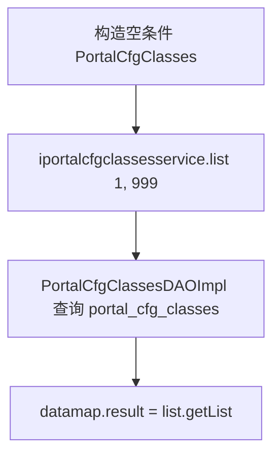

# PortalCfg

## 职责
门户菜单配置查询。读取 `portal_cfg_classes` 表（门户菜单树：title/pid/url/order_index/css），一次性返回全部菜单（固定第 1 页、999 条），供门户前端渲染导航。数据走 realcfg 数据源。

- 源码：`real-cfg/src/main/java/cn/testin/service/portal/PortalCfg.java`
- 入口：ApiServlet 按 `action=portal`、`op=<方法名>` 反射调用。

## op 一览表

| op | 说明 | 主要表 |
|---|---|---|
| getMenu | 查询门户菜单列表 | portal_cfg_classes |

---

### getMenu (`PortalCfg.getMenu`)
- **入口**：ApiServlet，action=portal，op=PortalCfg.getMenu
- **实现意图**：无条件查询门户菜单（按 order_index 倒序），一次取回全量（上限 999 条）。
- **请求参数**：无

| 字段 | 类型 | 必填 | 说明 |
|---|---|---|---|
| 无 | — | 否 | 无请求参数 |
- **响应结构**：datamap 的 key 及含义
  - `result`：PortalCfgClasses 列表（id、title、pid 父节点、url、index 排序、css）
- **返回参数**（统一 `{code, msg, data}`，`code=0` 成功）：

| 字段 | 类型 | 说明 |
|---|---|---|
| code | Integer | 0 成功 / 非 0 失败 |
| msg | String | 提示信息 |
| data | JSONObject | 业务数据 |
| data.result | JSONArray | PortalCfgClasses 数组（id/title/pid/url/index/css） |
- **处理流程**：

- **调用链**：PortalCfg → PortalCfgClassesServiceImpl.list → PortalCfgClassesDAOImpl.list → 表 portal_cfg_classes
- **涉及表与 SQL**：
  - `portal_cfg_classes`：SELECT * WHERE 1=1 ORDER BY `order_index` DESC（分页 offset=0, max=999），DAO 方法 `PortalCfgClassesDAOImpl.list`
- **异常与校验**：无入参校验；DAO 层异常捕获后写日志并返回空 BaseList。
- **关键代码摘录**：
```java
// real-cfg/src/main/java/cn/testin/service/portal/PortalCfg.java
public String getMenu(ApiRequest apirequest) throws Exception {
    cn.testin.pojo.realcfg.PortalCfgClasses portalCfgClasses = new cn.testin.pojo.realcfg.PortalCfgClasses();
    BaseList<cn.testin.pojo.realcfg.PortalCfgClasses> list = iportalcfgclassesservice.list(portalCfgClasses, 1, 999);
    JSONObject jObj = ApiUtil.getJSONobj(apirequest, CommonCode.success.getValue(), CommonCode.success.getDescr());
    Map<String, Object> datamap = new HashMap<>();
    datamap.put(ApiResponse.RES_RESULT, list.getList());
    jObj.put(ApiResponse.RES_DATA, datamap);
    return jObj.toString();
}
```
