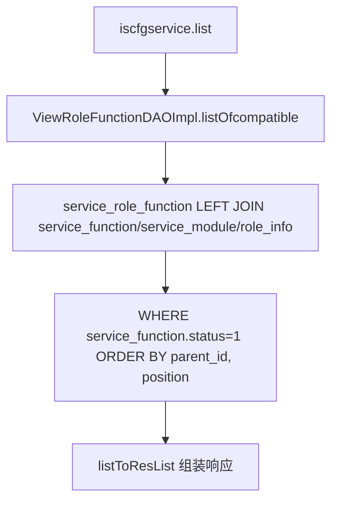
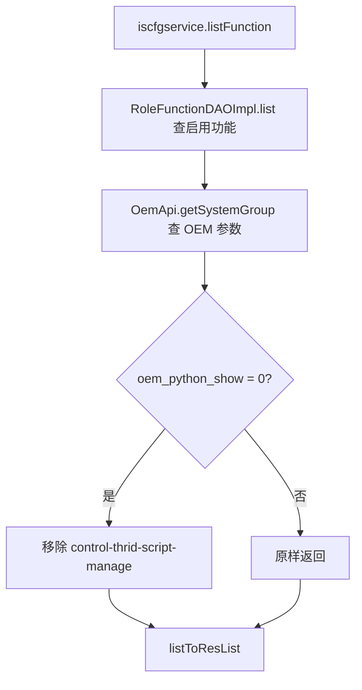
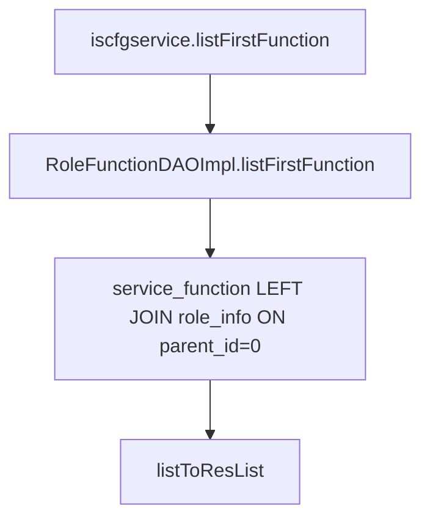
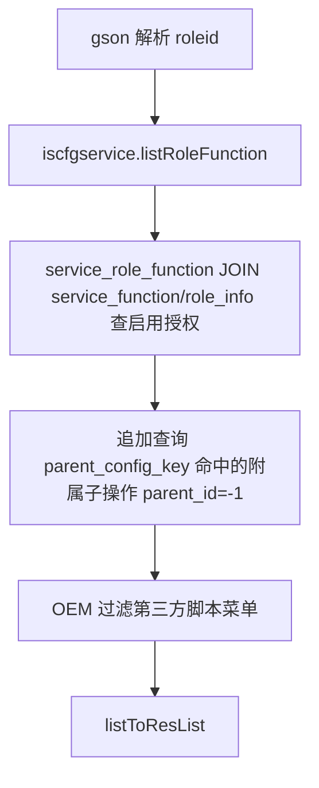
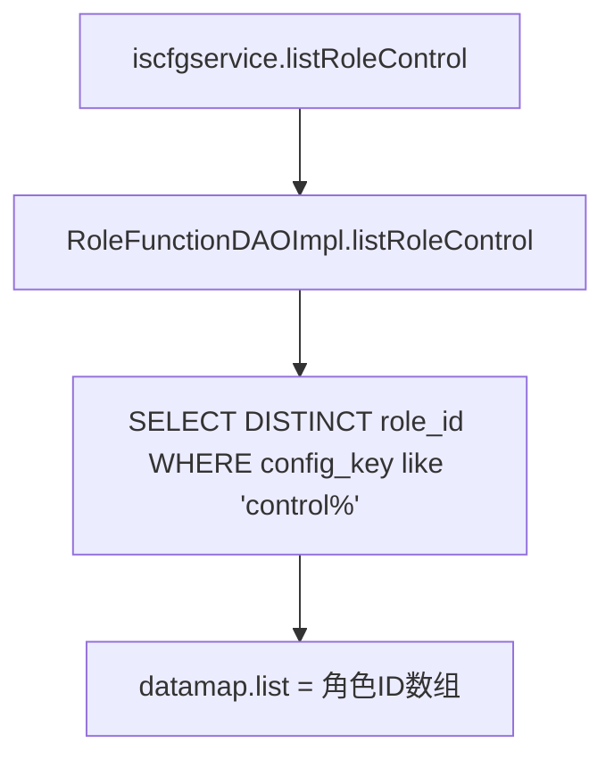
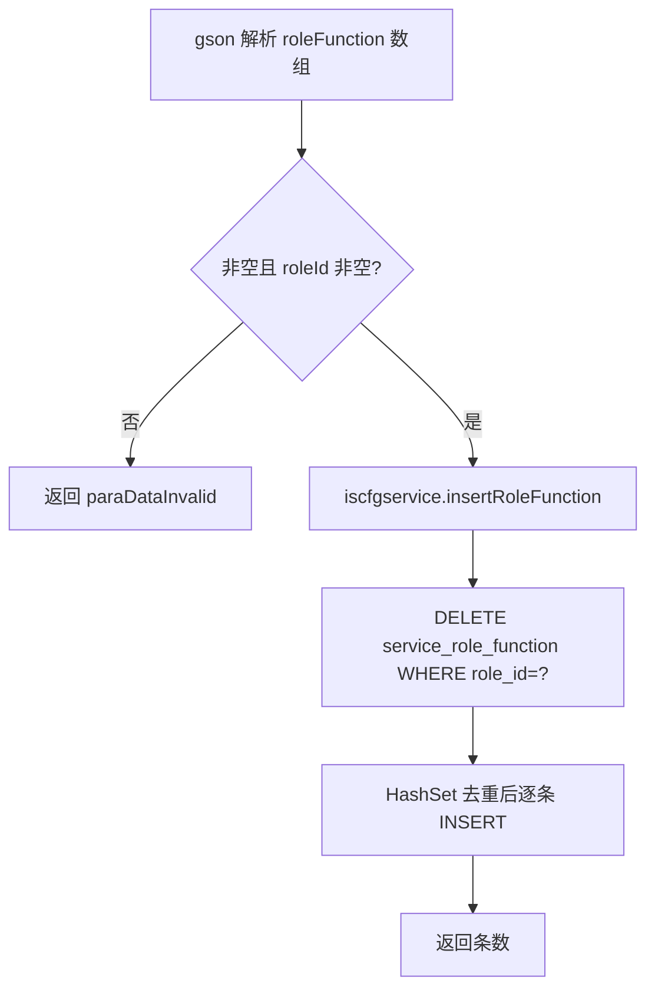
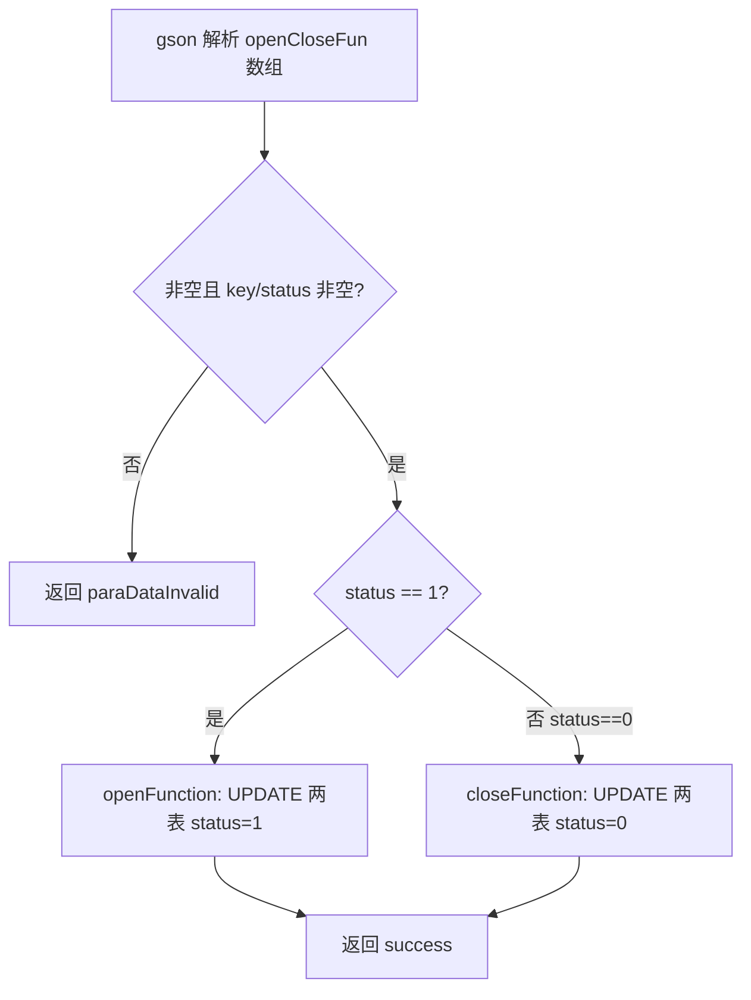

# ServiceCfg

## 职责
平台菜单/功能权限配置（service 配置）。维护 `db_service.service_function`（功能菜单树，config_key 标识功能）、`db_service.service_role_function`（角色-功能授权）及其视图，供管理后台配置各角色可见菜单与功能开关。功能开关按 config_key 前缀批量生效。数据走 service 数据源（getServicedao），并跨库 join `db_user.role_info`。

- 源码：`real-cfg/src/main/java/cn/testin/service/scfg/ServiceCfg.java`
- 入口：ApiServlet 按 `action=scfg`、`op=<方法名>` 反射调用。

## op 一览表

| op | 说明 | 主要表 |
|---|---|---|
| list | 查询角色-功能全量视图（含模块信息） | view_role_function 相关基表 |
| listFunction | 查询启用功能菜单列表（OEM 过滤） | service_function |
| listFirstFunction | 查询一级功能菜单 | service_function |
| listRoleFunction | 按角色查询已授权功能（含附属子操作） | service_role_function, service_function |
| listRoleControl | 查询拥有 control 类权限的角色 ID 列表 | service_role_function, service_function |
| insertRoleFunction | 重置某角色的功能授权（先删后插） | service_role_function |
| openCloseFunction | 按 configKey 前缀开关功能 | service_function, service_role_function |

---

### list (`ServiceCfg.list`)
- **入口**：ApiServlet，action=scfg，op=ServiceCfg.list
- **实现意图**：查询全部角色的功能授权视图（join service_function、service_module、db_user.role_info），仅含启用状态功能，按 parent_id/position 排序。源码中按企业过滤的逻辑已注释。
- **请求参数**：无（eid 过滤逻辑已注释掉）

| 字段 | 类型 | 必填 | 说明 |
|---|---|---|---|
| 无 | — | 否 | 无请求参数 |
- **响应结构**：datamap 的 key 及含义
  - `list`：ViewRoleFunction 数组（role_id、fun_id、module_id、module_name、domain、parent_id、fun_name、display_name、href、target、position、icon、status、config_key 等）
- **返回参数**（统一 `{code, msg, data}`，`code=0` 成功）：

| 字段 | 类型 | 说明 |
|---|---|---|
| code | Integer | 0 成功 / 非 0 失败 |
| msg | String | 提示信息 |
| data | JSONObject | 业务数据 |
| data.list | JSONArray | ViewRoleFunction 数组 |
- **处理流程**：

- **调用链**：ServiceCfg → ScfgServiceImpl.list → ViewRoleFunctionDAOImpl.listOfcompatible → 表 service_role_function / service_function / service_module / db_user.role_info
- **涉及表与 SQL**：
  - `service_role_function` LEFT JOIN `service_function`、`service_module`、`db_user.role_info`：SELECT 视图字段 WHERE `service_function.status = 1`，DAO 方法 `ViewRoleFunctionDAOImpl.listOfcompatible`
- **异常与校验**：无入参校验。
- **关键代码摘录**：
```java
// real-cfg/src/main/java/cn/testin/dao/impl/servicecfg/ViewRoleFunctionDAOImpl.java
StringBuffer sql = new StringBuffer("SELECT `db_user`.`role_info`.`id` AS `role_id`, ... "
    + "FROM `service_role_function`"
    + " LEFT JOIN `service_function` ON `service_role_function`.`fun_id` = `service_function`.`id`"
    + " LEFT JOIN `service_module` ON `service_function`.`module_id` = `service_module`.`id`"
    + " LEFT JOIN db_user.role_info ON `service_role_function`.`role_id` = db_user.role_info.`id`"
    + " where service_function.status = 1 ORDER BY parent_id, position;");
return this.getServicedao().query(sql.toString(), new Object[]{}, new ViewRoleFunctionRowMapper());
```

---

### listFunction (`ServiceCfg.listFunction`)
- **入口**：ApiServlet，action=scfg，op=ServiceCfg.listFunction
- **实现意图**：查询全部启用状态的功能菜单（排除 config_key='switch'）；当 OEM 参数 `enterprise-info/oem_python_show` 配置为失效（0）时，移除"第三方脚本管理"菜单（config_key=`control-thrid-script-manage`）。
- **请求参数**：无

| 字段 | 类型 | 必填 | 说明 |
|---|---|---|---|
| 无 | — | 否 | 无请求参数 |
- **响应结构**：datamap 的 key 及含义
  - `list`：RoleFunction 数组（funId、displayName、parentId、configKey、status）
- **返回参数**（统一 `{code, msg, data}`，`code=0` 成功）：

| 字段 | 类型 | 说明 |
|---|---|---|
| code | Integer | 0 成功 / 非 0 失败 |
| msg | String | 提示信息 |
| data | JSONObject | 业务数据 |
| data.list | JSONArray | RoleFunction 数组（funId/displayName/parentId/configKey/status） |
- **处理流程**：

- **调用链**：ServiceCfg → ScfgServiceImpl.listFunction → RoleFunctionDAOImpl.list → 表 service_function（LEFT JOIN db_user.role_info）；OemApi → [user-manager](../../../平台基础功能服务/00-首页.md)（action=user, op=SystemParam.list 查询 OEM 系统参数）
- **涉及表与 SQL**：
  - `service_function`：SELECT `id AS fun_id, display_name, parent_id, config_key, status` WHERE `status=1 AND config_key != 'switch'` ORDER BY `parent_id, position`，DAO 方法 `RoleFunctionDAOImpl.list`
- **异常与校验**：无入参校验；OEM 查询异常向上抛出 GeneralException。
- **关键代码摘录**：
```java
// real-cfg/src/main/java/cn/testin/business/impl/ScfgServiceImpl.java
List<SystemParam> oemList = OemApi.getSystemGroup("enterprise-info", "oem_python_show");
if (CollectionUtils.isEmpty(oemList) || !StatusTypeEnum.INVALID.getType().toString().equals(oemList.get(0).getParamValue())
        || CollectionUtils.isEmpty(roleFunctions)) {
    return;
}
roleFunctions.removeIf(item -> FunctionKeyConstant.CONTROL_THIRD_SCRIPT_MANAGE.equals(item.getConfigKey()));
```

---

### listFirstFunction (`ServiceCfg.listFirstFunction`)
- **入口**：ApiServlet，action=scfg，op=ServiceCfg.listFirstFunction
- **实现意图**：查询一级功能菜单（parent_id = 0 的节点）。
- **请求参数**：无

| 字段 | 类型 | 必填 | 说明 |
|---|---|---|---|
| 无 | — | 否 | 无请求参数 |
- **响应结构**：datamap 的 key 及含义
  - `list`：RoleFunction 数组
- **返回参数**（统一 `{code, msg, data}`，`code=0` 成功）：

| 字段 | 类型 | 说明 |
|---|---|---|
| code | Integer | 0 成功 / 非 0 失败 |
| msg | String | 提示信息 |
| data | JSONObject | 业务数据 |
| data.list | JSONArray | RoleFunction 数组 |
- **处理流程**：

- **调用链**：ServiceCfg → ScfgServiceImpl.listFirstFunction → RoleFunctionDAOImpl.listFirstFunction → 表 service_function
- **涉及表与 SQL**：
  - `service_function`：SELECT `id AS fun_id, display_name, parent_id, config_key, status`（LEFT JOIN db_user.role_info ON `b.id = a.id AND a.parent_id = 0`），DAO 方法 `RoleFunctionDAOImpl.listFirstFunction`
- **异常与校验**：无入参校验。
- **关键代码摘录**：
```java
// real-cfg/src/main/java/cn/testin/dao/impl/servicecfg/RoleFunctionDAOImpl.java
sql.append("SELECT a.id as fun_id ,a.display_name,a.parent_id,a.config_key,a.status FROM ");
sql.append(RoleFunction.table() + " a ");
sql.append(" left join db_user.role_info b on b.id = a.id and a.parent_id = 0");
return this.getServicedao().query(sql.toString(), new Object[]{}, new FunctionRowMapper());
```

---

### listRoleFunction (`ServiceCfg.listRoleFunction`)
- **入口**：ApiServlet，action=scfg，op=ServiceCfg.listRoleFunction
- **实现意图**：查询指定角色已授权的功能菜单（含菜单下的附属子操作 parent_id=-1 记录）；同样应用 OEM 第三方脚本菜单过滤。roleid 为空时查询全部角色的授权。
- **请求参数**：

| 参数名 | 类型 | 必填 | 说明 |
|---|---|---|---|
| roleid | int | 否 | 角色 ID（gson 反序列化，非数字时为 null） |

- **响应结构**：datamap 的 key 及含义
  - `list`：RoleFunction 数组（funId、roleId、displayName、parentId、configKey、href）
- **返回参数**（统一 `{code, msg, data}`，`code=0` 成功）：

| 字段 | 类型 | 说明 |
|---|---|---|
| code | Integer | 0 成功 / 非 0 失败 |
| msg | String | 提示信息 |
| data | JSONObject | 业务数据 |
| data.list | JSONArray | RoleFunction 数组（funId/roleId/displayName/parentId/configKey/href） |
- **处理流程**：

- **调用链**：ServiceCfg → ScfgServiceImpl.listRoleFunction → RoleFunctionDAOImpl.listRoleFunction → 表 service_role_function / service_function / db_user.role_info；OemApi → [user-manager](../../../平台基础功能服务/00-首页.md)
- **涉及表与 SQL**：
  - `service_role_function` LEFT JOIN `service_function`、`db_user.role_info`：WHERE `srf.status=1 AND sf.status=1 AND sf.config_key != 'switch' [AND srf.role_id=?]`
  - `service_function`：追加 SELECT WHERE `parent_config_key IN (...) AND parent_id = -1`
- **异常与校验**：无显式校验；roleid 非法时按 null 处理（查全部）。
- **关键代码摘录**：
```java
// real-cfg/src/main/java/cn/testin/dao/impl/servicecfg/RoleFunctionDAOImpl.java
String subSql = "SELECT * FROM db_service.service_function "
    + " WHERE parent_config_key IN ( SELECT config_key FROM ( " + sql + " ) tmp ) AND parent_id = -1; ";
list.addAll(this.getServicedao().query(subSql, params.toArray(), new RoleFunctionRowMapper()));
```

---

### listRoleControl (`ServiceCfg.listRoleControl`)
- **入口**：ApiServlet，action=scfg，op=ServiceCfg.listRoleControl
- **实现意图**：查询拥有 control 类功能（config_key 以 'control' 开头且启用）的全部角色 ID 去重列表，用于判断角色是否有管控权限。
- **请求参数**：无

| 字段 | 类型 | 必填 | 说明 |
|---|---|---|---|
| 无 | — | 否 | 无请求参数 |
- **响应结构**：datamap 的 key 及含义
  - `list`：角色 ID（Integer）数组
- **返回参数**（统一 `{code, msg, data}`，`code=0` 成功）：

| 字段 | 类型 | 说明 |
|---|---|---|
| code | Integer | 0 成功 / 非 0 失败 |
| msg | String | 提示信息 |
| data | JSONObject | 业务数据 |
| data.list | JSONArray | 角色 ID（Integer）数组 |
- **处理流程**：

- **调用链**：ServiceCfg → ScfgServiceImpl.listRoleControl → RoleFunctionDAOImpl.listRoleControl → 表 service_role_function / service_function
- **涉及表与 SQL**：
  - `service_role_function` LEFT JOIN `service_function`：SELECT DISTINCT `role_id` WHERE `sf.status=1 AND sf.config_key like 'control%'`，DAO 方法 `RoleFunctionDAOImpl.listRoleControl`
- **异常与校验**：无入参校验。
- **关键代码摘录**：
```java
// real-cfg/src/main/java/cn/testin/dao/impl/servicecfg/RoleFunctionDAOImpl.java
sql.append("SELECT DISTINCT role_id FROM service_role_function srf "
    + "LEFT JOIN service_function sf ON srf.fun_id = sf.id "
    + "where sf.status = 1 and sf.config_key like 'control%';");
return this.getServicedao().queryForList(sql.toString(), params.toArray(), Integer.class);
```

---

### insertRoleFunction (`ServiceCfg.insertRoleFunction`)
- **入口**：ApiServlet，action=scfg，op=ServiceCfg.insertRoleFunction
- **实现意图**：整体重置某角色的功能授权：先删除该角色全部旧授权，再批量插入新授权（去重，hidden=0、status=1）。
- **请求参数**：

| 参数名 | 类型 | 必填 | 说明 |
|---|---|---|---|
| roleFunction | array | 是 | RoleFunction 数组（每项含 roleId、funId），JSON 字符串，不能为空 |

- **响应结构**：datamap 的 key 及含义
  - `result`：传入的授权条数（插入条数）；异常时为 null
- **返回参数**（统一 `{code, msg, data}`，`code=0` 成功）：

| 字段 | 类型 | 说明 |
|---|---|---|
| code | Integer | 0 成功 / 非 0 失败 |
| msg | String | 提示信息 |
| data | JSONObject | 业务数据 |
| data.result | Integer | 插入的授权条数 |
- **处理流程**：

- **调用链**：ServiceCfg → ScfgServiceImpl.insertRoleFunction → RoleFunctionDAOImpl（delete + insert）→ 表 service_role_function
- **涉及表与 SQL**：
  - `service_role_function`：DELETE WHERE `role_id=?`；INSERT（fun_id, role_id, hidden, status, createtime, updatetime），DAO 方法 `RoleFunctionDAOImpl.delete / insert`
- **异常与校验**：
  - 数组为空或元素 roleId 为空 → `paraDataInvalid`；funId 为空的元素跳过
  - 源码中"系统内置角色（roleId<=4）权限不能修改"的校验已注释
- **关键代码摘录**：
```java
// real-cfg/src/main/java/cn/testin/dao/impl/servicecfg/RoleFunctionDAOImpl.java
this.delete(roleFunction.get(0).getRoleId());
HashSet<RoleFunction> functionHashSet = new HashSet<>();
for (RoleFunction function : roleFunction) { functionHashSet.add(function); }
for (RoleFunction function : functionHashSet) {
    if (function.getFunId() == null) { continue; }
    // INSERT INTO service_role_function (fun_id,role_id,hidden,status,createtime,updatetime)
    this.getServicedao().insert(sql.toString(), objs);
}
```

---

### openCloseFunction (`ServiceCfg.openCloseFunction`)
- **入口**：ApiServlet，action=scfg，op=ServiceCfg.openCloseFunction
- **实现意图**：按 configKey 前缀批量开关功能：status=1 开放、status=0 关闭；同时更新 service_function 与关联的 service_role_function 的 status。
- **请求参数**：

| 参数名 | 类型 | 必填 | 说明 |
|---|---|---|---|
| openCloseFun | array | 是 | OpenCloseFun 数组（key=configKey、status=1/0），JSON 字符串，不能为空 |

- **响应结构**：datamap 无业务 key；响应 msg 固定为 `success`
- **返回参数**（统一 `{code, msg, data}`，`code=0` 成功）：

| 字段 | 类型 | 说明 |
|---|---|---|
| code | Integer | 0 成功 / 非 0 失败 |
| msg | String | 固定 "success" |
| data | — | 无业务数据 |
- **处理流程**：

- **调用链**：ServiceCfg → ScfgServiceImpl.openFunction/closeFunction → RoleFunctionDAOImpl.updateStatus → 表 service_function / service_role_function
- **涉及表与 SQL**：
  - `db_service.service_function`：UPDATE SET `status=?` WHERE `config_key like 'key%'`
  - `db_service.service_role_function`：UPDATE SET `status=?` WHERE `fun_id IN (SELECT id FROM service_function WHERE config_key like 'key%')`
  - DAO 方法 `RoleFunctionDAOImpl.updateStatus`
- **异常与校验**：
  - 数组为空、元素 key/status 为空 → `paraDataInvalid`
  - status 非 0/1 时不执行任何更新但仍返回 success
- **关键代码摘录**：
```java
// real-cfg/src/main/java/cn/testin/dao/impl/servicecfg/RoleFunctionDAOImpl.java
sql.append(" update db_service.service_function set status = ? where config_key like ? ");
params.add(status);
params.add(configKey + "%");
int update = this.getServicedao().update(sql.toString(), params.toArray());
sql2.append(" update db_service.service_role_function set status = ? "
    + " where fun_id in(select id from db_service.service_function where config_key like ? ) ");
```
