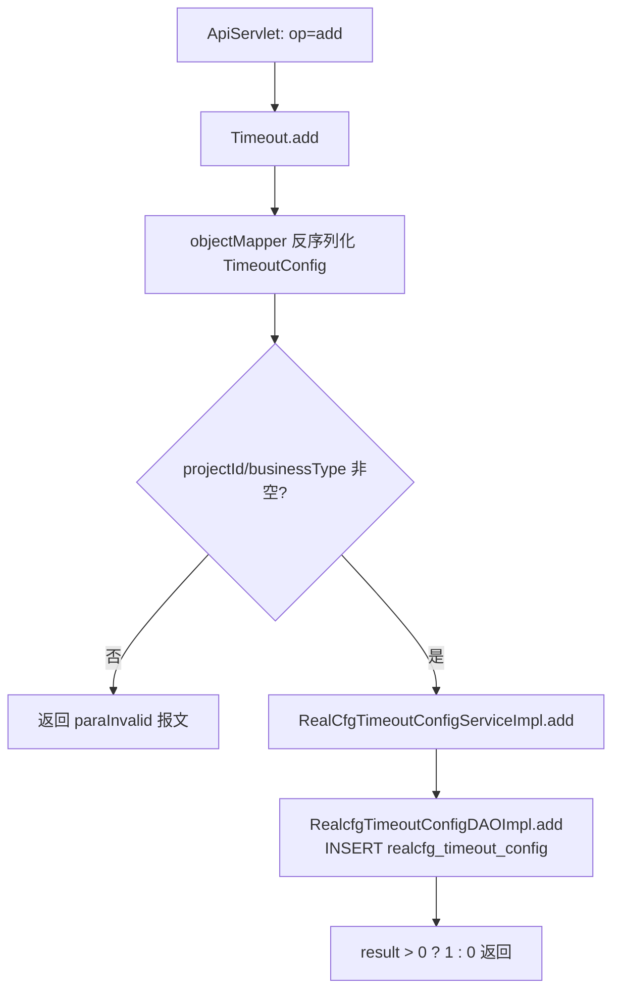
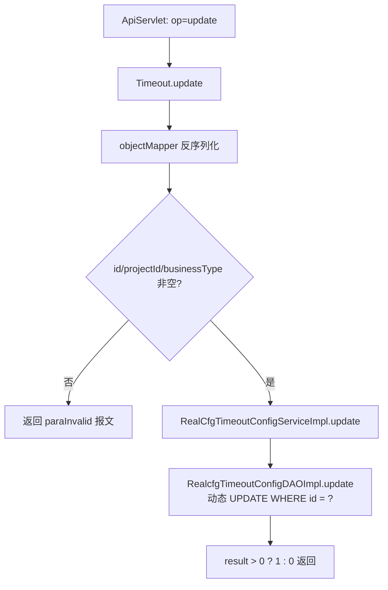
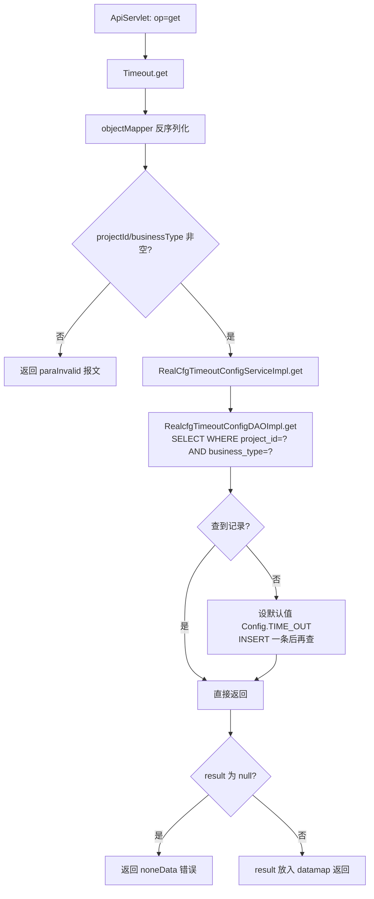

# Timeout

项目级超时配置管理服务：按（projectId + businessType）维度维护超时阈值（realcfg_timeout_config 表），支持新增、修改、查询。get 查询不到时会自动写入一条默认值配置。

## op 一览

| op | 功能 |
| --- | --- |
| add | 新增超时配置 |
| update | 修改超时配置 |
| get | 按项目+业务类型查询超时配置（不存在则写默认值） |

### add (`Timeout.add`)

- **入口**：ApiServlet，action=cfg，op=Timeout.add
- **实现意图**：为某项目的某业务类型新增一条超时配置（value 为超时阈值，单位依业务约定）。
- **请求参数**（Jackson 反序列化为 TimeoutConfig）：

| 参数名 | 类型 | 必填 | 说明 |
| --- | --- | --- | --- |
| projectId | Integer | 是 | 项目 id |
| businessType | Integer | 是 | 业务类型 |
| name | String | 否 | 配置名称 |
| value | Integer | 否 | 超时阈值 |
| status | Integer | 否 | 状态（1 启用） |

- **响应结构**：统一返回 `{code, msg, data}` 报文，错误时无 `data` 节点。

| 字段 | 类型 | 说明 |
| --- | --- | --- |
| code | Integer | 返回码，0 成功 |
| msg | String | 提示信息 |
| data | Object | 数据对象 |
| data.result | Integer | 1 成功 / 0 失败 |
- **处理流程**：



- **调用链**：cn.testin.service.cfg.Timeout → cn.testin.business.impl.RealCfgTimeoutConfigServiceImpl → cn.testin.dao.impl.realcfg.RealcfgTimeoutConfigDAOImpl → 表 realcfg_timeout_config
- **涉及表与 SQL**：
  - `realcfg_timeout_config`：INSERT（project_id, name, business_type, value, status, createtime, updatetime），DAO 方法 `RealcfgTimeoutConfigDAOImpl.add(TimeoutConfig)`
- **异常与校验**：projectId 或 businessType 为空返回 `CommonCode.paraInvalid`；DAO 异常 catch 返回 0
- **关键代码摘录**：

```java
// real-cfg/src/main/java/cn/testin/service/cfg/Timeout.java
TimeoutConfig timeoutConfig = objectMapper.readValue(reqjson.toString(), TimeoutConfig.class);
if (timeoutConfig == null || timeoutConfig.getProjectId() == null || timeoutConfig.getBusinessType() == null) {
    return ApiUtil.getResult(apirequest, CommonCode.paraInvalid.getValue(), CommonCode.paraInvalid.getDescr());
}
Integer result = iTimeoutConfigService.add(timeoutConfig);
datamap.put("result", result > 0 ? 1 : 0);
```

### update (`Timeout.update`)

- **入口**：ApiServlet，action=cfg，op=Timeout.update
- **实现意图**：按记录 id 修改超时配置，非空字段（projectId/name/businessType/value/status）动态拼入 UPDATE。
- **请求参数**：

| 参数名 | 类型 | 必填 | 说明 |
| --- | --- | --- | --- |
| id | Long | 是 | 记录 id |
| projectId | Integer | 是 | 项目 id |
| businessType | Integer | 是 | 业务类型 |
| name / value / status | String / Integer | 否 | 传哪个改哪个 |

- **响应结构**：统一返回 `{code, msg, data}` 报文，错误时无 `data` 节点。

| 字段 | 类型 | 说明 |
| --- | --- | --- |
| code | Integer | 返回码，0 成功 |
| msg | String | 提示信息 |
| data | Object | 数据对象 |
| data.result | Integer | 1 成功 / 0 失败 |
- **处理流程**：



- **调用链**：cn.testin.service.cfg.Timeout → cn.testin.business.impl.RealCfgTimeoutConfigServiceImpl → cn.testin.dao.impl.realcfg.RealcfgTimeoutConfigDAOImpl → 表 realcfg_timeout_config
- **涉及表与 SQL**：
  - `realcfg_timeout_config`：UPDATE（按非空字段动态 SET + updatetime，`WHERE id = ?`），DAO 方法 `RealcfgTimeoutConfigDAOImpl.update(TimeoutConfig)`
- **异常与校验**：service 层校验 id/projectId/businessType 非空；DAO 层 id < 1 直接返回 0
- **关键代码摘录**：

```java
// real-cfg/src/main/java/cn/testin/service/cfg/Timeout.java
if (timeoutConfig == null || timeoutConfig.getId() == null
        || timeoutConfig.getProjectId() == null || timeoutConfig.getBusinessType() == null) {
    return ApiUtil.getResult(apirequest, CommonCode.paraInvalid.getValue(), CommonCode.paraInvalid.getDescr());
}
Integer result = iTimeoutConfigService.update(timeoutConfig);
```

### get (`Timeout.get`)

- **入口**：ApiServlet，action=cfg，op=Timeout.get
- **实现意图**：按（projectId + businessType）查询超时配置。业务层有"读不到即写默认值"的自愈逻辑：查不到时以 Config.TIME_OUT 默认值、status=1 插入一条，再查询返回。
- **请求参数**：

| 参数名 | 类型 | 必填 | 说明 |
| --- | --- | --- | --- |
| projectId | Integer | 是 | 项目 id |
| businessType | Integer | 是 | 业务类型 |

- **响应结构**：统一返回 `{code, msg, data}` 报文，错误时无 `data` 节点。

| 字段 | 类型 | 说明 |
| --- | --- | --- |
| code | Integer | 返回码，0 成功（查询异常返回 noneData） |
| msg | String | 提示信息 |
| data | Object | 数据对象 |
| data.result | Object | TimeoutConfig 对象 |
| data.result.id | Long | 记录 id |
| data.result.projectId | Integer | 项目 id |
| data.result.name | String | 配置名称 |
| data.result.businessType | Integer | 业务类型 |
| data.result.value | Integer | 超时阈值 |
| data.result.status | Integer | 状态 |
| data.result.createtime | Long | 创建时间（毫秒时间戳） |
| data.result.updatetime | Long | 更新时间（毫秒时间戳） |
- **处理流程**：



- **调用链**：cn.testin.service.cfg.Timeout → cn.testin.business.impl.RealCfgTimeoutConfigServiceImpl → cn.testin.dao.impl.realcfg.RealcfgTimeoutConfigDAOImpl → 表 realcfg_timeout_config；默认值取自 cn.testin.util.Config.TIME_OUT
- **涉及表与 SQL**：
  - `realcfg_timeout_config`：SELECT（`WHERE project_id = ? AND business_type = ?`，`RealcfgTimeoutConfigDAOImpl.get`）；查不到时 INSERT 默认记录（`RealcfgTimeoutConfigDAOImpl.add`）
- **异常与校验**：参数缺失返回 `CommonCode.paraInvalid`；最终结果为 null 返回 `CommonCode.noneData`
- **关键代码摘录**：

```java
// real-cfg/src/main/java/cn/testin/business/impl/RealCfgTimeoutConfigServiceImpl.java
TimeoutConfig result = iRealcfgCANConfigDAO.get(timeoutConfig);
//如果没有,设置默认值
if (result == null) {
    timeoutConfig.setValue(Config.TIME_OUT);
    timeoutConfig.setStatus(1);
    timeoutConfig.setCreatetime(System.currentTimeMillis());
    timeoutConfig.setUpdatetime(System.currentTimeMillis());
    iRealcfgCANConfigDAO.add(timeoutConfig);
}
result = iRealcfgCANConfigDAO.get(timeoutConfig);
```

> 备注：RealCfgTimeoutConfigServiceImpl 中 DAO 字段命名为 `iRealcfgCANConfigDAO`，但实际 Spring bean 类型为 `IRealcfgTimeoutConfigDAO`，属于历史命名遗留。
