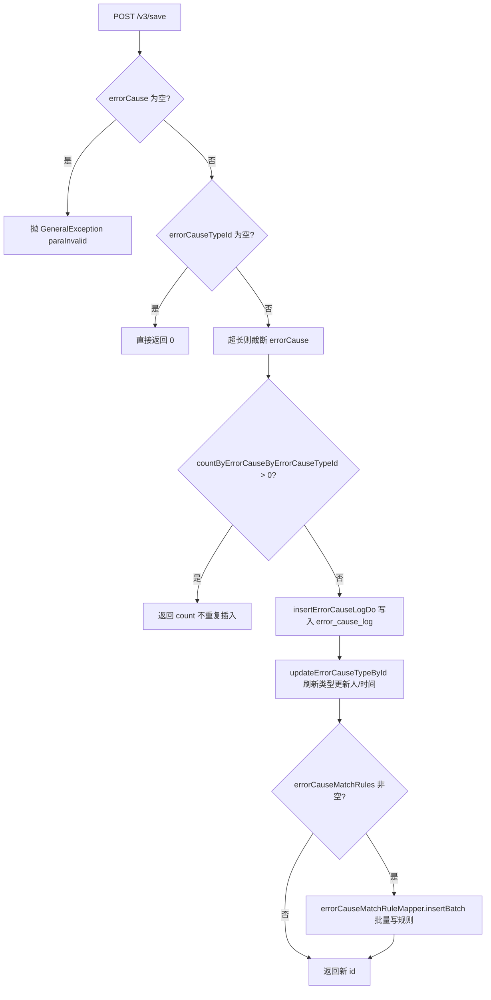
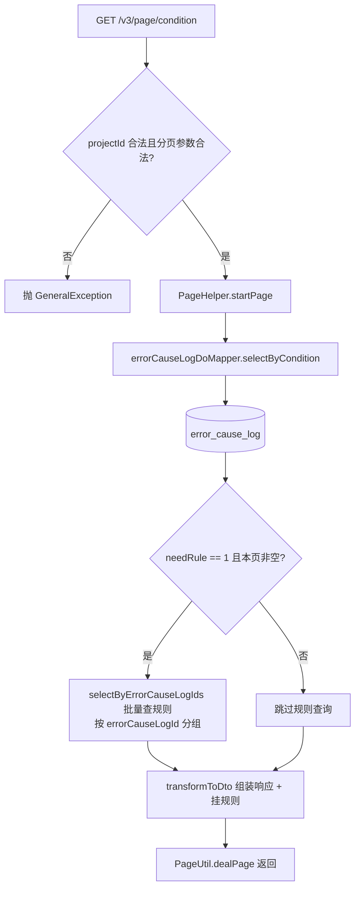
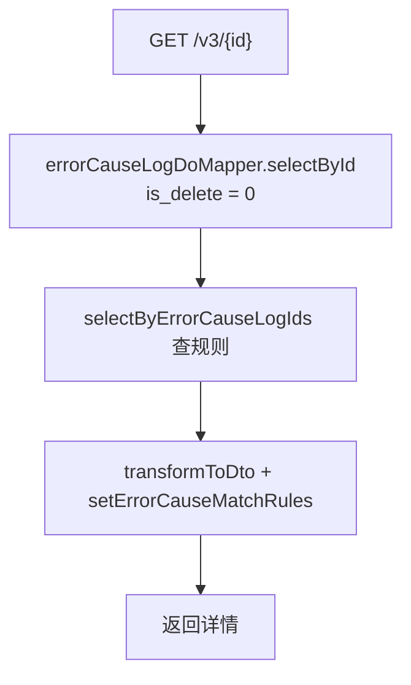
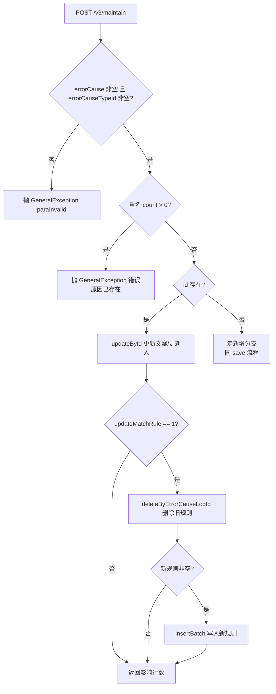
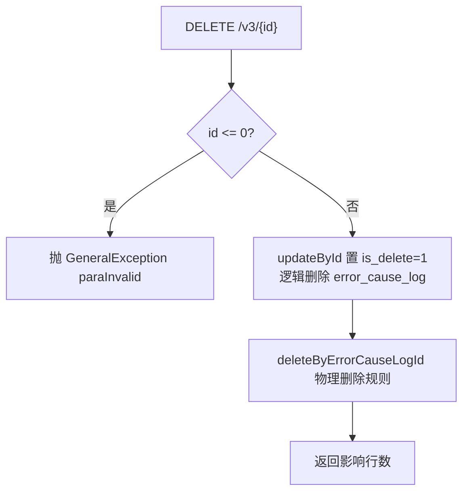
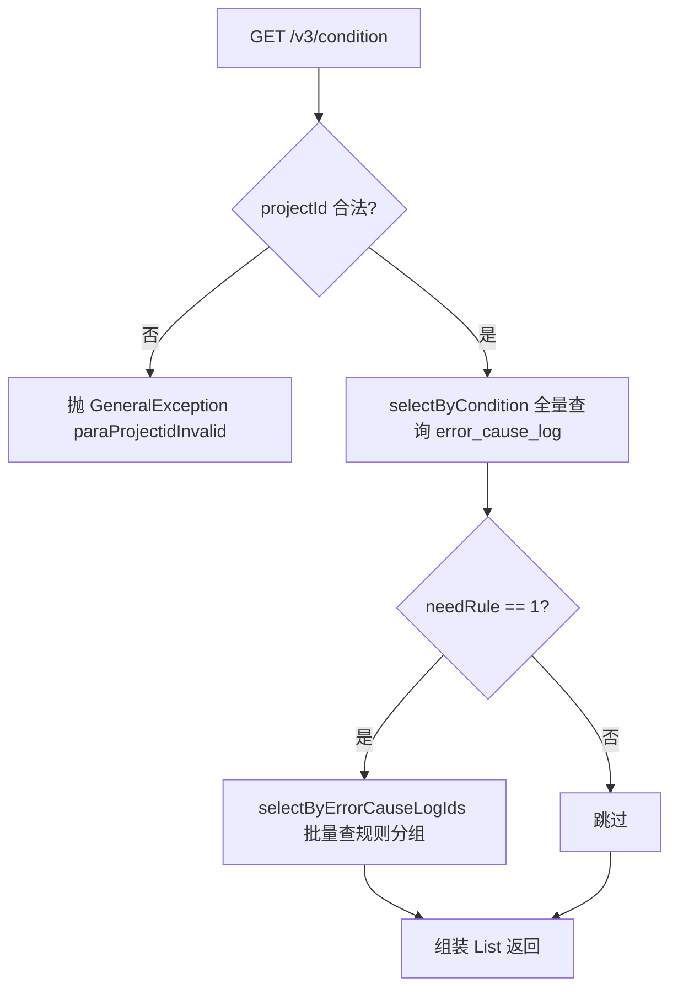

# ErrorCauseLogController

错误原因（ErrorCauseLog）管理服务：维护"项目下某条错误日志对应的错误原因描述及其自动匹配规则"，支撑测试报告中的错误归因功能。

类路径：`real-cfg/src/main/java/cn/testin/controller/ErrorCauseLogController.java`，基础路径 `/v3/realcfg/error_cause_log`。

## 本类接口一览

| 接口 | 方法 | 路径 | 功能 |
| --- | --- | --- | --- |
| saveErrorCauseLog | POST | /v3/realcfg/error_cause_log/save | 新增错误原因（含匹配规则） |
| getErrorCauseLogByPageCondition | GET | /v3/realcfg/error_cause_log/page/condition | 分页条件查询错误原因 |
| getErrorCauseLogById | GET | /v3/realcfg/error_cause_log/{id} | 查询单条错误原因详情（含规则） |
| maintainErrorCauseLog | POST | /v3/realcfg/error_cause_log/maintain | 更新/新增错误原因及规则 |
| deleteErrorCauseLog | DELETE | /v3/realcfg/error_cause_log/{id} | 逻辑删除错误原因 |
| getErrorCauseLogByCondition | GET | /v3/realcfg/error_cause_log/condition | 不分页条件查询错误原因列表 |

## saveErrorCauseLog (`POST /v3/realcfg/error_cause_log/save`)

- **实现意图**：新增一条错误原因记录，并可同时落库其匹配规则（rule_type/rule_msg，用于后续自动归因匹配）。保存前做去重（同项目 + 同类型 + 同文案不重复插入），并把错误原因文本截断到 `MAX_USER_ERROR_LENGTH`，防止超长文本写库。保存成功后同步刷新所属错误类型的更新时间与更新人，保证列表页排序正确。

- **请求参数**：Body `ErrorCauseLogDTO`（`@Valid`）：

| 参数名 | 类型 | 必填 | 说明 |
| --- | --- | --- | --- |
| userId | Integer | 是（@NotNull） | 操作人 id |
| userName | String | 否 | 操作人名称 |
| projectId | Integer | 是（@NotNull） | 项目 id |
| eid | Integer | 否 | 企业 id |
| type | Integer | 否 | 类型（1 app / 3 web / 5 pc） |
| errorCause | String | 是（Service 校验非空） | 错误原因描述，超长截断 |
| errorCauseTypeId | Integer | 是（为空直接返回 0） | 所属错误类型 id |
| updateMatchRule | Integer | 否 | 是否更新匹配规则 |
| errorCauseMatchRules | List\<ErrorCauseMatchRuleDO\> | 否 | 匹配规则（ruleType/ruleMsg） |

- **响应结构**：`ResponseResult<BaseResponseDTO>`，统一返回 `{code, msg, data}` 报文。

| 字段 | 类型 | 说明 |
| --- | --- | --- |
| code | Integer | 返回码，0 成功 |
| msg | String | 提示信息 |
| data | Object | 数据对象（BaseResponseDTO） |
| data.result | Integer | 已存在时返回重复计数；新增成功时返回新记录 id |

- **处理流程**：



- **调用链**：`ErrorCauseLogController` → `ErrorCauseLogService.saveErrorCauseLogDo` → `ErrorCauseLogDoMapper` / `ErrorCauseTypeMapper` / `ErrorCauseMatchRuleMapper`。无外部服务调用。方法带 `@Transactional`，任一写库失败整体回滚。

- **涉及表与 SQL**：

| 表 | 操作 | Mapper 方法 |
| --- | --- | --- |
| error_cause_log | select count | countByErrorCauseByErrorCauseTypeId |
| error_cause_log | insert | insertErrorCauseLogDo |
| error_cause_type | update | updateErrorCauseTypeById |
| error_cause_match_rule | insert | insertBatch |

- **异常与校验**：`@Valid` 校验 userId/projectId 非空；Service 校验 errorCause 非空否则抛 `GeneralException(CommonCode.paraInvalid)`。`@OperateLog(PROBLEM_ADD)`：AOP 切面（OperateLogAspect）记录"新增问题"操作日志。

- **关键代码摘录**：

```java
// real-cfg/src/main/java/cn/testin/business/service/ErrorCauseLogService.java
int count = errorCauseLogDoMapper.countByErrorCauseByErrorCauseTypeId(
        errorCauseLogDTO.getProjectId(), errorCauseLogDTO.getErrorCause(),
        errorCauseLogDTO.getProjectId(), errorCauseLogDTO.getErrorCauseTypeId());
if (count > 0) {
    return count; // 已存在该原因，幂等返回
}
ErrorCauseLogDo errorCauseLogDo = ErrorCauseLogDo.builder().eid(errorCauseLogDTO.getEid())
        .createUserId(errorCauseLogDTO.getUserId()).createUserName(errorCauseLogDTO.getUserName())
        .createTime(System.currentTimeMillis()).type(errorCauseLogDTO.getType())
        .isDelete(ErrorCauseLogDo.UN_DELETE)
        .errorCauseTypeId(errorCauseLogDTO.getErrorCauseTypeId())
        .errorCause(errorCauseLogDTO.getErrorCause()).projectId(errorCauseLogDTO.getProjectId()).build();
int result = errorCauseLogDoMapper.insertErrorCauseLogDo(errorCauseLogDo);
```

## getErrorCauseLogByPageCondition (`GET /v3/realcfg/error_cause_log/page/condition`)

- **实现意图**：管理后台错误原因列表页的数据源，支持项目 id + 关键字 + 错误类型的组合筛选和分页。`need_rule=1` 时按本页记录 id 批量捞取匹配规则并按 errorCauseLogId 分组挂到每条记录上，避免 N+1 查询。

- **请求参数**：

| 参数名 | 类型 | 必填 | 说明 |
| --- | --- | --- | --- |
| project_id | Integer | 是 | 项目 id，必须 > 0 |
| key_words | String | 否 | 关键字，模糊匹配错误原因 |
| error_cause_type_id | Integer | 否 | 错误类型 id |
| need_rule | Integer | 否 | 1 时返回每条记录的匹配规则 |
| page | Integer | 是 | 页码，>= 1 |
| page_size | Integer | 是 | 每页条数 |

- **响应结构**：`ResponseResult<PageInfoList<ErrorCauseLogResponseDTO>>`，统一返回 `{code, msg, data}` 报文。

| 字段 | 类型 | 说明 |
| --- | --- | --- |
| code | Integer | 返回码，0 成功 |
| msg | String | 提示信息 |
| data | Object | 数据对象（PageInfoList\<ErrorCauseLogResponseDTO\>） |
| data.totalRow | Long | 总条数 |
| data.totalPage | Integer | 总页数 |
| data.pageSize | Integer | 每页条数 |
| data.page | Integer | 当前页码 |
| data.list | Array\<Object\> | 当前页错误原因数组（ErrorCauseLogResponseDTO），元素字段： |
| data.list[].id | Integer | 错误原因记录 ID |
| data.list[].eid | Integer | 企业 ID |
| data.list[].projectId | Integer | 项目 ID |
| data.list[].errorCause | String | 错误原因描述 |
| data.list[].type | Integer | 类型（1 app / 3 web / 5 pc） |
| data.list[].createUserId | Integer | 创建人 id |
| data.list[].createUserName | String | 创建人名称 |
| data.list[].updateUserId | Integer | 更新人 id |
| data.list[].updateUserName | String | 更新人名称 |
| data.list[].createTime | Long | 创建时间（毫秒时间戳） |
| data.list[].updateTime | Long | 更新时间（毫秒时间戳） |
| data.list[].isDelete | Integer | 逻辑删除标记（0 正常 / 1 删除） |
| data.list[].errorCauseTypeId | Integer | 所属问题类型 id |
| data.list[].errorCauseMatchRules | Array\<Object\> | 匹配规则列表（need_rule=1 时填充），元素字段： |
| data.list[].errorCauseMatchRules[].id | Integer | 规则 ID |
| data.list[].errorCauseMatchRules[].errorCauseTypeId | Integer | 所属类型 id |
| data.list[].errorCauseMatchRules[].errorCauseLogId | Integer | 所属错误原因 id |
| data.list[].errorCauseMatchRules[].ruleType | Integer | 规则类型（1 文本包含） |
| data.list[].errorCauseMatchRules[].ruleMsg | String | 包含文本 |
| data.list[].errorCauseMatchRules[].createTime | Date | 创建时间 |
| data.list[].errorCauseMatchRules[].updateTime | Date | 更新时间 |
| data.list[].errorCauseMatchRules[].status | Integer | 状态 |

- **处理流程**：



- **调用链**：`ErrorCauseLogController` → `ErrorCauseLogService.getByPageCondition` → `ErrorCauseLogDoMapper.selectByCondition` / `ErrorCauseMatchRuleMapper.selectByErrorCauseLogIds`。

- **涉及表与 SQL**：

| 表 | 操作 | Mapper 方法 |
| --- | --- | --- |
| error_cause_log | select | selectByCondition |
| error_cause_match_rule | select | selectByErrorCauseLogIds（status=1 AND error_cause_log_id IN ...） |

- **异常与校验**：Controller 显式校验：`projectId == null || <= 0` 抛 `paraProjectidInvalid`；`page < 1 || pageSize < 0` 抛 `paraInvalid`。

- **关键代码摘录**：

```java
// real-cfg/src/main/java/cn/testin/business/service/ErrorCauseLogService.java
PageHelper.startPage(page, pageSize);
List<ErrorCauseLogDo> errorCauseLogDoList = errorCauseLogDoMapper.selectByCondition(projectId, keyWords, errorCauseTypeId);
PageInfo<ErrorCauseLogDo> errorCauseLogDoPageInfo = new PageInfo<>(errorCauseLogDoList);
if (needRule != null && needRule.equals(StatusTypeEnum.VALID.getType()) && !CollectionUtils.isEmpty(errorCauseLogIds)) {
    List<ErrorCauseMatchRuleDO> errorCauseMatchRules = errorCauseMatchRuleMapper.selectByErrorCauseLogIds(errorCauseLogIds);
    for (ErrorCauseMatchRuleDO rule : errorCauseMatchRules) {
        errorCauseMatchRuleMap.computeIfAbsent(rule.getErrorCauseLogId(), k -> new ArrayList<>()).add(rule);
    }
}
```

## getErrorCauseLogById (`GET /v3/realcfg/error_cause_log/{id}`)

- **实现意图**：编辑弹窗的数据回源接口，返回单条错误原因详情及其全部有效匹配规则。

- **请求参数**：

| 参数名 | 类型 | 必填 | 说明 |
| --- | --- | --- | --- |
| id | Integer | 是（路径变量） | 错误原因记录 id |

- **响应结构**：`ResponseResult<ErrorCauseLogResponseDTO>`，统一返回 `{code, msg, data}` 报文。

| 字段 | 类型 | 说明 |
| --- | --- | --- |
| code | Integer | 返回码，0 成功 |
| msg | String | 提示信息 |
| data | Object | 数据对象（ErrorCauseLogResponseDTO） |
| data.id | Integer | 错误原因记录 ID |
| data.eid | Integer | 企业 ID |
| data.projectId | Integer | 项目 ID |
| data.errorCause | String | 错误原因描述 |
| data.type | Integer | 类型（1 app / 3 web / 5 pc） |
| data.createUserId | Integer | 创建人 id |
| data.createUserName | String | 创建人名称 |
| data.updateUserId | Integer | 更新人 id |
| data.updateUserName | String | 更新人名称 |
| data.createTime | Long | 创建时间（毫秒时间戳） |
| data.updateTime | Long | 更新时间（毫秒时间戳） |
| data.isDelete | Integer | 逻辑删除标记（0 正常 / 1 删除） |
| data.errorCauseTypeId | Integer | 所属问题类型 id |
| data.errorCauseMatchRules | Array\<Object\> | 匹配规则列表（恒填充），元素字段： |
| data.errorCauseMatchRules[].id | Integer | 规则 ID |
| data.errorCauseMatchRules[].errorCauseTypeId | Integer | 所属类型 id |
| data.errorCauseMatchRules[].errorCauseLogId | Integer | 所属错误原因 id |
| data.errorCauseMatchRules[].ruleType | Integer | 规则类型（1 文本包含） |
| data.errorCauseMatchRules[].ruleMsg | String | 包含文本 |
| data.errorCauseMatchRules[].createTime | Date | 创建时间 |
| data.errorCauseMatchRules[].updateTime | Date | 更新时间 |
| data.errorCauseMatchRules[].status | Integer | 状态 |

- **处理流程**：



- **调用链**：`ErrorCauseLogController` → `ErrorCauseLogService.getErrorCauseLogById` → `ErrorCauseLogDoMapper.selectById` / `ErrorCauseMatchRuleMapper.selectByErrorCauseLogIds`。

- **涉及表与 SQL**：

| 表 | 操作 | Mapper 方法 |
| --- | --- | --- |
| error_cause_log | select | selectById |
| error_cause_match_rule | select | selectByErrorCauseLogIds |

- **异常与校验**：无显式校验；id 不存在时 `selectById` 返回 null，Service 直接对 null 调用 getter 会抛 NPE（由全局异常处理兜底）。

- **关键代码摘录**：

```java
// real-cfg/src/main/java/cn/testin/business/service/ErrorCauseLogService.java
ErrorCauseLogDo errorCauseLogDo = errorCauseLogDoMapper.selectById(id);
List<Integer> errorCauseLogIds = new ArrayList<>();
errorCauseLogIds.add(errorCauseLogDo.getId());
List<ErrorCauseMatchRuleDO> rules = errorCauseMatchRuleMapper.selectByErrorCauseLogIds(errorCauseLogIds);
ErrorCauseLogResponseDTO responseDTO = ErrorCauseLogResponseDTO.transformToDto(errorCauseLogDo);
responseDTO.setErrorCauseMatchRules(rules);
return responseDTO;
```

## maintainErrorCauseLog (`POST /v3/realcfg/error_cause_log/maintain`)

- **实现意图**：错误原因的"保存或更新"复合接口。DTO 带 id 时走更新：重名检查（排除自身）通过后更新文案；`updateMatchRule=1` 时采用"先删后插"策略整体替换匹配规则。DTO 不带 id 时退化为新增（逻辑同 save）。规则整体替换简化了前端交互——不用逐条 diff。

- **请求参数**：Body `ErrorCauseLogDTO`，同 save 接口，额外使用 id（存在则更新）、updateMatchRule（1 时替换规则）。

- **响应结构**：`ResponseResult<BaseResponseDTO>`，统一返回 `{code, msg, data}` 报文。

| 字段 | 类型 | 说明 |
| --- | --- | --- |
| code | Integer | 返回码，0 成功 |
| msg | String | 提示信息 |
| data | Object | 数据对象（BaseResponseDTO） |
| data.result | Integer | 更新时返回影响行数；新增时返回新记录 id |

- **处理流程**：



- **调用链**：`ErrorCauseLogController` → `ErrorCauseLogService.maintainErrorCauseLogDo` → `ErrorCauseLogDoMapper` / `ErrorCauseMatchRuleMapper` / `ErrorCauseTypeMapper`。`@Transactional` 保证更新与规则替换原子完成。

- **涉及表与 SQL**：

| 表 | 操作 | Mapper 方法 |
| --- | --- | --- |
| error_cause_log | select count / update / insert | countByErrorCauseByErrorCauseTypeId / updateById / insertErrorCauseLogDo |
| error_cause_match_rule | delete / insert | deleteByErrorCauseLogId / insertBatch |
| error_cause_type | update | updateErrorCauseTypeById（新增分支） |

- **异常与校验**：errorCause 为空、errorCauseTypeId 为空、重名均抛 `GeneralException(paraInvalid)`。`@OperateLog(PROBLEM_UPDATE)` 记录"更新问题"操作日志。

- **关键代码摘录**：

```java
// real-cfg/src/main/java/cn/testin/business/service/ErrorCauseLogService.java
if (errorCauseLogDTO.getUpdateMatchRule() != null
        && errorCauseLogDTO.getUpdateMatchRule().equals(StatusTypeEnum.VALID.getType())) {
    errorCauseMatchRuleMapper.deleteByErrorCauseLogId(errorCauseLogDTO.getId());
    if (!CollectionUtils.isEmpty(errorCauseLogDTO.getErrorCauseMatchRules())) {
        // 组装新规则 ...
        errorCauseMatchRuleMapper.insertBatch(errorCauseMatchRules);
    }
}
```

## deleteErrorCauseLog (`DELETE /v3/realcfg/error_cause_log/{id}`)

- **实现意图**：逻辑删除一条错误原因，并物理删除其匹配规则。错误原因表保留 is_delete 标记以便历史报告仍可展示归因文案，规则表则直接清掉避免脏数据参与后续匹配。

- **请求参数**：

| 参数名 | 类型 | 必填 | 说明 |
| --- | --- | --- | --- |
| id | Integer | 是（路径变量） | 错误原因 id，必须 > 0 |
| user_id | Integer | 是 | 操作人 id（供 AOP 日志使用） |
| user_name | String | 是 | 操作人名称 |
| project_id | Integer | 是 | 项目 id |

- **响应结构**：`ResponseResult<BaseResponseDTO>`，统一返回 `{code, msg, data}` 报文。

| 字段 | 类型 | 说明 |
| --- | --- | --- |
| code | Integer | 返回码，0 成功 |
| msg | String | 提示信息 |
| data | Object | 数据对象（BaseResponseDTO） |
| data.result | Integer | 逻辑删除 update 影响行数 |

- **处理流程**：



- **调用链**：`ErrorCauseLogController` → `ErrorCauseLogService.deleteErrorCauseLogDo` → `ErrorCauseLogDoMapper.updateById` / `ErrorCauseMatchRuleMapper.deleteByErrorCauseLogId`。`@Transactional` 保证两处删除原子完成。

- **涉及表与 SQL**：

| 表 | 操作 | Mapper 方法 |
| --- | --- | --- |
| error_cause_log | update（逻辑删除） | updateById |
| error_cause_match_rule | delete | deleteByErrorCauseLogId |

- **异常与校验**：`id <= 0` 抛 `paraInvalid`。`@OperateLog(PROBLEM_DELETE)` 记录"删除问题"操作日志，user_id/user_name/project_id 主要服务于该切面。

- **关键代码摘录**：

```java
// real-cfg/src/main/java/cn/testin/business/service/ErrorCauseLogService.java
@Transactional(rollbackFor = Exception.class)
public int deleteErrorCauseLogDo(Integer id) {
    int result = errorCauseLogDoMapper.updateById(null, null, null, id, null, ErrorCauseLogDo.IS_DELETE);
    errorCauseMatchRuleMapper.deleteByErrorCauseLogId(id);
    return result;
}
```

## getErrorCauseLogByCondition (`GET /v3/realcfg/error_cause_log/condition`)

- **实现意图**：不分页的全量条件查询，用于下拉选择、导出等需要完整列表的场景。规则分组逻辑与分页版一致；注意此版本分组 key 用的是 errorCauseTypeId（与分页版的 errorCauseLogId 不同），属于实现上的不一致点。

- **请求参数**：

| 参数名 | 类型 | 必填 | 说明 |
| --- | --- | --- | --- |
| project_id | Integer | 是 | 项目 id，必须 > 0 |
| error_cause_type_id | Integer | 否 | 错误类型 id |
| key_words | String | 否 | 关键字 |
| needRule | Integer | 否 | 1 时返回匹配规则（注意驼峰命名，与其他接口 need_rule 不同） |

- **响应结构**：`ResponseResult<List<ErrorCauseLogResponseDTO>>`，统一返回 `{code, msg, data}` 报文。

| 字段 | 类型 | 说明 |
| --- | --- | --- |
| code | Integer | 返回码，0 成功 |
| msg | String | 提示信息 |
| data | Array\<Object\> | 错误原因数组，元素字段（ErrorCauseLogResponseDTO）： |
| data[].id | Integer | 错误原因记录 ID |
| data[].eid | Integer | 企业 ID |
| data[].projectId | Integer | 项目 ID |
| data[].errorCause | String | 错误原因描述 |
| data[].type | Integer | 类型（1 app / 3 web / 5 pc） |
| data[].createUserId | Integer | 创建人 id |
| data[].createUserName | String | 创建人名称 |
| data[].updateUserId | Integer | 更新人 id |
| data[].updateUserName | String | 更新人名称 |
| data[].createTime | Long | 创建时间（毫秒时间戳） |
| data[].updateTime | Long | 更新时间（毫秒时间戳） |
| data[].isDelete | Integer | 逻辑删除标记（0 正常 / 1 删除） |
| data[].errorCauseTypeId | Integer | 所属问题类型 id |
| data[].errorCauseMatchRules | Array\<Object\> | 匹配规则列表（needRule=1 时填充），元素字段： |
| data[].errorCauseMatchRules[].id | Integer | 规则 ID |
| data[].errorCauseMatchRules[].errorCauseTypeId | Integer | 所属类型 id |
| data[].errorCauseMatchRules[].errorCauseLogId | Integer | 所属错误原因 id |
| data[].errorCauseMatchRules[].ruleType | Integer | 规则类型（1 文本包含） |
| data[].errorCauseMatchRules[].ruleMsg | String | 包含文本 |
| data[].errorCauseMatchRules[].createTime | Date | 创建时间 |
| data[].errorCauseMatchRules[].updateTime | Date | 更新时间 |
| data[].errorCauseMatchRules[].status | Integer | 状态 |

- **处理流程**：



- **调用链**：`ErrorCauseLogController` → `ErrorCauseLogService.getByCondition` → `ErrorCauseLogDoMapper.selectByCondition` / `ErrorCauseMatchRuleMapper.selectByErrorCauseLogIds`。

- **涉及表与 SQL**：

| 表 | 操作 | Mapper 方法 |
| --- | --- | --- |
| error_cause_log | select | selectByCondition |
| error_cause_match_rule | select | selectByErrorCauseLogIds |

- **异常与校验**：`projectId == null || <= 0` 抛 `paraProjectidInvalid`。无分页保护，数据量大时慎用。

- **关键代码摘录**：

```java
// real-cfg/src/main/java/cn/testin/business/service/ErrorCauseLogService.java
List<ErrorCauseLogDo> errorCauseLogDos = errorCauseLogDoMapper.selectByCondition(projectId, keyWords, errorCauseTypeId);
if (needRule != null && needRule.equals(StatusTypeEnum.VALID.getType())) {
    List<ErrorCauseMatchRuleDO> errorCauseMatchRules = errorCauseMatchRuleMapper.selectByErrorCauseLogIds(errorCauseLogIds);
    for (ErrorCauseMatchRuleDO rule : errorCauseMatchRules) {
        errorCauseMatchRuleMap.computeIfAbsent(rule.getErrorCauseTypeId(), k -> new ArrayList<>()).add(rule);
    }
}
```
