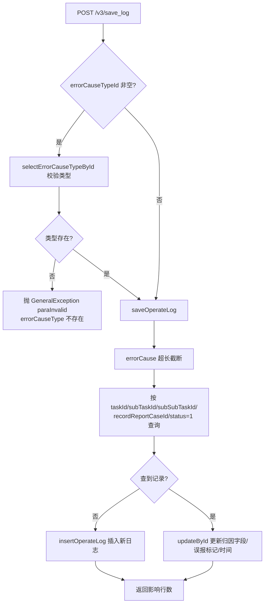
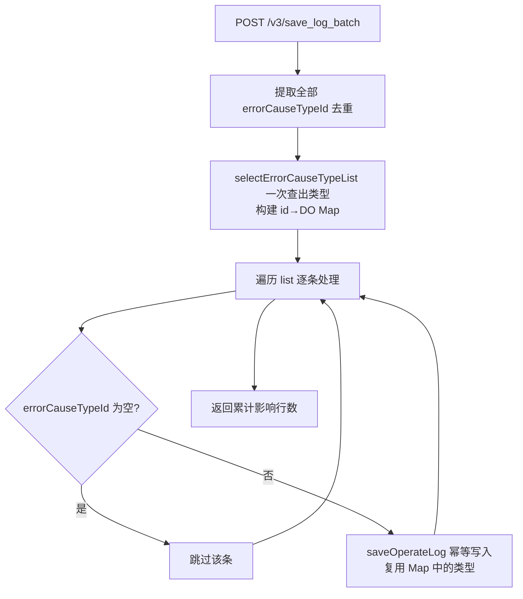

# ErrorCauseOperateLogController

错误归因操作日志服务：测试任务执行过程中（通常由执行端/调度端回调）记录"某条用例被归因为某错误类型/原因"的操作流水，供报告与统计使用。

类路径：`real-cfg/src/main/java/cn/testin/controller/ErrorCauseOperateLogController.java`，基础路径 `/v3/realcfg/error_cause_operate_log`。

## 本类接口一览

| 接口 | 方法 | 路径 | 功能 |
| --- | --- | --- | --- |
| saveOperateLog | POST | /v3/realcfg/error_cause_operate_log/save_log | 保存单条错误归因操作日志（存在即更新） |
| saveOperateLogBatch | POST | /v3/realcfg/error_cause_operate_log/save_log_batch | 批量保存错误归因操作日志 |

## saveOperateLog (`POST /v3/realcfg/error_cause_operate_log/save_log`)

- **实现意图**：以"任务 + 子任务 + 子子任务 + recordReportCaseId"为唯一维度做幂等写入：查不到则插入新日志，查到则就地更新归因结果（category/errorCause/errorCauseTypeId）。这样执行端重复上报不会堆积重复记录。若携带 errorCauseTypeId，先校验类型存在，并把该类型的"是否误报"标记（errorReport）冗余写入日志，便于统计时不再回查类型表。

- **请求参数**：Body `ErrorCauseOperateLogRequestDTO`（继承 BaseRequestDTO）：

| 参数名 | 类型 | 必填 | 说明 |
| --- | --- | --- | --- |
| projectId | Integer | 是（@NotNull 继承） | 项目 id |
| userId | Integer | 是（@NotNull 继承） | 用户 id |
| userName | String | 否 | 用户名 |
| eid | Integer | 否 | 企业 id |
| taskId | String | 否 | 任务 id |
| subTaskId | String | 否 | 子任务 id |
| subSubTaskId | String | 否 | 子子任务 id |
| scriptNo | Long | 否 | 脚本编号 |
| errorCauseTypeId | Long | 否 | 错误类型 id（非空时校验存在性） |
| category | Integer | 否 | 系统自定义类型 |
| errorCause | String | 否 | 错误原因，超长截断到 MAX_USER_ERROR_LENGTH |
| recordReportCaseId | Integer | 否 | 报告用例 id（幂等维度之一） |

- **响应结构**：`ResponseResult<BaseResponseDTO>`，统一返回 `{code, msg, data}` 报文。

| 字段 | 类型 | 说明 |
| --- | --- | --- |
| code | Integer | 返回码，0 成功 |
| msg | String | 提示信息 |
| data | Object | 数据对象（BaseResponseDTO） |
| data.result | Integer | insert/update 的影响行数 |

- **处理流程**：



- **调用链**：`ErrorCauseOperateLogController` → `ErrorCauseOperateLogService.saveErrorCauseOperateLog` → `ErrorCauseTypeMapper.selectErrorCauseTypeById` / `ErrorCauseOperateLogMapper.selectByCondition` / `insertOperateLog` / `updateById`。无外部服务调用。`@Transactional`。

- **涉及表与 SQL**：

| 表 | 操作 | Mapper 方法 |
| --- | --- | --- |
| error_cause_type | select | selectErrorCauseTypeById |
| error_cause_operate_log | select | selectByCondition |
| error_cause_operate_log | insert | insertOperateLog |
| error_cause_operate_log | update | updateById |

- **异常与校验**：errorCauseTypeId 对应类型不存在时抛 `GeneralException(CommonCode.paraInvalid, "errorCauseType 不存在")`。Controller 未加 `@Valid`，BaseRequestDTO 的 @NotNull 不强制生效，校验主要靠 Service 层。

- **关键代码摘录**：

```java
// real-cfg/src/main/java/cn/testin/business/service/ErrorCauseOperateLogService.java
List<ErrorCauseOperateLogDO> list = errorcauseoperatelogMapper.selectByCondition(condition);
if (CollectionUtils.isEmpty(list)) {
    ErrorCauseOperateLogDO entity = ErrorCauseOperateLogRequestDTO.transToEntity(requestDTO);
    if (errorCauseTypeDO != null) {
        entity.setErrorReport(errorCauseTypeDO.getErrorReport());
    }
    return errorcauseoperatelogMapper.insertOperateLog(entity);
}
ErrorCauseOperateLogDO exist = list.get(0);
exist.setCategory(requestDTO.getCategory());
exist.setErrorCause(requestDTO.getErrorCause());
exist.setErrorCauseTypeId(requestDTO.getErrorCauseTypeId());
exist.setUpdateTime(new Date());
return errorcauseoperatelogMapper.updateById(exist);
```

## saveOperateLogBatch (`POST /v3/realcfg/error_cause_operate_log/save_log_batch`)

- **实现意图**：批量版保存。先把所有条目的 errorCauseTypeId 去重后一次查出全部类型并建成 id→DO 的 Map，再逐条复用单条的幂等写入逻辑，避免每条都单独查类型表（批量 N+1 优化）。errorCauseTypeId 为空的条目直接跳过。

- **请求参数**：Body `ErrorCauseOperateLogBatchRequestDTO`：

| 参数名 | 类型 | 必填 | 说明 |
| --- | --- | --- | --- |
| list | List\<ErrorCauseOperateLogRequestDTO\> | 是 | 操作日志列表，单条字段同 save_log |

- **响应结构**：`ResponseResult<BaseResponseDTO>`，统一返回 `{code, msg, data}` 报文。

| 字段 | 类型 | 说明 |
| --- | --- | --- |
| code | Integer | 返回码，0 成功 |
| msg | String | 提示信息 |
| data | Object | 数据对象（BaseResponseDTO） |
| data.result | Integer | 所有条目影响行数之和 |

- **处理流程**：



- **调用链**：`ErrorCauseOperateLogController` → `ErrorCauseOperateLogService.saveErrorCauseOperateLogBatch` → `ErrorCauseTypeMapper.selectErrorCauseTypeList` / 单条 saveOperateLog 内部复用 `ErrorCauseOperateLogMapper`。

- **涉及表与 SQL**：

| 表 | 操作 | Mapper 方法 |
| --- | --- | --- |
| error_cause_type | select（in ids） | selectErrorCauseTypeList |
| error_cause_operate_log | select / insert / update | selectByCondition / insertOperateLog / updateById |

- **异常与校验**：批量方法未加事务注解，逐条写入互不回滚；类型 Map 中缺失的 id（非法类型）会导致 entity 的 errorReport 不设置，但不抛错。errorCauseTypeId 为空的条目静默跳过。

- **关键代码摘录**：

```java
// real-cfg/src/main/java/cn/testin/business/service/ErrorCauseOperateLogService.java
List<Integer> ids = list.stream().map(ErrorCauseOperateLogRequestDTO::getErrorCauseTypeId)
        .filter(Objects::nonNull).distinct().map(Long::intValue).collect(Collectors.toList());
ErrorCauseTypeCondition condition = new ErrorCauseTypeCondition();
condition.setIds(ids);
List<ErrorCauseTypeDO> doList = errorCauseTypeMapper.selectErrorCauseTypeList(condition);
Map<Integer, ErrorCauseTypeDO> map = doList.stream().collect(Collectors.toMap(ErrorCauseTypeDO::getId, v -> v));
for (ErrorCauseOperateLogRequestDTO requestDTO : list) {
    if (requestDTO.getErrorCauseTypeId() == null) continue;
    result += saveOperateLog(requestDTO, map.get(requestDTO.getErrorCauseTypeId().intValue()));
}
```
