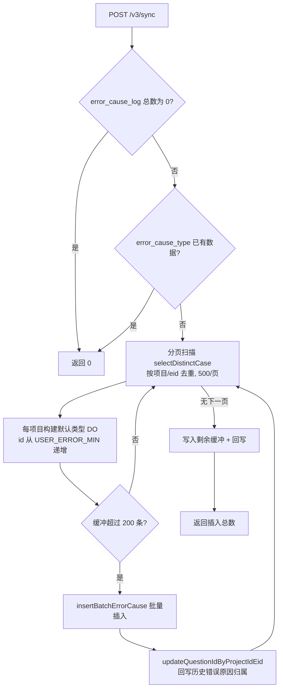
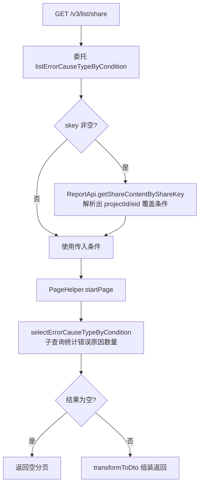
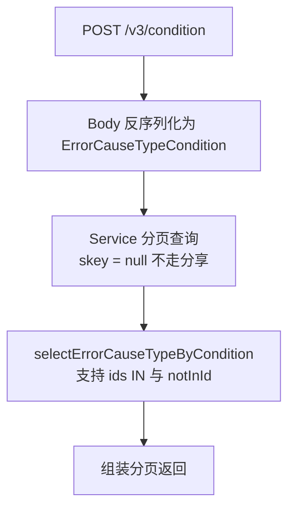
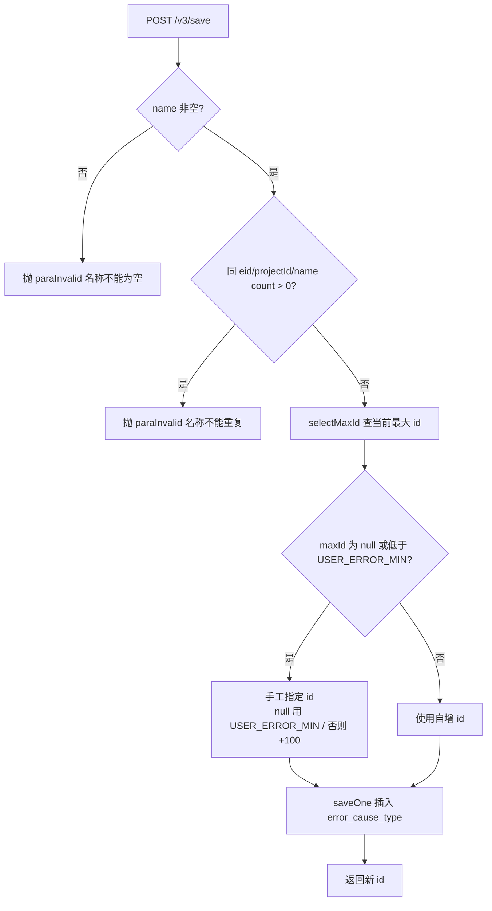
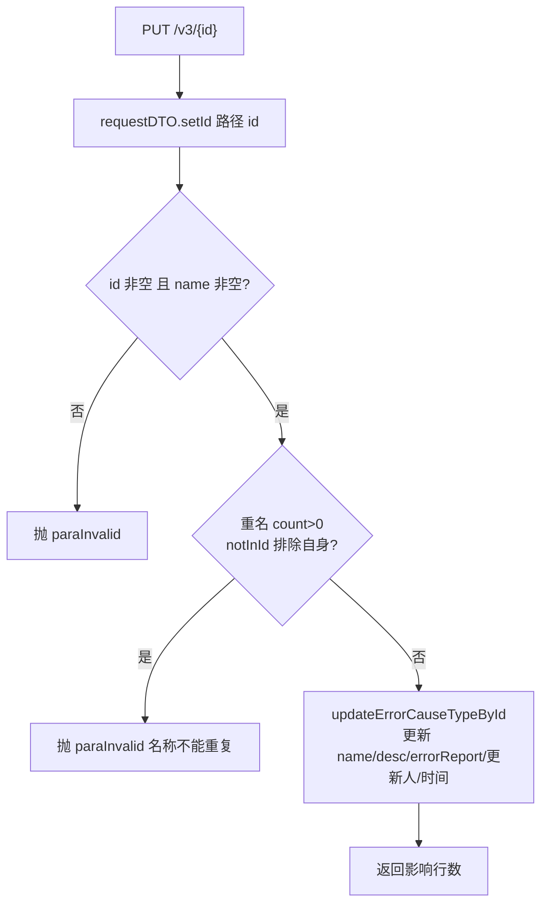
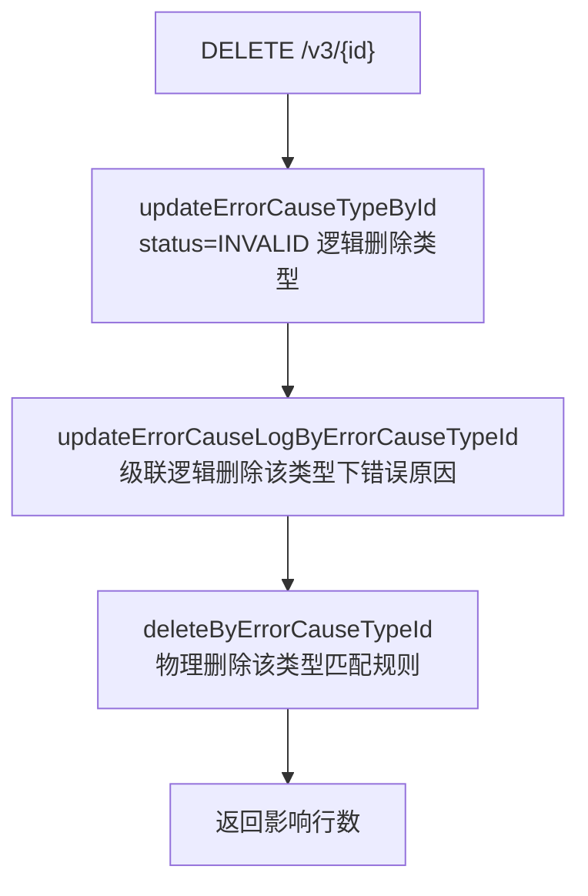
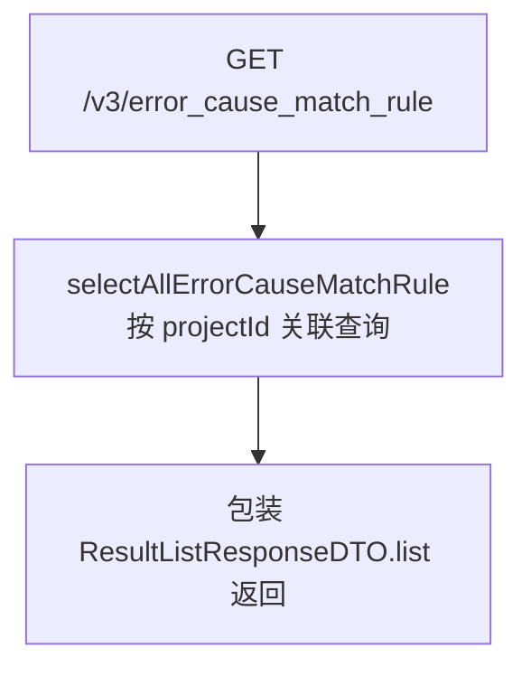

# ErrorCauseTypeController

错误类型（ErrorCauseType）管理服务：错误归因体系的分类维度，维护项目下的"问题类型"（含是否误报标记），并提供类型下错误原因数量统计、数据迁移同步、分享页面查询等能力。

类路径：`real-cfg/src/main/java/cn/testin/controller/ErrorCauseTypeController.java`，基础路径 `/v3/realcfg/error_cause_type`。

## 本类接口一览

| 接口 | 方法 | 路径 | 功能 |
| --- | --- | --- | --- |
| syncQuestionCase | POST | /v3/realcfg/error_cause_type/sync | 版本升级数据迁移：为历史错误原因补建默认问题类型 |
| listErrorCauseTypeByConditionShare | GET | /v3/realcfg/error_cause_type/list/share | 分享页查询错误类型（share_id 解析项目） |
| listErrorCauseTypeByCondition | GET | /v3/realcfg/error_cause_type/list | 分页条件查询错误类型 |
| listErrorCauseTypeByConditionPost | POST | /v3/realcfg/error_cause_type/condition | POST 版条件查询（支持 id 列表） |
| saveErrorCauseType | POST | /v3/realcfg/error_cause_type/save | 新增错误类型 |
| maintainErrorCauseType | PUT | /v3/realcfg/error_cause_type/{error_cause_type_id} | 更新错误类型 |
| deleteErrorCauseType | DELETE | /v3/realcfg/error_cause_type/{error_cause_type_id} | 逻辑删除错误类型（级联处理） |
| selectAllErrorCauseMatchRule | GET | /v3/realcfg/error_cause_type/error_cause_match_rule | 查询项目下全部匹配规则 |

## syncQuestionCase (`POST /v3/realcfg/error_cause_type/sync`)

- **实现意图**：一次性数据迁移接口，版本升级时调用。老数据里 error_cause_log 只有错误原因、没有问题类型概念；本接口按 (projectId, eid) 去重扫描错误原因表，为每个项目批量插入一条名为"未设置问题类型"的默认类型（id 从 `USER_ERROR_MIN` 起手工编号，创建人标记为"系统管理员"），再把这些项目下所有历史错误原因回写到该默认类型。若错误原因表为空或类型表已有数据则直接返回 0，保证可重复调用且只在首次生效。

- **请求参数**：无。

- **响应结构**：`ResponseResult<BaseResponseDTO>`，统一返回 `{code, msg, data}` 报文。

| 字段 | 类型 | 说明 |
| --- | --- | --- |
| code | Integer | 返回码，0 成功 |
| msg | String | 提示信息 |
| data | Object | 数据对象（BaseResponseDTO） |
| data.result | Integer | 插入的类型条数（未迁移时返回 0） |

- **处理流程**：



- **调用链**：`ErrorCauseTypeController` → `ErrorCauseTypeService.syncErrorCauseType` → `ErrorCauseLogDoMapper` / `ErrorCauseTypeMapper`。`@Transactional` 包整个迁移过程。

- **涉及表与 SQL**：

| 表 | 操作 | Mapper 方法 |
| --- | --- | --- |
| error_cause_log | select count | selectCountErrorCauseLog |
| error_cause_type | select count | selectCount |
| error_cause_log | select distinct | selectDistinctCase |
| error_cause_type | insert batch | insertBatchErrorCause |
| error_cause_log | update | updateQuestionIdByProjectIdEid |

- **异常与校验**：无参数校验；通过"错误原因为空不处理 / 类型表已有数据不处理"两道闸保证幂等。

- **关键代码摘录**：

```java
// real-cfg/src/main/java/cn/testin/business/service/ErrorCauseTypeService.java
Integer count = errorCauseTypeMapper.selectCount();
if (count != null && count > 0) {
    return result; // 表里有数据 不处理
}
// ...
errorCauseTypeDO.setName("未设置问题类型");
errorCauseTypeDO.setCreateUserName("系统管理员");
errorCauseTypeDO.setErrorReport(ErrorReportEnum.CLOSE.getType());
errorCauseList.add(errorCauseTypeDO);
if (errorCauseList.size() > insertSize) {
    errorCauseTypeMapper.insertBatchErrorCause(errorCauseList);
    for (ErrorCauseTypeDO caseDO : errorCauseList) {
        errorCauseLogDoMapper.updateQuestionIdByProjectIdEid(caseDO.getProjectId(), caseDO.getId(), caseDO.getEid());
    }
}
```

## listErrorCauseTypeByConditionShare (`GET /v3/realcfg/error_cause_type/list/share`)

- **实现意图**：测试报告分享页（免登录）查看错误类型的入口。与 `/list` 的唯一差别是参数名 `share_id`（对应 /list 的 `skey`），Service 层统一通过 skey 调外部报告服务解析出 projectId/eid 后查询。Controller 直接委托给 `listErrorCauseTypeByCondition`。

- **请求参数**：

| 参数名 | 类型 | 必填 | 说明 |
| --- | --- | --- | --- |
| eid | Integer | 否（默认 1） | 企业 id |
| share_id | String | 否 | 分享 key，非空时覆盖 projectId/eid |
| project_id | Integer | 否 | 项目 id |
| name | String | 否 | 类型名称模糊匹配 |
| system | Integer | 否（默认 1） | 是否系统内置 |
| error_status | Integer | 否 | 错误状态过滤 |
| need_rule | Integer | 否 | 是否需要规则配置 |
| page | Integer | 是 | 页码 |
| page_size | Integer | 是 | 每页条数 |

- **响应结构**：`ResponseResult<PageInfoList<ErrorCauseTypeResponseDTO>>`，统一返回 `{code, msg, data}` 报文。

| 字段 | 类型 | 说明 |
| --- | --- | --- |
| code | Integer | 返回码，0 成功 |
| msg | String | 提示信息 |
| data | Object | 数据对象（PageInfoList\<ErrorCauseTypeResponseDTO\>） |
| data.totalRow | Long | 总条数 |
| data.totalPage | Integer | 总页数 |
| data.pageSize | Integer | 每页条数 |
| data.page | Integer | 当前页码 |
| data.list | Array\<Object\> | 当前页错误类型数组（ErrorCauseTypeResponseDTO），元素字段： |
| data.list[].id | Integer | 类型 ID |
| data.list[].name | String | 类型名称 |
| data.list[].errorCauseLogTotal | Integer | 类型下错误原因数量（子查询统计） |
| data.list[].desc | String | 描述 |
| data.list[].createUserId | Integer | 创建人 id |
| data.list[].createUserName | String | 创建人名称 |
| data.list[].updateUserId | Integer | 更新人 id |
| data.list[].updateUserName | String | 更新人名称 |
| data.list[].updateTime | Long | 更新时间（毫秒时间戳） |
| data.list[].projectId | Integer | 项目 ID |
| data.list[].errorReport | Integer | 是否误报（0 否 / 1 是） |
| data.list[].errorCauseMatchRules | Array\<Object\> | 匹配规则列表，元素字段： |
| data.list[].errorCauseMatchRules[].id | Integer | 规则 ID |
| data.list[].errorCauseMatchRules[].errorCauseTypeId | Integer | 所属类型 id |
| data.list[].errorCauseMatchRules[].errorCauseLogId | Integer | 所属错误原因 id |
| data.list[].errorCauseMatchRules[].ruleType | Integer | 规则类型（1 文本包含） |
| data.list[].errorCauseMatchRules[].ruleMsg | String | 包含文本 |
| data.list[].errorCauseMatchRules[].createTime | Date | 创建时间 |
| data.list[].errorCauseMatchRules[].updateTime | Date | 更新时间 |
| data.list[].errorCauseMatchRules[].status | Integer | 状态 |

- **处理流程**：



- **调用链**：`ErrorCauseTypeController` → `ErrorCauseTypeService.listErrorCauseTypeByCondition` → `ErrorCauseTypeMapper.selectErrorCauseTypeByCondition`；外部服务：[app处理服务](../../../app处理服务（real-test）/07-开放接口文档/00-模块索引.md)（ReportApi 通过 ApiUtil 调 `Task.shareInfo` 解析分享内容）。

- **涉及表与 SQL**：

| 表 | 操作 | Mapper 方法 |
| --- | --- | --- |
| error_cause_type | select（含 error_cause_log 子查询计数） | selectErrorCauseTypeByCondition |

- **异常与校验**：声明 `throws Exception`；skey 解析失败时 content 为 null 则按原条件查询。page/pageSize 为空时 Service 用默认分页兜底。

- **关键代码摘录**：

```java
// real-cfg/src/main/java/cn/testin/business/service/ErrorCauseTypeService.java
if (StringUtils.isNotBlank(skey)) {
    ShareContent content = ReportApi.getShareContentByShareKey(skey);
    if (content != null) {
        condition.setProjectId(content.getProjectid());
        condition.setEid(content.getEid());
    }
}
```

## listErrorCauseTypeByCondition (`GET /v3/realcfg/error_cause_type/list`)

- **实现意图**：管理后台错误类型列表页的主查询接口。组装 `ErrorCauseTypeCondition` 后走与分享版完全相同的 Service 逻辑；skey 参数传入时同样按分享语义解析（接口同时服务登录态与分享态）。

- **请求参数**：同 list/share，仅分享参数名为 `skey`（而非 share_id）。

- **响应结构**：`ResponseResult<PageInfoList<ErrorCauseTypeResponseDTO>>`，统一返回 `{code, msg, data}` 报文。

| 字段 | 类型 | 说明 |
| --- | --- | --- |
| code | Integer | 返回码，0 成功 |
| msg | String | 提示信息 |
| data | Object | 数据对象（PageInfoList\<ErrorCauseTypeResponseDTO\>） |
| data.totalRow | Long | 总条数 |
| data.totalPage | Integer | 总页数 |
| data.pageSize | Integer | 每页条数 |
| data.page | Integer | 当前页码 |
| data.list | Array\<Object\> | 当前页错误类型数组（ErrorCauseTypeResponseDTO），元素字段： |
| data.list[].id | Integer | 类型 ID |
| data.list[].name | String | 类型名称 |
| data.list[].errorCauseLogTotal | Integer | 类型下错误原因数量（子查询统计） |
| data.list[].desc | String | 描述 |
| data.list[].createUserId | Integer | 创建人 id |
| data.list[].createUserName | String | 创建人名称 |
| data.list[].updateUserId | Integer | 更新人 id |
| data.list[].updateUserName | String | 更新人名称 |
| data.list[].updateTime | Long | 更新时间（毫秒时间戳） |
| data.list[].projectId | Integer | 项目 ID |
| data.list[].errorReport | Integer | 是否误报（0 否 / 1 是） |
| data.list[].errorCauseMatchRules | Array\<Object\> | 匹配规则列表，元素字段： |
| data.list[].errorCauseMatchRules[].id | Integer | 规则 ID |
| data.list[].errorCauseMatchRules[].errorCauseTypeId | Integer | 所属类型 id |
| data.list[].errorCauseMatchRules[].errorCauseLogId | Integer | 所属错误原因 id |
| data.list[].errorCauseMatchRules[].ruleType | Integer | 规则类型（1 文本包含） |
| data.list[].errorCauseMatchRules[].ruleMsg | String | 包含文本 |
| data.list[].errorCauseMatchRules[].createTime | Date | 创建时间 |
| data.list[].errorCauseMatchRules[].updateTime | Date | 更新时间 |
| data.list[].errorCauseMatchRules[].status | Integer | 状态 |

- **处理流程**：同 list/share 流程图（skey 非空时走 [app处理服务](../../../app处理服务（real-test）/07-开放接口文档/00-模块索引.md) 解析）。

- **调用链**：`ErrorCauseTypeController` → `ErrorCauseTypeService.listErrorCauseTypeByCondition` → `ErrorCauseTypeMapper.selectErrorCauseTypeByCondition`；外部服务：[app处理服务](../../../app处理服务（real-test）/07-开放接口文档/00-模块索引.md)。

- **涉及表与 SQL**：error_cause_type — select — selectErrorCauseTypeByCondition。

- **异常与校验**：无显式校验；page/pageSize 由 Service 用 `CommonConstants.DEFAULT_PAGE / DEFAULT_PAGE_SIZE` 兜底。

- **关键代码摘录**：

```java
// real-cfg/src/main/java/cn/testin/controller/ErrorCauseTypeController.java
ErrorCauseTypeCondition condition = new ErrorCauseTypeCondition();
condition.setName(name);
condition.setPage(page);
condition.setPageSize(pageSize);
condition.setSystem(system);
condition.setErrorStatus(errorStatus);
condition.setNeedRule(needRule);
if (projectId != null) condition.setProjectId(projectId);
if (eid != null) condition.setEid(eid);
PageInfoList<ErrorCauseTypeResponseDTO> pageInfoList =
        errorCauseTypeService.listErrorCauseTypeByCondition(condition, skey);
```

## listErrorCauseTypeByConditionPost (`POST /v3/realcfg/error_cause_type/condition`)

- **实现意图**：GET 查询的 POST 增强版，条件以 JSON Body 传递，额外支持 `ids`（id 列表过滤）和 `notInId`（排除指定 id）这类 GET query 不便表达的复杂条件。skey 恒传 null，即不走分享解析。

- **请求参数**：Body `ErrorCauseTypeCondition`：

| 参数名 | 类型 | 必填 | 说明 |
| --- | --- | --- | --- |
| eid | Integer | 否 | 企业 id |
| projectId | Integer | 否 | 项目 id |
| name | String | 否 | 名称模糊 |
| page / pageSize | Integer | 否 | 分页，空则默认 |
| notInId | Integer | 否 | 排除的 id |
| system | Integer | 否 | 是否系统内置 |
| ids | List\<Integer\> | 否 | id 列表过滤 |
| errorStatus | Integer | 否 | 错误状态 |
| needRule | Integer | 否 | 是否需要规则 |

- **响应结构**：`ResponseResult<PageInfoList<ErrorCauseTypeResponseDTO>>`，统一返回 `{code, msg, data}` 报文。

| 字段 | 类型 | 说明 |
| --- | --- | --- |
| code | Integer | 返回码，0 成功 |
| msg | String | 提示信息 |
| data | Object | 数据对象（PageInfoList\<ErrorCauseTypeResponseDTO\>） |
| data.totalRow | Long | 总条数 |
| data.totalPage | Integer | 总页数 |
| data.pageSize | Integer | 每页条数 |
| data.page | Integer | 当前页码 |
| data.list | Array\<Object\> | 当前页错误类型数组（ErrorCauseTypeResponseDTO），元素字段： |
| data.list[].id | Integer | 类型 ID |
| data.list[].name | String | 类型名称 |
| data.list[].errorCauseLogTotal | Integer | 类型下错误原因数量（子查询统计） |
| data.list[].desc | String | 描述 |
| data.list[].createUserId | Integer | 创建人 id |
| data.list[].createUserName | String | 创建人名称 |
| data.list[].updateUserId | Integer | 更新人 id |
| data.list[].updateUserName | String | 更新人名称 |
| data.list[].updateTime | Long | 更新时间（毫秒时间戳） |
| data.list[].projectId | Integer | 项目 ID |
| data.list[].errorReport | Integer | 是否误报（0 否 / 1 是） |
| data.list[].errorCauseMatchRules | Array\<Object\> | 匹配规则列表，元素字段： |
| data.list[].errorCauseMatchRules[].id | Integer | 规则 ID |
| data.list[].errorCauseMatchRules[].errorCauseTypeId | Integer | 所属类型 id |
| data.list[].errorCauseMatchRules[].errorCauseLogId | Integer | 所属错误原因 id |
| data.list[].errorCauseMatchRules[].ruleType | Integer | 规则类型（1 文本包含） |
| data.list[].errorCauseMatchRules[].ruleMsg | String | 包含文本 |
| data.list[].errorCauseMatchRules[].createTime | Date | 创建时间 |
| data.list[].errorCauseMatchRules[].updateTime | Date | 更新时间 |
| data.list[].errorCauseMatchRules[].status | Integer | 状态 |

- **处理流程**：



- **调用链**：`ErrorCauseTypeController` → `ErrorCauseTypeService.listErrorCauseTypeByCondition(condition, null)` → `ErrorCauseTypeMapper.selectErrorCauseTypeByCondition`。

- **涉及表与 SQL**：error_cause_type — select — selectErrorCauseTypeByCondition。

- **异常与校验**：无显式校验，条件全部可选。

- **关键代码摘录**：

```java
// real-cfg/src/main/java/cn/testin/controller/ErrorCauseTypeController.java
@PostMapping("/condition")
public ResponseResult<PageInfoList<ErrorCauseTypeResponseDTO>> listErrorCauseTypeByConditionPost(
        @RequestBody ErrorCauseTypeCondition condition) throws Exception {
    PageInfoList<ErrorCauseTypeResponseDTO> pageInfoList =
            errorCauseTypeService.listErrorCauseTypeByCondition(condition, null);
    return ResponseResult.success(pageInfoList);
}
```

## saveErrorCauseType (`POST /v3/realcfg/error_cause_type/save`)

- **实现意图**：新增一个错误类型。同 (eid, projectId) 下名称唯一；为兼容部分客户自增 id 失效的部署环境，当表中最大 id 低于 `USER_ERROR_MIN`（用户自定义类型的 id 水位线）时手工指定 id（maxId 为 null 用 USER_ERROR_MIN，小于水位线则 +100），与系统内置类型的 id 区间隔离。

- **请求参数**：Body `ErrorCauseTypeRequestDTO`（`@Valid`，继承 BaseRequestDTO：projectId/userId 必填，eid/userName 可选）：

| 参数名 | 类型 | 必填 | 说明 |
| --- | --- | --- | --- |
| name | String | 是（Service 校验非空） | 类型名称，同项目唯一 |
| desc | String | 否 | 描述 |
| errorReport | Integer | 否 | 是否误报（0 否 1 是） |
| updateMathRule | Boolean | 否 | 是否更新匹配规则（保存时未使用） |
| errorCauseMatchRules | List | 否 | 匹配规则（保存时未使用） |

- **响应结构**：`ResponseResult<BaseResponseDTO>`，统一返回 `{code, msg, data}` 报文。

| 字段 | 类型 | 说明 |
| --- | --- | --- |
| code | Integer | 返回码，0 成功 |
| msg | String | 提示信息 |
| data | Object | 数据对象（BaseResponseDTO） |
| data.result | Integer | 新类型 id |

- **处理流程**：



- **调用链**：`ErrorCauseTypeController` → `ErrorCauseTypeService.saveErrorCauseType` → `ErrorCauseTypeMapper.countByCondition` / `selectMaxId` / `saveOne`。`@Transactional`。

- **涉及表与 SQL**：

| 表 | 操作 | Mapper 方法 |
| --- | --- | --- |
| error_cause_type | select count | countByCondition |
| error_cause_type | select max(id) | selectMaxId |
| error_cause_type | insert | saveOne |

- **异常与校验**：name 空抛 `paraInvalid("问题类型名称不能为空")`；重名抛 `paraInvalid("问题类型名称不能重复")`。`@OperateLog(PROBLEM_ADD)` 记录操作日志。

- **关键代码摘录**：

```java
// real-cfg/src/main/java/cn/testin/business/service/ErrorCauseTypeService.java
// 部分客户存在自增id失效的情况 手动指定
Integer maxId = errorCauseTypeMapper.selectMaxId();
if (maxId == null) {
    maxId = CommonConstants.USER_ERROR_MIN;
    result = maxId;
    errorCauseTypeDO.setId(maxId);
}
if (maxId < CommonConstants.USER_ERROR_MIN) {
    maxId += 100;
    result = maxId;
    errorCauseTypeDO.setId(maxId);
}
```

## maintainErrorCauseType (`PUT /v3/realcfg/error_cause_type/{error_cause_type_id}`)

- **实现意图**：更新错误类型的名称/描述/误报标记。路径 id 强制覆盖 Body 中的 id，重名检查用 `notInId` 排除自身，避免"名称没改却报重复"。

- **请求参数**：

| 参数名 | 类型 | 必填 | 说明 |
| --- | --- | --- | --- |
| error_cause_type_id | Integer | 是（路径变量） | 类型 id，覆盖到 DTO.id |
| Body | ErrorCauseTypeRequestDTO | 是 | 字段同 save（name 必填，desc 非空才更新） |

- **响应结构**：`ResponseResult<BaseResponseDTO>`，统一返回 `{code, msg, data}` 报文。

| 字段 | 类型 | 说明 |
| --- | --- | --- |
| code | Integer | 返回码，0 成功 |
| msg | String | 提示信息 |
| data | Object | 数据对象（BaseResponseDTO） |
| data.result | Integer | update 影响行数 |

- **处理流程**：



- **调用链**：`ErrorCauseTypeController` → `ErrorCauseTypeService.maintainErrorCauseType` → `ErrorCauseTypeMapper.countByCondition` / `updateErrorCauseTypeById`。`@Transactional`。

- **涉及表与 SQL**：

| 表 | 操作 | Mapper 方法 |
| --- | --- | --- |
| error_cause_type | select count | countByCondition |
| error_cause_type | update | updateErrorCauseTypeById |

- **异常与校验**：id 空抛 `paraInvalid("问题类型id不能为空")`；name 空/重名分别抛对应 `paraInvalid`。`@OperateLog(PROBLEM_UPDATE)`。

- **关键代码摘录**：

```java
// real-cfg/src/main/java/cn/testin/business/service/ErrorCauseTypeService.java
condition.setName(name);
condition.setEid(requestDTO.getEid());
condition.setProjectId(requestDTO.getProjectId());
condition.setNotInId(requestDTO.getId()); // 排除自身
int count = errorCauseTypeMapper.countByCondition(condition);
if (count > 0) {
    throw new GeneralException(CommonCode.paraInvalid.getValue(), "问题类型名称不能重复");
}
return errorCauseTypeMapper.updateErrorCauseTypeById(errorCauseTypeDO);
```

## deleteErrorCauseType (`DELETE /v3/realcfg/error_cause_type/{error_cause_type_id}`)

- **实现意图**：逻辑删除错误类型，并级联处理关联数据：该类型下所有错误原因逻辑删除（is_delete=1），匹配规则物理删除。三步写操作在一个事务中完成，保证归因体系不出现"类型已删但原因/规则仍有效"的悬挂状态。

- **请求参数**：

| 参数名 | 类型 | 必填 | 说明 |
| --- | --- | --- | --- |
| error_cause_type_id | Integer | 是（路径变量） | 类型 id |
| user_id | Integer | 是 | 操作人 id |
| user_name | String | 是 | 操作人名称 |

- **响应结构**：`ResponseResult<BaseResponseDTO>`，统一返回 `{code, msg, data}` 报文。

| 字段 | 类型 | 说明 |
| --- | --- | --- |
| code | Integer | 返回码，0 成功 |
| msg | String | 提示信息 |
| data | Object | 数据对象（BaseResponseDTO） |
| data.result | Integer | 类型表 update 影响行数 |

- **处理流程**：



- **调用链**：`ErrorCauseTypeController` → `ErrorCauseTypeService.deleteErrorCauseType` → `ErrorCauseTypeMapper.updateErrorCauseTypeById` / `ErrorCauseLogDoMapper.updateErrorCauseLogByErrorCauseTypeId` / `ErrorCauseMatchRuleMapper.deleteByErrorCauseTypeId`。`@Transactional`。

- **涉及表与 SQL**：

| 表 | 操作 | Mapper 方法 |
| --- | --- | --- |
| error_cause_type | update（逻辑删除） | updateErrorCauseTypeById |
| error_cause_log | update（逻辑删除） | updateErrorCauseLogByErrorCauseTypeId |
| error_cause_match_rule | delete | deleteByErrorCauseTypeId |

- **异常与校验**：Controller 无显式校验。`@OperateLog(PROBLEM_DELETE)` 记录操作日志。

- **关键代码摘录**：

```java
// real-cfg/src/main/java/cn/testin/business/service/ErrorCauseTypeService.java
int result = errorCauseTypeMapper.updateErrorCauseTypeById(errorCauseTypeDO);
// 删除错误定位表
ErrorCauseLogDo condition = ErrorCauseLogDo.builder().isDelete(ErrorCauseLogDo.IS_DELETE)
        .errorCauseTypeId(id).updateTime(System.currentTimeMillis())
        .updateUserId(userId).updateUserName(userName).build();
errorCauseLogDoMapper.updateErrorCauseLogByErrorCauseTypeId(condition);
errorCauseMatchRuleMapper.deleteByErrorCauseTypeId(errorCauseTypeDO.getId());
return result;
```

## selectAllErrorCauseMatchRule (`GET /v3/realcfg/error_cause_type/error_cause_match_rule`)

- **实现意图**：一次拉取项目下全部匹配规则（含所属类型/原因的名称），前端用于规则总览页或归因调试，不做分页。

- **请求参数**：

| 参数名 | 类型 | 必填 | 说明 |
| --- | --- | --- | --- |
| project_id | Integer | 是 | 项目 id |

- **响应结构**：`ResponseResult<ResultListResponseDTO<ErrorCauseMatchRuleResponseDTO>>`，统一返回 `{code, msg, data}` 报文。

| 字段 | 类型 | 说明 |
| --- | --- | --- |
| code | Integer | 返回码，0 成功 |
| msg | String | 提示信息 |
| data | Object | 数据对象（ResultListResponseDTO\<ErrorCauseMatchRuleResponseDTO\>） |
| data.list | Array\<Object\> | 匹配规则数组，元素字段： |
| data.list[].errorCauseTypeId | Integer | 所属错误类型 id |
| data.list[].errorCauseName | String | 类型名称 |
| data.list[].errorCauseLogId | Integer | 所属错误原因 id |
| data.list[].errorCauseLogName | String | 原因文案 |
| data.list[].errorCauseMatchRuleType | Integer | 匹配规则类型 |
| data.list[].errorCauseMatchRuleValue | String | 匹配规则内容 |

- **处理流程**：



- **调用链**：`ErrorCauseTypeController` → `ErrorCauseTypeService.selectAllErrorCauseMatchRule` → `ErrorCauseMatchRuleMapper.selectAllErrorCauseMatchRule`。

- **涉及表与 SQL**：

| 表 | 操作 | Mapper 方法 |
| --- | --- | --- |
| error_cause_match_rule（关联 error_cause_type / error_cause_log） | select | selectAllErrorCauseMatchRule |

- **异常与校验**：无显式校验；无分页，项目数据量大时注意返回体积。

- **关键代码摘录**：

```java
// real-cfg/src/main/java/cn/testin/controller/ErrorCauseTypeController.java
List<ErrorCauseMatchRuleResponseDTO> rules = errorCauseTypeService.selectAllErrorCauseMatchRule(projectId);
ResultListResponseDTO<ErrorCauseMatchRuleResponseDTO> list = new ResultListResponseDTO<>();
list.setList(rules);
return ResponseResult.success(list);
```
