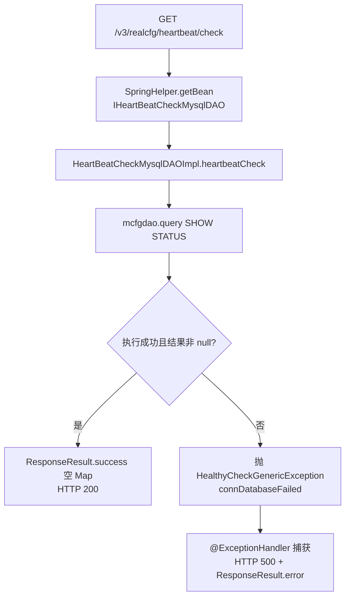

# HeartBeatController

平台配置 服务的健康检查端点，供部署探活/监控调用，验证服务进程与 MySQL 连通性。

类路径：`real-cfg/src/main/java/cn/testin/controller/HeartBeatController.java`，基础路径 `/v3/realcfg`。

## 本类接口一览

| 接口 | 方法 | 路径 | 功能 |
| --- | --- | --- | --- |
| check | GET | /v3/realcfg/heartbeat/check | 健康检查：执行 SHOW STATUS 验证 MySQL 连接 |

## check (`GET /v3/realcfg/heartbeat/check`)

- **实现意图**：最小化探活接口。不返回业务数据，只验证两件事：Spring 容器能取到 DAO Bean（`IHeartBeatCheckMysqlDAO`）、DAO 能对 MySQL 执行 `SHOW STATUS` 成功。任一失败抛 `HealthyCheckGenericException`，由本类 `@ExceptionHandler` 转成 HTTP 500 + 错误码，监控系统据此判定实例不健康。

- **请求参数**：无。

- **响应结构**：统一返回 `{code, msg, data}` 报文。

| 字段 | 类型 | 说明 |
| --- | --- | --- |
| code | Integer | 返回码，0 成功；失败时 HTTP 500，code 为 `CommonCode.connDatabaseFailed` |
| msg | String | 提示信息 |
| data | Object | 数据对象，成功时为空 HashMap（无内容） |

- **处理流程**：



- **调用链**：`HeartBeatController` → `HeartBeatCheckMysqlDAOImpl`（`cn.testin.dao.impl.heartBeat`）→ `AbstractGenericDaoImpl.getMcfgdao().query`。无外部服务调用。

- **涉及表与 SQL**：

| 对象 | 操作 | 说明 |
| --- | --- | --- |
| MySQL 实例 | 其他 | `SHOW STATUS`（不经具体表，验证连接活性） |

- **异常与校验**：`HealthyCheckGenericException`（`cn.testin.exceptions`）携带 `CommonCode.connDatabaseFailed`，由类内 `@ExceptionHandler` 统一转为 HTTP 500 响应；DAO 内任何异常（含 NPE/SQL 异常）都被 catch 后包装为该异常。

- **关键代码摘录**：

```java
// real-cfg/src/main/java/cn/testin/dao/impl/heartBeat/HeartBeatCheckMysqlDAOImpl.java
public void heartbeatCheck() throws HealthyCheckGenericException {
    try {
        List res = this.getMcfgdao().query("SHOW STATUS", null);
        if (res == null) {
            throw new HealthyCheckGenericException(CommonCode.connDatabaseFailed.getValue(), "mysql connection failed!");
        }
    } catch (Exception e) {
        Logit.errorLog(e.getMessage(), e);
        throw new HealthyCheckGenericException(CommonCode.connDatabaseFailed.getValue(), "mysql connection failed!");
    }
}
```
