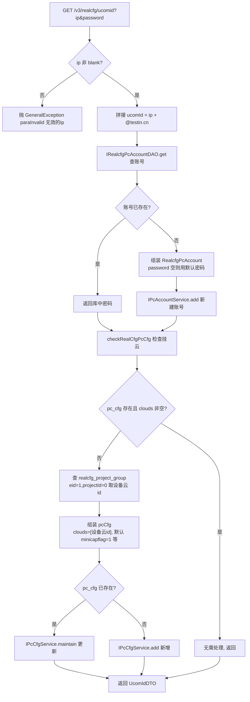

# UcomIdController

上位机账号开通服务：根据上位机 IP 自动生成 ucom 账号（ip + @testin.cn）并挂入企业级设备云，供真机机架上位机接入平台使用。

类路径：`real-cfg/src/main/java/cn/testin/controller/UcomIdController.java`，基础路径 `/v3/realcfg/ucomid`。

## 本类接口一览

| 接口 | 方法 | 路径 | 功能 |
| --- | --- | --- | --- |
| addUcomId | GET | /v3/realcfg/ucomid | 按 IP 创建/获取上位机账号并确保挂入设备云 |

## addUcomId (`GET /v3/realcfg/ucomid`)

- **实现意图**：上位机（控制真机的 PC）接入平台时需要一对账号凭证。本接口把 IP 拼成 ucomId（`<ip>@testin.cn`）后做幂等开通：账号已存在则直接返回其密码；不存在则新建账号（未传密码时用内置默认密码）。随后保证该账号在设备云配置（realcfg_pc_cfg）中存在且已关联到默认设备云分组——查 `realcfg_project_group`（eid=1, projectId=0）拿到企业级设备云 id，把账号的 clouds 字段写为该分组。整个流程保证"同一个 IP 多次调用返回同一对账号密码且必然挂云"。

- **请求参数**：

| 参数名 | 类型 | 必填 | 说明 |
| --- | --- | --- | --- |
| ip | String | 是 | 上位机 IP，blank 时抛异常 |
| password | String | 否 | 自定义密码，不传用默认密码 |

- **响应结构**：`ResponseResult<UcomIdDTO>`，统一返回 `{code, msg, data}` 报文。

| 字段 | 类型 | 说明 |
| --- | --- | --- |
| code | Integer | 返回码，0 成功 |
| msg | String | 提示信息 |
| data | Object | 数据对象（UcomIdDTO） |
| data.UcomId | String | 上位机账号（ip@testin.cn） |
| data.password | String | 密码（已有账号返回库中密码，新账号返回传入值或默认密码） |

- **处理流程**：



- **调用链**：`UcomIdController` → `UcomIdService.addUcomId` / `checkRealCfgPcCfg` → `IRealcfgPcAccountDAO`、`IRealcfgPcCfgDAO`（SpringHelper 手动取 Bean）、`IPcAccountService` / `IPcCfgService`（同模块 XML 装配服务，其接口文档见 [模块索引](../00-模块索引.md) 中 PcAccount / PcCfg）、`RealCfgProjectGroupMapper.selectByEidAndProjectId`。无跨模块外部服务调用。

- **涉及表与 SQL**：

| 表 | 操作 | 方法 |
| --- | --- | --- |
| realcfg_pc_account | select / insert | IRealcfgPcAccountDAO.get / IPcAccountService.add |
| realcfg_pc_cfg | select / insert / update | IRealcfgPcCfgDAO.get / IPcCfgService.add / maintain |
| realcfg_project_group | select（devicegroupid） | RealCfgProjectGroupMapper.selectByEidAndProjectId |

- **异常与校验**：ip 为 blank 抛 `GeneralException(CommonCode.paraInvalid, "无效的ip")`；声明 `throws GeneralException, IOException`。默认密码硬编码于 Service（`Test!n_2024#`），属历史实现遗留。

- **关键代码摘录**：

```java
// real-cfg/src/main/java/cn/testin/business/service/UcomIdService.java
String ucomId = ip + UCOM_ID_SUFFIX; // "@testin.cn"
RealcfgPcAccount realcfgPcAccount = irealcfgpcaccountdao.get(ucomId);
if (realcfgPcAccount != null) {          // 如果上位账号已存在
    ucomIdDTO.setPassword(realcfgPcAccount.getUcomidPwd());
    checkRealCfgPcCfg(ucomIdDTO.getUcomId(), ip);
    return ucomIdDTO;
}
RealcfgPcAccount pcAccount = new RealcfgPcAccount();
pcAccount.setUcomid(ucomId);
pcAccount.setUcomidPwd(StringUtils.isBlank(password) ? UCOM_ID_PASSWORD : password);
ipcaccountservice.add(pcAccount);
checkRealCfgPcCfg(ucomId, ip);
```
